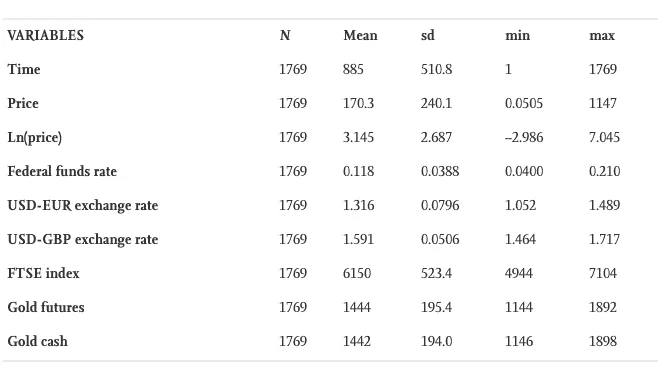
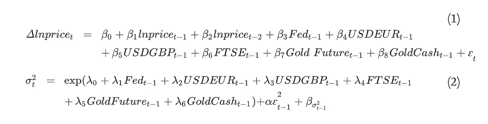
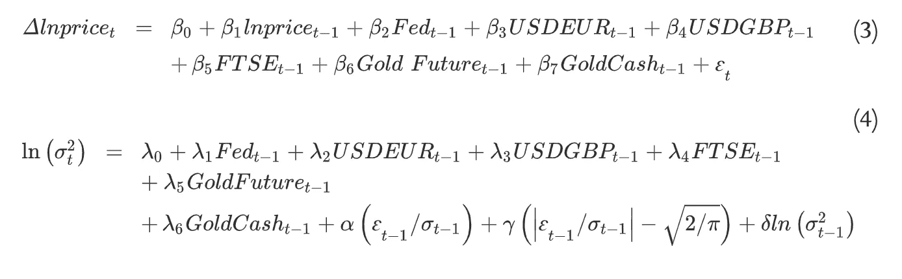
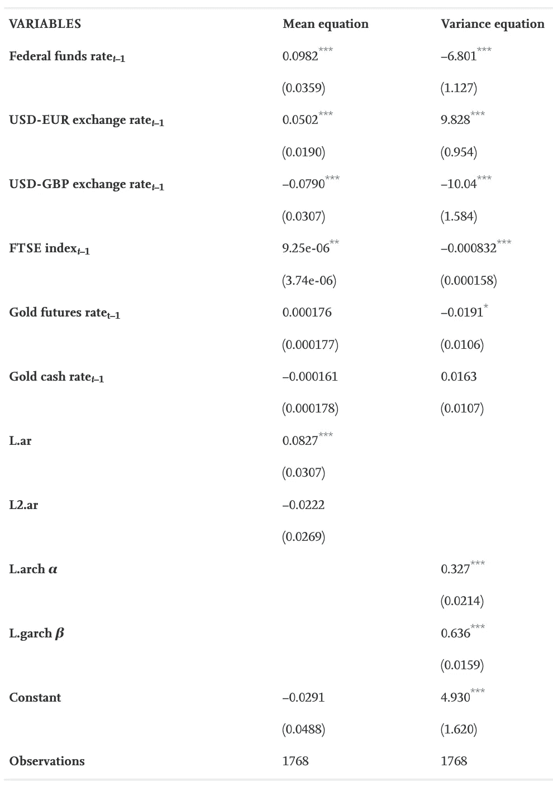

# 比特币、美元还是黄金:波动性分析

> 原文：<https://medium.com/analytics-vidhya/bitcoin-usd-or-gold-volatility-analysis-2723bb549ec9?source=collection_archive---------16----------------------->

自 2008 年以来，新虚拟货币的数量，以及客户群和交易量都大幅上升。这是一个了不起的成就，因为在网络游戏社区之外没有虚拟货币。然而，由于货币业务中断，决策者、分析师和企业面临重大威胁和前景。这种增长也迫使利益相关者重新考虑他们对金钱所能拥有的能力的基本假设。

我的另一篇理学硕士论文，去掉了无聊的部分！

符合所有 3 个条件的最接近的库存图像

任何分析的第一步都是确定比特币是哪种金融资产，因为这将决定它在经济中的地位。

由于比特币的好处，立法者和经济学家一直热衷于从经济角度对其进行定性。是产品还是货币？它与加密现金(Chaum，1983)和其他虚拟货币(ECB，2012)有何区别？Glaser 等人(2014 年)提出了这种担忧，重点关注比特币作为一种贸易手段的潜力。比特币具有相当的流动性，在这个意义上，它可以在任何时间用任何货币进行比特币交易；但是，由于其稀有性，和所有商品一样，它也存在流动性缺陷。此外，根据 Bohme 等人(2015 年)的说法，转移可以推迟一个小时，这大大限制了流动性选择。

然而，由于其用户的姓名仍然未知，比特币协议并没有因为观察名单或禁运国家而禁止交易。与银行运营的其他货币相比，这使得比特币在国际转账方面更加灵活，速度也更快。根据 Glaser 等人(2014 年)的说法，大多数比特币消费者将他们的投资组合视为投机资产，而不是支付方式。因此，比特币作为资产可能比货币更有价值。比特币被分析师比作黄金，因为两者有一定的相似性。虽然黄金有一些内在价值，但其目前每金衡盎司约 1200 美元的市场价值不太可能是合理的(数据流)。如果比特币的用户合乎逻辑，它可能有一些内在价值。2015 年 6 月每比特币 240.5 美元的当前价格是否合理值得怀疑(Coin-desk，2015)。比特币和黄金都很稀有且难以提取，这一事实解释了它们的大部分价值。他们都没有护照，也不受政府监管。一些个体经营者和公司同时开采这两处地产。在金本位时期，黄金被用作贸易手段，但由于流动性问题而停止使用。当比特币的用户群进一步增长时，类似的问题也会出现。但是，黄金和比特币有一定的区别。黄金主要被用作财富的储存手段，并且因为它与美元负相关，这使得它具有避险价值。比特币不能保证有这样的能力，所以我们会考虑一下。

## 数据

硬币桌价格指数是我们获取比特币价格信息的地方。金条美元/金衡盎司汇率(黄金现金)、CMX 黄金期货 100 盎司美元汇率(黄金期货)、美元-欧元和美元-英镑汇率以及金融时报股票交易指数将被用作解释变量。联邦基金利率也包括在内，定期观察来自纽约美联储银行。

下表包含了数字汇总:

## 方法学

比特币、黄金和美元之间的相似之处通过两个模型进行了探索。然后，如下图所示，一个带有解释变量和均值 Eq 的 GARCH 模型。(1)和方差等式。(2)是计算出来的。

这些摘自安妮·豪博·迪尔伯格 2016 年的论文。

指数 GARCH 模型，使用平均 Eq。(3)和方差等式。(4)看比特币的回报率是否受到正负消息的不对称影响(被称为杠杆效应)，是第二种模型。

## 结果

下表表明，没有漂移的证据，类似于 Capie 等人(2005 年)在黄金调查中的结果。与黄金相似，方差方程显示了低长期收敛性、波动聚集性和高波动持续性。过去的方差效应明显多于过去的冲击效应，预测应该考虑到这一点。研究结果表明，比特币的回报更多地是由比特币作为一种贸易手段的需求驱动的，而不是由模仿货币波动的市场波动驱动的。Hammoudeh 和袁(2008)认为，黄金受珠宝和回收需求的影响要大得多，因为它是一种贵金属，而不是消费金属，受短期冲击的影响较小。因此，在回报不确定性和最具影响力的惊喜类型方面，比特币和黄金似乎是可比的，尽管也发现了货币比较。

当看解释变量时，很多观点都很突出。均值方程中联邦基金利率的乘数表明，随着联邦基金利率上升和货币价值上升，进口将上升，互联网价格无疑也会上升。随着国际互联网交易变得更加便利，对比特币的需求将会上升，从而导致比特币资产的回报更高。这一发现强调了比特币作为贸易手段的好处及其货币相似性。

汇率系数表明，比特币的回报对美元相对于英镑的价值比对美元相对于欧元的价值更敏感。因此，存在地理或国家特定的影响。这一发现与之前的黄金研究一致，表明比特币可能被用作对美元的对冲工具。根据英国《金融时报》股票交易所指数的系数，对股市的积极冲击可能会鼓励投资者承担更多风险，投资于比特币等替代资产。

根据方差方程，美元对英镑汇率的正波动冲击降低了比特币回报的方差，表明比特币在这种情况下是一种相对稳定的货币。这一发现表明比特币具有额外的风险评估能力。当联邦基金利率受到正波动冲击时，有人可能会认为，根据该系数，比特币回报的波动性将低于美元。因此，与分析师对黄金的发现相似，比特币对美元可能具有一定的风险控制能力。然而，这些能力的大小是由之前的比特币数量和货币波动决定的。富时指数系数表示比特币对冲伦敦证券交易所交易证券的能力。

除了美元-欧元汇率之外，似乎虽然这些因素存在正的波动冲击，但比特币回报的波动性降低了。这表明，对于厌恶风险的投资者来说，比特币可能是更好的选择。另一方面，Tully 和 Lucey (2007 年)没有发现类似的发现，因为比特币的波动性是由外部变量决定的，而不是像黄金那样的内生因素，因为它的估值只受全球力量的影响，因为它缺乏高内在价值。

由于受联邦基金利率和交易媒介特征的影响，这些发现表明比特币的回报行为类似于汇率。然而，正如之前报道的那样，比特币的回报在许多方面与黄金相似，包括其对汇率的反应和高波动持久性。因此，比特币可能同时被归类为货币和资产。

在指数 GARCH 实验中，伽马系数(类似于黄金)的优势表明，好消息和坏消息对比特币回报的波动性几乎没有不对称影响。解释变量的值与之前的 GARCH 模型中的值相同，这意味着最初的解释是正确的。由于正面和负面冲击不会不对称地影响比特币和黄金的回报，人们可以使用比特币或黄金来对冲不对称地影响其他属性的市场风险。此外，由于比特币没有重大的杠杆影响，因此对于风险厌恶型投资者来说，在出现坏消息时，它是一种安全的投资。

## 结论

根据这份报告，比特币与黄金和美元有许多相似之处。比特币作为交易媒介的特征是显而易见的，它对联邦基金的步伐反应强烈，表明它作为一种货币发挥作用。另一方面，比特币永远不会像今天的货币那样运作，因为它既分散又完全不受控制。比特币和黄金在几个方面是相同的，例如它们如何对 GARCH 模型中的类似因素做出反应，具有类似的对冲特征，对好消息和坏消息做出对称的反应。然而，由于比特币交易更容易，对投资者情绪的反应也更快，交易量可能会更高。由于其分散的存在和有限的市场规模，最终效果表明比特币介于货币和产品之间。然而，这并不意味着比特币不如现有的市场资产有用。另一方面，这种分类意味着基金管理和市场预测的个人将通过纳入比特币来实现对市场更准确的看法，让他们做出更明智的选择，并获得另一种对冲工具。此外，如果出现坏消息，比特币可以被用作规避风险的投资者的工具。因此，比特币的交易场所将介于黄金和美元之间，一方提供纯粹的价值储存好处，另一方提供纯粹的交换媒介好处。这一发现表明，资本市场上的比特币将融合资产和货币的一些优势，使其成为基金管理、风险分析和投资者情绪分析的重要工具。

更多信息请关注:)