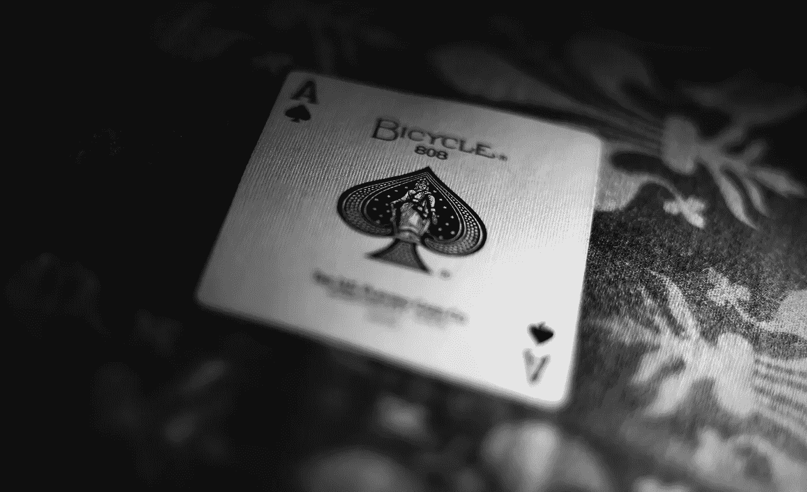

# 二十一点模拟器

> 原文：<https://medium.com/analytics-vidhya/blackjack-simulator-d89e763c9a84?source=collection_archive---------3----------------------->

算牌风险自担。

由 [Unsplash](https://unsplash.com/s/photos/ace-of-spades?utm_source=unsplash&utm_medium=referral&utm_content=creditCopyText) 上 [Badhan Ganesh](https://unsplash.com/@badhanganesh?utm_source=unsplash&utm_medium=referral&utm_content=creditCopyText) 拍摄的照片

以下是我在模拟课上做的一个项目，模拟课是佐治亚理工学院 OMSA 项目中的一门操作选修课(对世界头号贾斯汀比伯迷戈尔德曼博士大声喊出来)。我知道我在上一篇文章中拿算牌开玩笑，但当这个项目在课堂上出现时，我不能错过尝试击败赌场的机会。如果你已经熟悉了 21 点，或者不想了解代码的细节，那么你可以跳到策略测试部分，看看我发现了什么。

# 摘要

这个项目的目标是测试各种 21 点策略，并确定哪种方法可以使利润最大化。或者，因为我们知道 21 点是赌场提供的一种受欢迎的游戏，我们应该说尽量减少损失。虽然游戏的一般规则非常简单，但实现各种边缘情况场景被证明是一个有趣的挑战。在设置了主游戏模拟之后，我测试了六种不同的策略，分别侧重于根据游戏结果调整赌注，以及根据玩家风格调整游戏策略。大多数策略揭示了我们所期望的:相对于许多迭代的明显优势。然而，一些策略显示了比其他策略更窄的房子边缘，有些策略惊人地激烈。你可能听说过的一种策略——传说中的“算牌”——在流行文化和赌博知识中很流行，甚至导致了玩家的优势！如今，赌场在游戏中内置了一些机制来防止这种策略，但展示这种策略的可行性是一个非常酷的结果。但是在我们得到这些结果之前，让我们来看一下游戏的模拟代码和设置。

# 背景

如果你不熟悉 21 点，这里是 http://www.hitorstand.net/strategy.php[的基本规则:](http://www.hitorstand.net/strategy.php)

*   21 点的目标是在不超过 21 点的情况下击败庄家。
*   牌面价值 10 英镑。a 值 1 或 11，取其中较好的一手。
*   每个玩家从两张牌开始，庄家的一张牌隐藏到最后。
*   “打”就是要另一张牌。“站”就是拿着你的总数，结束你的回合。
*   如果你超过 21，你就破产了，不管庄家的牌如何，庄家都会赢。
*   如果你一开始就拿到 21 点(a & 10)，你就有 21 点。
*   21 点通常意味着你赢了 1.5 倍的赌注。取决于赌场。
*   庄家将打到他/她的牌总数达到 17 或更高。
*   翻倍就像一击命中，只是赌注翻倍，你只能再得到一张牌。
*   当你有两张相同的牌时，可以进行拆分——这一对被拆分成两只手。
*   拆分也使赌注翻倍，因为每手新牌都值原来的赌注。
*   你只能在第一次移动时加倍/分割，或者在由分割产生的手牌的第一次移动时加倍/分割。
*   你不能在两张 a 分开后再玩。
*   你可以在一手牌中翻倍，或者下注三倍或四倍。

虽然规则可能会因赌场的不同而略有不同，但上面的规则是非常标准的，也是我在设计程序时所遵循的。一些额外的注意事项:

1.  在我的程序中，我用一个玩家对一个庄家。添加额外的玩家对游戏没有任何影响，因为玩家的手牌只会根据庄家的手牌来评估，这样做只会使程序变得复杂。
2.  一些赌场提供“退保”选项，甚至额外的保险/额外赌注，我没有包括在这个模拟中。
3.  我在鞋子里放了 8 副洗牌的牌，鞋子一用完就重新洗牌。这种重新洗牌可以在没有手牌干扰的情况下进行。

下面我将介绍我的程序的每一步，并解释每一部分对游戏执行的贡献。一旦我们有了实际的游戏设置，我将解释不同策略背后的逻辑，并演示它们在许多手动模拟中的表现。通过这些比较，我将得出一些关于这个游戏的见解，并推荐从长远来看能给你带来最大收益的策略。

# 模拟代码

在测试我们的 21 点策略之前，我们需要开发模拟游戏的代码。首先，我们将导入用于该程序的包。这里没有什么太疯狂的，我用了很多常见的嫌疑人。我们将使用 random 来帮助我们设置面板，使用 pandas 进行策略查找，使用 numpy 和 scipy 进行一些基本的统计，使用 matplotlib 来帮助我们可视化一些输出。

首先，让我们建立策略。21 点是一个“已解决”的游戏，事实上，对于玩家手牌和庄家向上牌的所有组合，都有一个已知的最佳玩家决策。下面的数据框代表了这些最优的玩家决策。行指数是玩家手牌的总和，列指数是庄家的上牌。有三个数据框架来处理不同的玩家手牌情况:一个用于基本策略，第二个用于玩家拿到 a 时，第三个用于玩家拿到对子时。

有 4 个可能的值:H、S、D 和 P——分别对应于玩家的击打、站立、双拳出击和劈分动作。

每当一手牌中需要玩家采取行动时，该手牌和庄家向上牌的值将被编入这些数据帧之一。最优策略会回归，手牌会继续。稍后，这些值中的一些可以被调整以代表不同的玩家行动策略。

注:根据赌场使用的特定 21 点规则，这些最佳策略略有不同。然而，下面的这些可以被认为是非常标准的。

对于模拟，我们有两个主要的类:一个用于玩家，一个用于控制甲板。在每次模拟运行之前，将创建一个玩家实例，该实例将存储关于玩家的手和筹码动作的所有必要信息。同样，新的模拟运行将创建 deck 类的“shoe”实例。deck 类将创建一个 8 副牌的随机洗牌，当牌用完时重新洗牌，发牌，并记录牌数(这将用于算牌策略)。

接下来，我们有 5 个主要的功能将用于控制游戏的流程。

1.  **get_hand_points()** :给定一手牌，返回与之相关的点数值。处理 a 需要特殊的逻辑，a 值 11 或 1，取决于哪一手牌更好。
2.  **player _ strategy _ decision()**:查看玩家手牌和庄家向上的牌，以决定玩家应该采取什么行动。手牌分割有一些特殊情况，我们将在稍后的分割处理部分解释。
3.  **evaluate_hands()** :在每手牌结束时运行，将玩家的最后一手牌与庄家的进行比较。有仔细的步骤逻辑来决定玩家或庄家是否赢了，以及如果玩家赢了赢了应该付多少钱。如果一方击中了 21 点，或者如果被评估的手牌是分牌的结果，那么顺序对于考虑庄家或玩家破产是很重要的。
4.  **hand_prep()** :包含每手牌之间必要的重置，例如发牌和更新玩家类别变量。
5.  **play_hand()** :一手牌的主要控制流程。查看玩家和庄家的牌，做出策略决策，然后在玩家行动完成后更新庄家的牌。包含在玩家分牌时处理多手牌的逻辑。

分牌结果有点复杂，所以我创建了单独的函数，当正确的玩法是分牌时调用这些函数。一手牌中最多可以出现 3 次分牌(这是一般规则)，因此这些函数需要能够为玩家从一手开始的牌中生成最多 4 手牌。

1.  **split_handling()** :控制这个主进程，最多允许四手。每次拆分一手牌时，都需要为拆分的一手牌更新新的策略决策，这又可能导致再次拆分。
2.  **get_strat_list()** :根据策略数据帧，接受已分割的手牌列表，并返回适当的行动。split_handling()使用这些信息来执行适当的逻辑。
3.  **get_split_hand()** :简单地返回两手牌，每手牌都包含它所传递的那手牌中的一张牌。

# 运行安装程序

现在我们已经有了主要的游戏基础设施，我们将想要设置副本。下面的函数 **run_hands()** 运行 a 手序列，其数量由用户定义。这里我选了 300。这假设玩家在 2 小时内每小时玩 150 手牌。这是比较随意的；我只是觉得这可能接近真实情况。每小时的实际牌局取决于玩家人数、是否有现场庄家或游戏在线，以及赌场洗牌规则。好消息是这并不重要。感谢我们的朋友中心极限定理，无论我们的精确复制设置是什么(只要我们运行足够多的复制)，我们都将期待某些收敛的结果。此外，我们将把我们战略中隐含的众议院优势%作为标准化衡量标准。

在这里，我们还将定义复制次数。我选择进行 100，000 次复制，每次 300 手。这足以让我们对我们的结果充满信心，并在我们的平均最终筹码数量周围产生一些非常紧密的置信区间。因此，一旦我们得到所有的输出，我们将测试 6 种不同的策略玩 21 点 2 小时，每种策略模拟 100，000 次。那可是 1.8 亿手模拟的！

这里的输出函数将是策略运行完成后的标准报告。我们将展示最终筹码数量的分布、策略中隐含的庄家优势、平均值和标准偏差，以及平均值周围 95%的置信区间。

房子的优势被定义为当你使用一个特定的策略时，从长远来看，你能期望房子有多大的优势。根据规则，21 点可能是对玩家最有利的赌场游戏之一。当然，从长远来看，只要他们有一点点优势，众议院总是会赢。对于每一个策略，我们将会看到我们的选择在多大程度上影响了房子的边缘，并看看我们是否能在某些情况下逆转它。

例如，如果隐含的房子边缘是 1%，我们可以预期每次玩一手牌都会损失 1%的赌注。假设我们从 10，000 美元开始，每次下注 100 美元。如果我们玩 300 手牌，我们预计每次会损失 1 美元，总损失为$300，预计最终筹码为$9，700。

# 策略测试

现在一切准备就绪，让我们测试一些不同的策略。尽管我们测试的一些策略要求不同的赌注，但我们每次都以相同的起始赌注开始。在确实会改变我们赌注的策略中，从长远来看，我们可以预期任何单一策略的平均赌注都非常接近这个起始赌注，这取决于赌注是如何计算的(详情如下)。这将有助于我们比较不同策略的预期最终筹码价值。为了初始化我们的每次模拟运行，我们将从一叠$10，000 的筹码和$100 的初始赌注开始。

我们还将在运行每个策略之前设置随机种子，以便我们的结果是一致的和可重复的。

## 策略 1:基本赌注

第一个策略再简单不过了——每次下注 100 美元。这将为我们提供一个关于玩 21 点的总体预期回报的良好基线指标。

策略 1 给了我们 0.27%的房子优势，一个相当好的结果。这是赌场游戏的一个小优势。虽然我们知道从长远来看我们会输，但我们可以长期采用这种策略，最大限度地享受游戏的乐趣。房子边缘越小，我们就能玩得越久，而不会输掉我们所有的筹码。如你所见，任何一个结果都有很大的可变性。所以在两个小时的交易中，我们有 47.89%的可能获利。但我们在这里的复制给了我们一个很好的长期价值和游戏的真正优势的想法。

## 策略 2:我们必须转运

策略 2 将改变我们的赌注。我们将从 100 美元的底线开始。如果我们连续输了两局牌，我们会把下一局赌注增加 10 美元。如果我们连续赢了两把牌，我们将从下一次赌注中减去 10 美元。这是一个朋友曾经向我建议的策略。逻辑是，如果我们遭遇连败，我们最终可以期待我们的运气好转，当它出现时，我们将从增加的赌注中受益。此外，相反的是，如果我们取得了巨大的连胜，让我们减少我们的赌注，以减轻不可避免的损失的影响。这在理论上有点道理，尽管我们无法在发牌前预测输赢，这让我相信这只是在制造低效率。但是让我们看看它是如何发展的。

很快我们发现策略 2 不如策略 1 好，因为房子的优势更大。此外，我们的输出图很有趣。由于更高的可变性，我们看到了一些非常极端的正值和负值。当我们运行许多复制时，极端的输出高或低的可能性几乎是必然的。因为我们这次改变了赌注，我们的可变性是策略 1 的两倍多。让我们把这些极端的观察结果去掉，再来看看这个图表:

这给了我们所习惯看到的正态分布。我们仍然从原始数据中获取统计数据，但是我想在这里确认一下，我们仍然看到正确的输出分布。

注意:我们现在看到一些负的筹码。这对于我们的目的来说很好，在这种情况下，负数将代表玩家一旦达到 0 筹码就回购。所以-5000 表示玩家输掉了最初的$10，000+5，000。

## 策略三:算牌

算牌是一个有趣的策略。如果做得正确，玩家实际上可以把游戏的赔率变成对他们有利。由于赌场的业务是赚钱，他们倾向于反对这种类型的策略(至少可以这么说)。如今，赌场采取措施确保这种策略不再有利可图。然而，让我们看看是否可以用我们的模拟重现这个结果。

算牌的基础其实出奇的简单。低牌(2-6)被分配+1，中牌(7-9)被分配 0，高牌(10-A)被分配-1。所有玩家必须做的是保持这些值的连续计数，并根据计数是高还是低来调整他们的赌注。这说起来容易做起来难，当然，这需要球员高度集中注意力。但从数学的角度来看，这其实很简单。这个想法是，一个高计数创造了一个玩家优势:有更多的高牌留在甲板上，所以玩家会击中更多的 21 点和经销商将破产更频繁。低计数对玩家不利，因此在这些情况下必须减少赌注。更多细节可以在这里找到:[https://en.wikipedia.org/wiki/Card_counting](https://en.wikipedia.org/wiki/Card_counting)

各种算牌系统都有细微差别，可能还有不同的下注调整系统。但是在这个测试中，我们将根据计数来调整赌注。例如，如果点数为+10，我们将下注 5 倍于原来的赌注。如果数到-10，我们将把赌注减少 5 倍。

我们赢得了满堂彩！这是一个很好的结果，我们实际上已经成功地将优势转向有利于玩家。在真实环境中，一个算牌的玩家只在点数很高的时候玩(被一个观察员叫到桌前)，当点数开始下降的时候迅速退出。使用这种方法以及调整逻辑和赌注金额可能会为这种策略带来更大的利润。然而，我们在这里看到的这个基本实现的长期玩家优势是一个令人兴奋的结果。我敢打赌，我们的其他策略都不会这么有利可图。

## 策略 4 —打我

策略 4 代表了一个过分热情的玩家。我们将调整一些策略数据框，以便玩家在更多的情况下选择击球，即使最佳策略另有规定。这是一个非常现实的场景，因为任何一个休闲玩家都不太可能知道每种情况下的最优策略决策。对于更有经验的玩家来说，混合一些情绪，人为错误，甚至在餐桌上喝一点酒，很难每次都做出正确的决定。在这个策略中，我们将回到一贯的 100 美元赌注。

呀！这一策略带来了高达 3.15%的房价优势。直觉上，这是有道理的。我们偏离了最优策略，所以我们认为它的表现会更差。此外，因为我们在积极的方向上犯错，难怪我们看到一个陡峭的下降。击打次数越多，意味着玩家击球次数越多。如果玩家破产，无论庄家做什么，他们都会输掉这手牌。因此，当庄家破产时，玩家将放弃潜在的胜利，如果他们正确地决定站着而不是打。

## 策略 5——我很好，谢谢

这里我们将采取与策略 4 相反的方法。我们将调整基本策略数据框架，当书上说我们应该出击时，我们会更频繁地站立。这将代表一个更为保守的玩家，他厌倦了破产，转而指望庄家破产。同样，我认为这种策略会产生次优的结果——但是你认为它和积极的策略相比如何呢？

仍然不是一个伟大的策略，但长期回报是相当好于 0.94%的房子优势的积极策略。这是有意义的，因为我们允许庄家有更多的机会破产，而玩家自己也破产得更少。很明显，当最优策略指示你应该击中时，这也放弃了一些胜利，但总的来说，这比激进策略 4 更可行。

## 策略 6 —回归基础

我们最后一次测试的策略将回到最佳策略行动，即击打和站立。然而，对于这次运行，我们将完全排除分裂或加倍的可能性。这将模拟一个玩家知道基本策略，但不知道这些选择会有优势的一些附加场景。

令人惊讶的糟糕结果。这显示了分拆和双倍下注对长期玩家回报的重要性。我的直觉认为，用这个简单的方法可以让房子的优势更接近策略 1，但事实证明这实际上是第二糟糕的选择。因此，如果你想享受你的下一个 21 点游戏更长一点，一定要研究这些分裂和双倍下注的情况。

# 结论

因此，我们最终的战略细分如下:

由于我们已经进行了如此多的重复实验，我们可以确信我们的平均输出代表了每种策略的可取性。首先，很明显，坚持策略 1、2 和 3 中的最佳 21 点策略决策将会给我们带来更好的长期回报。这可能从一开始就很明显。但不是每个人都记住了这些策略矩阵。如果我们不确定在某种情况下该做什么，策略 5 表明我们最好安全地站着。

虽然策略 3 显然是最好的，但我认为建议任何人尝试算牌是不负责任的。首先，在今天的赌场里，这是不可能的，他们已经采取措施来防止它。另外，你见过试图欺骗房子的人会有什么下场吗？虽然算牌从技术上来说不算作弊，但这可能是一个打断膝盖骨的好方法。无论如何，证明这确实是可能的和有利可图的是我最喜欢的部分。

那怎么办呢？嗯，有时候简单是最好的。如果你能记住最优策略表，那么一个简单的标准下注方法，比如策略 1，从长远来看会对你有好处。平均来说，你可以玩得最久，直到你所有的筹码都用完为止。但是，也许你想要更多的刺激？如果你想尝试“要么做大，要么回家”，策略 2 的高度可变性可能证明是诱人的。因为记住你不是在玩 100，000 次(至少我希望不是)，而可能只是偶尔坐下来玩一两个小时。也许这一次运气(又名期望方差)会站在你这边。

注意:感谢您对我的编码有耐心..这是我第一次广泛地使用对象。因为我只是在我的 main hand 函数中引用了 main_player 对象实例，所以我为每次重复全局地创建了 main_player，而不是将其传递给函数。这导致在整个策略测试中出现一些重复的代码。总的来说，这是一次很好的学习经历，我学到了一些下次可以改变的东西。