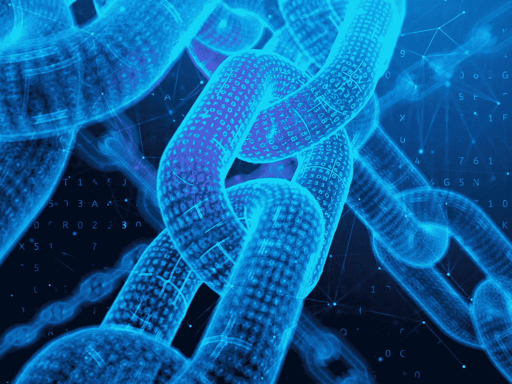
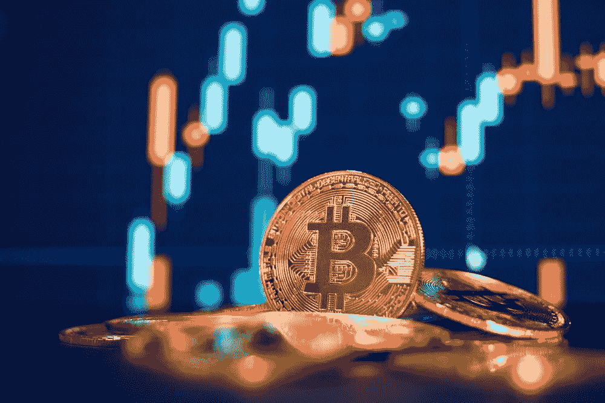
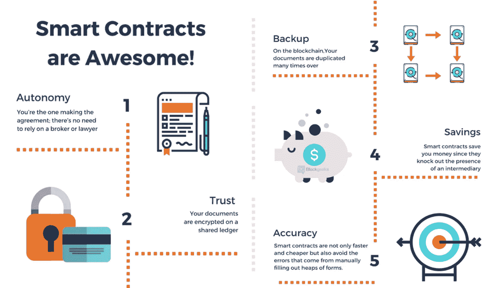
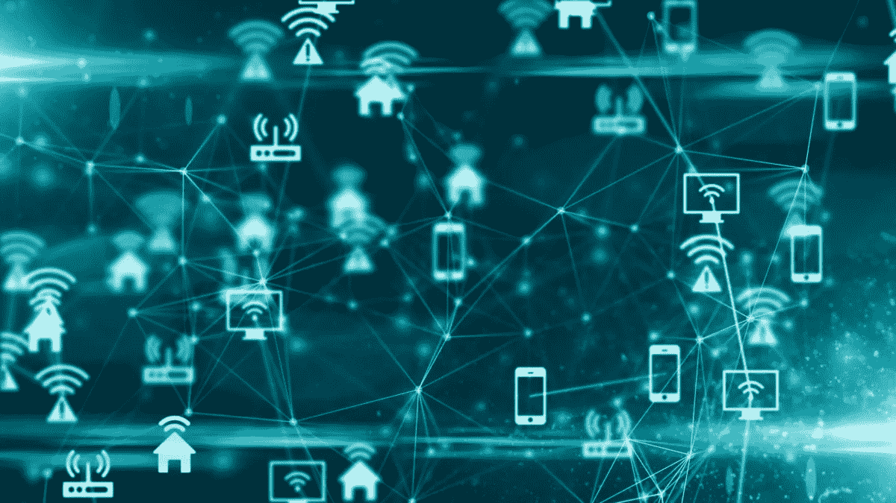

# 区块链崩溃了

> 原文：<https://medium.com/analytics-vidhya/blockchain-broken-down-b1a3fcdcc1e7?source=collection_archive---------26----------------------->

## 区块链初学者指南，这项技术正在席卷全球，而这仅仅是个开始。

区块链本质上是一个区块链。就像一条链，每个块都是相互连接的。

每个块都是一个事务。交易基本上是一种交易；比如用一件有价值的东西和另一件有价值的东西进行交易。

这里有一个例子:你想要一个麦当劳的汉堡，你付 5 美元，你就得到一个汉堡。在这里，你用一个汉堡换了 5 美元。那是一笔交易。

所以区块链是一个交易链。每一笔交易。包括你的麦当劳之旅。

## 当前系统的缺陷

接下来的一周，你决定要一个汉堡。你又绕道去麦当劳点了一个汉堡。你先付钱****然后**收到汉堡。注意事件的顺序。我们中没有人真正质疑过为什么我们会先给**钱**，然后再收到我们的货物。**

**但是为什么我们对此没有意见呢？这是因为我们 ***信任*** 这个系统。我们相信当我们付钱时，为我们服务的人会给我们汉堡包。**

*****在当前的体系中，信任在我们的经济中扮演着明确的角色。在每一笔交易中，信任都是不可或缺的。*****

**但是如果他们不给你汉堡呢？他们说价格从 5 美元涨到了 10 美元，你需要额外付费。**

**在这一点上，你无能为力。你无能为力。你可以要求退钱，但是如果他们不给你呢？毕竟，你给了他们钱，他们可以选择如何处理这些钱。**

**让我们更上一层楼。**

**你从一家 ***银行*** 贷款 100 万美元。利息是 10%，所以你得向银行支付 1，100，000 美元。**

**重要的是要记住，你是信任银行的。您相信银行会遵守双方(您和银行)达成的初始协议。**

**但是银行有权说，“哦，不，实际上你要付 15%的利息”或者“根据我们的记录，你取了 150 万美元的贷款”。你和银行之间的信任不仅会丧失，而且你会意识到他们拥有改变记录的至高权力。**

**他们处理所有的信息。他们可以随意篡改、更改和改变记录。**

**现在，你可以提起诉讼，沿着这条路走下去，但这不仅昂贵和耗时，而且也不能保证你会赢。**

**你也意识到在所有这些系统中，总有一个中间人。在你和你的钱之间，**银行被牵扯进来**。在你的钱和你的汉堡之间，**麦当劳被牵扯进来**。在这两种情况下，麦当劳和银行都是中间人，拥有所有的权力。**

## **围绕区块链的炒作**

**现在银行已经修改了他们的记录，你很沮丧，他们也没有办法重新赢得你的信任。但是之后你会听说这项名为 ***区块链的迷人新技术。*****

**Stuart Haber 和 W. Scott Stornetta 在 1991 年首次概述了区块链技术，这两位研究人员希望实现一个文档时间戳不能被篡改的系统。**

**我的朋友，这就是区块链的精髓。没有人能篡改或改变它。木已成舟。事实就是事实。你明白了。你所能做的就是增加链条，也就是做更多的交易。**

**最棒的是，你不必被迫信任任何中间人！**

**区块链生态系统处理和保存所有交易，并以无人能篡改或更改交易的方式锁定和保护。这从政府手中夺走了大量的权力。这使得区块链成为一个**去中心化**的系统:在那里你不必依赖第三方，并且在区块链上存储所有的事务，这些事务是不可变的(不能被改变)。**

**正因为如此，许多人实际上开始将他们的钱从银行取出来，投资于加密货币！**

# **应用程序**

**提醒你，区块链只是一个分散的互联链接平台，也就是交易。以下是一些使用区块链最广泛的应用程序。**

## **加密货币**

****

**加密货币，简称 crypto，是一种数字资产，旨在作为一种交易媒介，其中个人硬币所有权记录存储在区块链中，并使用强大的加密技术来保护交易记录。**

**通过将业务分散到一个计算机网络，区块链允许比特币和其他加密货币在不需要中央机构的情况下运行。这不仅降低了风险，还消除了许多处理和交易费用。**

## **智能合同**

****

**智能合同只是你的常规合同，但有++的好处。它是一种计算机程序，旨在根据初始协议的条款执行和记录法律上相关的事件。**

**这样，就不会有冲突，所有的权力都在代码行之内，不涉及任何中间人(例如，如果你要贷款，就去银行)。**

**一切都是自动完成的，你是制定协议和验证最初协议的人。**

## **物联网**

****

**区块链还可以用来提高物联网数据安全性。物联网是指全球数十亿台物理设备现在连接到互联网，都在收集和共享数据。你可能会想，“这是使用区块链技术的完美方式！”，你说得再正确不过了！由于物联网是设备的互联，因此涉及到一个巨大的因素:安全。物联网使互联网上的设备能够将数据发送到专用区块链网络，以创建共享交易的防篡改记录。**

**许多公司已经开始采取行动。**

****IBM 区块链**使您的业务合作伙伴能够与您共享和访问物联网数据，但不需要集中控制和管理。**

## **这只是开始**

**无论政府系统喜不喜欢，区块链正在改变我们的经济。虽然区块链是最近的事，但我们开始看到许多公司意识到区块链的潜力。随着公司将这种现代化技术嵌入他们的系统，事实上区块链的崛起才刚刚开始。**

# **个人笔记**

**一定要查看我的 [**LinkedIn**](https://www.linkedin.com/in/fatimah-hussain/) ，关注我的 [**中**](/@fatimahandhussain) 。我最近更新了我的 [**网站**](https://fatimahhussain.com/)**；**快来看看！当我写这些文章的时候，我总是付出 100%的努力和奉献，所以我希望你过得愉快！敬请关注，点击关注按钮，获取每周更新和有趣的内容。**