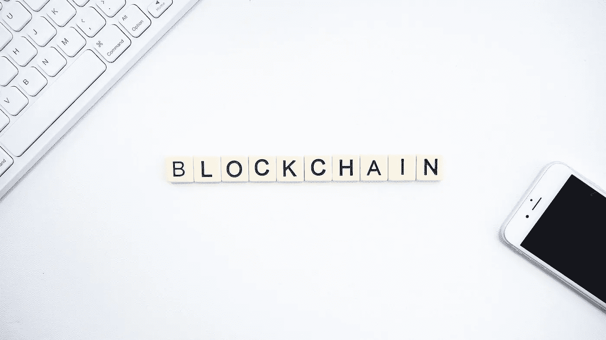

# 区块链——最佳安全性

> 原文：<https://medium.com/analytics-vidhya/blockchain-security-at-its-best-19af095e60b7?source=collection_archive---------3----------------------->

在当前的大数据时代，安全性已成为至关重要的一部分。几年前，安全问题还没有得到解决。但是时代变了，人们对他们的网上活动和安全变得更加谨慎和有意识。

如果你不是生活在岩石下的人，你可能会听说过区块链。即使你生活在岩石下，你也是在正确的地方开始的！

图片:Unsplash

我们将看到以下内容

1.  区块链的定义
2.  区块链到底是什么？
3.  区块链的类型
4.  真实世界区块链的组件
5.  区块链的运作
6.  受欢迎的原因
7.  完美的系统？

# **1。区块链的定义**

> 区块链是一种共享的、不可变的分类账，有助于记录交易和跟踪商业网络中的资产。

# 2.区块链到底是什么？

现在我们已经看到了定义，你可能想知道区块链到底是什么？区块链是一种记录信息的方法，使欺骗、黑客攻击或改变系统变得极其困难或不可能。

# 3.区块链的类型

有各种类型的区块链结构适合各种用例。总体而言，区块链可以分为两种类型——许可型和非许可型区块链。

**许可的区块链** —这些链限制对链的访问，也限制网络上节点的权利。因此，被许可的区块链不是完全分散的。

**无许可区块链**——这些连锁店允许任何人加入网络。无权限区块链往往更安全，但由于链中节点数量的增加，交易需要更长的处理时间。

进一步深入，我们可以将区块链分为 4 种类型

## 一.公共区块链

公共区块链在本质上是未经许可的，并且是真正分散的。属于这种类型的节点具有同等的权限，不受任何限制。这些节点有权访问、验证和创建新的数据块。公共链的例子有比特币、以太坊等。

## 二。二等兵区块链

私人区块链也被称为管理的区块链。这种类型的区块链结构中的某些权利受到管理实体的限制。因此，这种类型的区块链不是完全分散的，因为控制权掌握在一个实体手中。

## 三。区块链财团

区块链财团结构是由一组实体而不是单一实体监管的许可系统。因此，联营连锁店被认为比私营连锁店更加分散，享有更高的安全水平。然而，联盟链很难建立，因为一组组织必须参与和协调。

## 四。混合区块链

混合区块链由单个组织控制，但由公共链执行一定程度的监督。

# 4.真实世界区块链的组件

各种组件协同工作，使区块链中的交易成为可能

## 一、**节点**

节点是区块链中的一个块。区块链中的每个用户都是一个节点。节点可以有两种类型—部分或完整。一个**部分节点**不包含所有事务的副本。它只包含那些事务的散列。然而，**全节点**包含网络中所有事务的副本。

## 二。分类帐

分类账是信息的数字数据库。分类帐可以有 3 种类型—公共的、分散的和分布式的。公共账本对所有人都是公开透明的。在分布式分类帐中，所有节点都有数据库的本地副本。在分散式分类账中，没有一个节点具有集中控制

## 三。钱包

钱包用于在区块链中存储加密货币。钱包有两种类型——热钱包和冷钱包。热钱包与互联网相连，而冷钱包则没有。

## 四。Nonce(数字只使用一次)

这是一个 32 位的数字，只生成一次，并添加到加密块中以使其安全

## 动词 （verb 的缩写）混杂

在区块链，哈希扮演着非常重要的角色。一个块上的散列是下一个块的输入。

# 5.区块链的运作

既然我们已经看到了区块链的组件，现在让我们看看区块链是如何工作的。

该流程通常在新交易发生时启动。一旦**事务被请求并被认证**，一个**新块被创建**用于相同的事务。

在块被创建之后，它然后被发送到网络中的每个节点。在此之后，**节点使用工作证明**验证交易，并因此获得奖励。这种奖励大多是加密货币的形式。

该过程一完成，**新创建的块就被添加到现有链**中，并且链的**更新通过网络**分发。

在所有这些之后，交易被理解为**完成**。

# 6.受欢迎的原因

区块链流行的原因是我们当前 gen 数据存储解决方案的缺陷和漏洞。我们当前 gen 解决方案提供了一定程度的可扩展性和安全性。但是到目前为止，一个主要的问题是**集中式架构**。区块链因其去中心化的架构而闻名，在这种架构中，没有任何一个实体能够完全控制你的数据。

理论上，区块链是一个好得令人难以置信的系统。完美吗？让我们看看！

# 7.完美的系统？

尽管它的安全性和隐私性比目前的系统要好很多，但它绝不是一个完美的系统。就像其他技术一样，它也有自己的问题。举几个例子，区块链的主要问题之一是集成到其他遗留系统甚至现代系统，这是一项艰巨的任务。在某一点之后，随着链的增长，由于其冗余性，可伸缩性也是另一个问题。

# 结论

区块链提供了引人注目的功能和安全/隐私措施，让普通人的选择偏向自己。但它最终归结为个人的用例。与区块链系统相比，我们的传统系统在某些方面提供了更好的价值，反之亦然。也就是说，我认为区块链技术将继续存在，如果得到改进，将为我们的数据需求提供真正安全的存储解决方案。