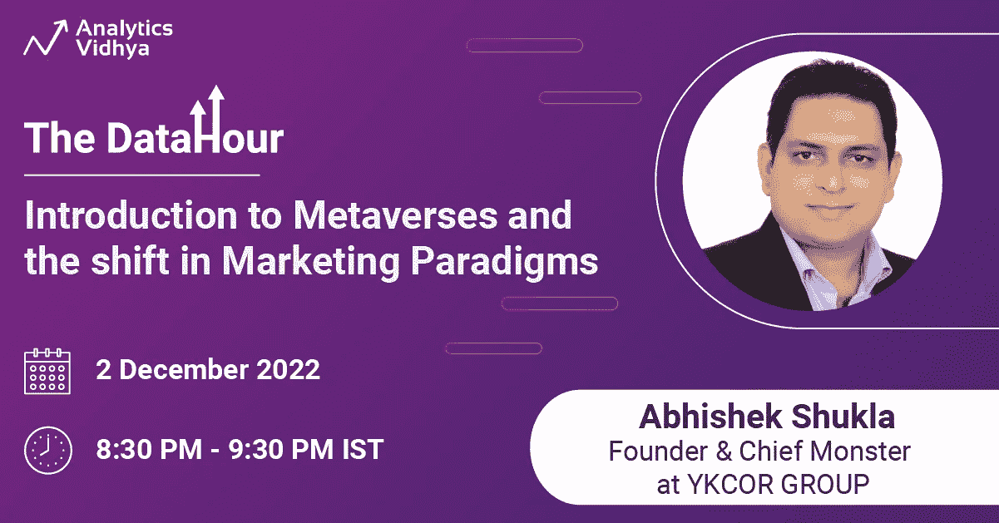
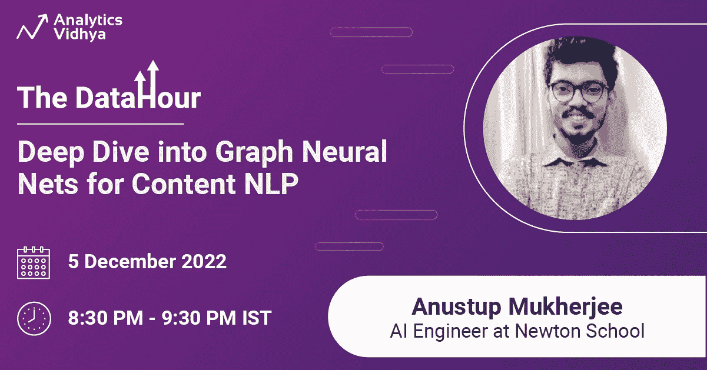

# 立即为即将到来的数据小时会议预订座位

> 原文：<https://medium.com/analytics-vidhya/book-your-seats-now-for-upcoming-datahour-session-s-23ecba7b6327?source=collection_archive---------1----------------------->

## 免费注册！

# 注册要求

好奇心和渴望学习和成长。

# 谁可以参加这些数据小时会议？

*   想从事数据技术行业的学生。
*   希望在数据技术行业改变职业生涯的职业人士。
*   数据科学行业的专业人士，他们希望提高自己的现有技能并了解当前趋势。

因此，[现在就注册](https://datahack.analyticsvidhya.com/contest/all/?utm_source=article&utm_medium=blog_announcement&utm_campaign=datahour)并复习你的技术技能。以下是即将举行的活动的完整列表。

# 数据小时会话:用 F#进行探索性数据分析

众所周知，F#是编程数据科学的优秀解决方案，因为它结合了高效的执行、REPL 脚本、强大的库和可伸缩的数据集成。它可以很容易地与其他强大和丰富的语言集成，如 R 和 MATLAB，因此在这个领域有无限的可能性。它也是一种可持续的编程语言，能耗更低，因此即使在处理大数据时也能减少碳排放。

**关于演讲人** : Munmun Das 是一位专业的研究学者，在软件项目管理、产品开发、产品战略、大型复杂自动化/转换解决方案的交付以及 web 和移动应用方面拥有超过 16 年的经验。她已经使用. Net web 应用程序在 RPA 上实施了握手项目，并成功构建了按需 RPA。

在 [LinkedIn](https://www.linkedin.com/in/munmun-das-5aa05316/) 上与 Munmun Das 联系。

# 数据小时会议:介绍 Metaverses 和营销模式的转变

Metaverses 可以从根本上改变企业和消费者与产品、服务以及彼此之间的互动方式。加密货币等元宇宙概念对当今经济有着深远的影响。为了在新的数字世界和利润丰厚的市场中保持竞争力，品牌必须做出选择:要么加入，要么出局。很明显，元宇宙产生了很多嗡嗡声。除了提供更多的广告空间，元宇宙还将改变从办公室互动到休闲活动和交流的一切。

**关于演讲人:** Abhishek Shukla，笔名 Abhysheq Shukla，国际主题演讲人、作家、心理学家、政治分析家、导师。他的研讨会激励了全世界的学生、教授和企业。Abhishek 是战略商业规划和品牌管理方面的专家。他是 Atal 创新使命、全球创业中心和 Web 3.0 卓越中心的顾问。他是 YKCOR 集团和 YKCOR 元宇宙服务有限责任公司的创始人和首席怪物。

在 [LinkedIn](https://www.linkedin.com/in/authorabhishek/) 上与 Abhishek Shukla 联系。

# 数据小时会议:使用 ML 和 Flutter 进行 HIV 分析

*   全世界和全国艾滋病毒病例统计。
*   使用 ML 检测 HIV 的阶段
*   避免艾滋病毒使用 Flutter 应用程序，如果我们能够与父母和老师谈论它，就可以避免艾滋病毒。

**关于演讲者:** Geeta 是 Kanishka IT Pvt. Ltd .的首席执行官兼数据科学家，她是谷歌开发者小组的组织者。她还是女性科技制造商 Gwalior 的品牌大使。她拥有超过 12 年的经验，是数据科学、Tableau、机器学习和 Python 编程领域的专家。

在 [LinkedIn](https://www.linkedin.com/in/geetakakrani/) 上与 Geeta Kakrani 联系。

# 数据小时会议:了解降维

在过去的十年中，数据的 3v(容量、速度和多样性)大幅增长。大数据革命彻底改变了公司收集、分析和存储数据的方式。

**关于演讲者:** Aakash Bansal 目前在亚马逊担任数据工程师。他在数据工程领域有超过 10 年的经验，主要关注数据仓库和数据建模。他研究过多种云技术——AWS 和 Microsoft Azure，通过建立满足组织整体数据需求的数据仓库和数据管道，为复杂的数据问题提供解决方案。

在 [LinkedIn](https://www.linkedin.com/in/aakashbansal001/) 上与 Aakash Bansal 联系。

# 数据小时会议:数据小时:扩展现实(XR)介绍

*   扩展现实简介
*   AR、VR、MR 和 XR 之间的概念区别。
*   平台、设备、应用、工具和 XR 技术前景
*   如何找到适合您设备的 XR 应用程序？
*   如何将 XR 应用程序按照从现实到虚拟的光谱进行分组？
*   虚拟现实的基础，包括虚拟现实的技术和历史
*   虚拟现实的各种用途
*   虚拟现实心理学
*   媒体的困难

**关于演讲者:** Pooja Sarin 是德里印度理工学院的数据科学研究员(博士研究学者)，从事“社交媒体挑战”的应用机器学习研究在加入博士项目之前，她在德里 IIT 大学担任研究助理，探索大数据领域及其应用(空气污染&计算机视觉应用)。她还在位于昌迪加尔的中央科学仪器组织(科学和工业研究委员会)担任 M.Tech .实习生，拥有地震数据分析方面的研究经验。

在 [LinkedIn](https://www.linkedin.com/in/sarinpooja/?originalSubdomain=in) 上与 Pooja Sarin 联系。

# 数据小时会议:使用 Flutter 及其强大的生态系统构建漂亮的应用程序

**关于演讲者:** Ashita 是 IIT-坎普尔和 IIM-艾哈迈达巴德的校友，是 Flutter Gems 的创始人，这是一个可视化包发现平台，受到全球 50 多万 Flutter 开发者的信任。

在 LinkedIn 上与 Ashita Prasad 联系。

# 数据小时会议:深入研究内容 NLP 的图形神经网络

*   图形架构模型的世界，包括在行业中执行的尖端项目的例子(过去/正在进行和未来)
*   定义 GNN 的基本定义，并通过知识图表的上下文，仅用现实生活中的例子强调重要的数学理解
*   解释现实世界的项目
*   GNN 模型的学习路径
*   如何用机遇开启人工智能的职业生涯？

**关于演讲者:** Anustup Mukherjee 拥有 10 多年与印度和硅谷公司合作开发人工智能解决方案的经验。阿努斯图普目前在牛顿学校担任人工智能工程师，用人工智能的力量构建下一次教育技术革命，他也曾与 MHRD 印度公司合作。他因对国家建设的贡献而获得总统奖。

在 LinkedIn[上与 Anustup Mukherjee 联系](https://www.linkedin.com/in/anustupmukherjee/)。

# 结论

上面讲的话题不精彩吗？数据小时课程是提高你技能的最佳来源。你可以在任何你方便的地方参加这些会议。你也可以通过问答环节直接向演讲者提问。因此，不要再等了，现在就[注册](https://datahack.analyticsvidhya.com/contest/all/?utm_source=article&utm_medium=blog_announcement&utm_campaign=datahour)以上即将到来的会议。如果你错过了之前的数据小时会议，那么在这里阅读它的[概要](https://www.analyticsvidhya.com/?s=datahour+&utm_source=article&utm_medium=blog_announcement&utm_campaign=datahour)。

# 与我们联系

如有任何疑问，请联系我们 editor@analyticsvidhya.com

*原载于 2022 年 12 月 1 日***。**