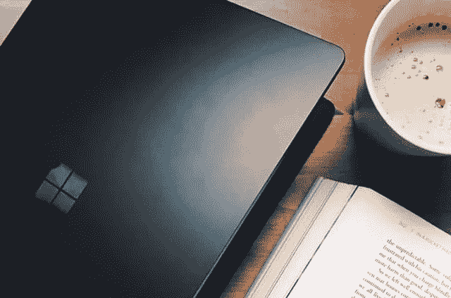

# 基于 Python 的图书价格预测

> 原文：<https://medium.com/analytics-vidhya/books-price-prediction-via-python-31dc358ad8d8?source=collection_archive---------8----------------------->

书是人一生中最重要的朋友。读者反对的所谓作者悖论，往往根本不存在于作者的书中，而是存在于读者的头脑中。——弗里德里希·尼采的书为每个人打开了通往独一无二的想象不到的世界的大门。对许多人来说，这不仅仅是一种爱好。我们当中有许多人喜欢花更多的时间在书上，而不是其他任何东西上。这里…