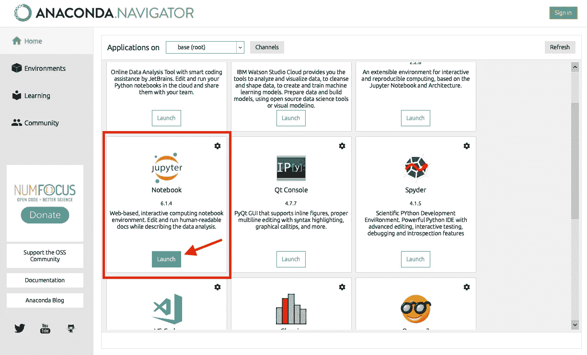
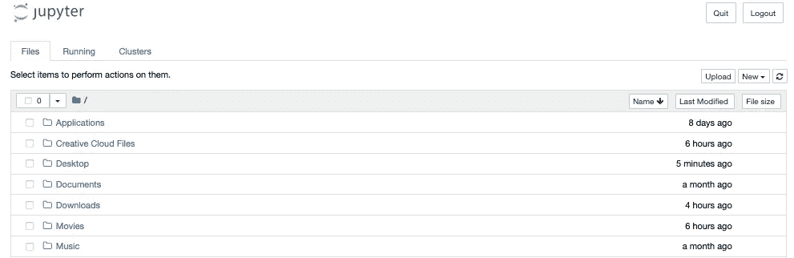
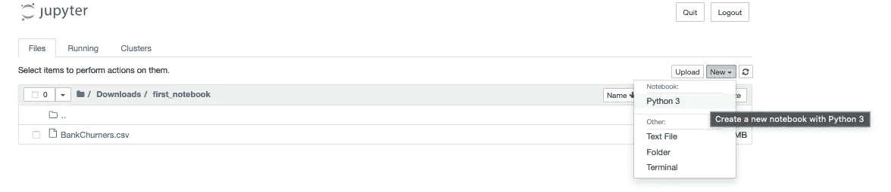
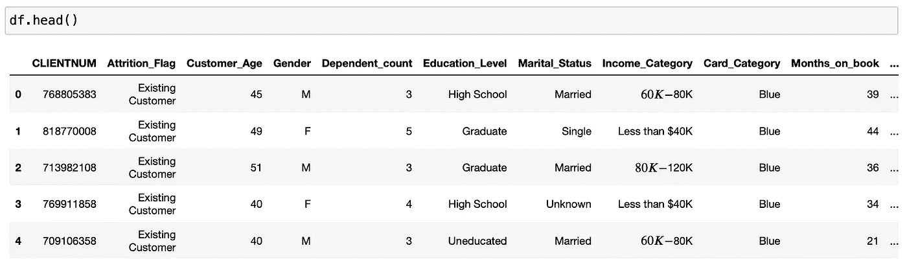
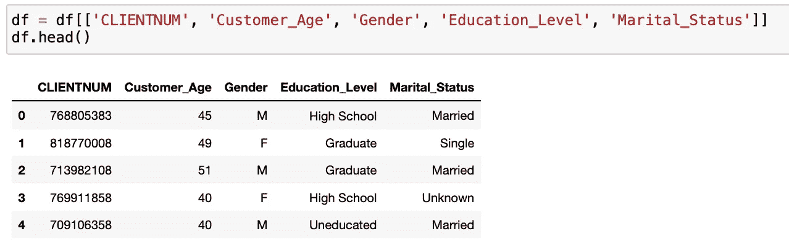
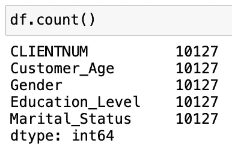
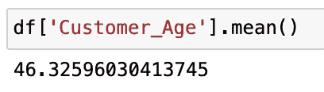
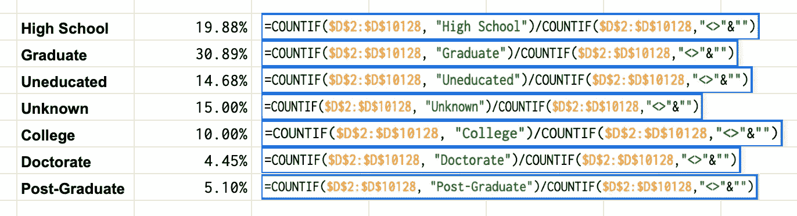
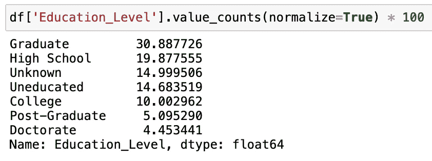

# 用熊猫提高您的 Excel 工作效率

> 原文：<https://medium.com/analytics-vidhya/boost-your-excel-productivity-with-pandas-b107e420d9d4?source=collection_archive---------20----------------------->

Python Pandas 的绝对初学者入门，用于办公室日常使用的电子表格数据分析。不需要编码经验。


来自 [Pixabay](https://pixabay.com/?utm_source=link-attribution&utm_medium=referral&utm_campaign=image&utm_content=1851650) 的[像素](https://pixabay.com/users/pexels-2286921/?utm_source=link-attribution&utm_medium=referral&utm_campaign=image&utm_content=1851650)的图像

在我们开始之前，你可能想知道一些超大的 peluches 将如何帮助你在办公室的一天。我不想让你失望，但我今天不想和你谈熊。这里有一只可爱的熊猫🐼。

> **Pandas** 是一个快速、强大、灵活且易于使用的开源数据分析和操作工具，构建于 [Python](https://www.python.org/) 编程语言之上。([https://pandas.pydata.org](https://pandas.pydata.org))

> 那么，我为什么要费心学习使用数据分析工具，甚至编程语言呢？

事实证明，如果你的工作涉及到使用任何类型的电子表格(Excel、Google、Numbers 等)。)，您很可能已经在做一些数据分析，那么为什么不利用技术提供的优势呢？

> 好的，那么我如何安装熊猫呢？

使用熊猫进行数据分析的最佳方式之一是通过“笔记本”。我觉得非常实用和强大的是 Jupyter 笔记本，可以在这里通过 Anaconda 安装:[https://www.anaconda.com/products/individual#Downloads](https://www.anaconda.com/products/individual#Downloads)

一旦你安装了 Anaconda，你可以通过点击 jupyter 笔记本下面的" launch "来启动 Jupyter 笔记本，如下所示。



第一次打开 Anaconda 时，您可能会选择“安装”而不是“启动”。

这将在您的浏览器中打开一个新的选项卡/窗口，您可以在其中浏览本地文件夹。



此时，您可能想要创建或导航到保存电子表格的工作目录，或者您可以为笔记本创建一个单独的文件夹。虽然你不一定需要在你的本地机器上有你的电子表格的副本(例如，如果你使用谷歌电子表格)；在云上访问电子表格需要更高的复杂度，本文不会讨论。

例如，假设您决定在电子表格的同一文件夹中创建笔记本。使用 Jupyter 界面导航到该目录，然后单击“新建”并选择“python3 ”,如下所示:



如果一切顺利，你的浏览器会打开一个新的标签，并创建一个名为“Untitled.ipynb”的文件。

祝贺你的第一个 Jupyter 笔记本！🎉

> 我可以用熊猫做什么？

您可以用 Pandas 做很多事情，但是为了本文的目的，我们将只关注一些基本的电子表格分析。现在你已经打开了你的 Jupyter 笔记本，你要做的第一件事就是通过输入你的第一行代码来确保你已经安装了熊猫:

```
import pandas as pd
```

要运行代码，只需按`shift + enter`。如果该命令抛出错误，只需键入并运行:`!pip install pandas`并重试。

笔记本的好处在于它允许你一行一行地运行你的代码，而不是传统的批量运行。现在您已经导入了熊猫，您可以开始读取您的电子表格数据了。

根据您的电子表格的格式，有不同的方法来读取您的数据。在我的例子中，我的电子表格是一个`csv`文件，但你可能有 Excel 文件。别急，两个过程我都给你看。

我的`csv`文件名为“BankChurners.csv”，来自:[https://www.kaggle.com/sakshigoyal7/credit-card-customers](https://www.kaggle.com/sakshigoyal7/credit-card-customers)。要读取`csv`文件，请键入:

```
df = pd.read_csv("BankChurners.csv")
```

如果您想打开一个 Excel 文件:

```
df = pd.read_excel("BankChurners.xlsx")
```

使用下一个命令，我们将查看数据(或数据帧)的前 5 行:



那不是很美吗？好吧，也许这会儿有点让人不知所措，所以让我们把数据压缩到更容易理解的程度。出于教育目的，我们只保留客户数量、年龄、性别、教育程度和婚姻状况:



既然我们已经缩减了数据，开始进行一些分析就更容易了:首先，我们想知道在我们的数据集中有多少客户端。这可以通过以下方式轻松实现:



它显示了每一列有多少个值。在这种情况下，我们还可以看到没有“null”或“empty”值，因为我们所有的列都有相同数量的条目(除非我们有一个空行；要检查空值，只需运行`df.isnull().any()`。

要了解我们顾客的平均年龄:



这些只是几个基本的例子，但是 Pandas 和 Python 让我们有可能加速更多的过程，这些过程在 Excel 中会很麻烦，甚至需要更多的代码。

举个例子，需要用 Excel 公式来计算每个教育水平的客户比例:



首先，我们必须获得不同教育水平(高中、研究生等)的唯一值。);然后我们必须为它们中的每一个写相同的代码行，在这个例子中，写了七次。此外，如果数据集的范围发生变化，我们必须手动更改代码。

使用 pandas 的一行代码可以获得相同的结果:



# **结论**

Pandas 使得对您的电子表格数据进行探索性分析变得极其容易，等等。利用 Python 和 Jupyter notebook 的强大功能，您可以创建可重复的工作流，可以与同事共享或在下一次办公室会议上展示，而不必处理分散的数据。

它还使得进行复杂的数据分析变得更加容易，否则仅仅使用电子表格即使不是不可能，也是非常麻烦的。

就我个人而言，我总是喜欢用熊猫来分析任何新数据，调查所有的相关性，并提取有意义的见解。

如果你创建了你的第一个笔记本，我希望你能继续寻找那些对你的电子表格有帮助的功能；熊猫在网上提供了大量的支持。如果你不知道从哪里开始，你可以看看这里的官方文档:【https://pandas.pydata.org/docs/】T2 如果你陷入困境，无法解决问题，加入 StackOverflow 上全球最大的开发者和数据科学家社区，提出你的问题:【https://stackoverflow.com】T4

另一种享受在线使用熊猫而不需要任何安装的方式是通过 Kaggle，它也为每个级别提供教程和指南:[https://www.kaggle.com](https://www.kaggle.com)

我希望你觉得这篇文章有趣并且有用。

享受编码！😃