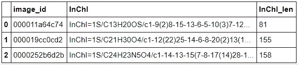

# 提升图像字幕模型性能

> 原文：<https://medium.com/analytics-vidhya/boosting-image-captioning-model-performance-df57132cad05?source=collection_archive---------10----------------------->

如何修改您的编码器、注意机制和解码器，以增加模型容量并产生更好的结果。还包括关于数据集大小和其他超参数的附加讨论。

变形记 II [1]

# 回顾以前的工作

在过去的两周里，Ethan Huang 和我一直在努力研究、重建和改进当代 CNN+LSTM 图像字幕模型，以实现最终的建筑设计，使生命科学研究人员能够有效地查找以前记录的分子化合物。目前，许多旧论文包含以所谓的骨架式表示的分子图，但是这些表示不能够被计算机很好地解释，并且如果不花费过多的精力和时间，很难通过在线资源找到。随着我们过渡到一个更加数字化的社会，开发新方法来整合新旧方法变得越来越迫切。这促使科学家在 21 世纪初开发了国际化学标识(InChI)标签。这些独特的识别标签允许每个已知的化合物由特定的、不同长度的文本串来表示。这种分子结构的一个例子，InChI 标签配对可以在下图中看到。通过以这种方式将可视图表转换为字符串，机器现在能够解析大量旧论文，并提取其中包含的有意义的化学物质，这将为当前的研究人员节省大量时间，并防止以前发表的结果消失在晦涩中。

咖啡因的骨架配方和相应的英制标签[2]

大型化工和制药公司对成功开发一种能够实现预期转化结果的模型也很感兴趣，因为它有可能大大加快 R&D 的速度和效率，并产生更高的投资回报。出于这个原因，百时美施贵宝发布了一个数据集，其中包含 240 万张记录的分子结构及其相应的 InChI 标签的训练图像，希望有人能帮助他们产生一个解决这个问题的可靠解决方案。正是基于这些数据，我们一直在训练和建立我们的模型，并且在衡量我们的模型的成功时关注的主要评估度量是 Levenshtein 距离，该距离计算将预测标签转换为真实标签需要多少编辑(插入、删除或交换)。

Levenshtein 距离演示[3]

我们之前的努力和现阶段的进展已经在我们之前的两篇博客文章([第一篇](/analytics-vidhya/deep-learning-for-molecular-translation-b032b90750bc) & [第二篇](/analytics-vidhya/exploring-and-implementing-a-contemporary-cnn-lstm-image-captioning-model-17ca8e01a2b9))中有详细的记录，但是为了方便起见，我在这里简单总结一下。

在我们最近的更新中，我们已经最终构建了一个基线、概念验证模型，该模型能够接受我们干净且经过处理的固定尺寸图像(256x448)并输出相应的预测字符串。我们选择检查的模型以及我们的项目所基于的模型可以在 Mark Wijkhuizen 的[笔记本](https://www.kaggle.com/markwijkhuizen/tensorflow-tpu-training-baseline-lb-16-92)中找到，并且具有下面描述的一般架构。

自动图像字幕的通用架构[4]

截至上周，我们只能以极其精简的方式训练该模型，因为我们在管理如此大规模的数据集时遇到了一些严重的困难，并且只能在这个初始的截断训练过程中纳入非常有限的数据集。在我们的上一篇文章后不久，我们还发现，我们努力在任何有意义大小的图像集上训练我们的模型的原因之一是，我们第一次需要访问 TPU 而不是 GPU。这需要我们将整个笔记本从 Colab Pro 转移到 Kaggle，并更好地熟悉编码环境。虽然我们仍在努力解决管理如此规模的数据集的一些复杂性，但我们的模型能够成功地产生一个可行的(尽管不是特别明智或有意义的)预测，正如您在下面的可视化中所看到的。

样本图像及其相应的预测和实际标签

检查我们的模型在这一点上产生的输出，很明显，虽然预测字符串的一些小的子序列似乎与实际字符串匹配得相当好，但模型通常缺乏有意义的预测能力，并且陷入了一次又一次重复相同的 3-gram“PBb”的循环中。虽然我们的模型在这一点上没有产生特别一致的 InChI 标签，但这是意料之中的，因为它还没有经过适当的训练。我们觉得这是一个非常好的中间点，因为我们有一个经过验证的模型，可以训练和执行推理，并且知道我们需要采取什么具体步骤来达到我们想要的水平。我们需要完成的第一件事是访问清理图像的完整数据集，在此基础上训练我们的模型，一旦完成，根据我们在课堂上学到的理论和概念修改模型的结构，以便对模型的功能进行重大改进。我们计划特别关注的模型部分是编码器 CNN、注意力机制和与隐藏状态、嵌入维度相关的超参数。这些开发将是本文的重点，正如您将在最后看到的，对它们进行适当的修改将会极大地提高模型的容量和功能。

# 完整数据集

正如我们在总结中所讨论的，我们改进过程的第一步是弄清楚如何处理完整的数据集。尽管我们的中途模型证明了我们的管道完全完好无损，但我们希望在对架构进行任何更改之前，确保我们的模型能够在更大范围内产生合理的结果。

此时，我们只对大约 500 张图像训练了模型，这只是我们所能处理的 240 万张图像中的一小部分。由于我们一直在使用 Google Colab，对更多数据进行模型训练需要我们将图像上传到 Google Drive，这一过程每 100，000 张图像需要大约 1 小时。

我们最终意识到使用 Colab 完全没有必要，因为我们的整个模型管道已经在 Kaggle 环境中了。在 Kaggle 中，任何笔记本都可以链接到比赛数据，这也允许更无缝的数据加载过程。事实上，这就是我们最终尝试的。用 Pandas 读取数据的代码如下所示(如果我们正在调试，我们选择只读取前 1000 个条目)。

加载训练数据

前 3 行训练数据

由于数据按照图像 ID、InChI 标签和 InChI 标签长度整齐地组织起来，将图像转换为 TFRecords 格式是一个相对简单的过程，这要归功于 Mark 神奇的[探索性数据分析笔记本](https://www.kaggle.com/markwijkhuizen/advanced-image-cleaning-and-tfrecord-generation)。我们不会在这篇博文中详细介绍这个转换过程，但是我们已经在 GitHub 资源库中提供了我们所有的代码，在适当的地方引用了 Mark 的笔记本，这个资源库可以在文章的结尾找到。

在所有 240 万张图像(230 万次训练，10 万次验证)被转换为 TFRecords(大约 4 小时的过程)后，我们将它们上传到谷歌云存储(GCS)，以便数据可以与 TPU 的使用兼容。我们选择将图像分成 40，000 个图像的批次，这样我们总共有 60 个批次(57 个训练和 3 个验证)。至关重要的是，我们公开了这个数据集，这样我们就可以从 Kaggle 环境中访问它。

TFRecords 格式的 10 批训练图像

一旦数据上传到 GCS，我们所要做的就是把它加载到我们的 Kaggle 笔记本上。在认证了我们的 Google Cloud 凭证之后，我们创建了一个数据路径，并使用 Glob 提取图像。

我们希望这一部分对任何希望在未来使用 Kaggle 的免费 TPU 来训练模型的人都有用(同样，我们所有的代码都可以在 GitHub 库中找到，以便仔细检查)。虽然我们花了几天时间来熟悉这种新的数据加载方法，但学习如何使用 Kaggle 环境和 Google 云存储最终被证明是非常有价值的。如果没有这些工具，我们就无法正确管理我们拥有的大量数据。

# CNN 编码器

在我们构建的基线模型中，编码器简单地将我们选择的导入 CNN 应用于固定维度的图像(256x448 ),并使用每个通道的展平特征图输出作为嵌入的序列数据。本质上，CNN 本身充当编码器，并且嵌入空间的维度是展平特征图的大小。对于我们的原始模型，我们使用 EfficientNetB0(带“嘈杂学生”初始化),因为它的 Imagenet 精度与参数数量之比很好，但是，从下图中可以看出，该模型的后续版本实现了更高的精度，而不需要过多的参数。在我们之前的项目中，我们对木薯叶图像进行分类，我们使用 ResNet50 作为我们的基础模型，但是，正如你可以清楚地看到的，该模型比 EfficientNetB4 有更多的参数，与近 83%的准确率相比，只能达到大约 76%的准确率。因此，在决定新的编码器 CNN 时，我们选择坚持使用 EfficientNet 系列分类器。在网上做了一些研究，阅读了其他人试图实现不同 CNN 的评论，并观察了下面的图表后，我们决定将 EfficientNetB4 作为我们模型的最佳选择。

不同型号在 Imagenet 上的性能与其尺寸的关系图[5]

正确地对我们的原始模型进行这种修改需要我们完全理解和确认编码器和解码器中隐藏状态的维度的兼容性，以及它们之间的交互是如何通过注意力来调节的(这将在下一节中进一步讨论)，但是，一旦它被成功实现，我们就可以看到模型的性能有了相当大的改善，这可以通过验证集上的 Levenshtein 距离(val_lsd)来衡量。这可以从下面的输出中看出，我们实现了 11.3 的 val_lsd。

高效的模型性能网络 4

请注意，这些结果是在经过 20 个时期而不是 10 个时期的训练后测得的，但在训练过程中，这些结果比以前更加稳定，而且，正如您可以从持续稳定下降的损失分数中看出的那样，该模型非常有希望继续建立。

# 注意机制

在修改了我们对图像分类器的选择后，我们决定实验的下一个组件是注意力机制。我们的中途模型展示了下图中常用的 Bahdanau 注意力模式。

Bahdanau 注意用于中途模式

为了提供一个高层次的概述，注意力的目标是找出编码器的每个隐藏状态对解码器输出的影响程度。为此，我们计算一个分数来量化编码器的隐藏状态和解码器的最新输出之间的关系。理想情况下，我们希望在进行预测时，只考虑对输出有明显影响的隐藏状态。

一旦我们有了编码器的每个隐藏状态的分数，我们就可以对它们进行软最大化(确保这些分量加起来等于 1，较大的分量对应于与解码器的输出更相关的贡献者)来确定注意力权重。然后，通过将注意力权重应用于解码器的隐藏状态，获得告知解码器如何考虑先前信息的上下文向量。穆拉特·卡拉卡亚的精彩笔记详细展示了所有这些，并总结如下:

注意力是如何工作的[6]

你可以想象，有很多方法可以计算出决定注意力权重的分数。我们决定对 Luong 注意力进行实验，看看它与 Bahdanau 注意力相比如何。这两种机制之间的唯一区别是 Luong 通常使用某种形式的点积来计算分数(因此是乘法风格)，并且上下文向量在嵌入到隐藏状态之前与解码器输入相结合，而在 Bahdanau 的情况下，上下文向量直接连接到嵌入的解码器输入。所有这些如下图所示:

[https://www . ka ggle . com/kmkarakaya/encoder-decoder-with-bahda nau-Luong-attention](https://www.kaggle.com/kmkarakaya/encoder-decoder-with-bahdanau-luong-attention)

Luong 和 Bahdanau 注意机制图[7]

不幸的是，Luong 注意机制最终降低了我们模型的容量。虽然训练过程是稳定的，但我们的验证指标在第 10 个纪元之前就开始停滞不前了。

Luong 训练指标:从第 4 时段到第 5 时段验证损失增加

最终，Bahdanau 注意力的结构方式使得它比 Luong 注意力有更多可学习的参数，这对于我们使用 LSTM 解码器的模型是至关重要的(我们将在结论中讨论为什么)。

# 超参数调谐

最后，我们决定研究控制训练过程的一些最重要的超参数:注意单元的数量和解码器的维数。我们怀疑增加这两个量会让我们的模型以一种有意义的方式提高它的能力，但是我们担心增加它们可能会导致额外的训练时间。

幸运的是，由于我们的自定义训练循环的设置方式和 TPU 提供的效率，同时增加这两个数量导致平均验证 Levenshtein 距离的明显改善，而总训练时间仅略有增加。具体来说，我们发现增加注意单元的数量会导致稍好的表现，而解码器维度所扮演的角色要重要得多。正如我们在上面看到的，将解码器尺寸减小 2 倍会导致更大的 Levenshtein 距离，正如我们将在下一节看到的，将解码器尺寸增加 2 倍会产生最佳结果。

将解码器尺寸从 512 减小到 256

# 总结和最终表现

概括地说，我们从研究和复制一个 [public Kaggle 笔记本](https://www.kaggle.com/markwijkhuizen/tensorflow-tpu-training-baseline-lb-16-92)开始，它实现了 22.2 的平均 Levenshtein 距离。

[马克的成绩](https://www.kaggle.com/markwijkhuizen/tensorflow-tpu-training-baseline-lb-16-92)

在充分了解我们复制的基础模型的各个组件并对包括但不限于新图像分类器、注意力机制和超参数调整的领域进行实验后，我们最终能够在验证数据上实现 7.4 的平均 Levenshtein 距离，这是一个巨大的成功！

决赛成绩

如果我们观察我们对最终模型进行训练的大约 30 个时期的训练损失和训练准确性的图，似乎我们的模型非常接近达到其全部潜力。验证损失和 Levenshtein 距离讲述了一个类似的故事，并表明我们可能已经从我们的模型中获得了一些额外的性能，因为验证指标仍在改进(尽管在这一点上只是略有改进)。

*请注意，我们试图用 40 个小时来训练最终模型，但由于 Kaggle 的最大连续运行时间为 9 个小时，我们只能完成大约 30 个时代。*

最终模型的培训指标

最后，让我们来看一个预测的例子:

预测示例，Levenshtein 距离为 17

正如我们所看到的，我们的模型在避免 n-gram 重复和产生与实际 InChI 标签长度一致的输出方面做得更好。由于标签的长度，这个特定的例子具有相对较高的 Levenshtein 延迟(与平均值 7.4 相比)，但是仍然展示了我们的最终模型如何能够很好地模拟长标签的一般结构，并且在此过程中有一些错误。

# 结束语

虽然我们很高兴达到了 10 以下的 Levenshtein 距离，但我们仍然看到了很大的改进空间。迄今为止，Kaggle 上的最高公开表演仅低于 2，因此，鉴于我们距离比赛结束还有一个多月的时间，我们相信我们将能够继续向这样的分数迈进。不幸的是，即使我们能够对我们为这个项目考虑的当前基线模型进行有意义的改进，看起来我们可能会达到当前框架的容量和预测能力的极限。由于编码器对于像我们这样具有简单编码器/解码器框架的模型来说至关重要，我们可以继续试验不同的 CNN 模型来用作编码器，并观察它们的表现，但我们认为，为了看到性能的下一次大幅提升，我们需要重新配置整个序列数据分析过程，并更新模型，以使用更现代的东西，如转换器，甚至可以直接从嵌入式编码器隐藏状态到预测输出的 BERT 架构。我们目前的模型有一些稍微过时的组件，如 LSTM 细胞和直接的 Bahdanau 注意力，因此，为了与顶级条目竞争，我们需要升级到最复杂的技术。鉴于我们面临的时间限制，这不是我们能够在此时进行调查并成功实施的事情，但我们对在下个月进一步探索这一想法的可能性感到兴奋。

此外，我们遇到了一些有趣的想法，即可能有一个单独的模型尝试学习“InChI 的语法”，然后使用它来调节来自我们另一个模型的预测输出，以确保产生的所有字符串都与我们试图预测的标签的底层语法结构兼容。进一步考虑所有这些事情会很有趣，我们期待在今年夏天开始时进一步开发我们的模型。

非常感谢您关注我们的进展！

这个项目的代码可以在这里找到。

关于作者:Ethan Huang 和我(Griffin McCauley)都是布朗大学应用数学专业的大三学生。此外，我是男子大学越野队和田径队的成员，也是经济系的助教，伊森是 NFL 平台 Starting Eleven 的主席和学术导师。

鸣谢:该项目基于百时美施贵宝-分子翻译 Kaggle 竞赛([https://www.kaggle.com/c/bms-molecular-translation](https://www.kaggle.com/c/bms-molecular-translation))，是数据科学倡议硕士项目中布朗大学数据 2040 课程(数据科学中的深度学习和专题)的一部分。

参考资料:

1.  [https://uploads 6 . wiki art . org/images/m-c-escher/变态-ii.jpg](https://uploads6.wikiart.org/images/m-c-escher/metamorphosis-ii.jpg)
2.  【https://iupac.org/100/stories/what-on-earth-is-inchi/ 
3.  [https://www.cuelogic.com/blog/the-levenshtein-algorithm](https://www.cuelogic.com/blog/the-levenshtein-algorithm)
4.  [https://www . analyticsvidhya . com/blog/2018/04/solving-an-image-captioning-task-using-deep-learning/](https://www.analyticsvidhya.com/blog/2018/04/solving-an-image-captioning-task-using-deep-learning/)
5.  [https://ai . Google blog . com/2019/05/efficient net-improving-accuracy-and . html](https://ai.googleblog.com/2019/05/efficientnet-improving-accuracy-and.html)
6.  [https://www . ka ggle . com/kmkarakaya/encoder-decoder-with-bahda nau-Luong-attention](https://www.kaggle.com/kmkarakaya/encoder-decoder-with-bahdanau-luong-attention)
7.  [http://cnyah.com/2017/08/01/attention-variants/](http://cnyah.com/2017/08/01/attention-variants/)