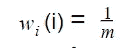
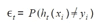
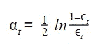
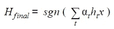

# Boosting 树和 AdaBoost:简介

> 原文：<https://medium.com/analytics-vidhya/boosting-trees-and-adaboost-an-introduction-1f20e2bc83c3?source=collection_archive---------15----------------------->

Boosting 是一种迭代组装机制，其中模型被一个接一个地训练。这些模型被称为“糟糕的学习者”，因为它们是基本的预测规则，仅比随机猜测好一点点(即略好于 50%的准确度)。

助推背后的核心前提是专注于“困难”情况，或模型无法准确预测的情况。通过倾斜发现的分布来强调这些例子，使它们更有可能出现在样本中。结果，下一个学习慢的人会更专注于纠正这些困难的例子。你总是能从连续的训练中获得一些知识，因为你的学习者总是比随机的学习者做得更好。当所有的基本预测规则合并到一个支配性模型中时，有效的预测器就出现了。

增强的集成学习器的一个优点是，只要使用简单的学习器，集成模型就非常抗过拟合。在训练模型时，如果您继续为训练数据的完全准确性进行优化，则有过度拟合的风险；这就是为什么交叉验证是必要的，因为它确保模型在新数据输入时仍然可以很好地工作。

当你开始过度拟合你的结果时，传统的有效性曲线(作为迭代训练的函数的训练和交叉验证分数的曲线)将会偏离。而助推模型则没有这种发散，非常有用。对此的解释是，boosting 将其精力集中在“硬”例子上。考虑分类情况:“硬”例子是那些接近决策边界的例子，因此 boosting 算法可以集中精力分离这些数据点。结果，决策边界两边的结果之间的差距增大了。正如我们在帮助向量机中发现的那样，宽边距分隔符可以很好地概括，并且可以防止过度拟合。

# adaboost 算法

Freund 和 Schapire 在 1996 年提出了 AdaBoost，即“自适应增强”的缩写，作为第一个实用的增强算法。它关注分类问题，目的是将一组弱分类器转换成一组强分类器。以下是一般步骤:

**第一步**:先给每个样本分配权重，目标是均匀分布。给定 m 个观察值，我们将从平等对待所有数据开始。我们将调整这些权重，将更多的注意力放在模型中表现不佳的观察上。

**第二步**:在一个随机样本上训练一个差学习器 ht(x)，这个随机样本在开始时用均匀分布加权，w1 (i)。

**第三步**:确定学习者的错误，ht (x)。我们将误差定义为模型将数据点错误分类的机会；这将隐含地考虑观察值的加权分布。

**第四步**:根据模型的误差计算模型的分数。这个等式不是一个天真的断言；它是从微积分中推导出来的，目的是计算出一个最小化总误差的公式。

**第五步**:重新分配，重新计算每次观察的权重。错误分类的发现会得到更多的关注。归一化因子 zt 确保权重相加为 1(从而形成分布)。

步骤 6 :反复训练模型并重新计算分布，将更多的注意力放在没有正确建模的结果上。

从某种意义上来说，每个连续的假设都可以预测 xi 的等级，要么是-1，要么是 1。我们的最终模型将结合这些预测，通过单个模型的性能(由 t 衡量)进行加权。

