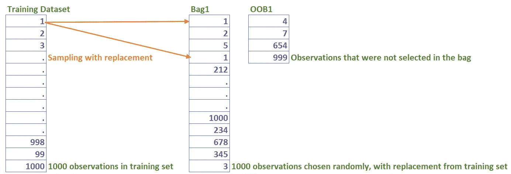
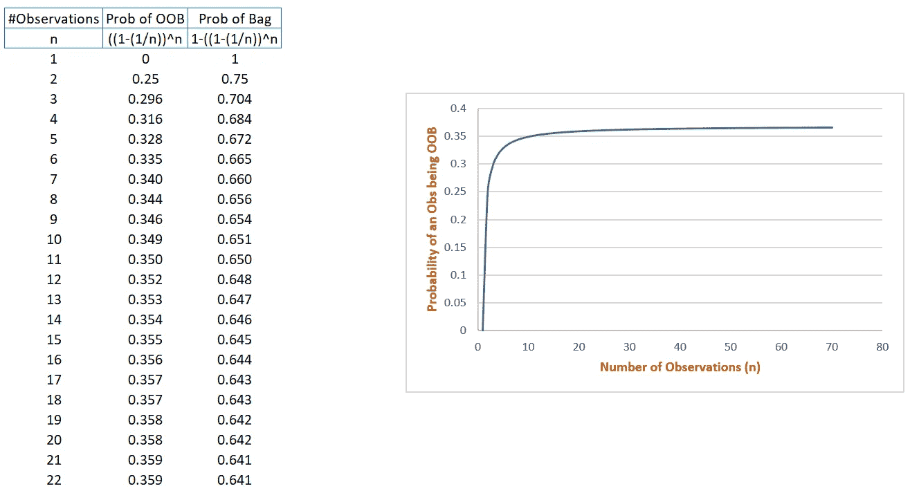

# 随机森林中的自举和 OOB 样本

> 原文：<https://medium.com/analytics-vidhya/bootstrapping-and-oob-samples-in-random-forests-6e083b6bc341?source=collection_archive---------4----------------------->

# 对为什么套袋率为 63.2%的解释

如果您已经阅读了随机森林(RF)中的自举和袋外(OOB)样本，那么您肯定已经阅读了当您使用自举构建 RF 时,“袋”中的观察值比例约为 63.2%。

这篇文章简明扼要地解释了数字 **63.2%的由来。**

森林能有多随机？(由[大卫·科瓦连科](https://unsplash.com/@davidkovalenkoo?utm_source=unsplash&utm_medium=referral&utm_content=creditCopyText)在 [Unsplash](https://unsplash.com/s/photos/random?utm_source=unsplash&utm_medium=referral&utm_content=creditCopyText) 上拍摄)

该员额组织如下:

1.  射频术语概述
2.  引导示例
3.  概括这个例子
4.  模拟
5.  结论

## 射频术语概述

RF 是一种通过 Bagging 进行集成学习的技术。

**Bagging = Bootstrap +聚合**

**Bootstrap** 意味着不是在所有观察值上训练，而是在观察值的子集上训练 RF 的每棵树。选择的子集称为**袋子**，其余称为袋子样本中的**。**

在不同的袋子上训练多个树，并且稍后来自所有树的结果被**聚集**。聚合步骤有助于减少差异。

## 引导示例

现在，回到选择自举样本。

如果我们有 1000 个训练观察值，那么对于每个袋子，从训练集中选择一组 1000 个观察值。

每次抽奖都有替换。

也就是说，当选择第一个样本时，有 1000 个选项可供选择。

对于下一个示例，同样有 1000 个选项可供选择。

对于 Bag1，该过程重复 1000 次。

因此，很有可能会有重复的观察，使其袋。

所有没有到达 Bag1 的观测值被称为 Bag1 的 OOB。

创建多个这样的包用于训练多个树。

包袋和 OOB 的创作

**概括例子**

训练集中的观察值数量= n

Bag1 的大小= n

在抽签中选择观察值的概率= 1/n

在抽签中观察结果未被选中的概率= 1-(1/n)

抽取次数=袋子大小= n

因此，对于 bag 1 =[1-(1/n)]^n ],观察值在所有抽签中未被选中的概率

随着 n 值的增加，该值趋于 36.8%

n 次抽签后观察值进入袋中的概率

= 1 – 36.8%

= 63.2%

**模拟**

让我们看一个具有多个 n 值的仿真。

随着 n 值的增加，OOB 的概率在 0.368 处饱和，相应地袋中样本的概率在 0.632 处饱和

**结论**

我希望这篇文章能帮助你理解分数 63.2%背后的原因。虽然这个数字本身并没有被提及太多，但是自举的过程却被提及，因为它构成了随机森林的核心。

通过在多个这样的自举样本上训练多个树，结合像列采样这样的其他参数，每个树获得观察空间的一个区域的可见性，从而创建多个不相关的树。

此外，OOB 样本的存在有助于计算特征的重要性，而 OOB 误差可以很好地估计验证误差。

**参考:**

 [## 平均引导样本忽略了 36.8%的数据

### 假设你掷出六个相同的六面骰子。您可能会看到至少一个重复的数字。的…

blogs.sas.com](https://blogs.sas.com/content/iml/2017/06/28/average-bootstrap-sample-omits-data.html#:~:text=I%27ll%20give%20you%20the,original%20observations%20and%20omits%2036.8%25)