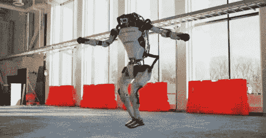
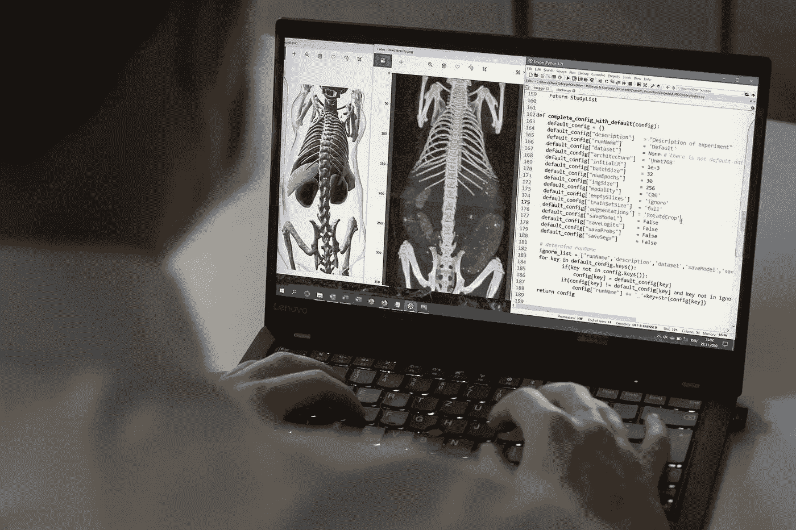
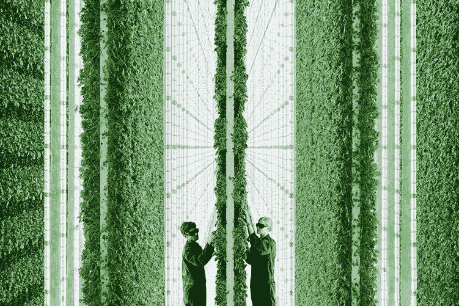

# 波士顿动力公司的机器人跳舞

> 原文：<https://medium.com/analytics-vidhya/boston-dynamics-robots-dancing-f8b1a7382157?source=collection_archive---------37----------------------->

*这是对本周发生的一些人工智能新闻的回顾*

一段视频显示，波士顿动力公司的机器人随着 Contours 公司 1962 年名为“你爱我吗”的节拍跳舞。在视频中，你可以看到他们的机器人的技能，如转弯和跳跃。这些机器人的巨大运动能力是超越的，给人以有机会被派往火星执行探索任务的暗示。别忘了波士顿动力公司最近被现代公司以 11 亿的价格收购了。对他们最终会成为终结者的恐惧仍然潜伏着。

## 新的人工智能工具可以预测电影的评级

[https://viterbishope . USC . edu/news/2020/11/ai-tool-may-predict-movies-future-ratings/](https://viterbischool.usc.edu/news/2020/11/ai-tool-may-predict-movies-future-ratings/)

电影的分类决定了对消费者及其潜在观众的吸引力。对电影的最终结果有影响。正常情况下，人类执行这项任务的基础是观看它，并对暴力、药物滥用和性内容的存在做出决定。拥有人工智能工具的研究人员可以根据电影剧本，在拍摄单个场景之前，在几秒钟内对电影内容进行评级。这将使电影管理人员能够通过在拍摄单个场景之前对剧本进行适当的编辑，按照他们的意愿提前设计电影评级。还允许故事讲述者和决策者思考他们为观众创造的内容以及这些内容可能对观众产生的影响。

## 自学习算法分析医学图像

【https://www.nature.com/articles/s41467-020-19449-7 

图像分析技术允许对有机体进行详细观察。解释这些数据需要大量的时间和经验。人工神经网络开辟了新的可能性，需要几秒钟来解释小鼠身体扫描，以彩色分割和表示器官，而不是各种灰色阴影。极大地方便了分析。一个跨学科的研究团队开发了自学习算法，以帮助未来分析生命科学成像数据。

## 人工智能控制的垂直农场

[https://www.plenty.ag/about-us/](https://www.plenty.ag/about-us/)

农业已经有了很大的发展。但是随着世界人口接近 80 亿，我们有一个问题。正如 18 世纪经济学家托马斯·马尔萨斯(Thomas Malthus)所观察到的，人口呈几何级数增长，而粮食产量仅呈算术级数增长。这意味着文明越发展和繁荣，就越有可能无法满足对食物的需求。凭借粮食生产革命的承诺，旧金山的一家农业技术初创公司建立了垂直气候控制农场，从谷歌前董事长埃里克·施密特、亚马逊的杰夫·贝索斯和软银那里筹集了 4 亿美元的资金。农场占地仅 2 英亩，生产 720 英亩的水果和蔬菜。照明、温度和灌溉由人工智能控制的机器人控制。LED 面板模拟阳光，因此食物可以一周 7 天、一天 24 小时在最佳条件下生长。并且水被再循环，蒸发的水被回收，所以实际上没有浪费。这种操作非常有效，比正常的农业操作少用了 99%的土地和 95%的水。

感谢你的阅读，我希望你已经了解了一些新的东西。下一期再见。