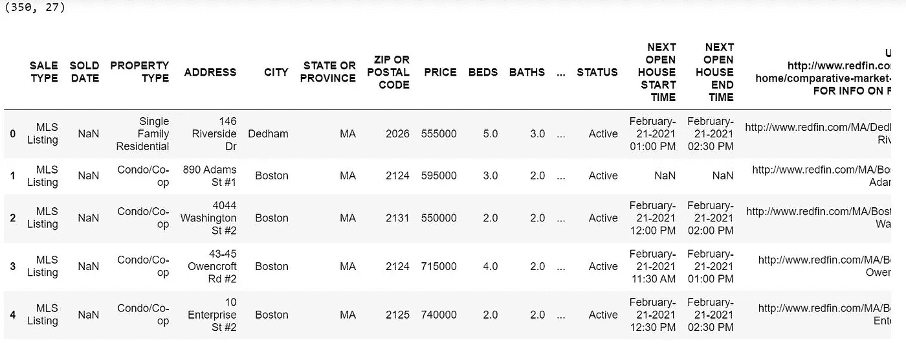
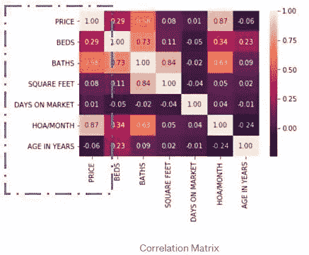
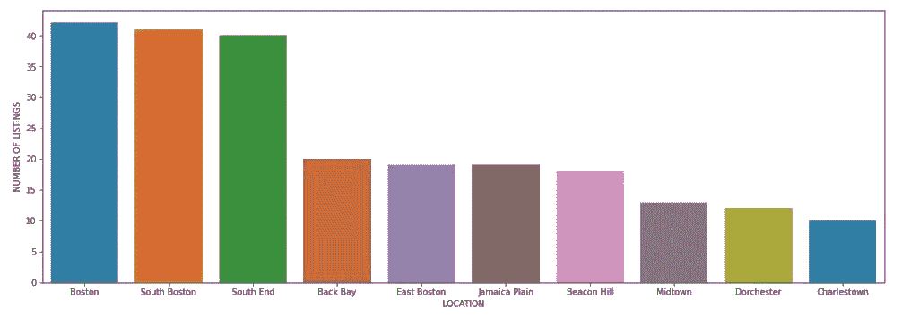
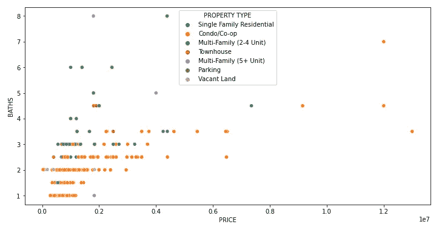
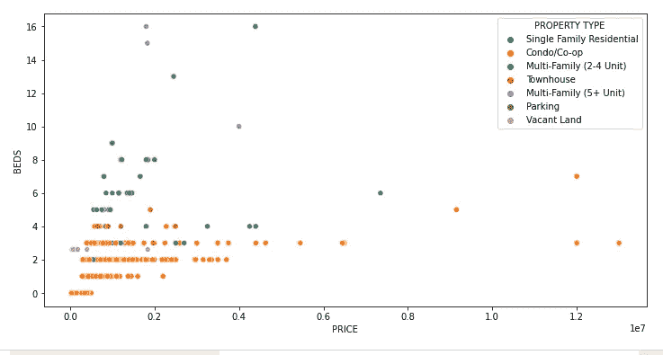

# 波士顿房价分析—第一部分

> 原文：<https://medium.com/analytics-vidhya/boston-housing-prices-trend-analysis-part-1-eca95932316b?source=collection_archive---------5----------------------->

来源:https://auscracker.com/knowledge/

随着新冠肺炎疫情进入第二个年头，我很想看看房地产市场在这样艰难的时期是如何受到影响的。随着上个月房价波动性的激增，我决定通过数据来解决我理解住房市场和定价的问题。

这是关于波士顿房价趋势的两篇系列文章的第一篇。这篇博文将揭示美国马萨诸塞州波士顿房价的趋势和模式。我将浏览数据集，并尝试回答以下问题。你可以在 [Github](https://github.com/sohilsshah91/boston-housing-prices-analysis) 上找到这个帖子的代码。

1.  *在马萨诸塞州的波士顿地区，哪些位置是热门市场？*
2.  *马萨诸塞州波士顿地区最贵的小区是哪些？*
3.  *不同房产类型的房价有何不同？*
4.  *该地块的浴室或床位数量等参数对房价有什么样的影响？*

## 数据的鸟瞰图:

数据来源于 redfin.com，包括房产类型、建造年份、地理位置详情、房屋参数，如床位数、浴室、平方英尺、has 月，即每月房主协会费用。下面的代码片段抓住了数据集的要点。

数据片段

我已经利用缺失值处理方法清理了这个住房数据集，如删除冗余列或数值字段的均值插补。为了理解上述字段之间的统计关系，我绘制了以下相关矩阵图。

根据上面的图，每月 HOA 和洗澡次数有很强的关系，这意味着它们与房价成正比。此外，越新的房子，有价格上涨的趋势。

**Q1。就马萨诸塞州波士顿地区的高挂牌量而言，哪些位置是热门市场？**

列表数量排名靠前的社区

从上面的结果中我们可以看出，根据这一数据，**波士顿、南波士顿和南端**区域拥有波士顿市街区中最多的房源。这些地区通常靠近波士顿市中心，更多的房源证明了波士顿市附近的受欢迎程度。

**Q2。马萨诸塞州波士顿最贵的社区是哪几个？**

按百万美元平均价格排名的顶级社区

从上图中我们可以看出， **Beacon Hill、Harvard Square 和 Midtown** 地区的平均房价在波士顿市的所有地区中**最高。像哈佛广场、滨水区等地方。靠近波士顿市区或大学区。**

总的来说，从以上两个邻域列表中，我们得到了以下观察结果:

1.  一些在热门列表中的社区也确实属于波士顿最昂贵的地区。贝肯山、后湾等。
2.  大多数受欢迎的地点都不在波士顿地区最昂贵的地点之列。

**Q3。不同房产类型的房价有何不同？**

在这里，我们将获得平均价格(美元)和按物业类型列出的房源数量。

财产类型汇总表

从上面的汇总表中，我们观察到*大部分房源*(350 个中的 271 个)属于 ***公寓/合作公寓*** 。然而，与其他家庭住宅相比，公寓/合作公寓的平均价格相对较低。

**Q4。像浴室或床的数量这样的参数对房价有什么样的影响？**

> 我们将首先分析每种物业类型的浴室数量与定价之间的关系。

4A。浴室数量对按物业类型定价的影响

基于上图 4A。我们有以下观察结果:

1.  总的来说，平均价格不会因浴池数量的不同而有很大变化。
2.  浴室数量较多(浴室数量大于 3 个)的公寓价格各不相同

> 现在，我们将探讨每种类型酒店的床位数和价格之间的关系。

4B。床位数量对按物业类型定价的影响

基于上面的图 4B。我们有以下观察结果:

1.  平均价格因床位数量和整体酒店类型的不同而有很大差异。
2.  *共管公寓:*共管公寓的价格根据床位数而有所不同。相对而言，公寓通常没有更多的床位。
3.  *多家庭:*价格大多在低端，但房间数量的范围很大。

## 总结和经验教训:

总之，我们了解了以下各种参数与房价的关系，如位置、物业类型、床位和浴室数量:

1.  一些受欢迎的地点，尤其是靠近市中心或大学区的地方，就房源数量而言，房价也很贵。
2.  根据给定的数据，上个月波士顿市的房源中，公寓/合作公寓是最主要的。
3.  价格确实对房产类型、床和浴室的组合有一些影响。根据相关矩阵，床位数量确实对房价有影响。

你所在社区的房价受到了怎样的影响？