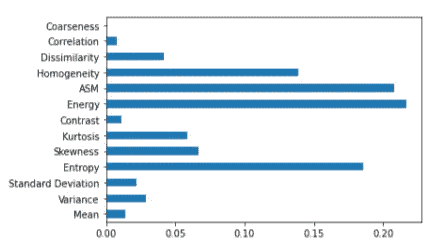

# 基于不同机器学习算法的脑肿瘤分类

> 原文：<https://medium.com/analytics-vidhya/brain-tumor-classification-using-different-machine-learning-algorithms-423421175028?source=collection_archive---------13----------------------->

在当今世界，脑瘤和其他神经系统癌症是男女死亡的第十大原因。在早期诊断肿瘤可以挽救一个人的生命。发现脑瘤实际上是一个巨大的挑战。脑瘤的检测可以在机器学习的帮助下完成。在该领域，机器学习在正确预测大脑内部肿瘤的存在方面发挥了至关重要的作用。

# **数据集:**

来源:https://www.kaggle.com/jakeshbohaju/brain-tumor

数据包括五个一阶特征和八个目标级别的纹理特征(在列类中)。在我们引用的研究论文中，他们首先使用深度学习技术从给定的图像中提取与脑瘤相关的特征，但由于我们的限制，我们直接采用提取的特征，并应用机器学习算法来根据特征值预测此人是否患有肿瘤。

我们的目标变量有两个值:“0”和“1”，因此这是一个二元分类问题。

# **探索性数据分析和数据可视化:**

1.  数据集的形状:(3762，15)
2.  数据类型:除了图像属性，所有其他属性都有 int/float 数据类型。因此，我们删除了图像属性，因为它在确定类别(即目标属性)时没有任何重要作用。
3.  目标属性的分布:类

我们可以说，我们有一个高度平衡的数据集，因为我们有 55.26% (2079)的样本被分类为 0 类，即非肿瘤，44.74% (1683)的样本被分类为 1 类，即肿瘤。

4.相关矩阵

Corr 矩阵显示不同的功能如何相互依赖。

5.检测缺失值

因此，我们在任何属性中都没有任何空值/缺失值。

6.异常值检测和去除:

使用箱线图，我们检测到在许多特征的数据中存在异常值，为了消除这些异常值，我们使用了一种称为异常值消除的四分位间距方法的技术。它说，计算数据的**四分位间距**。将**四分位距** ( **IQR** )乘以 1.5(用于辨别**异常值**的常数)。将 1.5 x ( **IQR** )加到第三个四分位数。任何大于此值的数字都是可疑的异常值**。**

7.特征选择和重要性

(a)单变量特征选择通过基于单变量统计测试选择最佳特征来工作。它可以被看作是估计器的预处理步骤。scikit-learn 库提供了 SelectKBest 类，它可以与一组不同的统计测试一起使用，以选择特定数量的特性。

(b)为了使用上述森林结构执行特征选择，在森林的构建期间，对于每个特征，计算在分割特征(基尼指数)的决定中使用的数学标准的归一化总缩减。该值称为要素的基尼系数。为了执行特征选择，每个特征根据每个特征的基尼重要性以降序排序，并且用户根据他/她的选择选择前 k 个特征。

8.特征标准化:

标准标量:通过移除平均值并缩放至单位方差来标准化要素。通过计算训练集中样本的相关统计数据，对每个特征独立进行居中和缩放。然后，存储平均值和标准偏差，以便使用变换在以后的数据中使用。

# **使用的机器学习算法:**

1.  [朴素贝叶斯分类器](https://towardsdatascience.com/naive-bayes-classifier-81d512f50a7c)
2.  [K 个最近邻居](https://towardsdatascience.com/machine-learning-basics-with-the-k-nearest-neighbors-algorithm-6a6e71d01761)
3.  [逻辑回归](https://towardsdatascience.com/logistic-regression-detailed-overview-46c4da4303bc)
4.  [支持向量分类器/机器](https://towardsdatascience.com/support-vector-machine-introduction-to-machine-learning-algorithms-934a444fca47)
5.  [人工神经网络](https://www.javatpoint.com/artificial-neural-network)
6.  [决策树](https://towardsdatascience.com/understanding-decision-tree-classifier-7366224e033b)
7.  [树木集合:装袋、随机造林和助推](https://towardsdatascience.com/decision-tree-ensembles-bagging-and-boosting-266a8ba60fd9)

# 考虑的性能指标:

1.  混淆矩阵/特异性/敏感性:

混淆矩阵是一种总结分类算法性能的技术。通过计算混淆矩阵，可以更好地了解分类模型的正确程度和错误类型。

灵敏度/TP 率/精度:分类器发现阳性结果的性能与灵敏度有关。特异性计算如下:TP/(TP+FN)。

特异性/TN 比率:分类器识别阴性结果的性能与特异性相关。它由:TN/(TN+FP)给出。

2.ROC 曲线:

ROC 代表接收机工作特性。ROC 图在 y 轴上绘制 TP 比率，在 x 轴上绘制 FP 比率。ROC 分析提供了选择可能的最优模型并抛弃次优模型的工具，独立于(并在指定之前)成本背景或类别分布。ROC 图左上角的分类器是优选的，因为它们的灵敏度和特异性都很高，具有最高灵敏度和特异性的分类器是该数据集的最佳模型。曲线下的面积越接近 1，绘制 ROC 曲线的算法越好。

3.OOB 分数和对数损失:

出袋(OOB)误差，对于数据集 D 的平均值，如果总共有 N 个样本，则 2N/3 个样本将是独立的，并包括在集成技术中。因此，N/3 个样本保持不变，这些样本可用于测试，并有助于避免过度拟合。对这些样本的测试准确度被称为 OOB 分数。

对数损失表示预测概率与相应的实际/真实值(在二元分类的情况下为 0 或 1)有多接近。预测概率偏离实际值越多，对数损失值就越高。我们已经使用对数损失/二进制交叉熵来最小化我们的神经网络中的损失。

# 结果分析:

模特表演:

显示不同算法的准确性/敏感性/特异性。

为了避免在应用的各种算法中过度拟合，我们选择了以下技术:

1)使用 GridSearchCV 进行超参数调整，以给出最佳参数。2) K 倍交叉验证，以测试模型预测未用于估算的新数据的能力。

3)正则化显著降低了模型的方差，而没有显著增加其偏差。

# 结论:

所有模型都达到了非常好的测试精度。然而，敏感性、特异性、FP 率和 FN 率是决定最佳模型的最重要因素。如果我们考虑特异性和敏感性的平均值，几乎所有算法的平均值都超过 99%。如果我们考虑 FP 率和 FN 率，随机森林分类器给出了最好的结果，显著的 FP 率为 0，FN 率为 0.003。此外，对于随机森林分类器，特异性和敏感性的平均值为 0.9985，是所有分类器中最高的。

因此，可以得出结论，对于我们的数据集，随机森林分类器是最佳和有效的模型，因为与所有其他模型相比，它获得了最佳结果。它还确保了在模型中不会发生过度拟合，因为所有的超参数都被适当地调整。

项目完整代码及报告链接:[https://github.com/ishdeep-10/Brain-Tumor-Classification](https://github.com/ishdeep-10/Brain-Tumor-Classification)。

谢谢大家！