# 脑肿瘤检测和分割模型

> 原文：<https://medium.com/analytics-vidhya/brain-tumor-detection-and-segmentation-model-fc5dc952f6fe?source=collection_archive---------15----------------------->

背景:

将人工智能引入医疗保健已经彻底改变了这个行业。在磁共振成像(MRI)方面，它通过分割和定位产生了更快和更好的肿瘤和癌症检测。

问题陈述:

作为一名 AI/ML 顾问，一家医疗诊断公司让您负责提高基于 MRI 扫描检测和定位脑肿瘤的速度和准确性。提供的数据集包含 3929 个脑部 MRI 扫描及其肿瘤位置，供您开发一个检测和定位脑肿瘤的模型。

兴趣:

该公司的目标是提高脑瘤的早期诊断，降低癌症诊断的成本。

解决方案:

为了解决上述问题，建立了一个分类和分割模型。

数据:

来源:数据来源于[这里的](https://www.kaggle.com/mateuszbuda/lgg-mri-segmentation)

使用。info 函数，我打印了 csv 文件中的列

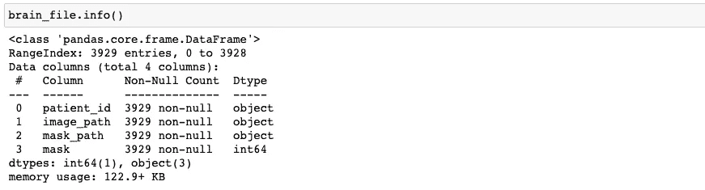

然后用。head 函数，我打印了数据集中的前 30 行

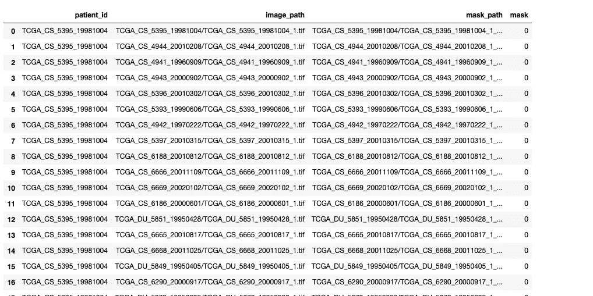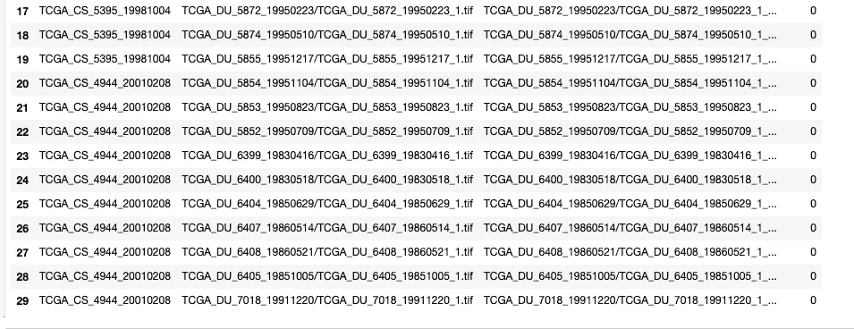

如上所示，名为 mask 的列的值为 0，表示没有肿瘤。

数据可视化

使用 matplolib.pyplot，我可视化了数据集中的第 723 幅图像，它的最大值为 255，最小值为 0。

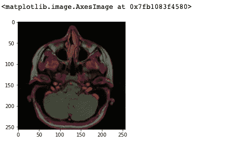

然后使用随机函数，我可视化了六个脑部核磁共振成像，生成了有肿瘤和无肿瘤的核磁共振成像。

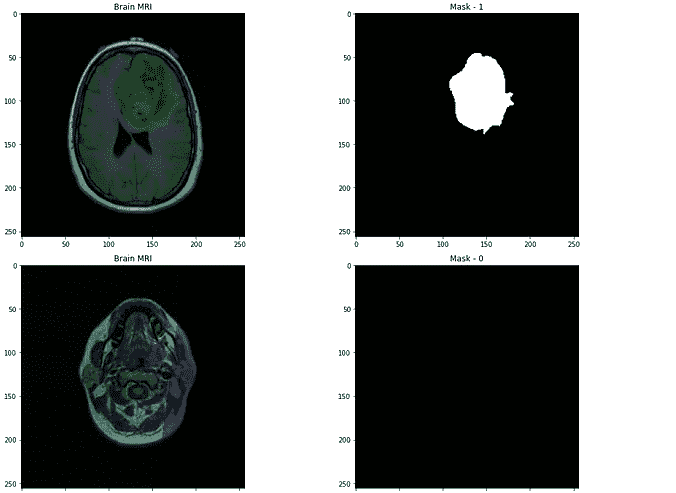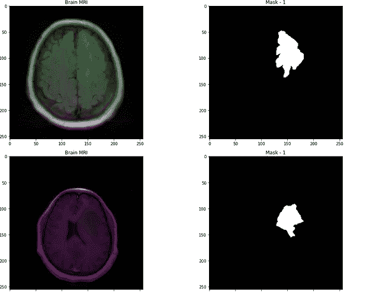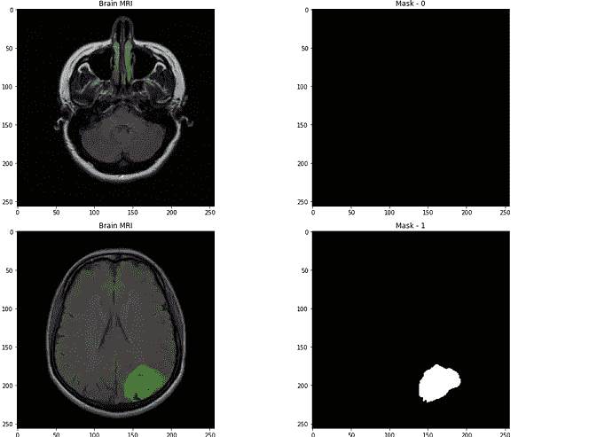

拆分:

使用 train_test_split 函数，我将数据分为值为 15%的训练和测试。然后使用来自 keras 的数据图像生成器，我重新调整了数据，并做了 15%的验证数据分割。

数据生成:

我生成了训练、验证和测试图像生成子集，批量大小为 16，类模式等于分类，目标大小为(256，256)，混洗等于假。

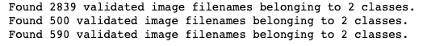

我用 resnet50 创建了一个基本模型，权重来自预先训练的值 imagenet。下面是基本模型的总结。

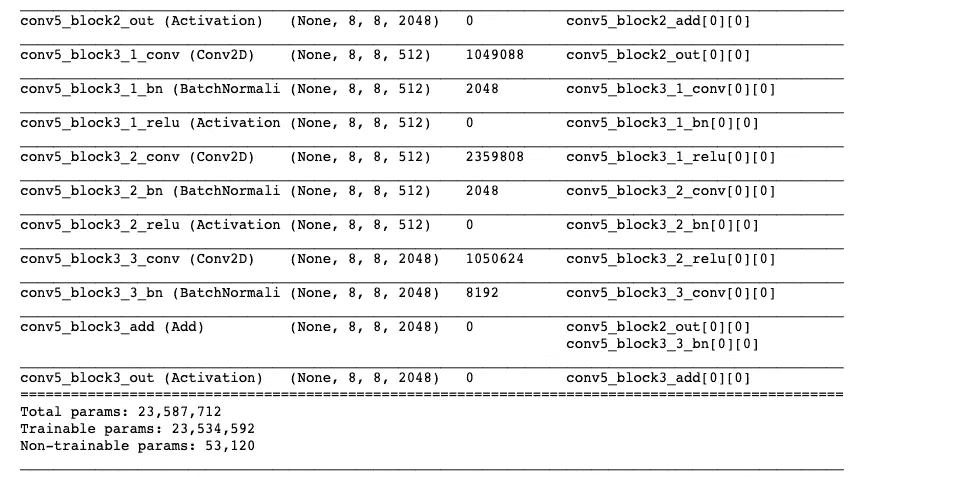

建筑网络:

我使用两个激活 relu 的隐藏层构建了网络，密度为 256，下降为 0.3，输出层使用 softmax 激活。下面是模型总结。

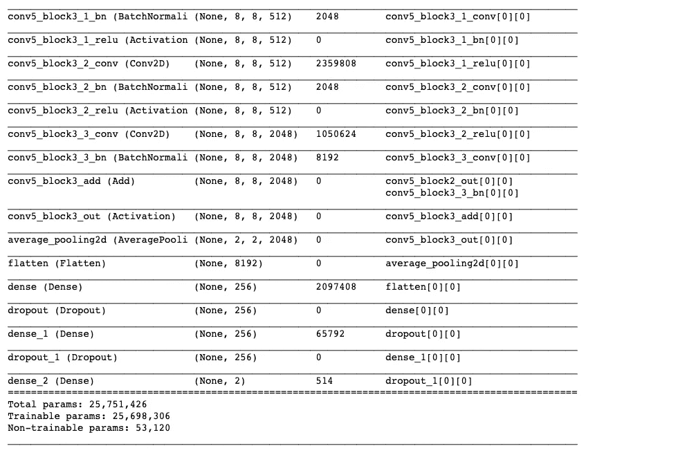

编译:

我使用损失分类交叉熵、adam 优化器和“准确性”指标编译了这个模型。

我还使用了耐心 20 后的早期停止，检查点将 save_best_model 设置为 true。

培训:

这就是反复试验的地方。用 10 个时期训练第一个模型，用这种可视化的混淆度量得到 0.329 的准确度。

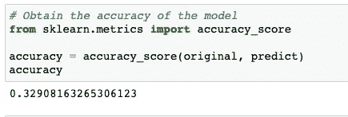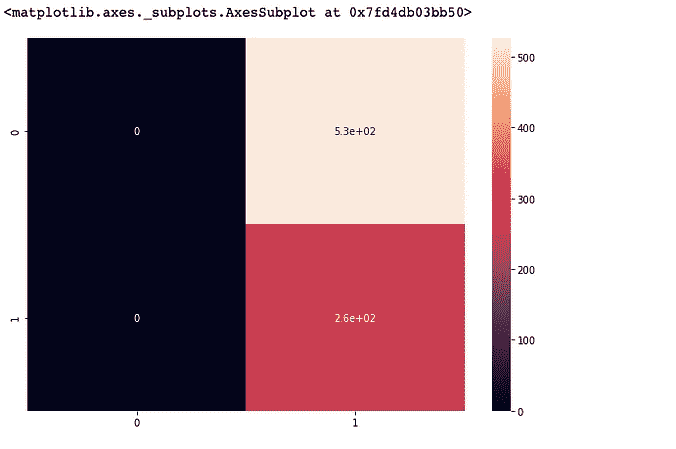

模型 1

第二个模型用 50 个历元训练。训练没有达到 50 个时期，因为早期停止被触发，导致模型在 33 个时期停止。这个模型的准确度为 0.866，无法对其可视化混淆指标进行操作。

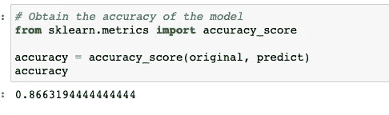

模型 2

第三个模型用一个时期训练，改变一些超参数。验证分为 20%而不是 15%。使用这种可视化混淆度量，准确度为 0.76。

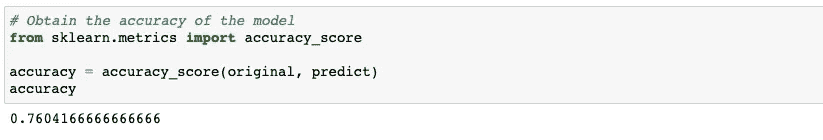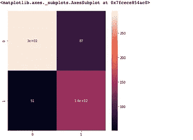

模型 3

用 25 个时期训练最终模型，其具有 0.946 的准确度，并且这可视化了混淆度量。

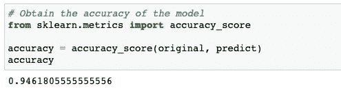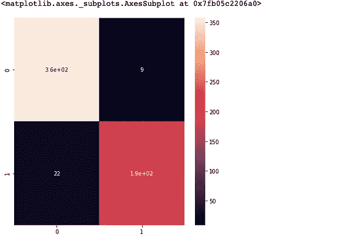

模型 4

看看上面的模型，我们有我们的赢家，第四个模型。

分数:

使用 sci kit learn classification _ report 函数，下图是报告。

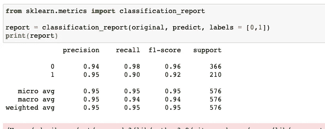

细分模型:

有助于定位的分割模型是使用掩模建立的，其目标是在像素级理解图像。

方法:

数据被分成训练、验证和测试子集。损失函数是使用定制的损失函数来完成的，该损失函数是 Tversky 损失函数。你可以在这里阅读更多关于它的内容[并且可以在这里](https://deepai.org/publication/a-novel-focal-tversky-loss-function-with-improved-attention-u-net-for-lesion-segmentation)找到[关于这个函数的回购。](https://github.com/nabsabraham/focal-tversky-unet/blob/master/losses.py)

使用 Adam optimizer，学习率为 0.05，ε为 0.1，损失函数为 focal_tversky 和“tversky”指标。早期停工和检查站也适用。

培训:

使用丢失和 tversky 为的 10 个时期来训练分割模型

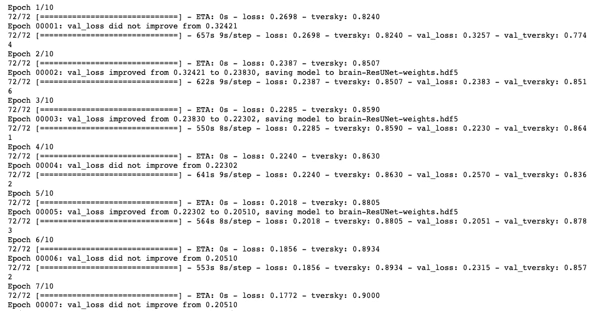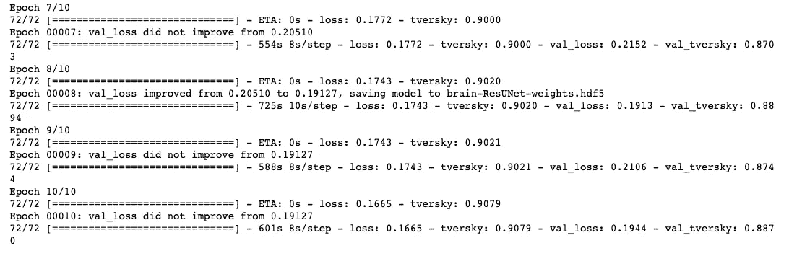

上述结果不足以进行分割，因为出现了假阴性。

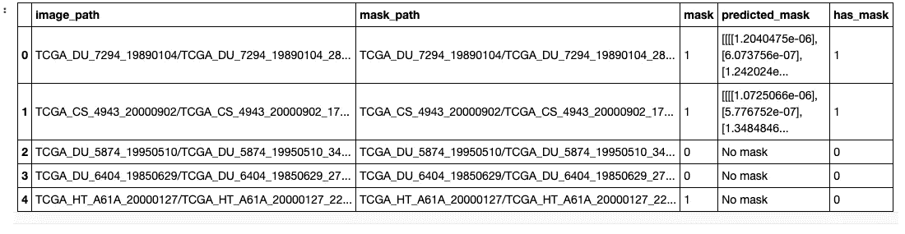

可视化:

该模型被绘图以可视化具有扫描、原始屏蔽、预测屏蔽、地面实况和具有预测屏蔽的扫描的磁共振成像。

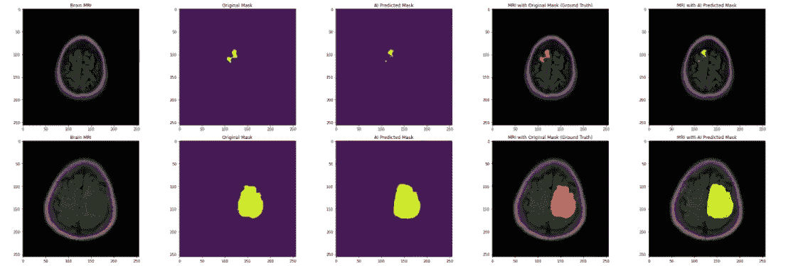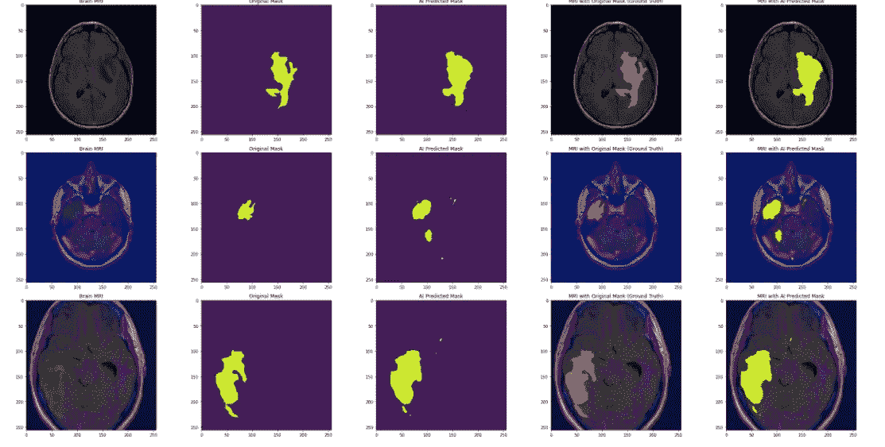

讨论:

训练不同模型的原因是为了获得更高的准确度，并消除假阳性和假阴性。这有助于消除误诊。

结论:

所有模型加起来花了 48 小时训练，这是我第一次碰到特沃斯基函数。欢迎任何关于如何将该模型的准确性提高到至少 99%的建议，您可以通过我的 [LinkedIn 个人资料](https://www.linkedin.com/in/rosemary-nwosu-ihueze/)联系我。

PS:这是我在 Udemy 上的认证课程的一部分。