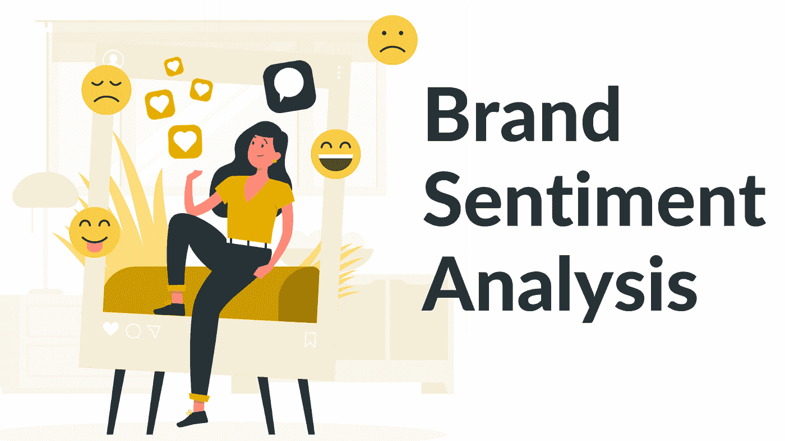

# 品牌情感分析

> 原文：<https://medium.com/analytics-vidhya/brand-sentiment-analysis-3b1292b2066f?source=collection_archive---------7----------------------->

在当今世界，社交媒体越来越受欢迎，这给企业带来了数据过载，因为很难每天都与客户保持联系，同时吸引他们并让他们满意。

因为公司有堆积如山的客户反馈数据为他们公司存储，有利也有弊。这就是使用[情绪分析](https://www.bytesview.com/blog/what-is-sentiment-analysis/)来识别积极、消极和中性反馈以帮助管理数据混乱的地方。

这导致近年来情感分析在各种品牌中日益流行。许多公司将 it 集成到他们的业务中，以便他们可以获得运营洞察力并自动化他们的业务流程。

他们使用情绪分析工具，如 [**BytesView**](https://www.bytesview.com/sentiment-analysis) ，因为在这样一个竞争激烈的环境中，你必须时刻了解你的客户的感受。

情绪分析为最重要的问题描绘了一幅清晰的画面，使我们能够基于大量数据而不是纯粹的直觉来自动化决策。

# **情感分析如何帮助品牌？**

## **1。投资回报增加**

企业可以使用情绪分析，根据实际情况而不是推测性的假设做出决策。有可能清楚地了解客户的意见。也可以考虑对竞争的见解。

它还增加了客户之间积极的品牌讨论的数量，使公司能够衡量营销活动的投资回报率。

## **2。提高产品质量**

了解客户对你的产品和服务的看法，有助于企业确定必须优先考虑和改进的关键领域，以满足客户的需求。

客户只能通过调查或随意交谈来提供产品改进建议。

## **3。营销策略优化**

虽然许多公司使用社交媒体来推广他们的品牌，但情感分析可以帮助公司优化他们的营销策略。

组织可以使用情绪分析来确定他们的社交媒体营销策略是否有效，以及他们需要做出哪些改变来区分自己。这对品牌有重大影响，因为这让他们能够更有效地实施他们的战略。

## **4。改善客户服务**

情绪分析有助于企业管理客户投诉，避免让他们感到被忽视。

它识别负面对话，并提醒客户服务团队成员，以便当客户投诉您的产品时，支持团队可以做出回应；你越早回应越好，因为现在的客户品牌忠诚度非常低，如果有需要，他们会在一天内更换，这样你的客户流失率就很低。

## **5。避免危机**

它对组织如何管理危机有重大影响。这是因为持续监控社交媒体对话和反馈有助于减轻新兴市场中产品质量差、客户服务差或其他环境危害造成的损害。

这使得企业能够将他们的努力引向正确的方向，从而提高效率。

## **6。帮助产生销售线索**

您可以通过调整营销活动、提供卓越的客户服务以及提高产品质量来满足客户需求，从而提高销售额并赢得更多客户。

情绪分析还可以帮助你找出你的客户想要什么，并开发能够吸引新的忠诚客户的产品。