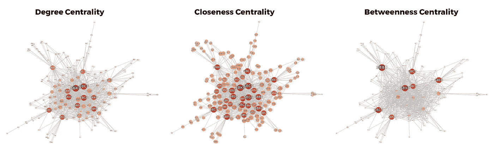

# 巴西空中交通和新冠肺炎疫情

> 原文：<https://medium.com/analytics-vidhya/brazilian-air-traffic-and-the-covid-19-pandemic-eb3f7009b544?source=collection_archive---------5----------------------->

## 用数据可视化技术分析复杂的飞行网络

社交距离是世界范围内用于遏制冠状病毒传播的主要策略，因为这种方法是世界卫生组织在 2020 年初提出的。在巴西，学生上课和面对面的服务，作为定期航班，于同年 3 月暂停，划定了检疫的开始，检疫在该国持续到今天。

在这种情况下，本研究分析了 2019 年和 2020 年(隔离前和隔离期间)的国家航班网络，比较了这两年的数据，以验证这种社会服务如何受到疫情的影响。

# 空中交通

关于巴西国家定期航班的数据是从 ANAC([agência Nacional de aviao Civil](https://www.gov.br/anac/pt-br))网站上的[公共数据库](https://sas.anac.gov.br/sas/vraarquivos/)中收集的。此外，为了更好的空间可视化，机场地理坐标取自数据中心的[公共数据集](https://datahub.io/core/airport-codes/r/airport-codes.csv)。

分析这些数据，很明显新冠肺炎疫情确实影响了巴西的空中交通，大幅减少了航班数量(大约 50 万次)，如下图所示。

每年的航班数量

在这些年中，有更多航班的两个机场来自巴西主要金融州圣保罗。然而，仅仅研究机场并不能提供整个国家空中交通系统的信息。

2019 年和 2020 年航班数量最多的前三大机场

# **网络**

可以在机场之间建立连接，以生成允许分析全国空中交通关系的网络结构。在这种情况下，机场可以代表节点，它们之间的连接可以通过航班实现。因此，给定两个机场，如果其间至少有一个航班，它们将被连接起来。应用此行为，可以绘制网络结构，如下图所示。每个黑点是一个机场，灰线是航班。

2019 年和 2020 年国家航班连接的机场(左)和(右)

# 古怪

在网络中，**偏心率**由每个节点到所有其他节点的最大距离(链接或“步数”)设定。考虑到这种度量，偏心率的最小值命名为**半径**，最大值命名为**直径**。如果节点的偏心值等于半径，它将位于**中心**。尽管如此，如果节点的偏心率等于直径，它将在网络**的外围**。

蓝色表示中心节点，红色表示外围节点

例如，假设画出了一个假想的网络。从节点 **d** 开始，到达任何节点的最大步数为 3。同时，对于节点 **a** ，到达每个其他节点最多需要 2 步。因此， **d** 偏心率为 3， **a** 为 2。在这种情况下，在所有偏心率中，最小值为 2 ( **半径**)。然后，具有这种偏心率的节点在网络**中心**。最大值为 3 ( **直径**，定义了**周长**。

在空中交通系统中，一个机场的偏心率是到达所有其他机场所需的最大航班数。因此，它可能需要更多的航班(步骤)来飞越周边机场。而到达中心机场通常需要较少的步骤。

从空间角度来看，下列图表按地理坐标显示了机场的位置。由于有许多机场，标签被省略了。

2019 年(左)和 2020 年(右)的中心机场(蓝色)和外围机场(红色)。按纬度和经度布局

请注意，在疫情之前，中心节点更分散在全国各地。但在第二年，中心节点的数量减少了，只有三个机场留了下来:坎皮纳斯机场国际机场(SP)、巴西利亚机场国际机场(DF)和马瑙斯机场国际机场(AM)。两个巴西地区在 2020 年没有显示任何中心节点。这表明，在新冠肺炎疫情期间，一度出现的航班线路暂停，减少了机场连接。

# 中心

分析复杂网络的一个重要特征是找到最重要的节点。为了找出答案，可以评估一组称为**网络中心性**的指标。本文只包含三个:度、贴近度和中间中心性。

简而言之，**度中心性**使用某个节点拥有的连接数(度)以及它最多可以拥有多少(考虑网络中的所有节点)。这一指标与连接数量成正比。就空中交通而言，与许多其他机场相连的机场具有更大程度的中心性。

同时，**接近中心性**是通过求和从一个节点到所有其他节点的距离(所需的最小航班数)来设置的。因此，这个度量依赖于邻近关系。

**通过评估每个节点是否是网络中任意两个其他节点的所有组合之间的最短路径的一部分来设置中间中心性**。这种测量是一种用于在网络流中具体化参与概念的装置，确定哪些节点更频繁并且需要维持大多数连接。

在国家航班网络中，考虑到 2019 年和 2020 年，坎皮纳斯(SP)的**国际机场**是系数最大的机场。这无疑表明了即使在疫情期间，该机场对巴西国家航空交通的重要性。

## 相互关系

验证和比较这些中心性度量之间的关系的一种方法是为网络中的所有节点绘制它们的值。

在包含两个测量值的图表中，可以注意到两者之间的正比例关系，因为随着中心性的增加，另一个中心性似乎也在上升。这证明了机场在整个空中交通系统中的重要性不仅仅依赖于一个方面。更重要的节点有更多的链接，离其他节点的航班更少，并且是大多数国家路线的一部分。

下图按国际民航组织代码标注了机场。红色的强度和每个节点的大小由图表中写的指标设置。

2019

2020

在这些可视化(放大)中，区域聚类变得清晰。中间中心性突出了像桥梁一样将机场分开节点。程度中心性显示了大多数来自巴西东南部地区的机场，表明有更多的航班来往于该地区。最后，节点间的接近中心性比其他度量更相似。这一证据表明，穿越美国所需的航班数量有一些差异。即便如此，图表显示巴西的空中交通系统似乎更集中在东南部和中西部地区(经济极)。数据显示，新冠肺炎确实减少了空中交通。航班减少，路线减少，整个系统萎缩。