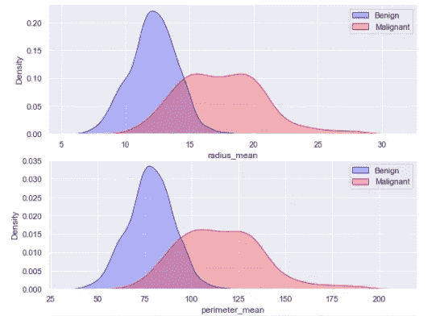
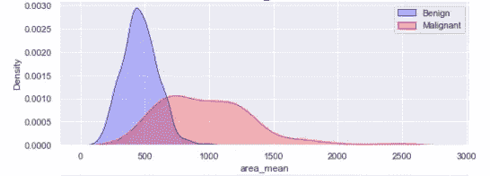
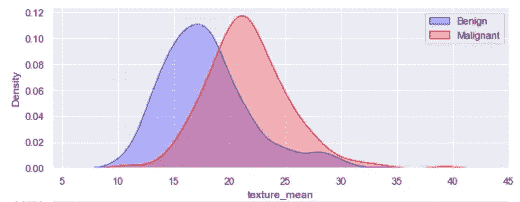
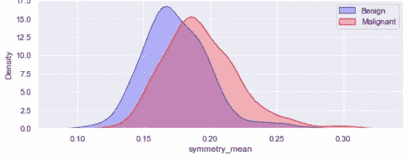
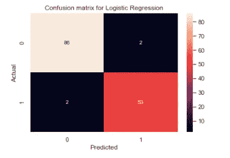
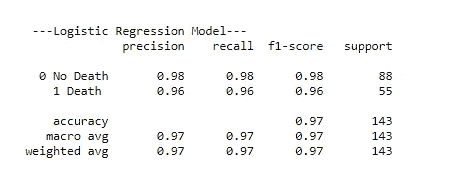

# 从机器学习的角度看乳腺癌诊断

> 原文：<https://medium.com/analytics-vidhya/breast-cancer-diagnosis-through-the-lens-of-machine-learning-d50cf505c00f?source=collection_archive---------25----------------------->

图片来源:[https://www . aplususapharma . com/blog/top-recent-advances-cancer-treatments/](https://www.aplususapharma.com/blog/top-recent-advances-cancer-treatments/)

乳腺癌是乳房细胞的癌症。全世界乳腺癌是女性癌症的主要类型，占所有病例的 25%。这是美国女性中诊断出的第二常见癌症。它可以发生在男性和女性身上，但在女性中更为常见。多年来，由于诊断和治疗的进步，乳腺癌的存活率增加了，与乳腺癌相关的死亡人数下降了。早期检测意味着使用一种方法来帮助乳腺癌在疾病变得具有侵略性之前得到早期诊断。因此，早期发现是乳腺癌治疗的关键。然而，每年都有一些早期病例未被诊断出来，或者在评估过程中被遗漏，延误了急需的治疗。

受癌症影响的细胞被称为**恶性细胞**。恶性细胞不同于身体中的正常细胞，因为它们分裂非常迅速并侵入周围组织。当它们加速分裂时，通常会形成一团被称为**肿瘤**的组织。有时细胞增殖并形成肿瘤而不扩散到周围组织，并且肿瘤不是癌性的，那些被称为**良性细胞**。

本研究的数据集来自 UCI 机器学习知识库[中的威斯康星州乳腺癌数据库【https://archive . ics . UCI . edu/ml/datasets/Breast+Cancer+Wisconsin+% 28 diagnostic % 29](https://archive.ics.uci.edu/ml/datasets/Breast+Cancer+Wisconsin+%28Diagnostic%29)

该数据集中描述的特征是根据乳腺肿块细针抽吸(FNA)的数字化图像计算得出的，描述了图像中出现的细胞核的特征。这项研究包括根据描述的特征(图像的数值测量)预测患者是否患有良性或恶性肿瘤。

在这里，这项研究的主要目标是询问机器学习与传统筛查相结合是否在乳腺癌的早期诊断中提供了额外的优势。更具体地说，解决了以下问题:

1.  **更大尺寸的细胞(半径/面积/周长)会癌变吗？即，较大尺寸的核意味着诊断是恶性的，而较小尺寸的核意味着良性的，反之亦然。**

**2。细胞核的对称性或质地与诊断是否不同？**

**3。机器学习结合常规筛查在乳腺癌诊断中是否提供了更好的准确性？**

为了回答这些问题，对所研究的数据集和模式进行了数据分析。这个数据集非常干净，不需要清理。研究了数据集以了解各种特征之间的关系。

1.  尺寸较大的细胞(半径/面积/周长)会癌变吗？

首先，我感兴趣的是发现细胞核的大小是否与一种诊断有某种关联。癌细胞通常会大量繁殖，异常侵入周围组织。因此，合乎逻辑的想法是，由于癌细胞中的异常遗传物质，它们看起来更大更暗，而良性细胞看起来正常，不会扩散到其他组织。

定义大小的变量的核密度估计显示恶性细胞在较大的一边。

在本研究中解决这个问题时，定义细胞大小的变量显示，在标记为恶性诊断的细胞中发现更大的细胞半径、周长和面积值。从图中还可以看出，在恶性肿瘤的诊断中，细胞核通常要大很多倍。

**2。细胞核的对称性或质地与诊断有区别吗？**

对称性和纹理的核密度估计显示癌性细胞与非癌性细胞没有差异。

对称性或纹理被认为在癌细胞或非癌细胞中类似地分布。这表明细胞核的对称性或质地与诊断无关。

**3。机器学习结合常规筛查在乳腺癌诊断中是否提供了更好的准确性？**

为了回答这个问题，模型的实例化、创建和评估如下:

1.逻辑回归

2.随机森林

混淆矩阵

对上述两个模型进行了训练、测试和评估。用于此分析的指标是准确性和召回值。在机器学习中，我们的目标是最小化 I 型(FP)和 II 型错误(FN)。在理想情况下，一个完美的模型应该没有这些错误。然而，这在现实世界中是不可能的，我们必须在精确度和召回率之间取得平衡。尽管在我们测试的模型中，随机森林和逻辑回归的准确率都是 97%，但逻辑回归被选为最佳模型，因为它最大化了召回值。尽管如此，在我们的最佳预测中仍有 2 个假阴性预测，比随机森林中的低。在这种情况下，我们更喜欢一种能最大限度减少假阴性的模型，从而帮助我们在不遗漏任何病例的情况下诊断出最大数量的病例，并在确诊后立即提供强化治疗。

常规筛查方法，包括乳房检查、乳房 x 线照相术、核磁共振成像、组织取样等。结合机器学习预测方法必将提高早期癌症诊断的准确性，并帮助患者延长寿命。

参考资料:

1.  [美国乳腺癌统计| Breastcancer.org](https://www.breastcancer.org/symptoms/understand_bc/statistics)
2.  [乳腺癌威斯康星州(诊断)数据集| Kaggle](https://www.kaggle.com/uciml/breast-cancer-wisconsin-data/tasks?taskId=299)