# ⚕️乳腺癌威斯康星州[诊断] - EDA📊📈

> 原文：<https://medium.com/analytics-vidhya/breast-cancer-diagnostic-dataset-eda-fa0de80f15bd?source=collection_archive---------3----------------------->

# 乳腺癌威斯康星州(诊断)数据集-探索性数据分析

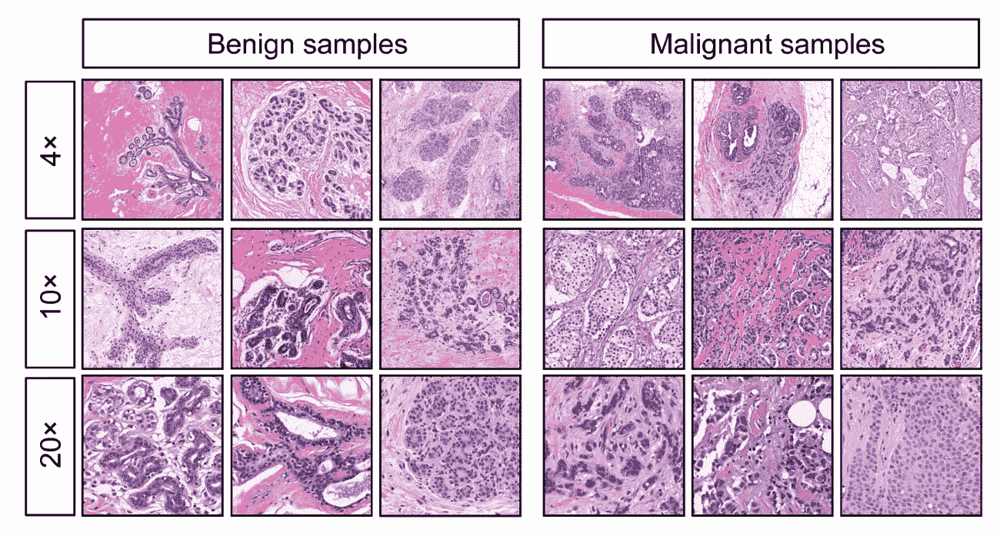[](https://www.kaggle.com/shubamsumbria/breast-cancer-prediction) [## 乳腺癌预测

### 这是威斯康星清洁乳腺癌(诊断)数据集

www.kaggle.com](https://www.kaggle.com/shubamsumbria/breast-cancer-prediction) 

> **数据集信息:**
> 
> 从乳腺肿块的细针抽吸(FNA)的数字化图像中计算特征。它们描述了细胞核的特征。
> 
> 使用多面方法树(MSM-T)获得上述分离平面[K. P. Bennett，“通过线性规划构建决策树”《第四届中西部人工智能和认知科学学会论文集》，第 97–101 页，1992 年]，一种使用线性规划构建决策树的分类方法。在 1-4 个特征和 1-3 个分离平面的空间中使用穷举搜索选择相关特征。
> 
> 用于获得 3 维空间中的分离平面的实际线性程序描述于:[K. P. Bennett 和 O. L. Mangasarian:“两个线性不可分集合的鲁棒线性编程判别”，Optimization Methods and Software 1，1992，23–34]。
> 
> **引自** Dua，d .和 Graff，C. (2019)。UCI 机器学习资源库【http://archive.ics.uci.edu/ml[】](http://archive.ics.uci.edu/ml%5D)。加州欧文:加州大学信息与计算机科学学院。

**导入必要的库**

```
import pandas as pd
import numpy as np
import matplotlib.pyplot as plt
import seaborn as sns
```

**将数据集加载到 Pandas 数据框中**

```
df = pd.read_csv("../input/breast-cancer-prediction/data.csv")
df.head()
```

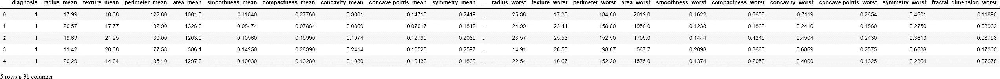

## 属性信息:

1.  *身份证号*
2.  *诊断(M =恶性，B =良性)*

*为每个细胞核(3–32)计算十个实值特征:*

*a)半径(从中心到周边各点的平均距离)*

*b)纹理(灰度值的标准偏差)*

*c)周长*

*d)面积*

*e)平滑度(半径长度的局部变化)*

*f)密实度(周长/面积— 1.0)*

*g)凹度(轮廓凹入部分的严重程度)*

*h)凹点(轮廓的凹部数量)*

*i)对称性*

*j)分形维数(“海岸线近似值”-1)*

*   我已经在 Kaggle 上上传了干净且随时可用的乳腺癌诊断数据集(链接在开头)。我从原始数据集中删除了不需要的列(id 号和未命名的 32)。重新映射诊断列的值(M: 1 和 B: 0)。

**检查空值和缺失值**

```
print("\nNull Values:\n", df.isnull().sum())
print("\nMissing Values:\n", df.isna().sum())Null Values:
 diagnosis                  0
radius_mean                0
texture_mean               0
perimeter_mean             0
area_mean                  0
smoothness_mean            0
compactness_mean           0
concavity_mean             0
concave points_mean        0
symmetry_mean              0
fractal_dimension_mean     0
radius_se                  0
texture_se                 0
perimeter_se               0
area_se                    0
smoothness_se              0
compactness_se             0
concavity_se               0
concave points_se          0
symmetry_se                0
fractal_dimension_se       0
radius_worst               0
texture_worst              0
perimeter_worst            0
area_worst                 0
smoothness_worst           0
compactness_worst          0
concavity_worst            0
concave points_worst       0
symmetry_worst             0
fractal_dimension_worst    0
dtype: int64

Missing Values:
 diagnosis                  0
radius_mean                0
texture_mean               0
perimeter_mean             0
area_mean                  0
smoothness_mean            0
compactness_mean           0
concavity_mean             0
concave points_mean        0
symmetry_mean              0
fractal_dimension_mean     0
radius_se                  0
texture_se                 0
perimeter_se               0
area_se                    0
smoothness_se              0
compactness_se             0
concavity_se               0
concave points_se          0
symmetry_se                0
fractal_dimension_se       0
radius_worst               0
texture_worst              0
perimeter_worst            0
area_worst                 0
smoothness_worst           0
compactness_worst          0
concavity_worst            0
concave points_worst       0
symmetry_worst             0
fractal_dimension_worst    0
dtype: int64
```

**数据集信息**

```
df.info()
<class 'pandas.core.frame.DataFrame'>
RangeIndex: 569 entries, 0 to 568
Data columns (total 31 columns):
 #   Column                   Non-Null Count  Dtype  
---  ------                   --------------  -----  
 0   diagnosis                569 non-null    int64  
 1   radius_mean              569 non-null    float64
 2   texture_mean             569 non-null    float64
 3   perimeter_mean           569 non-null    float64
 4   area_mean                569 non-null    float64
 5   smoothness_mean          569 non-null    float64
 6   compactness_mean         569 non-null    float64
 7   concavity_mean           569 non-null    float64
 8   concave points_mean      569 non-null    float64
 9   symmetry_mean            569 non-null    float64
 10  fractal_dimension_mean   569 non-null    float64
 11  radius_se                569 non-null    float64
 12  texture_se               569 non-null    float64
 13  perimeter_se             569 non-null    float64
 14  area_se                  569 non-null    float64
 15  smoothness_se            569 non-null    float64
 16  compactness_se           569 non-null    float64
 17  concavity_se             569 non-null    float64
 18  concave points_se        569 non-null    float64
 19  symmetry_se              569 non-null    float64
 20  fractal_dimension_se     569 non-null    float64
 21  radius_worst             569 non-null    float64
 22  texture_worst            569 non-null    float64
 23  perimeter_worst          569 non-null    float64
 24  area_worst               569 non-null    float64
 25  smoothness_worst         569 non-null    float64
 26  compactness_worst        569 non-null    float64
 27  concavity_worst          569 non-null    float64
 28  concave points_worst     569 non-null    float64
 29  symmetry_worst           569 non-null    float64
 30  fractal_dimension_worst  569 non-null    float64
dtypes: float64(30), int64(1)
memory usage: 137.9 KB
```

*   在检查了空值计数、缺失值计数和信息等各个方面之后。这个数据集是完美的，因为没有 Nul 和缺失值。

**数据的统计描述**

```
df.describe()
```


**提取平均值、平方误差和最差特征**

```
df_mean = df[df.columns[:11]]
df_se = df.drop(df.columns[1:11], axis=1)
df_se = df_se.drop(df_se.columns[11:], axis=1)
df_worst = df.drop(df.columns[1:21], axis=1)
```

## **基于诊断的计数:**

```
df.diagnosis.value_counts() \
    .plot(kind="bar", width=0.1, color=["lightgreen", "cornflowerblue"], legend=1, figsize=(8, 5))
plt.xlabel("(0 = Benign) (1 = Malignant)", fontsize=12)
plt.ylabel("Count", fontsize=12)
plt.xticks(fontsize=12);
plt.yticks(fontsize=12)
plt.legend(["Benign"], fontsize=12)
plt.show()
```

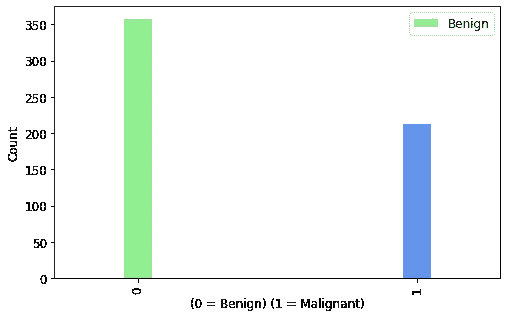

***观察:*** *我们有 357 个恶性病例和 212 个良性病例，所以我们的数据集是*不平衡的，我们可以使用各种重采样算法，如欠采样、过采样、SMOTE 等。*使用“足够”的正确算法。*

## ***与诊断的相关性:***

***均值特征与诊断的相关性:***

```
plt.figure(figsize=(20, 8))
df_mean.drop('diagnosis', axis=1).corrwith(df_mean.diagnosis).plot(kind='bar', grid=True, title="Correlation of Mean Features with Diagnosis", color="cornflowerblue");
```

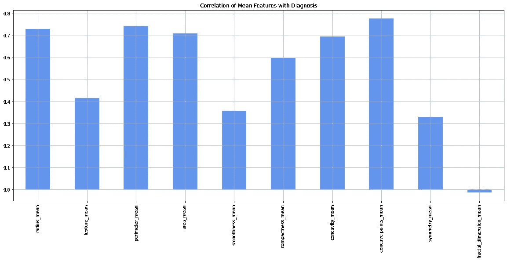

***观察:***

*   *分形 _ 维数 _ 均值与目标变量最小相关。*
*   *所有其他均值特征与目标变量有显著相关性。*

***平方误差特征与诊断的相关性:***

```
plt.figure(figsize=(20, 8))
df_se.drop('diagnosis', axis=1).corrwith(df_se.diagnosis).plot(kind='bar', grid=True, title="Correlation of Squared Error Features with Diagnosis", color="cornflowerblue");
```

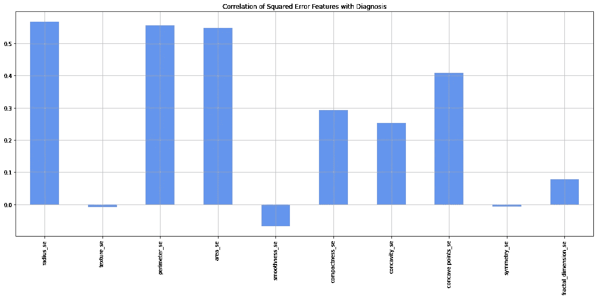

***观察:***

*   *纹理 _se、平滑度 _se、对称性 _se 和分形 _ 维数 _se 与目标变量的相关性最小。*
*   *所有其他平方误差特征与目标变量具有显著相关性。*

***最差特征与诊断的相关性:***

```
plt.figure(figsize=(20, 8))
df_worst.drop('diagnosis', axis=1).corrwith(df_worst.diagnosis).plot(kind='bar', grid=True, title="Correlation of Worst Error Features with Diagnosis", color="cornflowerblue");
```

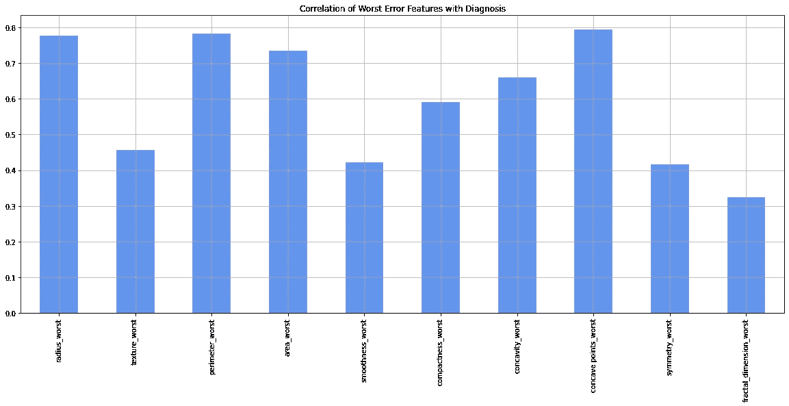

***观察:***

*   *所有最坏的特征都与目标变量有显著的相关性。*

***提取均值、平方误差和最差特征列***

```
df_mean_cols = list(df.columns[1:11])
df_se_cols = list(df.columns[11:21])
df_worst_cols = list(df.columns[21:])
```

***根据诊断一分为二***

```
dfM = df[df['diagnosis'] == 1]
dfB = df[df['diagnosis'] == 0]
```

## 基于核和诊断的分布:

***表示特征 vs 诊断:***

```
plt.rcParams.update({'font.size': 8})
fig, axes = plt.subplots(nrows=5, ncols=2, figsize=(8, 10))
axes = axes.ravel()
for idx, ax in enumerate(axes):
    ax.figure
    binwidth = (max(df[df_mean_cols[idx]]) - min(df[df_mean_cols[idx]])) / 50
    ax.hist([dfM[df_mean_cols[idx]], dfB[df_mean_cols[idx]]],
            bins=np.arange(min(df[df_mean_cols[idx]]), max(df[df_mean_cols[idx]]) + binwidth, binwidth), alpha=0.5,
            stacked=True, label=['M', 'B'], color=['b', 'g'])
    ax.legend(loc='upper right')
    ax.set_title(df_mean_cols[idx])
plt.tight_layout()
plt.show()
```

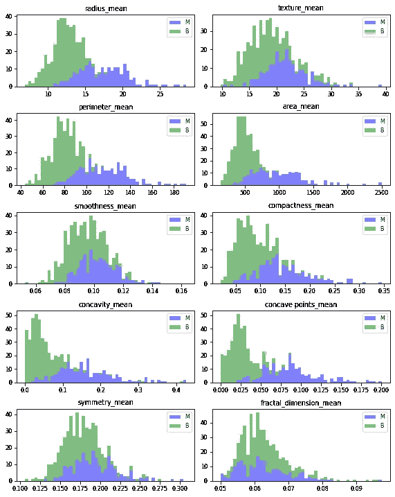

***平方误差特征 vs 诊断:***

```
plt.rcParams.update({'font.size': 8})
fig, axes = plt.subplots(nrows=5, ncols=2, figsize=(8, 10))
axes = axes.ravel()
for idx, ax in enumerate(axes):
    ax.figure
    binwidth = (max(df[df_se_cols[idx]]) - min(df[df_se_cols[idx]])) / 50
    ax.hist([dfM[df_se_cols[idx]], dfB[df_se_cols[idx]]],
            bins=np.arange(min(df[df_se_cols[idx]]), max(df[df_se_cols[idx]]) + binwidth, binwidth), alpha=0.5,
            stacked=True, label=['M', 'B'], color=['b', 'g'])
    ax.legend(loc='upper right')
    ax.set_title(df_se_cols[idx])
plt.tight_layout()
plt.show()
```

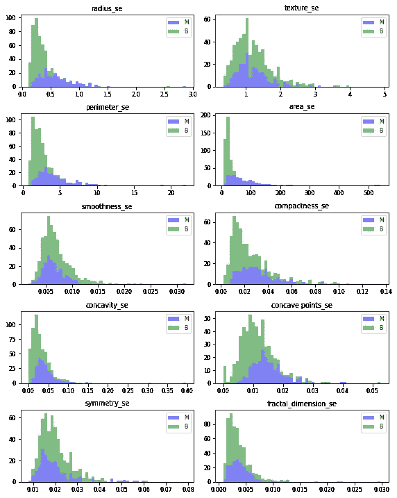

***最差特征 vs 诊断:***

```
plt.rcParams.update({'font.size': 8})
fig, axes = plt.subplots(nrows=5, ncols=2, figsize=(8, 10))
axes = axes.ravel()
for idx, ax in enumerate(axes):
    ax.figure
    binwidth = (max(df[df_worst_cols[idx]]) - min(df[df_worst_cols[idx]])) / 50
    ax.hist([dfM[df_worst_cols[idx]], dfB[df_worst_cols[idx]]],
            bins=np.arange(min(df[df_worst_cols[idx]]), max(df[df_worst_cols[idx]]) + binwidth, binwidth), alpha=0.5,
            stacked=True, label=['M', 'B'], color=['b', 'g'])
    ax.legend(loc='upper right')
    ax.set_title(df_worst_cols[idx])
plt.tight_layout()
plt.show()
```

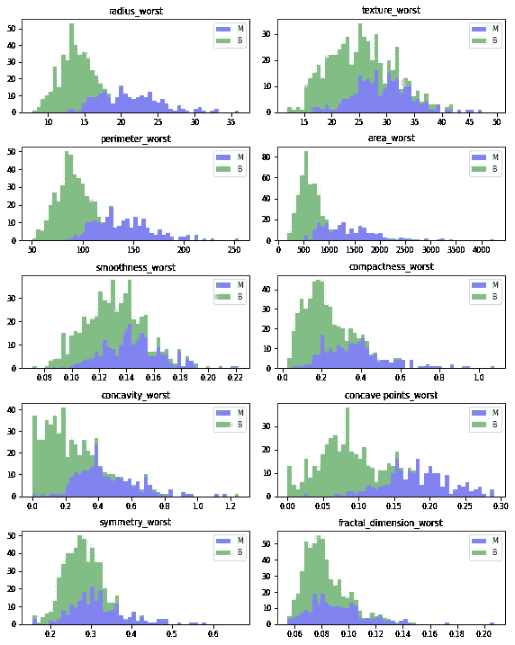

## **检查不同特征之间的多重共线性:**

```
def pairplot(dfx):
    import seaborn as sns
    name = str([x for x in globals() if globals()[x] is dfx][0])
    if name == 'df_mean':
        x = "Mean"
    elif name == 'df_se':
        x = "Squared Error"
    elif name == 'df_worst':
        x = "Worst"
    sns.pairplot(data=dfx, hue='diagnosis', palette='crest', corner=True).fig.suptitle('Pairplot for {} Featrues'.format(x), fontsize = 20)pairplot(df_mean)
```

***表示特性:***

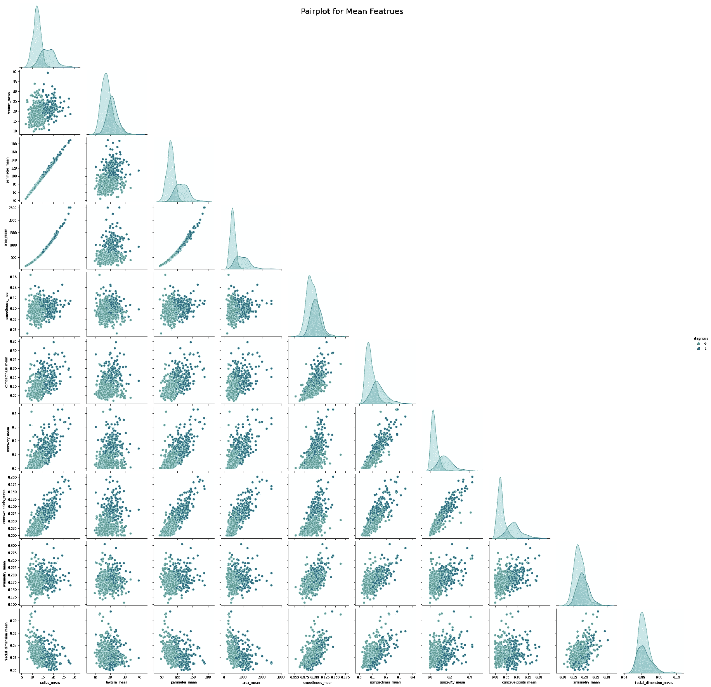

```
pairplot(df_se)
```

***平方误差特性:***

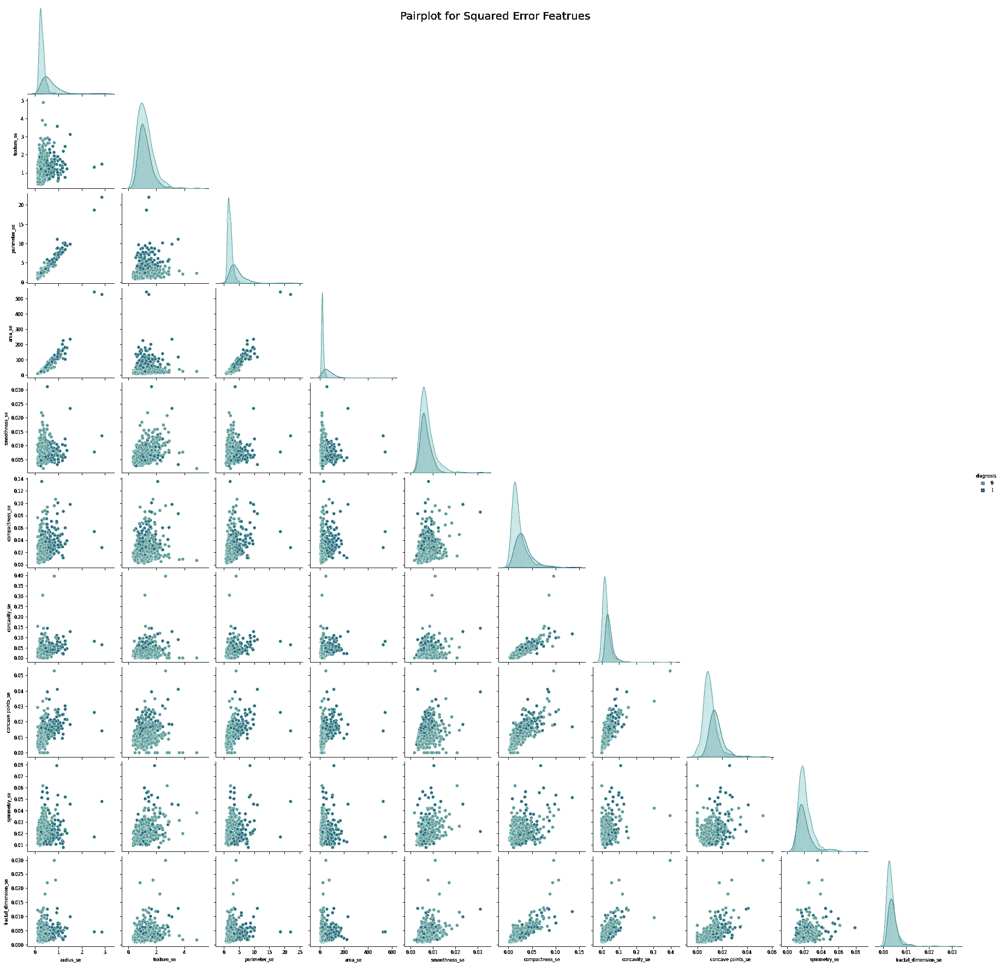

```
pairplot(df_worst)
```

***最差特性:***

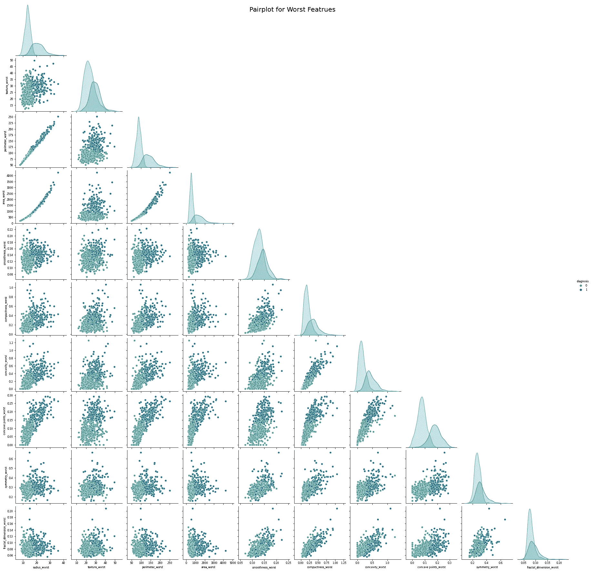

***观察值:*** 半径、周长和面积属性之间几乎完美的线性模式暗示着这些变量之间存在多重共线性。另一组可能暗示多重共线性的变量是凹度、凹点和密实度。

## **细胞核特征间关联热图:**

```
corr_matrix = df.corr()  # Correlation Matrix

# Mask for Heatmap
mask = np.zeros_like(corr_matrix, dtype=np.bool)
mask[np.triu_indices_from(corr_matrix)] = True

# Correlation Matrix Heatmap including all features
fig, ax = plt.subplots(figsize=(22, 10))
ax = sns.heatmap(corr_matrix, mask=mask, annot=True, linewidths=0.5, fmt=".2f", cmap="YlGn");
bottom, top = ax.get_ylim()
ax.set_ylim(bottom + 0.5, top - 0.5);
ax.set_title("Correlation Matrix Heatmap including all features");
```

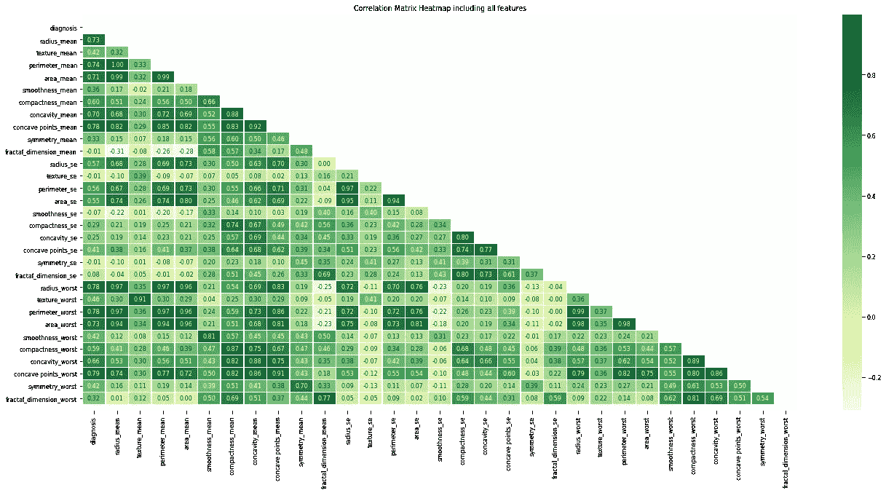

***观察值:*** 我们可以验证一些变量之间的多重共线性。这是因为这三列基本上包含相同的信息，即观察值(单元)的物理大小。因此，当我们进一步分析时，我们应该只选择这三列中的一列。

> **多重共线性问题** [(参考分析 Vidhya)](https://www.analyticsvidhya.com/blog/2020/03/what-is-multicollinearity/#article-data:~:text=next.-,The%20Problem%20with%20having%20Multicollinearity,Multicollinearity%20may%20not%20affect%20the%20accuracy%20of%20the%20model%20as%20much.%20But%20we%20might%20lose%20reliability%20in%20determining%20the%20effects%20of%20individual%20features%20in%20your%20model%20%E2%80%93%20and%20that%20can%20be%20a%20problem%20when%20it%20comes%20to%20interpretability.)

## 使用该数据集时要记住的事项:

*   稍微不平衡的数据集( *357 个恶性病例和 212 个良性病例*)。我们必须选择适当的重采样算法来进行平衡。
*   某些要素之间的多重共线性。
*   由于三列基本上包含相同的信息，即单元的物理大小，我们必须选择适当的特征选择方法来消除不必要的特征。

*目前正在进行* **乳腺癌预测的不同机器学习分类算法对比分析** *。查看*我的 [GitHub](https://github.com/shubamsumbria66) 档案了解更多详情。

如果你觉得这个故事信息丰富，请留下评论。✨

***感谢阅读！*** 🤗