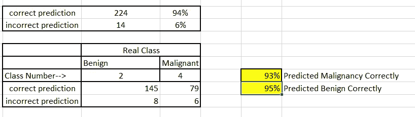

# 基于概率优化的几何平均分类乳腺癌预测

> 原文：<https://medium.com/analytics-vidhya/breast-cancer-prediction-with-geometric-mean-classification-with-probabilistic-optimization-2e2988cb8bd1?source=collection_archive---------14----------------------->

## [机器学习](https://towardsai.net/p/category/machine-learning)，[优化](https://towardsai.net/p/category/optimization)

T 他的这篇文章将谈论基于 UCI 机器的乳腺癌诊断预测…