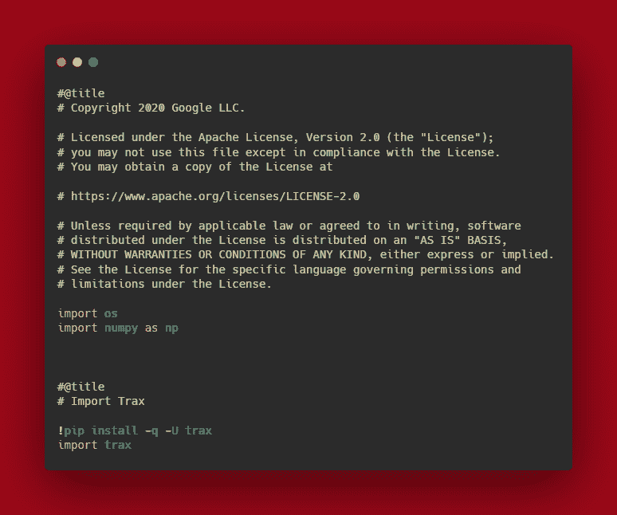

# Google 的 Trax 库简介

> 原文：<https://medium.com/analytics-vidhya/brief-view-of-googles-trax-library-b78eae008cb6?source=collection_archive---------4----------------------->

# 什么是 Trax？

Trax-一个端到端的库，提供简单易懂的代码。Trax 中的代码通常具有更简单的结构，这与 TensorFlow 和 Pytorch 等其他库的大代码相反。在[谷歌大脑团队](https://research.google.com/teams/brain/)积极使用和维护。

它最初是许多库的派生版本，但主要是遵循 TensorFlow 风格。

## 安装::-

# 图:安装 Trax

上面可以看到，使用它类似于 TensorFlow 和 Numpy。

在 Tensorflow 中，我们定义“将 Tensorflow 作为 Tf 导入”,在本库中，我们的做法与“导入 Trax”相同。

它包括了 NLP 任务的一些基本模型(例如:LSTM，ResNET，Transformer)。用于各种领域，如研究图书馆，用于不断开发新模型，并在包括 Tensorflow 数据集的数据集上测试它们。T2T 也称为张量-2-张量数据集。

此库—用于基于 Python 的笔记本来处理自定义模型，以及基于 Shell 的命令，用于在预训练的模型上训练模型。

# Trax 是如何工作的？

源自 TensorFlow，使用 Numpy 等核心 Python 库。它有一些包介绍了在 Trax 中编码的更有效的方法。

1.  **Trax 和 Fastmath**

它的模型基于一种叫做 Tensors 的阵列结构，通常使用“Numpy”操作。数组”库函数。结合使用该库和 Numpy 库，通过使用 GPU 和 TPU 来加速它们，提高了计算速度。这使得在张量上自动计算梯度的需要成为可能，这也被预先打包到“Trax”中。Fastmath”包感谢它的后端——[JAX](https://github.com/google/jax)和 [TensorFlow Numpy](https://tensorflow.org/) 。

下面是 Fastmath 和 Trax Numpy 的基本代码。

## 图:它工作了([Https://Github.Com/Google/Trax](https://github.com/google/trax))

1.  **图层**

层是这个库的必要组成部分，其中的一层能够计算具有零个或多个输入或零个或多个输出的函数。输入和输出是作为 JAX 和 Numpy.Array 工作的张量。可以使用没有任何权重或子层的 Trax 层，而无需初始化该层。

这些层还被定义为对象，这使它们变得简单——“_ _ call _ _”方法，这使我们能够直接在输入数据上使用。

下面的代码—来自它的文档。

这些层与 Tensorflow 或 Pytorch 等其他框架中的层相同，但与其他层不同的是这些层被编码成的行数。

我们现在将直接切入其层的实现。在 Tensorflow 中，模型是使用“顺序”定义的，在这里，它是使用“串行”完成的。“串行”是一个组合器，它根据每一层的输入/输出来组合子层。它使用层的堆叠，这使得将输入传递到每一层变得容易。

**举例:**

它看起来就像一个“张量流”。顺序”模型，但它的内部结构各层，这使它运行速度很快。

它还允许您定义自己的层和子层。

**下面是 Trax 模型在实际图层中的样子:**

下面是我的一个课程笔记本中的代码块，在那里我了解到了 Trax。

# 结论:-

由于它仍在开发中，我很幸运地在一个在线课程中获得了使用这个库的实践经验。我可以说，这使得 NLP 任务变得更加容易，而不是实现深度学习和像 RNNs 这样的神经网络。

**参考文献:-**

1.  这个链接是关于“Trax 是如何产生的”

h[ttps://coursera . org/share/1 bdab 833 B3 FB bee 79133006 F2 cab 236 f](https://coursera.org/share/1bdab833b3fbbee79133006f2cab236f)

1.  该链接详细遵循 Trax 文档。

h[ttps://trax-ml . readthedocs . io/en/latest/notebooks/trax _ intro . html](https://trax-ml.readthedocs.io/en/latest/notebooks/trax_intro.html)