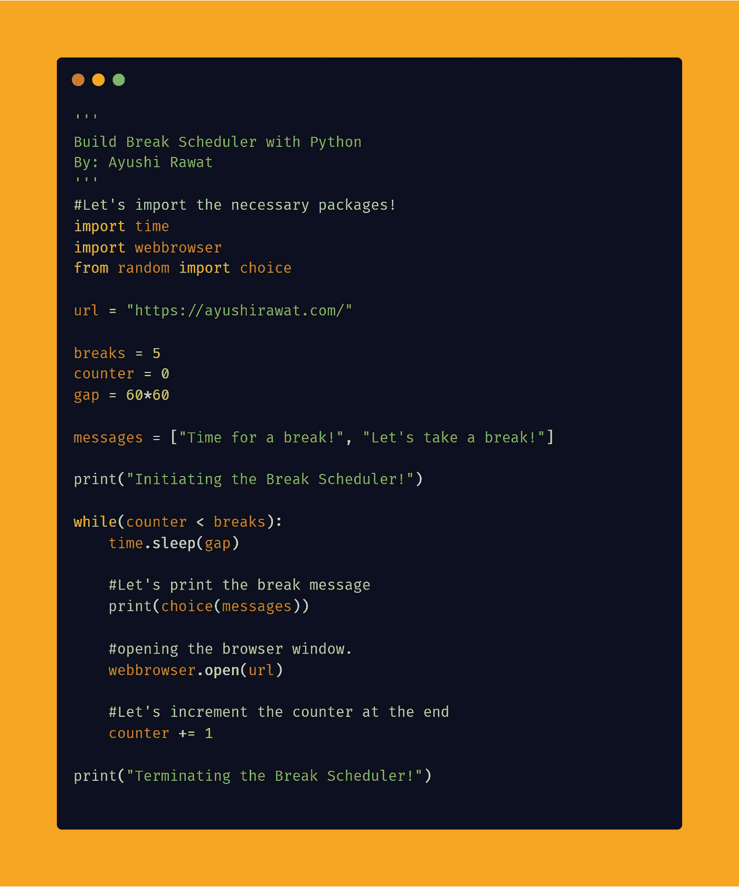

# 使用 Python 构建休息调度程序

> 原文：<https://medium.com/analytics-vidhya/build-a-break-scheduler-using-python-7eb6653ecb9a?source=collection_archive---------9----------------------->

读者你好！


在家工作是新的常态。这是确保健康的工作生活平衡的必要条件。你不能拿着笔记本电脑整天工作，这会严重影响你的健康。

安排好你的休息时间，这是最重要的。对我来说效果很好。在这篇博客文章中，我们将学习如何建立一个休息时间表。我们将看到 Python 中的实现。

[查看 python](https://github.com/ayushi7rawat/Ultimate-Python-Resource-Hub) 的终极资源库。发现有用就掉颗星！有什么要补充的吗？开个 PR 就一样了！

你可以参考我的 YouTube 视频教程来看一个工作教程，以便更好地理解和一步一步的指导。

# 这个博客将会涵盖什么

```
1\.    Why breaks are important & how to Utilize them?
2\.    What is webbrowser Module
3\.    How to build a simple breaks Scheduler using Python.
```

*我们开始吧！*

# 为什么休息很重要&如何利用它们？

在家工作可能是一项累人的案头工作。你需要注意你的心理健康。你可以安排你的休息时间

*   每小时休息五分钟
*   经常喝水。
*   伸展你的肌肉。
*   准备茶/咖啡或任何健康的饮料，并进行几分钟的散步。
*   当你接到一个非工作电话时，再走一走，说说话。

你如何利用和计划你的休息时间？

# 使用的模块:

# 网络浏览器模块:

`[webbrowser](https://docs.python.org/3/library/webbrowser.html#module-webbrowser)`模块提供了一个高级接口，允许向用户显示基于 Web 的文档。在大多数情况下，简单地从这个模块调用`open()`函数将会做正确的事情。脚本 webbrowser 可以用作模块的命令行界面。它接受一个 URL 作为参数。

如果你想了解更多，可以参考 [webbrowser 模块文档](https://docs.python.org/3/library/webbrowser.html#module-webbrowser)。

现在你已经熟悉了*休息为什么重要&如何利用它们？*了解了 *webbrowser 模块的基本知识后，*我们可以前进到*编码部分。*

# 该编码了！

你可以在我的 [GitHub 资源库](https://github.com/ayushi7rawat/Youtube-Projects/tree/master/Break%20Scheduler)中找到所有代码。发现有用就掉颗星。



为了访问 python 库，我们需要将包导入到 Python 脚本中。使用以下命令来完成此操作。

```
import time 
import webbrowserfrom random import choice
```

现在我们已经使用命令`import requests`导入了库，让我们继续。

让我们显示一条欢迎信息。

```
print("Initiating the Break Scheduler!")
```

让我们要求用户输入他希望休息的次数，或者因为您是自己运行脚本，所以您也可以硬编码这个值。

```
breaks = input('input the number of times you wish to take break today! ')
print(breaks)#breaks = 2
```

现在，您可以根据需要设置休息时间。我现在把休息时间设定为每小时一次。

```
gap = 60*60
```

最初让我们将计数器设置为零

```
counter = 0
```

现在，让我们定义您希望在该时间间隔内打开的 URL

```
url = "https://www.youtube.com/c/AyushiRawat"
```

让我们利用`random`模块在每个休息时间显示一条随机消息。同样，让我们存储要在`messages`中显示的消息。

```
messages = ["Time for a break!", "Let's take a break!"]
```

我们得到的数据存储在`res`。我们将利用`text`方法提取我们想要的天气细节，并显示结果。

现在，让我们运行一个 while 循环，直到计数器等于所需的中断次数。

```
while(counter < breaks):
    time.sleep(gap) #Let's print the break message
    print(choice(messages)) #opening the browser window.
    webbrowser.open(url)
```

我们将在这里介绍`sleep`来安排休息时间。随机消息将显示在屏幕上，网址将在每隔一段时间自动打开。

最后，让我们把计数器加 1。

```
counter += 1
```

最后，让我们在脚本结束时显示终止消息。

```
print("Terminating the Break Scheduler!")
```

就是这样。我们要做的就是建立一个简单的休息时间表。就这样，结束了！我希望这篇文章对你有用！请在下面的评论中分享。

我创建关于职业、博客、编程和生产力的内容，如果你对此感兴趣，请与你的朋友和关系人分享这篇文章。你也可以订阅我的时事通讯，在我每次写东西的时候得到更新！

谢谢你的阅读，如果你已经到目前为止，请喜欢这篇文章，它会鼓励我写更多这样的文章。请分享您的宝贵建议，感谢您的真诚反馈！

我强烈建议你看看 YouTube 上的视频[还有别忘了订阅我的频道。我很乐意在](https://www.youtube.com/watch?v=jAOkWehMF6E)[Twitter](https://twitter.com/ayushi7rawat)|[LinkedIn](https://www.linkedin.com/in/ayushi7rawat/)与你联系。

你绝对应该看看我的其他博客:

*   [Python 3.9:你需要知道的一切](https://ayushirawat.com/python-39-all-you-need-to-know)
*   [GitHub CLI 1.0:你需要知道的一切](https://ayushirawat.com/github-cli-10-all-you-need-to-know)
*   [如何制作自己的谷歌 Chrome 扩展](https://ayushirawat.com/how-to-make-your-own-google-chrome-extension-1)
*   [从 Python 运行 Javascript】](https://ayushirawat.com/run-javascript-from-python)
*   [使用 Python 自动化 WhatsApp】](https://ayushirawat.com/automate-whatsapp-using-python)
*   [使用 Python 自动化 Cowin 疫苗槽可用性](https://ayushirawat.com/automate-cowin-vaccine-slots-availablity-using-python)
*   [什么是竞争性编程](https://ayushirawat.com/what-is-competitive-programming-or-beginners-guide)

## 资源:

*   [docs.python.org/3/library/webbrowser.html](https://docs.python.org/3/library/webbrowser.html)

在我的下一篇博客文章中再见，保重！！