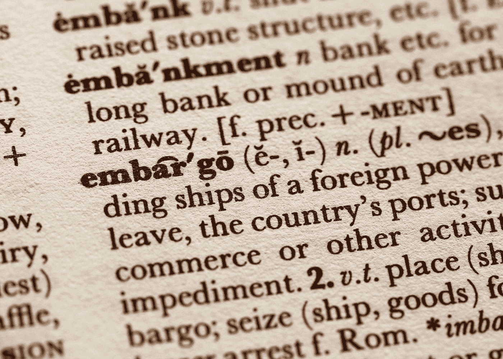

# 使用 Python | NLP 构建定制的停用词表

> 原文：<https://medium.com/analytics-vidhya/build-a-customized-stopwords-list-using-python-nlp-6fc78d4eae3c?source=collection_archive---------5----------------------->

桑迪·米勒在 [Unsplash](https://unsplash.com?utm_source=medium&utm_medium=referral) 上拍摄的照片

在本文中，我将讨论如何使用 python 为您的 NLP 应用程序构建一个定制的停用词表。如果您的数据是特定于域的，这将提高性能。

# 什么是停用词表？

如果我们想建立一些机器学习应用程序，我们想确保算法将能够提供准确的结果…