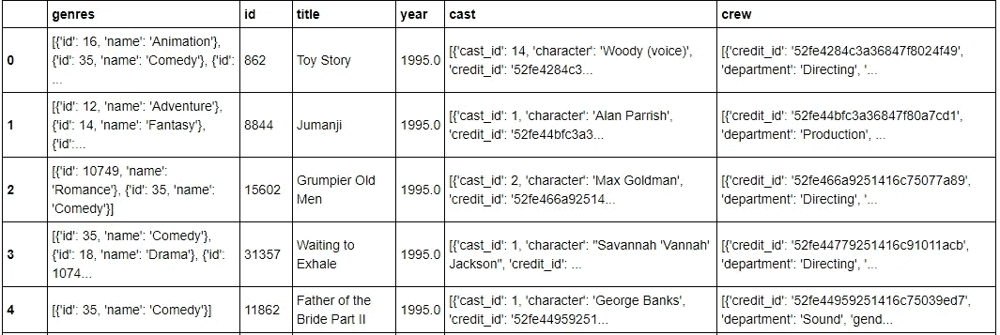
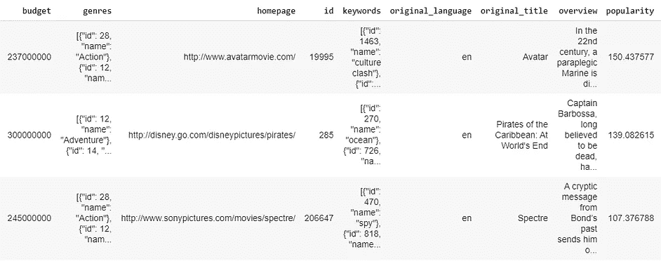
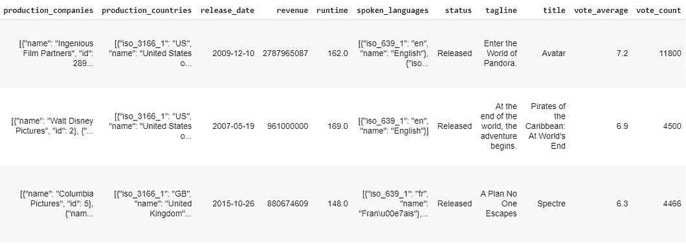
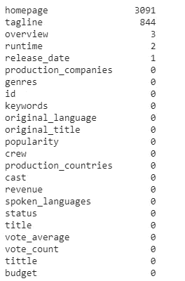
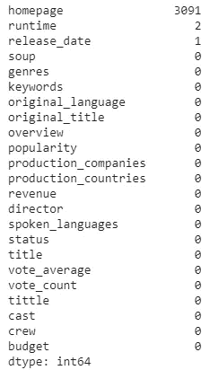
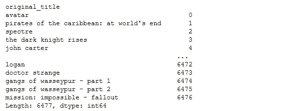
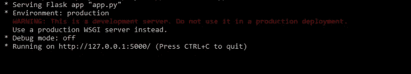
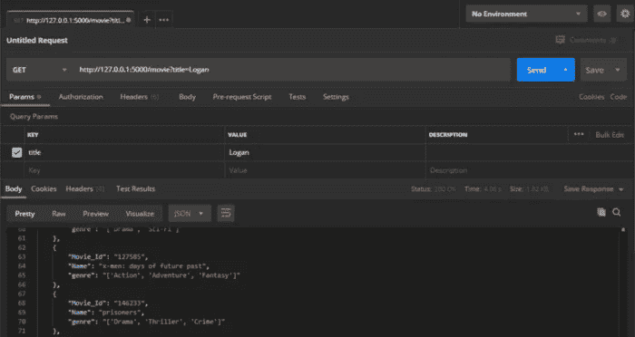

# 构建基于电影推荐烧瓶的部署

> 原文：<https://medium.com/analytics-vidhya/build-a-movie-recommendation-flask-based-deployment-8e2970f1f5f1?source=collection_archive---------1----------------------->

创建您自己的电影推荐 API，供其他开发者在他们的应用程序或网站中使用

> “每次我去看电影，都很神奇，不管电影讲的是什么”。
> 
> — **史蒂文·斯皮尔伯格**


照片由[迈克·西蒙](https://unsplash.com/@myke_simon?utm_source=medium&utm_medium=referral)在 [Unsplash](https://unsplash.com?utm_source=medium&utm_medium=referral) 上拍摄

> 应用程序的现场演示可以在[这里](https://lookupforcinema.herokuapp.com)查看

你好，我将解释以下内容:

1.  数据预处理
2.  构建电影推荐器机器学习模型
3.  使用 Flask 构建 REST API
4.  在本地主机 127.0.0.1:5000 上测试它— API 上线

推荐系统以两种方式之一生成推荐列表:

**协同过滤**:协同过滤方法基于过去的用户行为(即用户购买或搜索的项目)和其他人做出的类似决定建立模型，然后该模型用于预测用户可能感兴趣的项目(或项目评级)。

**基于内容的过滤。基于内容的**过滤**方法** **利用** **的优势****的某些** **的独有特性**中的某一项向**建议**附加具有类似特性的项。**内容**过滤**是**完全基于****项目的描述**和**用户** **兴趣的简介，**基于**用户过去的****兴趣推荐项目。****

**所以，事不宜迟，我们开始吧。如果你已经习惯了，也可以跳过任何部分。**

****

# **第一部分:数据预处理**

**我们先来看看数据集。我们将使用来自 Kaggle.com 的 [TMDB5000 数据集](https://www.kaggle.com/tmdb/tmdb-movie-metadata)。该数据集由两个文件组成，即 tmdb _ 5000 _ credits . CSV&tmdb _ 5000 _ MOVIES . CSV。还有一个名为[的数据集，即电影数据集](https://www.kaggle.com/rounakbanik/the-movies-dataset)，它拥有超过百万的电影评论和评级。然而，我没有使用它有两个原因。**

1.  **数据集对于系统来说太大了，估计需要 45–50GB 的 RAM。**
2.  **生产的机器学习模型对 Heroku 来说也太大了。Heroku 不允许我们在免费账户上存储超过 250MB 的内容。**

**让我简单介绍一下数据集，以便我们可以专注于构建机器学习模型部分。**

**我们将 2 个 CSV 文件加载到 df1 和 df2 熊猫数据帧中。**

****get _ data()的返回值:-****

****

**图 1:数据帧 1 — tmdb_5000_credits.csv**

********

**图 2:数据帧 2 — tmdb_5000_movies.csv**

**我没有处理两个数据帧，而是合并了两个数据帧，因此我们必须处理一个数据帧。幸运的是，数据集没有很多空值。让我们一个一个地处理它们。以下是所有列的概述。**

****combine _ data()的返回值:-****

****

**图 NaN 的所有列视图**

**至于每部电影特有的 ID 栏，我们不需要，因为不影响推荐。此外，删除介绍栏是个好主意，因为大多数电影都有概述，因此介绍会导致更多相似的上下文。通过删除这两列，您得到一个具有 21 个属性的数据帧。**

**有几列(见图 3)包含一个字典的行或节点。我们可以使用上一个模块中的文字来删除这些行或节点，并获得一个内联字典。因此，我们对演员、关键字、组和类别的属性使用文字值，现在我们以字典的形式拥有它们，我们可以使用它们并获得重要的特征，例如导演的名字，这对我们的推荐系统来说是一个非常重要的因素。对于演员、关键字和性别属性，我们可以返回列表中每个类别的前 3 个名字。我们现在可以创建一个列，它将是所有 4 个属性的总和，这些属性对于我们的推荐系统来说是非常重要的因素。让我们把这个列叫做“汤”(因为它就像一个汤/ 4 属性组合)。**

**现在让我们检查 NaN 值的数据集。**

****

**图 5:更新的所有列视图**

**由于我们的主页上有许多空白值，我们别无选择，只能删除它们。我们也可以用平均值填充空的运行时间值。由于我们有一个未发布的动作，我们可以删除这个特定的行，因为电影还没有发布。我们现在有了一些机器学习模型的最终数据集。**

# **第二部分:构建电影推荐器机器学习模型**

**为了构建我们的模型，我们首先创建一个用向量计数工具生成的计数矩阵。我们用英语停用词创建一个计数向量，并拟合和转换我们在上一节中刚刚创建的 soup 列。一个很好的技术叫做余弦相似度。它只是一种度量标准，用于确定文档的相似性，而不考虑文档的大小。在为我们的数据集构建余弦相似性矩阵之后，我们可以对结果进行排序，以找到前 10 部相似的电影。我们将电影标题和索引返回给用户。**

# **推荐 _ 电影()**

****推荐 _ 电影()**取四个参数。**

*   ****片名:**电影名称**
*   ****数据:**返回值 **get_data()****
*   ****combine:****combine _ data()**的返回值**
*   ****transform:****transform _ data()**的返回值**

**创建一个**熊猫系列**，包含我们数据集中所有电影的索引。**

****

**熊猫系列**

# **第 3 节:使用 Flask 构建 REST API**

****

**照片由[克拉肯 images](https://unsplash.com/@krakenimages?utm_source=medium&utm_medium=referral) 在 [Unsplash](https://unsplash.com?utm_source=medium&utm_medium=referral) 上拍摄**

# **烧瓶:-**

**为了理解文章的这一部分，我建议你对 Flask 有一个基本的概念。对于我们的任务，我们只需要了解一些初级功能。**

**要在您的系统上安装 Flask，请在终端/命令提示符下键入 ***pip install Flask。*** 就这样，Flask 现在已经安装在你的系统上了。**

**要了解一个简单的 Flask 应用程序的基本知识，请点击下面的链接。**

****烧瓶你好世界****

**现在，我们对 Flask 有了一个基本的概念，让我们进入下一个主题，即**REST API。****

# **REST API:-**

**用 Flask 创建 RESTful API—GET 请求**

# **文件 2 — app.py**

**在这个文件中，我们将编写 Flask 应用程序，并使用我们之前构建的推荐系统。**

# **导入所需的包**

**在我们导入 **Flask** 类之后，然后**请求**库发送 **HTTPS** 请求，最后我们导入 **jsonify** 以 **JSON** 格式返回我们的结果。**

**我们导入 **flask_cors** 来为我们的 API **启用跨来源请求。****

**什么是**跨来源请求**？**

> ****(****【CORS】****)跨源资源共享是一种机制，它允许从第一个资源所服务的域之外的另一个域请求网页上的受限资源。****

***要了解更多关于 CORS 的政策，请点击下面的链接。它解释了你需要知道的关于 CORS 政策的一切。***

*   ***[**什么是 CORS？**](https://www.codecademy.com/articles/what-is-cors)***

***现在我们导入我们的**推荐. py** 文件作为一个模块，在我们的 **app.py** 文件中使用它。***

## ***烧瓶代码:-***

*   *****第 1 行:**我们创建了这个类的一个实例。第一个参数是应用程序的模块或包的名称。***
*   *****第 2 行:**我们使用 **CORS()** 方法在我们的 API 上启用 **CORS** 策略。***
*   *****第 4 行:**然后我们使用 **route()** decorator 告诉 Flask 哪个 URL 应该触发我们的函数。在这种情况下，我们使用带有基本 URL 的 **/movie** 端点。***
*   *****第 5 行:**现在，我们定义一个名为 **recommend_movies()** 的函数，它将用于返回前 20 个推荐。***
*   *****第 6 行:**在这一行中，我们从 **recommendation.py** 文件中调用 **results()** 函数，并将推荐存储在一个名为 **res.** 的变量中。使用**request . args()**将电影名称作为**查询字符串**传递给我们的 **results()** 函数，参数名称为 **title。*****
*   *****第 7 行:**最后我们将从 **recommendation.py** 接收到的结果以字典格式返回到 **app.py** 并转换成 **JSON** 格式返回结果。***
*   *****第 9 行:**这一行表示如果我们直接从终端/命令提示符调用我们的 **app.py** 文件，那么它将执行后面的内容。***
*   *****第 10 行:**我们在终端/命令提示符下直接调用我们的 **app.py** 文件后运行 app。当在***localhost****上运行时，我们将端口号设置为 5000，并设置 **debug=True** 来追溯运行我们的应用程序时出现的任何错误。****

# ****4.在本地主机上测试它— 127.0.0.1:5000****

********

****由 [David Travis](https://unsplash.com/@dtravisphd) 在 [Unsplash](https://unsplash.com/?utm_source=medium&utm_medium=referral) 上拍摄的照片****

****现在，我们已经完成了编码部分，让我们在 ***localhost*** 上测试我们的应用程序，看看它是否工作。****

****如果你想用 Postman 测试我们的 API，那么从下面的链接下载。****

*   ******下载邮差******

****如果你喜欢用浏览器而不是邮递员，你也可以用浏览器来测试。我们将对他们两个进行测试，你将会看到结果。****

# ****测试我们的 API:-****

******步骤— 1:** 如果在 Windows 中打开命令提示符，如果使用 Linux 则打开终端。****

******步骤— 2:** 使用命令行导航到保存数据集、**推荐. py** 文件和 **app.py** 文件的文件夹。****

****我们将文件存储在名为**建议 2.0 的文件夹中。下面是我们的目录结构。******

```
**Our directory structure(**Recommendation 2.0)**movie_data.csv.zipRecommendation.pyapp.py**
```

****开发应用程序时，所有文件和数据集都应该放在一个文件夹中，以便于使用。****

******步骤— 3:** 当我们在**建议 2.0** 文件夹中时，在命令行中键入以下命令。****

```
****set FLASK_APP=app.py****
```

******运行应用程序:-******

```
****flask run****
```

****执行完这两个命令后，我们将看到我们的应用程序运行在 **localhost** 上。****

********

****Flask 应用程序启动并运行****

****使用 Postman 或任何浏览器在本地主机 上测试我们的 API。****

****当我们将一部电影传递给我们的 API 时，让我们看看我们的结果。****

## ****邮递员:-****

********

# ****最后，我们的电影推荐 API 现已上线。****

# ****万岁！现在我们开始直播****

> ****该应用的现场演示可在处查看****

********

****史蒂夫·哈拉马在 [Unsplash](https://unsplash.com?utm_source=medium&utm_medium=referral) 上拍摄的照片****

****请给一些掌声，做⭐的 [***资源库***](https://github.com/Tharun-tharun/Movie-Recommendation-System-with-Sentiment-Analysis) *，如果它对你有帮助的话。*****

# ****你可以通过以下方式找到我****

*   ****[**领英**](https://www.linkedin.com/in/tharun-p-827813177)****
*   ****[**GitHub**](https://github.com/Tharun-tharun)****