# 使用 Azure Data Lakehouse 和 Synapse 无服务器 SQL 池构建一个新时代的经济高效的商业智能系统

> 原文：<https://medium.com/analytics-vidhya/build-a-new-age-cost-effective-business-intelligence-system-using-azure-data-lakehouse-and-synapse-46d361ba33e6?source=collection_archive---------6----------------------->

这是我之前的[文章](/analytics-vidhya/data-lakehouse-architecture-azure-synapse-serverless-sql-pools-78a7a142ca37)的延续，在这篇文章中，我们将看到如何使用 Azure Data Lakehouse 和 Azure Synapse 无服务器 SQL Pool 为您的企业构建一个新时代的 BI 系统。

下图显示了从源仪表板到终端用户仪表板的数据流

现在让我们看看如何在数据流中构建每个组件

步骤 1:创建 Azure Synapse 工作区
步骤 2:创建 Synapse 管道
步骤 3:创建 DataLakeHouse 数据库
步骤 4:创建外部表和视图
步骤 5:创建表格模型
步骤 6:创建仪表板

# Azure Synapse 工作区

→打开 Azure Portal 并+创建一个资源 Synapse Analytics)
→单击创建 Synapse Analytics 并提供所需的所有详细信息
→您可以创建一个新的 data lake 存储帐户或使用现有帐户
→您可以创建一个新的文件系统或使用存储帐户中的现有文件系统
→准备就绪后，单击查看创建(保持其余选项卡的默认设置，除非您想要更改它们)—对于此示例，我使用了其他选项卡的默认设置

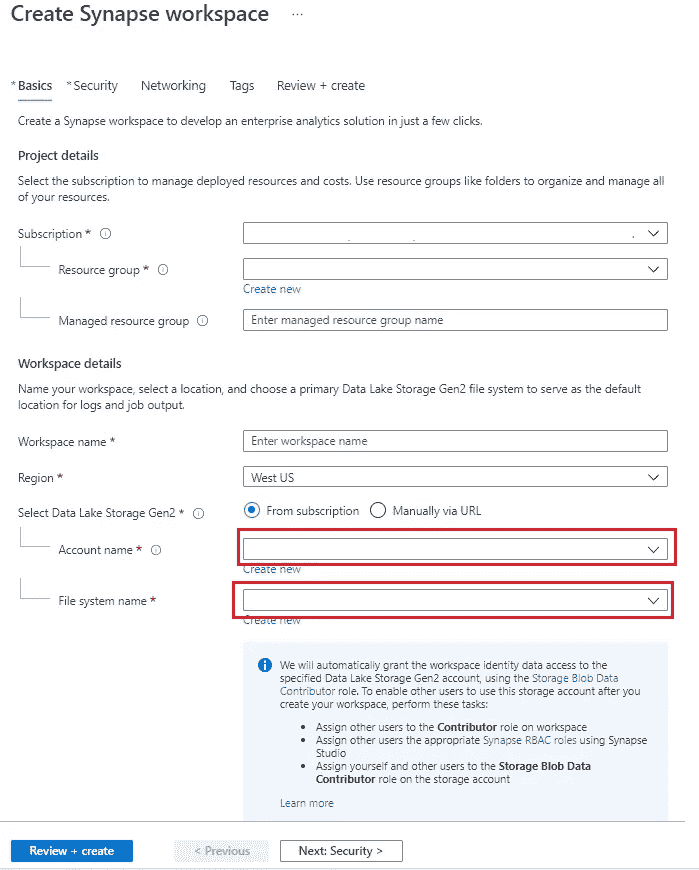

一旦资源准备就绪，您将会看到在您的 RG 中创建了两个主要资源(+相关资源)

→ Synapse 分析工作区
→数据湖存储账户

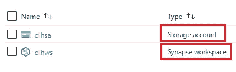

# 数据接收— Azure Synapse 管道复制数据

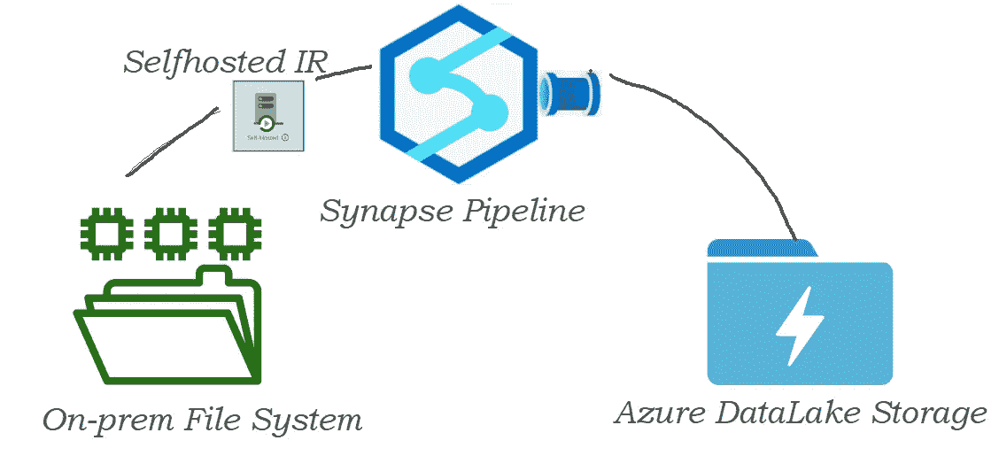

→对于此示例，我使用本地计算机中的文件作为源→使用 Azure Data Synapse 管道—复制数据工具将文件从您的本地文件系统复制到 Azure Data Lake 存储

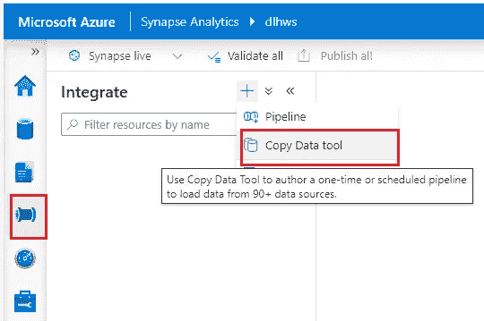

→点击复制数据工具→点击内置复制任务

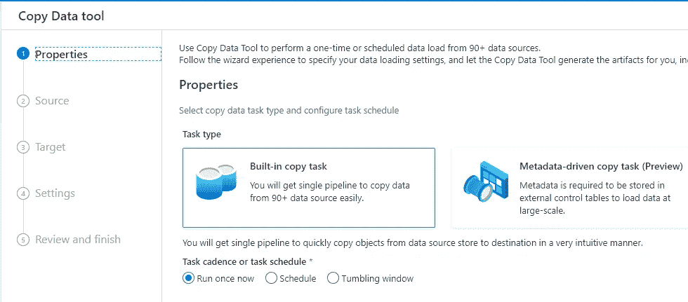

→按照步骤操作并创建一个复制数据管道
→如果您的数据位于内部网络中，您需要配置一个自托管集成运行时来连接它。

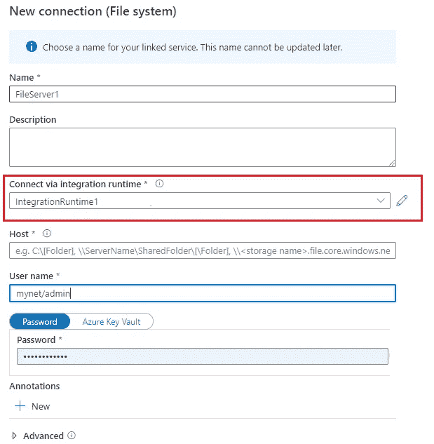

→如果尚未安装自托管 IR，则按照如下所示进行安装和配置(它已经安装在我的机器上)

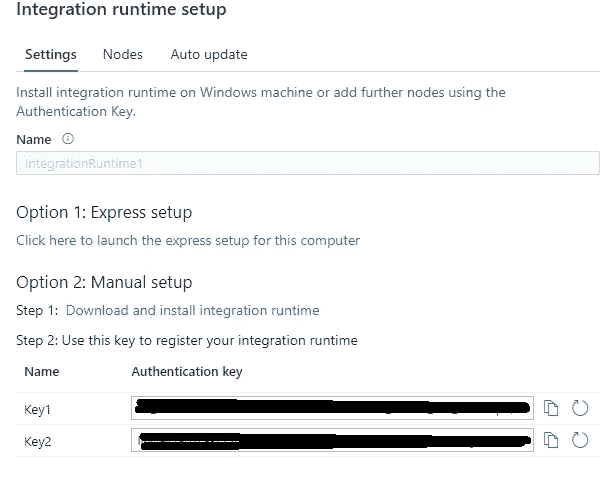

安装自托管 IR

→管道成功复制了数据

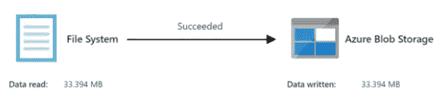

→我能看到两者。CSV 文件复制到我的存储容器

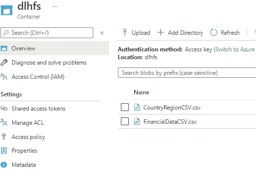

# 使用无服务器 SQL 池创建数据仓库

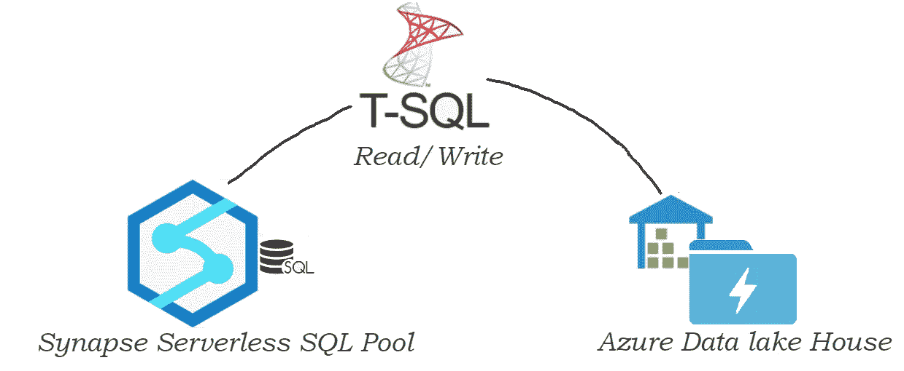

→打开 Synapse 工作区，点击左侧菜单中的脚本

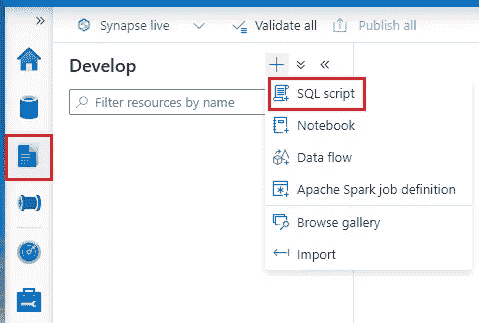

→在编辑器上输入下面的脚本并执行它，根据**内置**无服务器 SQL 池创建数据库

> 创建数据库销售

→ Builtin 是 Azure Synapse Workspace 附带的默认无服务器 SQL 池
→创建数据库后，下一步是创建数据库范围的凭据，以便能够访问受 SAS 保护的 Azure 存储帐户。

> C 创建数据库范围的凭据[aaaa]
> ，其中 IDENTITY= '共享访问签名'，
> SECRET = ' SV = 2018–03–28&ss = BF&SRT = SCO&sp = rl&ST = 2019–10–14t 12% 3a 10% 3a 25 z&se = 2061–12–31t 12% 3a 10% 3a 00 z【t

→创建引用受 SAS 密钥保护的 Azure 存储帐户的外部数据源

> 用(
> LOCATION = '[https://sqlondemandstorage . blob . core . windows . net '](https://sqlondemandstorage.blob.core.windows.net')，
> CREDENTIAL = aaaa
> )创建外部数据源 xxxx

# 创建外部表和视图

属性在 SalesBI 数据库中创建一个外部表。存储帐户中的 CSV 文件

> 使用[sales bi]；
> GO
> 创建外部表 factSales
> (
> 【国家】VARCHAR(100)COLLATE Latin1 _ General _ bin 2，
> 【项目类型】VARCHAR(100)COLLATE Latin1 _ General _ bin 2，
> 【销售渠道】VARCHAR(100)COLLATE Latin1 _ General _ bin 2，
> 【订单优先级】VARCHAR(100)COLLATE Latin1 _ General _ bin 2，
> 【订单日期】DATETIME2，
> 
> 创建外部表 dim region
> (
> [name]VARCHAR(100)COLLATE Latin1 _ General _ bin 2，
> [alpha-2]VARCHAR(100)COLLATE Latin1 _ General _ bin 2，
> [alpha-3]VARCHAR(100)COLLATE Latin1 _ General _ bin 2，
> [country-code]VARCHAR(100)COLLATE Latin1 _ General _ bin 2，
> [iso _ 3166–2]VARCHAR(11

→现在数据库和表都准备好了，是时候创建视图(如果需要)来添加一些自定义列和应用业务逻辑了

→创建数据库视图以添加新的计算列

> 创建视图 vwFactSales
> 作为
> 选择
> 【国家】
> 【项目类型】
> 【销售渠道】
> 【订单优先级】
> 【订单日期】
> 【订单 ID】
> 【发货日期】
> 【售出单位】
> 【单价】
> 【单位成本】
> 【总收入】
> 【总成本】

# 使用 DataLakeHouse 创建表格模型

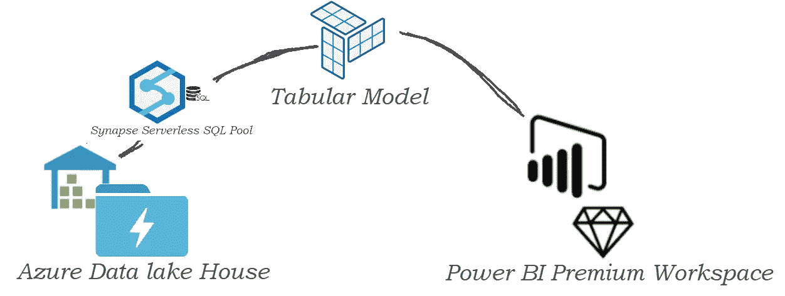

→使用无服务器 SQL 池端点连接到 LakeHouse 并导入表数据
→创建模型并将其部署到 Power BI 工作区

> 在这篇文章中，我不会讨论如何创建和部署模型,我会为此写一个单独的博客

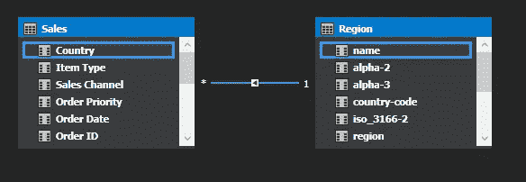

→模型成功部署后，刷新它以将数据放入模型

→等待模型刷新，然后从 Power BI Desktop 连接以创建报告
→我部署的模型已经刷新并准备好访问。

# 创建一个 Power BI 仪表板并发布

→连接到新部署的模型并检查字段

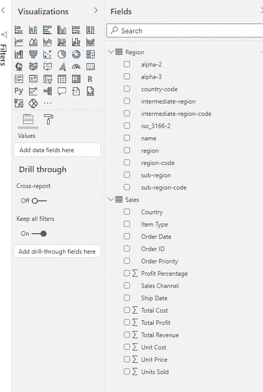

→让我们玩玩它，创造一些美丽的视觉效果

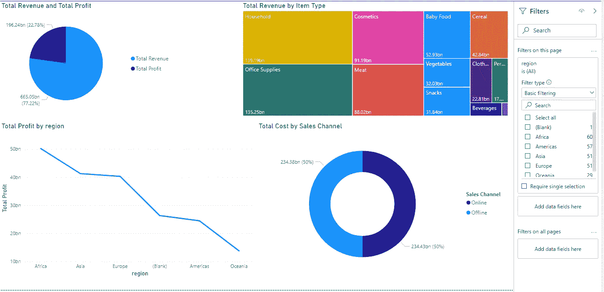

→将仪表板发布到 Power BI 门户，并与您的团队分享

→我们将在我的下一篇文章中讨论该解决方案的成本效益，直到保持安全和健康。

[参考号](https://quoteideas.com/respect-quotes/):