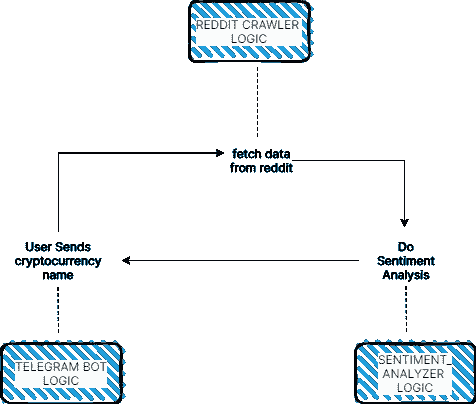
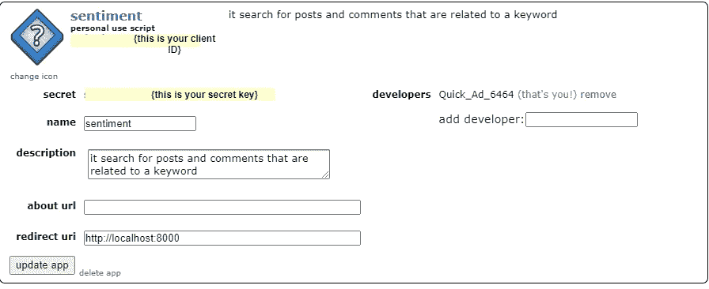

# 用 python 构建一个电报机器人，使用来自 reddit 的数据获得对特定加密货币的情感。

> 原文：<https://medium.com/analytics-vidhya/build-a-telegram-bot-in-python-to-get-sentiment-for-a-particular-cryptocurrency-using-data-from-ac9715be87?source=collection_archive---------2----------------------->


## 介绍

在处理加密货币时，我们想知道的一件事是世界观；全世界都认为这是个坏主意，还是每个人都对此感到高兴。有感情。

> 因此，在本教程中，我们将设计构建一个电报机器人，它可以接受加密货币，并根据从 reddit 抓取的数据告诉我们当前的情绪。

**条款**

*   机器人是一个执行自动化任务的软件系统。所以我们的电报机器人可以通过电报接收和发送信息。就像和朋友在电报上聊天一样。
*   情感分析是一种自然语言技术，用来判断一个陈述是积极的、消极的还是中性的。

Reddit 是数据来源。

[这里是完整代码库的链接。](https://github.com/mrsimi/cryptosentiment_bot)

## 先决条件

*   Python 知识(不是高级知识，但对函数有基本的了解)。
*   一个 Reddit 帐户(如果你没有使用谷歌，你可以创建一个)和一点点熟悉。
*   如果你想实现电报机器人部分，使用电报。如果您不想这样做，您可以在功能或任何其他客户端的基础上构建一个 web 应用程序。

# 设计

**用例:**

**用户向电报机器人发送加密货币名称。电报机器人接收消息，在数据源上爬行，然后进行情感分析，然后我们为用户生成报告。**

*PS:这是一个理想的场景，现实生活中的场景可能会更复杂。*

因此，我们有一些设计选择和使用原则:

**选择数据来源**:由于互联网限制，我只能抓取 Reddit 数据。(Twitter 将是一个很好的补充，所以一定要加上它)。

**编程范例**:我选择了函数式编程。你可以选择的其他选项包括面向对象编程、命令式编程等。但是让我们一起坚持函数式编程方法。

**关注点分离(SoC)** :爬虫脚本仅爬行，情感分析器仅分析等。这有助于扩展性，比如当我意识到 twitter 爬虫由于互联网限制而无法工作时。

## 我们最后的流程



我们的应用流程

这些精美的盒子是我们从应用程序流中提取的服务。电报机器人逻辑、REDDIT 爬虫逻辑和情感分析器逻辑(或服务)

# 构建服务

因此，我们提取了将要构建的服务:

*   TELEGRAM _BOT 逻辑:它帮助我们与用户建立电报聊天，我们可以接受他们的输入，并向他们发送我们的情感分析报告。
*   REDDIT_CRAWLER 逻辑:负责接收**关键字**并抓取 REDDIT 寻找与**关键字**相关的帖子
*   情操 _ 分析器逻辑:就是那种把不同的句子取进去，推断出是正面、负面还是中性的那种。

让我们建造。

**在 Visual Studio 代码中创建一个文件夹**

## **创建 REDDIT_CRAWLER**

## 步骤 1 获得访问权限:

*   转到 P[references(reddit.com)](https://www.reddit.com/prefs/apps)然后选择底部的创建另一个应用程序
*   详细填写。选择(脚本)。重定向 url (http://localhost:8080)并单击创建应用程序。
*   创建时，您会看到一个对话框。记下个人使用脚本和密码，它们分别是您的客户端 id 和密钥。



*   将. env 添加到文件夹中，并将字段添加到文件中。看起来是这样的。

```
REDDIT_USERNAME = {see developers}
REDDIT_SECRET_KEY= {secret key}
REDDIT_CLIENT_ID={client key}
```

## 步骤 2 安装一些软件包

*   praw:它是 Reddit API 的 Python 包装器。在[PRAW:Python Reddit API 包装器——PRAW 7 . 5 . 0 文档中找到更多信息](https://praw.readthedocs.io/en/stable/)
*   python-dotenv:它有助于从。环境文件

所以跑吧:

```
pip install praw
pip install python-dotenv 
```

## 步骤 3 编写逻辑

我们将创建一个功能:

*   接受一个关键字(加密货币名称)
*   在加密货币子编辑中搜索一周内的所有事件。
*   将帖子添加到列表中，忽略*加载更多评论选项*我们确实看到这会延长帖子。

## 第四步:让我们测试一下

我创建了一个 run.py 文件作为应用程序的入口点，所以在这里

运行一个 **python run.py** 来查看结果。

我们有我们的 reddit 数据。情感分析器上

## 构建情感分析器

## 步骤 1 安装库

情感分析器是自然语言处理中的一项技术，有多种技术可以实现它。但是出于这个目的，我们将使用 **TextBlob。**

TextBlob 使用基于规则的方法来确定句子的情感，还有其他技术，如使用深度学习算法。

```
pip install textblob
```

## 步骤 2 讨论和编写代码

TextBlob 是这样工作的:

*   我们将一个句子传递给一个 TextBlob 对象，然后得到结果
*   从结果中，我们可以获得不同的情感指标，但我们只对**情感.极性.**检验[教程:快速入门— TextBlob 0.16.0 文档](https://textblob.readthedocs.io/en/dev/quickstart.html#sentiment-analysis)感兴趣，以了解更多信息。

现在，由于我们正在处理一个句子列表，我们跟踪那些带有负面情绪、正面情绪和中性情绪的句子，那么整体情绪是百分比最高的一个。(坚持简单推理)。

因此，如果我们分析 4 个帖子，2 个是正面的，1 个是负面的，1 个是中性的。总体情绪是积极的。

我们的准则:

我写了一些其他的函数，比如

*   第 17 行:get _ voices(dataList，provider)，获取数据列表和提供者。我在一个事件中添加了提供商警告，我们正在从 reddit、twitter 等几个来源获取数据，以帮助我们生成一份全面的报告。
*   第 6 -7 行:clean_text(text)删除字符串中的所有特殊字符
*   第 9 -15 行:maximum(pos，neg，neu)接受正数、负数和中性数，并返回文本定义中的最大值——如果最大值是正数，则返回正数。

## 第三步:我们来测试一下

让我们更新 run.py 文件。我们将使用一些虚拟的句子列表来确保它的性能。

你会看到我们的函数式编程方法允许我们测试每一个功能，而不用担心其他函数的复杂性。所以我们的**perspective _ analyzer . py**不需要知道 **reddit_crawler.py**

运行这个来看看结果。

情绪分析检查

## 建造电报机器人

## 步骤 1 获得访问权限

为了让我们能够访问 telegram API，我们需要令牌，我们可以从 BotFather(想想所有聊天机器人之父)那里获得令牌。

所以:

*   在这里搜索/联系 bot father[电报:联系@BotFather](https://telegram.me/BotFather)
*   将 **/new** 作为消息发送
*   填写详细信息，您应该会得到您的 API 令牌
*   将令牌复制到。env 文件应该是这样的:

```
TELEGRAM_TOKEN = xxxxxxxxxxx
```

*   你也应该为你的机器人获得一个 chatId，类似于**t.me/{name_of_bot}**。这就是你会与之聊天的机器人。

## 步骤 2 安装库

我们可以使用许多 python 库来访问 Telegram API，但是出于这个目的，我选择了由 [eternnoir](https://github.com/eternnoir/pyTelegramBotAPI) 开发的那个。

```
pip install pyTelegramBotAPI
```

## 步骤 3 逻辑和讨论

现在我们只对电报机器人的三个功能感兴趣:

*   发送一个欢迎消息来显示机器人做什么和说明。
*   接收用户的响应，在这种情况下是加密货币名称。
*   向用户发回响应。

这部分的代码如下:

*   第 7 行是关于设置的
*   第 10–12 行只是一个受欢迎的序列
*   第 14–18 行是我们接收消息并回复的地方
*   第 20 行是让机器人不停运行的原因；名字

现在在 run.py 上，将代码更新为

我知道你在本地运行它，但是如果你去你的电报和在 t.me/{name_of_bot}聊天，你会和它互动得很好。

它应该给你所有我们硬编码的信息。

但这不是我们想要的。

## 设置— 4 将所有内容整合在一起

我们已经有了以前的服务来获取数据并对其进行情感分析。

因此，我们真正想要的是在第 15 行获取加密货币名称(消息参数)，在第 16 行和第 18 行之间放入我们的逻辑以从 reddit 获取数据，并进行情感分析。好在我们都有了。

所以让我们来写我们的最终实现。

并更新我们的条目文件 run.py

## 第五步:让我们测试一切

奔跑

```
python run.py
```

然后拿出你的电报和你的机器人聊天。这是我的一个样本结果。

## 部署

基本上，我们正在寻找的是服务器，让我们永远运行脚本，如果我们想保持电报机器人始终在线。有几个付费选项。

我发现免费运行它的一个选项来自 YouTube 上的一个名为 [Frank 的网站。看看他](https://www.youtube.com/watch?v=S6pBLq8Jv_A)。

[这是我的机器人在 Replit 上运行的链接](https://replit.com/@MrSimi/MisguidedSneakyParallelprocessing#main.py)

[这是和我的机器人聊天的电报链接。](https://t.me/Sentiment_09_bot) *(PS:你在看这个教程的时候我可能已经把这个 bot 下线了)*

[这里是 GitHub 上代码库的链接。](https://github.com/mrsimi/cryptosentiment_bot)

# 进步和增加

我们有一个合理的起点，但还有一些东西可以补充。

**多个来源:**我只使用 reddit 作为我的来源，但我们可以包括其他社交媒体来源，如 twitter、脸书，甚至公共论坛。

**验证用户输入:**对于电报机器人，我们只是接受用户输入作为插入，没有验证或确认，这是完全不安全的。在未来的添加中，我们希望验证它是一个文本，是一个硬币，以及我们可能想到的其他验证。

**使用更高级的情感分析器**:我们选择了 TextBlob 作为我们的情感分析器，但它是最复杂的。您可以选择使用更复杂、更精确的工具。你也可以从头开始构建自己的情感分析器。

# 结论

在本教程中，我们构建了一个电报机器人，它可以接受加密货币名称，从 reddit 收集数据，并根据数据对其进行情感分析，并帮助我们生成报告。

但不仅仅如此。我们实际上已经建立了一个庞大系统和知识体系，可以独立提取。我们可以为 reddit 中的其他数据编写一个 enter crawler，或者将我们的数据扩展到其他来源。我们也可以使用我们的电报机器人逻辑作为构建其他类型机器人的起点。

我希望这是一个有见地的阅读。

这里是 GitHub 上代码库的链接。

[这是我的机器人在 Replit 上运行的链接](https://replit.com/@MrSimi/MisguidedSneakyParallelprocessing#main.py)