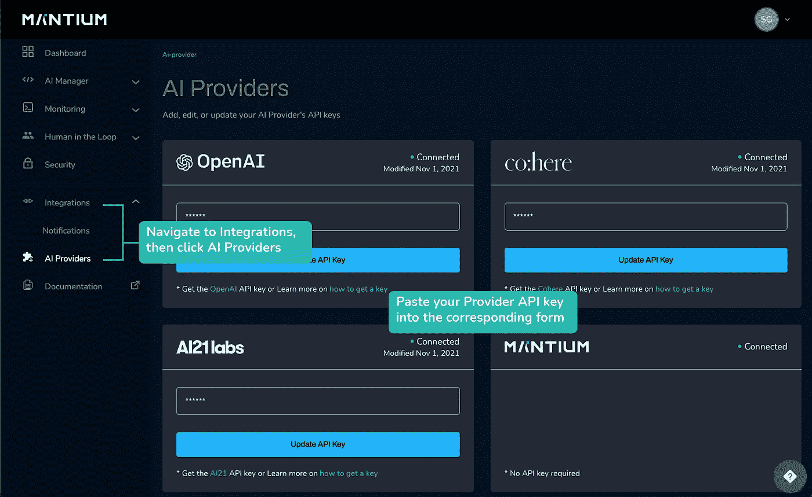
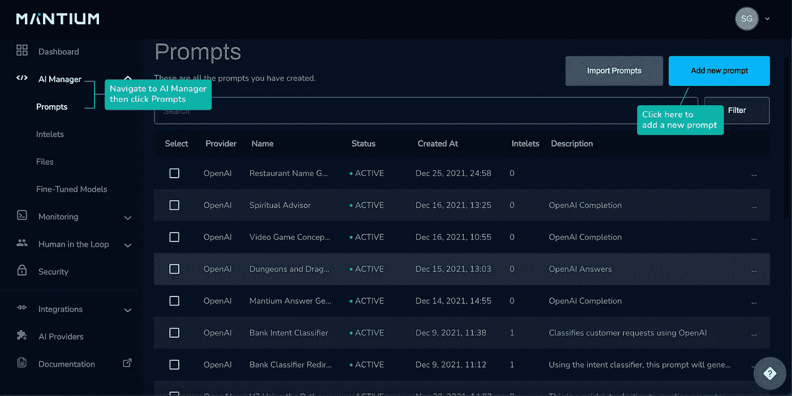
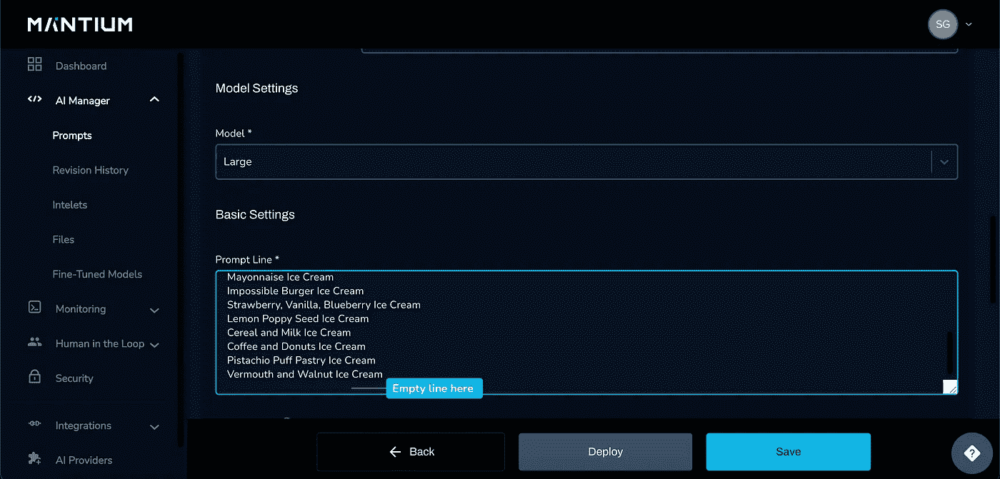
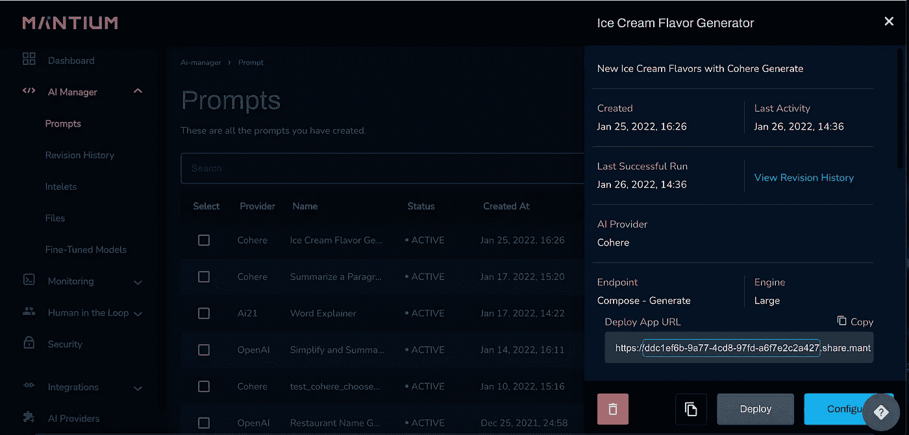

# 用 Mantium、Tweepy 和 Heroku 创建一个 Twitter 机器人

> 原文：<https://medium.com/analytics-vidhya/build-a-twitter-bot-with-mantium-tweepy-and-heroku-34622705b54a?source=collection_archive---------0----------------------->

## 了解如何使用 Python 创建利用大型语言模型的应用程序！


照片由[克里斯里德](https://unsplash.com/@cdr6934?utm_source=medium&utm_medium=referral)在 [Unsplash](https://unsplash.com?utm_source=medium&utm_medium=referral) 拍摄

在本教程中，我们将探索一种快速的方法来创建一个自动化的应用程序，将一段有趣的文本发布到 Twitter 上。我们将使用的示例文本是一个独特的冰淇淋口味列表——每天，机器人将通过使用示例文本作为基线模式来生成一种新的口味。如果你想关注一个不是冰淇淋口味的话题，请随意使用你自己的示例文本。

用这个[示例提示](https://ddc1ef6b-9a77-4cd8-97fd-a6f7e2c2a427.share.mantiumai.com/)来看看它是如何工作的！只需点击“执行”，看看你得到什么味道回来。

这将是一个简单的 Twitter 机器人，其唯一的工作是定期发布由大型语言模型生成的文本，其唯一的任务是生成一段创意文本，连接到 Twitter API，并在推文中发布文本。在后面的教程中，我们将探讨如何添加功能，如喜欢和回复推文！

*注意:Twitter 对于公开发布信息的来源非常严格。请务必公开您的应用程序是一个机器人。*

# 帐户设置

如果您已经在这些服务上设置了帐户，请随意跳过您已经完成的任何步骤。如果你不想用 Heroku 的，你也可以选择你自己的时间表。

**Mantium 账户**

*   如果您还没有帐户，请[在 Mantium 平台](https://app.mantiumai.com/)上注册。
*   选择您的提供商。您可以使用 Mantium 的大型语言模型，或者，如果您想使用另一个提供者，导航到`Integrations > AI Providers`，然后将您的 API 密匙粘贴到相应的提供者表单中。[点击此处了解关于由提供商获取 API 密钥的详细信息](https://developer.mantiumai.com/docs/provider-api-keys)。



**拥有基本访问权限的 Twitter 开发者账户**

*   为了访问 Twitter API，您必须拥有一个开发者访问的 Twitter 帐户。对于一个机器人，你可能想创建一个独立的账户，这样它就可以代表自己发微博了。在这里用 Twitter 账户[登录，然后点击“注册”,按照说明进行基本访问。一旦您确认了您的帐户，**将您的 API 密匙、API 密匙和不记名令牌保存在一个安全的位置**以备后用。](https://developer.twitter.com/en)
*   API 访问分为三种类型:基本、高级和学术研究。要启用自动发布，您必须具有提升的访问权限。在您的仪表板中，您将看到一个项目 1 链接。点击该链接，然后选择“申请提升”。填写申请并尽可能详细地描述——你几乎可以立即获得提升的访问权限。
*   回到您的项目仪表板，单击您的项目，然后单击您的应用程序旁边的关键图标。这将允许您生成一个访问令牌和密码，并将它们保存在一个安全的位置。
*   注意:Twitter 偶尔会使用一个自动系统来删除可疑应用程序的 API 访问。如果这种情况发生在你身上，它可能是随机的。提交支持票，如果您的访问未被重新授权，请务必跟进。在创建面向用户的应用程序时，要注意你的意图。我们支持在开发时考虑完整性和安全性——有助于任何类型的钓鱼、垃圾邮件或骚扰的应用程序都不符合我们的社区标准。

**Heroku 账号**

*   如果你想把你的机器人设置成定期发送 Tweet，Heroku 有一个简单的选项，可以用调度程序自动运行你的脚本。
*   [注册一个 Heroku 账号](https://signup.heroku.com/)。这是您将推动您的应用程序的地方。
*   [安装 Heroku CLI](https://devcenter.heroku.com/articles/heroku-cli) 以便更轻松地部署您的代码。

# 快速工程

原型化提示以创建您想要的输出的最简单的方法是通过 Mantium UI。

**提示创建**

*   导航至您的 Mantium 账户，点击`AI Manager` > `Prompts` > `Add new prompt`。



*   **添加安全策略**
    在你的提示中添加安全策略可以控制输入和输出内容质量——你可以配置自己的或使用 Mantium 的默认策略，每个帐户都有。点击安全策略下的`Add Security Policies`，将`Default Policies`拖至所选策略。点击`Done`保存。当策略名称在安全策略下可见时，您将知道该策略已被应用。
*   **选择一个提供者:Co:here**
    在这里你可以选择任何一个你已经集成了 API 密匙的提供者。欢迎您选择不同的提供商。
*   **选择一个端点:Compose — Generate** 所有的提供者都有一个支持生成文本的端点。为您选择的提供者选择相应的端点。与生成文本相关的提供者端点如下:
    *open ai:Completion
    Co:here:Compose—Generate
    manti um:Completion
    Ai21:Complete*
*   **型号:大型**
    型号因供应商而异，并经过优化以更好地执行不同的任务。在此配置过程中，您可以测试不同的型号，因此可以随意尝试不同的选项。
*   **提示行** 添加模型生成输出时将遵循的文本。注意格式——语言模型对标点、符号、空白等很敏感。对于这个例子，我已经附上了一个文本文件，其中列出了一些有创意的(有时不太好吃的)冰激凌口味的想法。请随意使用此文本粘贴到提示行中，或者创建自己的提示行。**确保在提示体**的末尾包含一个空行——这对于模型正确完成下一个文本模式至关重要。

[冰淇淋 _ 口味 _ txt](https://gist.github.com/sglibova/1434202903202a1df7b01ca250dfffe5)



# 提示设置

对于这个简单的提示，大多数设置可以保留为默认值。要配置的最重要的设置是最大令牌数、温度和停止序列。

*   最大令牌数:12 个令牌大约是一个普通英语单词的 0 . 75。因为我们生成的是短字符串，所以这个值可能相当低。
*   **温度:. 95**
    温度控制着“创造力”——更高的温度会产生更独特和创造性的产出，但也更有可能变得毫无意义。对于不一定需要事实反应的创造性和有趣的反应，更高的温度值完全没问题。
*   **停止序列:\n**
    停止序列是一种控制模型输出的方法——它们允许您定义任何强制模型停止的文本序列。因为我们希望模型只生成一行文本，所以它应该在下次创建换行符时停止(" \n ")。
*   该提示不需要输入就能起作用。点击`Test Run`测试模型输出！多次点击`Test Run`可能每次都会产生不同的结果——您可以将此作为测试和调整提示设置的机会。一旦你对结果感到满意，点击`Save`。
*   回到 Prompts 菜单，单击您刚刚配置的提示符—这将打开提示符的抽屉视图。在 Deploy App URL 中，你会发现*“https://”*和*“share . manti um . com”*之间的提示 ID。复制并保存该值，以便在项目的环境文件中进行设置。



# 目录设置

本教程假设您对初始化存储库和版本控制有些熟悉。以您最方便的方式设置项目的顶级目录，或者使用下面提供的示例。在开始安装软件包之前，请确保您的虚拟环境处于活动状态。

**项目和虚拟环境设置命令示例:**

```
$ mkdir twitter_bot
$ cd twitter_bot
$ python -m venv twitter-bot-venv
$ source twitter-bot-venv/bin/activate
```

**初始化这个项目需要的文件:**

```
$ touch .gitignore .env requirements.txt 
$ mkdir app
$ cd app
$ touch app.py load_env.py mantium_call.py
```

**您的目录结构现在应该是这样的:**

```
twitter_bot
    ├── .gitignore
    ├── .env
    ├── requirements.txt
    └── app
       ├── app.py
       ├── load_env.py
       └── mantium_call.py
```

**将以下库添加到您的活动虚拟环境:**

```
pip install mantiumapi tweepy python-dotenv
```

**然后，使用 pip freeze 将您的依赖项添加到需求文件:**

```
$ pip freeze > requirements.txt
```

如果您最终使用`pip install`将更多的库添加到您的依赖项中，您总是可以重新运行这个命令来更新您的需求文件。

# 文件内容

*   **。gitignore**
    我使用[这个模板](https://github.com/github/gitignore/blob/main/Python.gitignore)作为许多 Python 项目的总括。您可以对其进行删减，以排除您不需要的文件，但要始终确保您的。env 文件在您的。gitignore 文件。永远不要将个人凭证放在公开可见的存储库中。
*   **。env**
    在这里，您将初始化与 Mantium 和 Twitter 交互所需的所有凭证。您将在这里粘贴之前在指南中保存提示 ID。

```
# Environment Variables# Mantium
MANTIUM_USER=your_account_email_address
MANTIUM_PASSWORD=your_mantium_password
PROMPT_ID=prompt_id_from_mantium_logs# Twitter
TWITTER_API_KEY=your_value_here
TWITTER_API_SECRET=your_value_here
TWITTER_ACCESS_TOKEN=your_value_here
TWITTER_ACCESS_SECRET=your_value_here
```

# 我们来编码吧！

## app.py

在应用程序的主体中，我们完成了几件事情:

*   使用我们在`load_env.py`中定义的`load_twitter_env()`函数加载 Twitter 凭证
*   通过从`mantium_call.py`模块调用`prompt_results()`将提示输出保存在`prompt_output`变量中。调用这个函数将执行我们在前面的教程中配置的提示。
*   验证、连接和验证 Twitter API 的登录。
*   使用 Tweepy `api.update_status`方法，我们将`prompt_result`作为状态更新发布到机器人的 Twitter 时间轴上！

现在让我们来看看助手模块:`load_env.py`和`mantium_call.py`

## 负载 _ 环境. py

使用 **python-dotenv** 库，我们调用`load_dotenv()`来加载我们在上面的`.env`文件中设置的凭证。我将这个过程分为两个功能:一个用于登录并使用 Mantium，另一个用于登录并使用 Twitter。

## mantium_call.py

这里，我们使用来自`load_env.py`的`load_mantium_env()`函数获取 Mantium 凭证，并通过检查我们是否能够通过调用`client.BearerAuth().get_token()`获得`mantium_token`来确认成功登录。

`prompt_id`值将用于检索您在本指南前面配置的特定提示。

`prompt_results()`函数执行输入空字符串的提示，因为该提示不需要任何输入。然后，我们检查提示状态，并在状态不是“COMPLETED”时刷新提示，然后检查提示的结果，以确保它们不是空字符串。一旦确认提示状态为完成，并且输出值不是空字符串，该函数将以字符串形式返回提示输出。

底部的代码允许测试单个脚本，以确保它成功地通过 Mantium 的认证，并可以检索提示结果。为了测试这个脚本本身(不用担心`app.py`发布到 Twitter)，您可以在`twitter_bot`目录中运行下面的命令:

```
$ python3 app/mantium_call.py
```

# 测试您的脚本！

在您的终端中，您可以通过从`twitter_bot`目录运行以下命令来测试您的脚本:

```
$ python3 app/app.py
```

如果成功，你应该有一个新的推文在你的机器人的时间轴上！

# 在 Heroku 上部署和调度

*注意:如果你使用 Python 诗歌，你需要一个* [*诗歌构建包*](https://elements.heroku.com/buildpacks/moneymeets/python-poetry-buildpack)*——按照说明创建一个需求文件供 Heroku 使用。*

## 部署

要使用 Heroku CLI 进行部署，首先从您的 web 浏览器登录您的 Heroku 帐户，单击主仪表板右上角的`New` > `Create new app`，并命名您的应用程序。

使用 CLI，您可以登录您的 heroku 帐户，并按照提示设置 SSH 密钥。

```
$ heroku login
```

一旦你设置好了，在你的`twitter_bot`目录中使用下面的命令。如果您已经初始化了一个 git 存储库，那么跳过运行`git init`。

```
$ cd twitter_bot
$ git init
$ heroku git:remote -a your-application-name
$ git add -A
$ git commit -m 'your commit message'
$ git push heroku master
```

要将主部署分支名称更改为现代实践并重新部署，请运行以下命令:

```
$ git checkout -b main
$ git branch -D master
$ git push heroku main
```

你的主分支现在被命名为`main`，任何后续的推送都将使用`git push heroku main`来完成。

## 为 Heroku 设置配置变量

因为我们没有推高。env 文件添加到 Heroku，我们可以在 Heroku CLI 中使用以下命令设置配置变量:

```
$ cd twitter_bot
$ heroku config:set MANTIUM_USER=your_account_email_address 
$ heroku config:set MANTIUM_PASSWORD=your_mantium_password 
$ heroku config:set PROMPT_ID=prompt_id_from_mantium_logs
$ heroku config:set TWITTER_API_KEY=your_value_here 
$ heroku config:set TWITTER_API_SECRET=your_value_here 
$ heroku config:set TWITTER_ACCESS_TOKEN=your_value_here 
$ heroku config:set TWITTER_ACCESS_SECRET=your_value_here
```

如果您愿意，也可以通过在一个命令中包含声明来同时设置多个变量，或者您可以在 Heroku UI 中配置它们。如果您想要删除任何配置变量，您可以运行如下所示的命令:

```
$ heroku config:unset CONFIG_VARIABLE
```

更多关于 Heroku 配置变量的信息请点击。

## 日程安排

要添加调度程序，请在主仪表板中单击您的应用程序，并在菜单的左半部分找到“配置附加组件”链接。点击这里，在“附件”搜索栏中搜索“Heroku Scheduler”。在那里，您将能够配置命令和命令运行的时间。点击右上角的"添加作业"，选择定时并粘贴以下命令:

```
python3 app/app.py
```

点击“保存作业”,一切就绪！

## 检查你的日志

一旦 Heroku 调度程序运行了您的应用程序，您应该能够通过在命令行中键入以下命令来访问最新的日志:

```
$ heroku logs
```

要在 Mantium 界面中仅查看您记录的提示输出，您可以登录您的 Mantium 帐户并点击`Monitoring` > `Logs`。

# 结论

有了这段代码，您现在就有了一个创建其他有趣应用程序的模板，这些应用程序利用大型语言模型生成文本！设置相对简单，并有足够的空间进行额外的创作。如果你想继续这个项目，或者对这个教程有任何疑问，请不要犹豫，通过[媒体](https://s-glibova.medium.com/)、 [LinkedIn](https://www.linkedin.com/in/svitlana-glibova/) 与我联系，或者加入我们的 [Mantium Discord](https://discord.com/invite/h9NCwW6mXY) ！