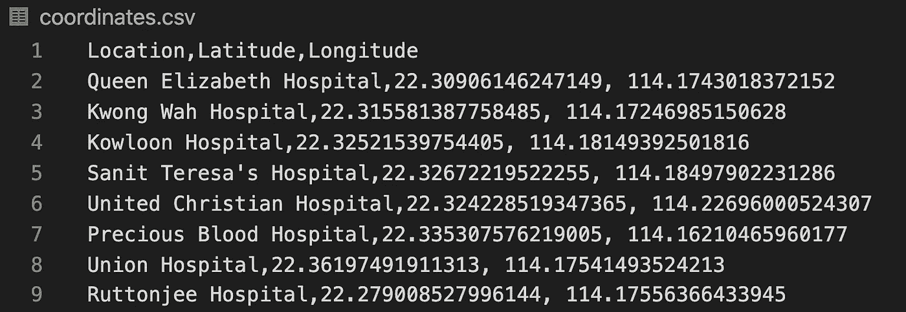
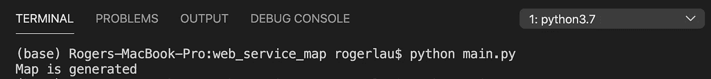
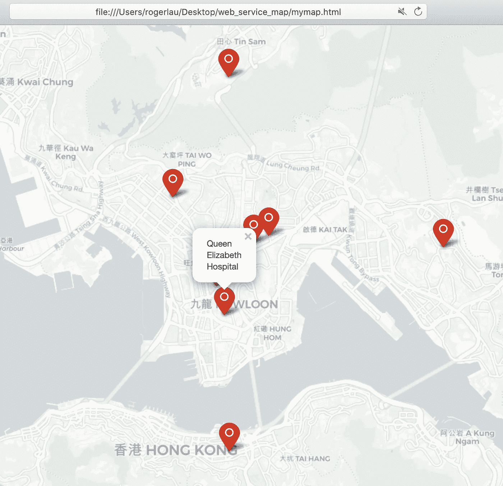
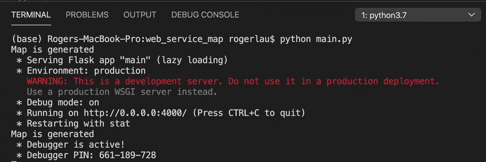
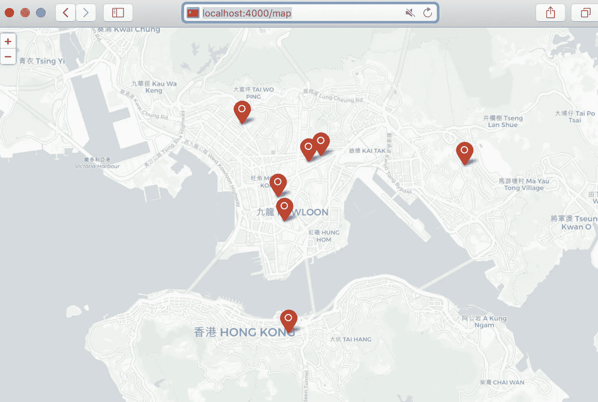

# 构建一个可视化地图数据的 web 服务

> 原文：<https://medium.com/analytics-vidhya/build-a-web-service-that-visualise-data-in-a-map-c8e36bd4e445?source=collection_archive---------6----------------------->


在 [Unsplash](https://unsplash.com?utm_source=medium&utm_medium=referral) 上由 [Brett Zeck](https://unsplash.com/@iambrettzeck?utm_source=medium&utm_medium=referral) 拍照

在这篇博客中，我将解释我是如何用浏览器将几个位置坐标可视化并显示在地图上的。

我将这个练习分为两个部分:

1.  演示如何使用 Python 包 folium 将坐标可视化为地图。
2.  使用 Flask 创建 restful API，Flask 是一个 python web 框架，一旦浏览器发出请求，它就会返回 html 文件或内容。

我们需要使用 pip 命令安装必要的软件包:

```
# python 2
pip install folium
pip install flask
# python 3
pip3 install folium
pip3 install flask
```

# **生成地图**

在动手之前，收集了一些香港医院的相关坐标，保存在一个 csv 文件中，如下图。我们需要纬度和经度来生成地图。



让我们从编写 main.py 开始:

```
import folium
import pandas as pd

def generate_map():
    df = pd.read_csv("coordinates.csv")

    my_map = folium.Map(
        # center: Hong Kong Space Museum
        location=[22.295403586726987, 114.17205382336623],
        tiles='cartodbpositron',
        zoom_start=13
    )
    df.apply(lambda row:folium.Marker(location=[row["Latitude"], row["Longitude"]], popup=row["Location"], icon=folium.Icon(color='red', prefix='fa fa-circle-o')).add_to(my_map), axis=1)
    my_map.save("mymap.html")

if __name__=="__main__":
    generate_map()
    print("Map is generated")
```

首先，导入 pandas 来加载 coordinates.csv 文件中的数据。然后，使用变量 my_map 创建地图，并将香港太空馆的坐标分配给用于标识地图中心的参数 location。参数 zoom_start 用于确定要显示的区域。数字越大，面积越小或越详细。最后，使用函数标记将所有坐标应用到对象 my_map，并将对象保存为 html 文件。

好吧。让我们尝试运行脚本。打开终端，导航到当前工作目录并运行它。



现在，您应该看到在当前目录中生成了一个文件名为“mymap.html”的文件。如果你用浏览器打开它，你会看到和下图一样的效果。



太好了。我们已经完成了生成地图的过程。

# 创建 web 服务

现在，我们应该考虑如何构建一个 web 服务来为浏览器提供 html 文件。我们将使用 Flask 中的 render_template 函数将 html 文件呈现给浏览器。

```
from flask import Flask, render_template
app = Flask(__name__)
```

我们将创建两个端点，一个用于检查状态，确保我的服务正在运行。另一个用于渲染文件。

```
@app.route("/", methods=["GET"])
def status():
    print("/")
    return "Status: OK"

@app.route("/map", methods=["GET"])
def map():
    print("/map")
    return render_template("mymap.html")
```

请注意，由于 render_template 函数将从文件夹模板中查找文件名，我们需要修改之前保存 html 文件的目录代码，方法是更改

```
my_map.save("mymap.html")
```

到

```
my_map.save("templates/mymap.html")
```

记住在当前目录中创建一个名为“templates”的文件夹。

最后，我们需要用下面的代码片段托管服务。

```
if __name__=="__main__":
    generate_map()
    print("Map is generated")

    app.run(host="0.0.0.0", port=4000, debug=True)
```

是时候再次测试它了。



我指定服务在端口 4000 运行。现在转到浏览器搜索栏，键入“localhost:4000/”，您应该看到“状态:正常”显示，这表明服务正在成功运行。之后再试试“localhost:4000/map”耶！！你成功地创建了一个简单的 web 应用程序，在地图上显示坐标。



耶！！你成功地创建了一个简单的 web 应用程序，在地图上显示坐标列表。

如果你想停止你的服务，只需按 Control + C 退出。

此外，如果不想保存 html 文件，可以将 map 对象转换为字符串并直接返回它。好处是不执行 I/O。

```
return(my_map.get_root().render())
```

完整代码:

```
import folium
import pandas as pd
from flask import Flask, render_template

app = Flask(__name__)

@app.route("/", methods=["GET"])
def status():
    print("/")
    return "Status: OK"

@app.route("/map", methods=["GET"])
def map():
    print("/map")
    return render_template("mymap.html")
    # return(my_map.get_root().render())

def generate_map():
    df = pd.read_csv("coordinates.csv")

    my_map = folium.Map(
        # center: Hong Kong Space Museum
        location=[22.295403586726987, 114.17205382336623],
        tiles='cartodbpositron',
        zoom_start=13
    )
    df.apply(lambda row:folium.Marker(location=[row["Latitude"], row["Longitude"]], popup=row["Location"], icon=folium.Icon(color='red', prefix='fa fa-circle-o')).add_to(my_map), axis=1)
    my_map.save("templates/mymap.html")

if __name__=="__main__":
    generate_map()
    print("Map is generated")

    app.run(host="0.0.0.0", port=4000, debug=True)
```

感谢你阅读这篇博客。

访问我的 GitHub 库[这里](https://github.com/Rogerlaulau/web-service-for-data-visualization)。