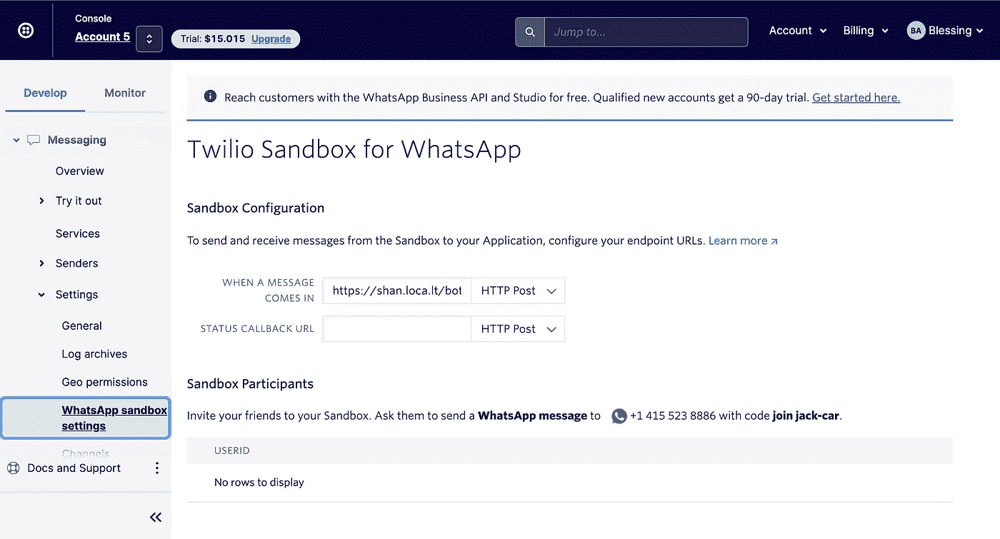

# 使用 Mantium & Twilio API，用 GPT 3 构建一个 WhatsApp 人工智能聊天机器人

> 原文：<https://medium.com/analytics-vidhya/build-a-whatsapp-ai-powered-chatbot-with-gpt-3-using-mantium-twilio-api-d4e40b6f0ed9?source=collection_archive---------0----------------------->

## 摘要

在本教程中，我们将构建一个 WhatsApp 人工智能机器人，能够进行对话式问答(QA)。与更常见的基于检索的聊天机器人相比，这种机器人是一种生成型聊天机器人。

为了创建这个机器人，我们将使用 Mantium 的 Python 库、Twilio WhatsApp API 和 Flask 框架。Mantium 应用程序/API 使我们能够获得生成性响应，因为它支持并提供对 OpenAI 的 GPT-3 模型的访问。

有什么问题吗？[加入 Mantium 的不和频道](https://discord.gg/SscDru7dFB)

下面是我们将在本教程结束时构建的内容。


# 介绍

聊天机器人是复制和处理书面或口头人类对话的应用程序，允许与数字设备进行交互，就像他们正在与真人交谈一样。您最近可能在浏览互联网网站时与聊天机器人进行了互动。你可能已经注意到，聊天机器人会以一种愉快的、非对抗性的方式自动吸引你，同时帮助你实现访问网站的目标。

聊天机器人已经在商业中得到了很好的应用，例如自动化客户交互、销售渠道等。他们变得越来越聪明。它们能够处理几乎人类水平的交互。

随着自然语言处理(NLP)领域的最新进展，OpenAI 在 2020 年开发了 GPT-3 模型，解决基于语言的任务(如生成和分类文本)变得更加容易。使用 Mantium 变得更加容易，因为它们提供了有效构建大型语言模型所需的开发支持。如果你想知道 OpenAI 的 GPT-3 模型是什么，它是 OpenAI 创建的第三代预测模型，它拥有 1750 亿个机器学习参数的容量。

使用 Mantium，我们将使用它来构建一个对话式 QA WhatsApp bot，只需几行代码。你不需要有扎实的机器/深度学习知识来构建 Mantium 的用例。

# 要求

要遵循本教程，您需要以下内容:

*   [一个 Mantium 账户](http://app.mantiumai.com)
*   [一个 OpenAI API 密钥](https://developer.mantiumai.com/docs/provider-api-keys#openai)
*   Twilio 帐户
*   烧瓶框架
*   本地隧道
*   拥有活跃 WhatsApp 账户的智能手机

# 使用 Mantium 应用程序进行提示设计

第一步也是最重要的一步是用 Mantium 应用程序设计提示符(对话文本生成任务)。提示设计是我们引导 GPT-3 模型给出有利的上下文响应的方式，因为它使我们能够提供文本输入并从模型中获得生成性响应。

把这想象成你在玩猜字谜游戏，你给玩家信息让他们猜出暗号。类似地，通过 GPT-3，我们为模型提供了足够的信息来识别训练提示中的模式。

要做到这一点，你不需要事先有深度学习的经验，几乎任何人都可以通过使用 [Mantium interactive UI](https://app.mantiumai.com/) 以无代码的方式来构建一个简单的文本应用程序。

我将把它分成你可以遵循的更简单的步骤。

## 步骤 1-注册一个 Mantium 帐户

访问[app.mantium.com](https://app.mantiumai.com/)网站创建免费账户。

## 步骤 2-连接您的 OpenAI API 密钥。

要通过 OpenAI API 访问 GPT-3 模型，您必须在 Mantium 应用程序上连接您的 OpenAI API 密钥。

点击`AI Providers`，粘贴你的 OpenAI，点击`Add API Key`。注意 Mantium 支持其他`AI providers`如 [Cohere](https://developer.mantiumai.com/docs/provider-api-keys#cohere) 、 [AI21](https://developer.mantiumai.com/docs/provider-api-keys#ai-21) ，你可以连接它们各自的`API keys`，但是对于本教程，我们用 OpenAI 的模型来构建。


在此连接您的 API 密钥

如果你没有任何`AI Providers`的 API 密匙，这里有[文档](https://developer.mantiumai.com/docs/provider-api-keys)告诉你如何获得一个。

## 步骤 3 —添加新提示

下一步是添加新的提示。导航到左侧边栏的`**AI Manager**`下拉选项卡，点击`**Prompts**`、并点击`**Add new prompt**`按钮，如下所示。


# 第 4 步—提示设计

在这里，我们将提供信息来构建我们的培训提示。

**答:基本信息**

让我们填写基本信息来识别我们的提示。请注意，您可以提供任何名称和描述。

提示名称—聊天机器人

描述——这是一个聊天机器人

**B .供应商**

在本教程中，我们使用 OpenAI API，从下拉列表中选择`OpenAI`。

**C. OpenAI 信息**

1.  **选择一个端点** —选择`Completion`端点。这个端点为模型提供一些文本，并生成一个文本补全，它试图适应所提供文本的上下文。
2.  **提示行** —这里我们将为模型提供示例，它将找出执行给定任务的模式。 ***见下图*** 我为我们的对话式 QA 生成任务设计的一个提示。
3.  **选择引擎**—open ai 引擎决定用于执行任务的语言模型。OpenAI 支持具有不同功能的各种模型。使用引擎来描述和访问这些模型。对于本教程，选择“达芬奇”引擎。

```
Human: Hello, who are you?
AI: I am an AI created by Blessing. How can I help you today?
###
Human: What is a language model?
AI: A language model is a statistical model that describes the probability of a word given the previous words.
###
Human: What is Cryptocurrency?
AI: A cryptocurrency (or “crypto”) is a digital currency that can be used to buy goods and services, but uses an online ledger 
with strong cryptography to secure online transactions.
###
Human: What country won the 2010 world cup?
AI: Spain
###
Human: How many pounds are in a kilogram?
AI: There are 2.2 pounds in a kilogram.
###
Human: When did the first airplane fly?
AI: On December 17, 1903, Wilbur and Orville Wright made the first flights.
###
Human: How can I learn swimming?
AI: There are many ways you can learn to swim. The first thing you can do is talk to your parents and ask if they know any instructors. You can also look online to find a class that you can take in your area.
###
Human:
```

将上述内容复制并粘贴到`Prompt Line`输入字段。

**D .基础设置**

在这里你将提供 OpenAI 模型的基本设置，见下图。


*   响应长度— 150
*   温度— 0.8
*   顶级 P-1
*   频率损失— 0.5
*   在场惩罚— 0.6
*   停止序列— ###

**基础设置说明。**

1.  响应长度——响应长度设置了 OpenAI API 在其完成中包含多少文本的限制。请注意您的响应长度，因为 OpenAI 是按令牌收费的，其中一个令牌大约是 4 个单词。最大令牌数控制您的完成时间长度，您的提示加完成加起来不能超过 2，049 个令牌。对于这个例子，在 Mantium 应用程序上，输入`150`作为你的响应长度。
2.  温度& Top P —温度控制响应的随机性；这是最重要的设置之一，因为它会显著影响输出。如果你想要更多创造性的完成，或者如果你想让模型偏离正题，提高温度。如果您希望模型遵循说明或保持真实，请降低温度。注意，如果改变温度，建议不要改变 top_p，因为它默认为 1。将值设置为`0.8`
3.  频率惩罚—这可以防止单词重复。如果你注意到一个模型的输出在重复同一个单词，你想让它停止重复同一个单词，增加`frequency_penalty`
4.  在场惩罚——在场惩罚防止主题重复。如果您注意到一个模型的输出停留在一个特定的主题上，并且您希望它谈论其他的东西，那么尝试增加 presence_penalty
5.  停止序列—停止序列是一组字符，指示 API 停止生成令牌。

**高级设置**

在本教程中，我们可以将高级设置保留为默认值。


关于这些设置的更多信息，你可以阅读 Mantium 的这个[教程。](https://developer.mantiumai.com/docs/using-mantium-for-employee-onboarding)

# 步骤 5 —测试提示结果

在 Mantium 应用程序上，我们将使用输入字段来测试我们的提示。看到下图，我问了这个问题`How can I learn Machine Learing?`，得到了一个有趣的回答。(见下文)

填写输入字段，并点击`Test run`按钮。


试验结果

恭喜你完成了第一步，也是必不可少的一步。请注意，您可以通过使用 Mantium API/Client Library 用代码完成上面的步骤，但是我选择解释无代码方法是为了让您首先理解并轻松调试。

[通过 Mantium 的部署功能](https://developer.mantiumai.com/docs/using-mantium-for-employee-onboarding#share-using-the-one-click-deploy-feature)，你可以快速生成一个单页应用程序，并与你的朋友分享，以测试你的聊天机器人，但我们打算创建一个 WhatsApp 应用程序。因此，在后续步骤中，我们将使用 Mantium 的客户端库获取该提示，并将其与 Python 中的 Twilio WhatsApp API 集成。

# 配置 Twilio WhatsApp 沙盒

在本教程中，我们将使用 Twilio WhatsApp 沙盒，在这里开发和测试我们的 chatbot 应用程序。

## 步骤 1 —创建帐户

创建一个 Twilio 账户，并访问 [Twilio 控制台](https://www.twilio.com/console)，点击`Explore Products`并选择`Messaging`。

## 步骤 2 —设置沙盒

导航到侧边栏，在信息和设置下，选择`WhatsApp sandbox settings`。



通过向分配给你的帐户的号码发送带有给定代码的 WhatsApp 消息来连接你的沙盒。Twilio 将发送一个回复，说明您的沙盒已经设置好了，您可以通过在 WhatsApp 上发送“Hello”来完成双向设置。

请注意，您可以将分配给您的帐户的号码共享给其他人连接，并在沙箱中测试您的应用程序。

最后一步是配置沙箱，我们将回到这一步。

# 让我们来建造聊天机器人！

在这里，我们将编写 Python 代码来构建 WhatsApp 聊天机器人。这个过程很简单。我们将用几行代码开发和测试我们的应用程序。我们将接受用户输入(您的 WhatsApp 传入消息)，通过 Mantium execute prompt 方法将消息作为输入传递，该方法将这个请求发送给模型并返回一个响应。Twilio 处理这个响应，并在 WhatsApp 上作为回复返回。

如果你仍然不清楚我们想要达到的目标，请看下图。


**我们来写点代码吧！**

## 步骤 1-设置 Python 虚拟环境。

使用下面的命令创建一个 Python 虚拟环境。

```
$ mkdir whatsapp-bot
$ cd whatsapp-bot
$ python -m venv whatsapp-bot-venv
$ source whatsapp-bot-venv/bin/activate
```

之后，在`whatsapp-bot`文件夹的根目录下创建一个名为`app.py`的文件。

## 步骤 2 —设置 Mantium 的客户端库

Mantium 提供了一个 [Python 客户端库](https://github.com/mantiumai/mantiumclient-py)来改善开发者的体验，我们将在本教程中使用它。

**安装**

使用下面的命令，安装 Python 客户端库。

```
pip install mantiumapi
```

**认证**

在这里，您将通过在环境变量中提供您的登录凭证来进行身份验证。

使用下面的命令，安装`python-dotenv`

```
pip install python-dotenv
```

之后，创建一个`.env`文件来存储您的凭证。输入您的登录凭证，如下所示。

```
MANTIUM_USER='youremail.com'
MANTIUM_PASSWORD='your-password'
```

在`app.py`中，您将使用下面的代码来验证您的 Mantium 帐户并创建一个提示。注意，我导入了 Mantium `prompt`方法，稍后会详细介绍。

这里是到 Mantium GitHub 库的链接。如果你感兴趣，你可以为图书馆的发展做出贡献。

## 步骤 3 —用 Flask 框架设置 Webhook

**安装**

这里我们需要安装 Flask 框架来创建 web 应用程序，并安装 Twilio Python Helper 库来使用 Twilio APIs。

```
pip install twilio flask
```

现在让我们用 Flask 框架建立一个 webhook。我们将创建一个监听`POST`请求的端点，当`Twilio`收到传入消息时，它们将调用这个端点。函数体处理输入消息，并在 Mantium 执行输入后提供响应。

这里是一个入门模板，在这里我们将输入`bot`函数的主体。

## 步骤 4——向 Mantium 发送输入，并返回响应。

让我解释一下上面的代码。

输入消息——获取用户的 WhatsApp 输入消息

```
incoming_msg = str(request.values.get('Body', '').lower())
```

你需要你的提示 ID。记住我们在上面创建的提示。我们去拿身份证。最简单的方法是使用`prompt editing page`的 URL。看下面的链接，最后一个字符串是你的提示 ID。

```
https://app.mantiumai.com/ai-manager/prompt/{prompt_id}
```

使用`from_id`方法，从 Mantium 中检索提示。

```
qa_prompt = prompt.Prompt.from_id('<your-prompt-id>')
```

**执行输入并得到结果**

在这里，我们将提示发送到 OpenAI API 端点，我们将从 GPT-3 模型获得响应。您需要刷新，因为这是异步完成的以获得结果。

```
result = qaPrompt.execute(incoming_msg)
result.refresh()
prompt_result = str(result.output)
```

## 步骤 5 - Twilio 消息和响应

Twilio 期望 webhook 以 TwiML 或 Twilio 标记语言(一种基于 XML 的语言格式)给出响应。有了 Twilio helper 库，我们可以轻松地创建这个响应，而不必直接创建 XML。下面解释了我们如何做到这一点。

```
from twilio.twiml.messaging_response import MessagingResponse

resp = MessagingResponse()
msg = resp.message()
msg.body('this is the response text')
```

# 把所有东西放在一起

这是完整的代码

# 测试聊天机器人。

## 步骤 1 —运行`app.py` 文件

运行下面的命令来启动聊天机器人，它将在本地机器的端口 5000 上运行。见下图。


```
python app.py
```

## 步骤 2 —本地隧道

Localtunnel 是一个简单的工具，它提供一个可公开访问的 URL，将每个请求重新路由到本地运行的服务。它向外界公开了我们的本地主机，以便于测试和共享，我们需要将 URL 连接到 Twilio(还记得我们在配置 Twilio 沙箱时跳过的步骤)。

您可以在初始终端旁边创建另一个终端，并安装 Localtunnel 工具。使用下面的命令，并确保安装了 [NPM。](https://docs.npmjs.com/downloading-and-installing-node-js-and-npm)

```
npm i localtunnel
```

在这之后，运行下面的命令，下面的浏览器窗口会自动弹出。我可以看到应用程序正在工作。

请注意，我的应用程序正在端口`5000`上运行

```
lt --port 5000 --subdomain shan --local-host "127.0.0.1" -o --print-requests
```


## 步骤 3-配置 Twilio 沙箱

在 Twilio 控制台上，将下面的 URL 粘贴到`WHEN A MESSAGE COMES IN`字段，因为我们的聊天机器人显示在`/bot` URL 下。之后，点击`Save`按钮。

网址—[https://shan.loca.lt/bot](https://shan.loca.lt/bot)


## 步骤 4 —发送和接收消息

现在，配置已经完成，服务器正在运行，是时候测试聊天机器人了。

这里，我决定问一些随机的问题，因为我没有为特定的用例设计提示。见下图。

您可以看到，我们得到了不在提示中的响应。


# 用 Mantium 测井

您可以使用 Mantium 的`Log`功能来检查您的提示的输出和状态。当你的 WhatsApp 信息没有得到任何回复时，这就派上用场了。

导航至左侧的`Monitoring`选项卡，点击`Logs`。


# 结论

虽然我没有为任何特定的用例设计提示，但我的目的是展示大型语言模型(LLM)的可能性，以及如何使用与 Twilio 的 API 集成的 [Mantium API](https://developer.mantiumai.com/reference) 来构建一些有趣的东西。有许多方法可以让你旋转这个教程来构建定制用例；例子包括但不限于智能客服机器人、虚拟人工智能助手等。

我希望这篇教程对你有所帮助，并且你已经了解了如何使用 Mantium &大型语言模型。如果你有什么想法，你可以通过 [LinkedIn](https://www.linkedin.com/in/bdetoye/) 联系我

有什么问题吗？[加入 Mantium 的不和频道](https://discord.gg/SscDru7dFB)