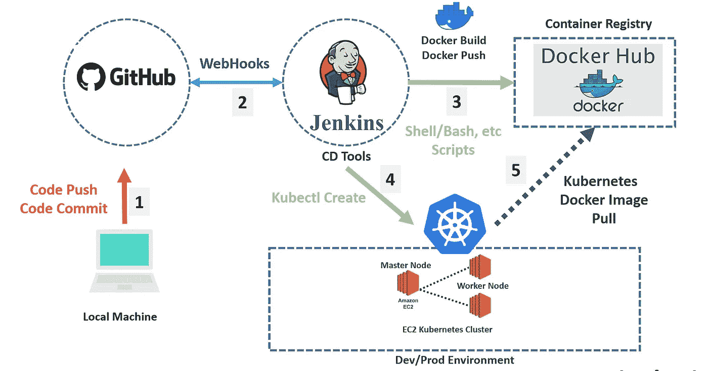
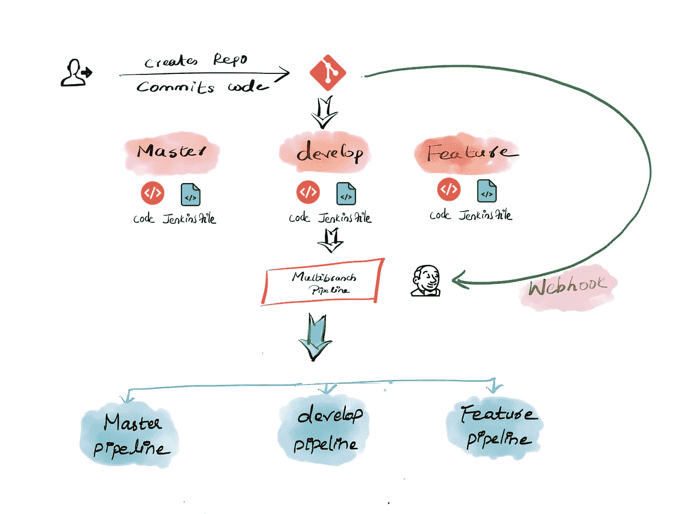

# 构建 Docker 映像并将其部署到 Jenkins + Kubernetes 集群

> 原文：<https://medium.com/analytics-vidhya/build-and-deploy-a-docker-image-to-jenkins-kubernetes-cluster-7531d524763b?source=collection_archive---------0----------------------->

许多组织使用 Docker 作为在所有机器上统一构建和测试环境的主要工具，为部署应用程序提供了有效的机制。

来源:https://ikarimov.com/img/pipeline.jpg

让我们从詹金斯开始。为了通过 Jenkins 管道构建和部署 Docker 映像，我们需要安装插件 [***Docker 管道插件。***](https://www.jenkins.io/doc/book/pipeline/docker/)

Docker Pipeline 插件提供了一个`build()`方法，用于在管道运行期间从存储库中的`Dockerfile`创建新的映像。

# 一旦安装。我们开始吧

在 Jenkinsfile 的 Stages 部分中，测试完应用程序后，我们可以继续构建和推送 Docker 映像:

*使用自定义注册表:*

默认情况下，Docker 管道集成采用 Docker Hub 的默认 Docker 注册表。

下一步是在我们的 Kubernetes 集群中部署它。Kubernetes 提供了几种更新资源的方法:应用、编辑、修补和替换。

当您想要更新资源时，最好默认为修补它。

此外，您还可以在部署前登录集群，并避开该行:****-s＄Cluster _ URL—TOKEN＄TOKEN _ Cluster—unsecured—skip—TLS—verify****

*在幕后，kubectl apply、edit 和 patch 命令都使用 PATCH HTTP 请求方法来更新现有资源。在这种情况下，部署将终止旧的 pod 并创建新的 pod。*

*要完成它，建议使用一个作业多分支来管理具有不同环境的集群，并能够在每个环境中部署相应的容器。*

**

*来源:[https://devops cube . com/Jenkins-multi branch-pipeline-tutorial/](https://devopscube.com/jenkins-multibranch-pipeline-tutorial/)*

*贝尔纳奥拉·马丁*