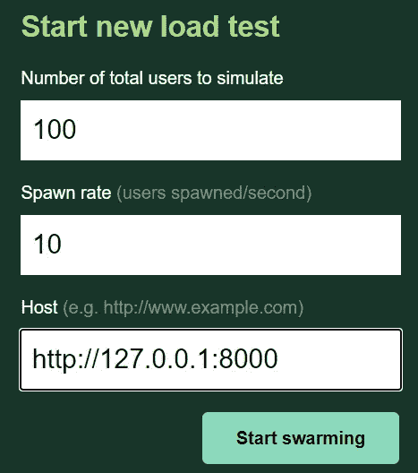
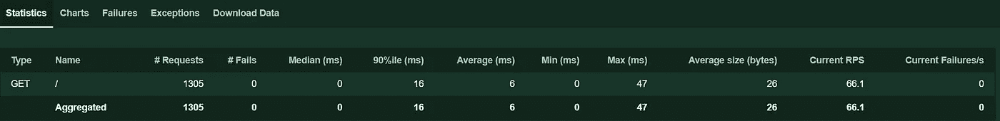

# 用 Python 构建和测试高性能 web 应用程序

> 原文：<https://medium.com/analytics-vidhya/build-and-test-high-performance-web-app-in-python-916a63d4df4e?source=collection_archive---------7----------------------->

## 在本文中，我们使用 Uvicorn 构建了一个简单的应用程序，并使用 locust 框架执行了负载测试

> **留在最后，获得如何扩展服务器以在多核上运行的奖励**


# 紫玉米

Uvicorn 是一个快如闪电的 ASGI 服务器实现，使用了 [uvloop](https://github.com/MagicStack/uvloop) 和 [httptools](https://github.com/MagicStack/httptools) 。

# 蝗虫

开源负载测试工具。用 **Python** 代码定义用户行为，让数百万用户同时涌入你的系统。

**设置**

```
|Application
   ->| -server.py
   ->| -test.py
   ->| -User1.py
   ->| -USer2.pyServer.py will contain our server code
test.py will contain locust test configuration
User1 and User2.py are to simulate dummy usersInstall required Libraries
pip install uvicorn
pip install locust
```

继续将这段代码粘贴到 server.py 中

这可能看起来比通常的 python 代码要大，但是不要担心，让我们来分解它

```
we have two methods
fastFact() => returns result imdeitaly
slowfactFact() => returns result 5 sec later
This are the methods will be invoked by clientapp() => is the starting point of our program which handels request from client and send response back to clienthere most of the thing is boilerplate code
Important lines are:
line (18-19) we geting request body and converting into dict.
line(20) geting result from factorial method (slow/fast)
line (30) converting result into bytes and sending them back to client.Run this program using 
uvicorn server:app 
```

现在我们的服务器正在运行，让我们用客户端打开 user1.py 测试一下，然后粘贴下面的代码

这里没有什么特别的，我们只是发送 get 请求并检查响应，你可以改变方法为慢或快。打开新的终端/cmd 运行

```
python user1.py
```

现在我们的客户端和服务器已经设置好了，让我们为负载测试设置一个 locust 框架，打开 test.py 并粘贴下面的代码

```
locust framework will spawn n user and execute callFast() for all those users for usStart two cmd
In first cmd run command it will start our server
uvicorn server:app --no-access-log--no-access-log => will disable logging in console other wise server console will be filled with logsin second terminal run
locust -f test.py It will start locust framework
open browser and go to localhost:8089 
you will see you like below
```



这里，locust 框架从 100 个用户开始负载测试，在我们的主机服务器上每秒产生 10 个用户。之后，点击开始蜂拥而至



你会看到这样的东西，这是服务器上的负载测试报告。单击图表，它将以图形格式显示其他详细信息

# 奖金

> **如何扩展服务器以在多核上运行？**

为了理解为什么我们需要我们的服务器在多核上运行

**执行以下步骤:**

打开 User2.py 并粘贴到代码下方

```
Open 3 terminal/cmdIn first cmd
run server 
uvicorn server:app In second cmd
run second client this will invoke slow calculation method
python User2.pyIn third cmd
run first client this will invoke fastcalculation method
python USer1.py
```

您会注意到，运行 User2 后，结果在 5 秒钟后返回，如 slow 方法中所述，但是 User1 也必须等待 5 秒钟，因为服务器正忙于执行 User2 任务。这是我们不想要的。

为了解决这个问题，我们将利用系统中可用的多个内核，以便服务器可以并行执行多个请求。幸运的是，使用 Uvicorn 很容易实现，我们只需要在启动服务器时传递 worker 参数

```
So now the server invocation command looks like this 
uvicorn server:app --workers 4 (no of avilable cores in system) 
```

再次尝试上述场景，你会注意到用户 1 立即得到回复，用户 2 在 5 秒后得到回复。

## 结论

在本文中，我们学习了如何使用 Uvicorn sever 框架在 python 中设置 ASGI 服务器，并对应用程序执行真实测试，以及如何在多个内核上扩展应用程序。

敬请关注未来的帖子，我们将看到更多这方面的高级用例，如如何正确实现 async/await 以使服务器更加健壮和无阻塞，以及使用 celery 框架进行后台处理等。

谢谢你，快乐编码