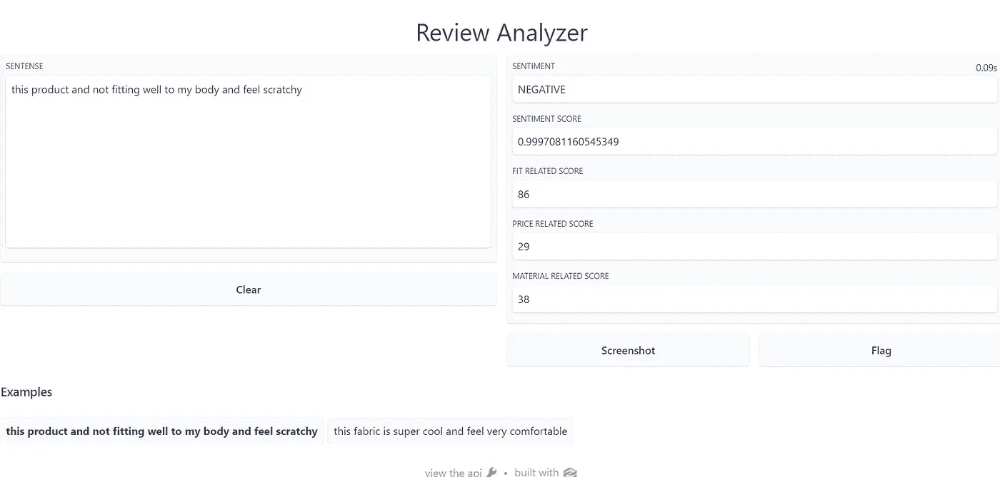

# 使用 Gradio 为 ML 模型构建应用程序

> 原文：<https://medium.com/analytics-vidhya/build-apps-for-ml-models-with-gradio-6350e567f83c?source=collection_archive---------2----------------------->

## 使用 Gradio 构建一个应用程序来分析您的消费者评论。


有一大堆消费者评论，却不知道该怎么办？

难道你不喜欢快速分析你的消费者评论并从中产生见解，并与他人分享应用程序吗？

有了 Gradio，你可以用五行代码自己完成。

让我们开始工作吧。

在这个练习中，我们将使用情感分析和自定义分类，并使用 Gradio 作为交互式应用程序快速部署。

你可以在这里找到我关于建立这个机器学习模型的详细文章

[](https://malakagunawardena.medium.com/practical-analysis-of-consumer-reviews-part-i-a575c05d7c64) [## 消费者评论的实践分析——第一部分

### 消费者评论的文本分析|超越情感分析

malakagunawardena.medium.com](https://malakagunawardena.medium.com/practical-analysis-of-consumer-reviews-part-i-a575c05d7c64) 

让我们从变形金刚中快速加载预先训练好的情感模型

```
from transformers import pipeline
sentiment=pipeline("sentiment-analysis")
```

下一步是创建名为*“方面”*的评分函数，使用自定义分类器进行预测，输入为文本，五个输出为情感以及适合度、价格和材料的分数。

```
def aspects(sentense):
    sentense=[sentense]
    sentimentdata=sentiment(sentense)
    fit_score=process.default_scorer(sentense,fit)
    mat_score=process.default_scorer(sentense,material)
    price_score=process.default_scorer(sentense,price)
    sentimentlabel=sentimentdata[0].get("label")
    sentprobability=sentimentdata[0].get("score")

    return  sentimentlabel,sentprobability,fit_score,price_score,mat_score
```

现在我们带来格拉迪欧

Gradio 是操作机器学习模型的简单而强大的框架。

[](https://gradio.app/) [## 格拉迪欧

### 🎉我们要加入拥抱脸！在这里阅读我们的公告。🤗Docs 构建并分享令人愉快的机器学习应用程序…

gradio.app](https://gradio.app/) 

让我们安装和导入 Gradio 到我们的笔记本电脑

```
!pip install gradio
import gradio as gr
```

Gradio 的主要方法是创建一个界面和启动界面。

让我们用 python 函数(评分函数)输入、输出和可选参数(如标题、实况(提交前更新输出)、示例输入创建接口，以提供更好的 UX。

一个输入:消费者评论

五个输出:情感标签、情感、契合度相关评分、价格相关评分、材料相关评分。

```
interface=gr.Interface(fn=aspects,inputs=gr.inputs.Textbox(lines=10,placeholder="please insert your text"),
examples=[
          ["this product and not fitting well to my body and feel scratchy"],
        ["this fabric is super cool and feel very comfortable "]

    ],
    title="Review Analyzer",
                       outputs=[gr.outputs.Textbox(type="auto", label="Sentiment"),
                                gr.outputs.Textbox(type="auto", label="Sentiment score"),
                                gr.outputs.Textbox(type="auto", label="Fit related score"),
                                gr.outputs.Textbox(type="auto", label="Price related score"),
                                gr.outputs.Textbox(type="auto", label="Material related score")],live=True)interface.launch()
```

您可以看到您的应用程序在本地主机上运行…



让我们用 https://huggingface.co/spaces 的[快速部署这个](https://huggingface.co/spaces)

您可以手动创建 app 文件和 requirement.txt 文件，如下所示

```
import gradio as gr
from transformers import pipelinedef aspects2(sentense):
 fit = ['fit','fitting','small','too','tight','large','lose','confortable','stretchy','tailored','strappy']price =['expensive','price','cheep','bucks','buy','sell','purchase','too','price','cost','amount','buks']material=['strech','material','fabric','composition','feel','premium'] sentense=[sentense]
 sentimentdata=sentiment(sentense)
 fit_score=process.default_scorer(sentense,fit)
 mat_score=process.default_scorer(sentense,material)
 price_score=process.default_scorer(sentense,price)
 sentimentlabel=sentimentdata[0].get(“label”)
 sentprobability=sentimentdata[0].get(“score”)

return        sentimentlabel,sentprobability,fit_score,price_score,mat_score
```

requirement.txt

```
1torch
2transformers
3fuzzywuzzy
```

你可以复制你的应用程序的网址并与任何人分享。

有用的链接

[](https://gradio.app/docs/) [## Gradio 文档

### 🎉我们要加入拥抱脸！在这里阅读我们的公告。🤗如果您刚刚开始使用 Gradio，请参阅…

gradio.app](https://gradio.app/docs/)