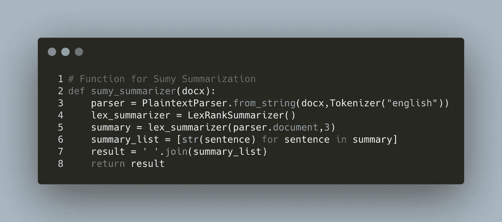
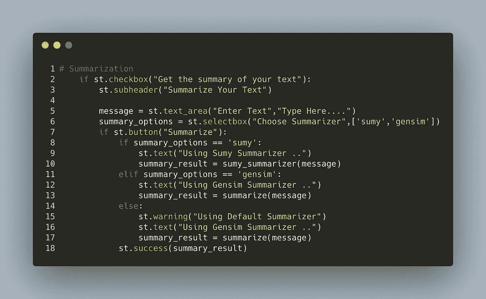

# 使用 Spacy、Streamlit 和 Heroku 构建和部署自然语言处理(NLP)应用程序

> 原文：<https://medium.com/analytics-vidhya/build-deploy-a-natural-language-processing-nlp-app-with-spacy-streamlit-and-heroku-54e78468fad0?source=collection_archive---------1----------------------->

## P 艺术一:如何用 Streamlit、Spacy、TextBlob、Gensim、Sumy 构建自然语言处理应用

T 这是关于如何构建和部署自然语言处理(NLP)应用的 2 部分教程的第一部分。在本教程中，我们将构建一个对基本自然语言处理任务有用的应用程序，如标记化、词条化、命名实体识别(NER)、情感分析器和文本摘要。

对于标记化和命名实体识别，我们将依赖于神奇的空间库。TextBlob 是一个简单而强大的情感分析包，提供情感的极性和主观性，将用于我们的情感分析。此外，对于文本摘要，我们将使用 Gensim 和 Sumy。最后，我们将使用 Streamlit 为我们的 NLP 应用程序增添一些光彩。让我们开始派对吧！

NLP 应用程序

**术语、概念和包装的定义**

让我们从我们将在本教程中使用的重要术语、概念和包的简洁定义开始。

自然语言处理(NLP): 使用自然语言处理(NLP)可以增强计算机解释人类语言的能力。在人工智能的这个分支中，机器和人通过自然语言进行交互。语言阅读、解码、理解和解释是自然语言处理的最终目标。为了从人类语言中提取意义，大多数 NLP 技术依赖于机器学习。

**标记化:**标记化是将短语、句子、段落或整个文本文档分解成更小部分的过程，例如单个单词或短语。令牌是这些较小单元的名称。
单词、数字或标点符号都可以用作记号。标记化通过定位单词边界来创建更小的单元。单词边界是一个单词的结束和下一个单词的开始。这些记号被认为是词干化和词元化的初步步骤。

**词干化&词干化:** **词干化**是一种原始的启发式程序，它切断单词的结尾，希望在大多数情况下成功地将一个单词简化为常见的基本形式，它经常包括去除派生词缀。**词汇化**通常是指通过使用词汇和单词的形态学分析来正确地做事情，目标是只删除屈折词尾，返回单词的基本形式或词典形式，这就是所谓的词汇。当遇到标记 saw 时，词干化可能只返回 s，而词汇化可能返回 see 或 saw，这取决于该标记是用作动词还是名词。

**命名实体识别:**命名实体识别是一种自然语言处理技术，可以自动扫描全文，提取文本中的一些基本元素并进行分类。通俗地说，命名实体识别就是从文本中提取命名实体的过程，比如人名、地名、公司名等等。

**情感分析:**情感分析(也称为观点挖掘)是一种自然语言处理技术，用于确定输入是积极的、消极的还是中性的。它基本上包括分析和确定一篇文章、演讲或任何其他形式的交流背后的情感或意图。

**TextBlob:** 这是一个用于处理文本数据的 Python (2 和 3)库。它提供了一个简单的 API，用于深入研究常见的自然语言处理(NLP)任务，如词性标注、名词短语提取、**情感分析**、分类、翻译等等。更多内容请访问 [*官方文档网站*](https://textblob.readthedocs.io/en/dev/)

**SpaCy** : spaCy 是一个用于高级自然语言处理(NLP)的 Python 库。它是免费和开源的。更多内容请访问 [*官方文档网站*](https://spacy.io/usage/spacy-101)

Sumy :一个简单的库和命令行工具，用于从 HTML 页面或纯文本中提取摘要信息。此外，该计划包括一个简单的文本摘要评估框架。更多[阅读*这里*这里](https://pypi.org/project/sumy/)

Gensim :这是一个用于大型语料库主题建模、文档索引和相似性检索的 Python 库。目标受众是自然语言处理(NLP)和信息检索(IR)社区。在这里阅读更多

***Streamlit** : Streamlit 是一个开源的 Python 工具包，用于为机器学习和数据研究创建和共享漂亮、独特的 web 应用。您可以在几分钟内创建和部署复杂的数据应用程序。在这里阅读更多*

**唷！那是一篇很长的✍️作品**

**现在，让我们进入技术层面，从第 0 行开始构建我们的 NLP 应用程序😎**

**软件包的安装**

****

**重要的包裹。在终端上运行每一行**

**现在我们已经安装了所有重要的包，让我们创建一个包含所有应用程序代码的 *app.py* 文件。要查看 app.py 的内容输出，我们将在终端中运行***streamlit run app . py***。👨‍💻**

****

**让我们导入所有需要的包。您可以在文本编辑器中键入代码片段中的所有代码。**

****

**导入所需的包**

**现在我们已经导入了包，让我们继续定义将在 streamlit 的 main()函数中使用的函数。**

**我们将定义的第一个函数是文本摘要函数 *sumy_summarizer()* 。**

****

**使用 Sumy 库进行总结**

**接下来，让我们定义一个函数 *text_analyzer()* ，它将被调用来分析文本输入并返回词条和标记。我们将在这个函数中利用 Spacy 库的能力。**

****

**记号和引理的函数**

**注意**line 2 @ ST . cache**-Streamlit 有一种缓存技术，可以确保您的应用程序即使在从 web 加载数据、处理海量数据集或进行昂贵的计算时也能保持高性能。这是通过使用 [@st](http://twitter.com/st) 完成的。缓存装饰器。当你使用 [@st](http://twitter.com/st) 时。函数上的 cache decorator，它通知 Streamlit 无论何时调用该函数，它都需要验证某些事情:**

1.  **用来调用函数的输入参数**
2.  **函数值中使用的任何外部变量**
3.  **函数的主体**
4.  **在缓存函数中使用的任何函数的主体。**

**如果这是 Streamlit 第一次以这种精确的组合和顺序看到这四个组件的确切值，它将执行该函数并将结果保存在本地缓存中。如果下次调用缓存的函数时这些组件都没有改变，Streamlit 将简单地避免执行该函数，而是返回以前保存在缓存中的输出。在这里阅读更多**

***我们的 NLP 应用程序的另一个功能是命名实体识别。让我们定义一个函数 *entity_analyzer()* 来帮助提取文本数据中的实体。同样，我们将在这个函数中利用 SpaCy 的强大功能。***

****

**NER 的功能**

**太好了！我们已经定义了所有重要的函数。现在，让我们定义一个 *main()* 函数，在这里我们将放置所有的逻辑并调用这些函数。**

****

**main()函数**

****

**在上面的代码片段中，我们使用 streamlit 库的 title、subheader 和 markdown 方法来声明应用程序的标题、subheader 和 markdown。这几行代码产生了下面的内容👇**

****

**现在，让我们为 summarizer 特性编写代码。这将为 Sumy summerizer 调用我们的 *sumy_summarizer()* 函数，并为 gensim summerizer 调用我们从 Gensim 导入的*summarize()*函数。**

****

**接下来是我们的情感分析器。这是我们将利用 TextBlob 的力量的部分。参见⬇️下面的片段**

****

**越来越有意思了吧？我打赌是！😎Streamlit 非常直观，易于使用。请务必查看[官方文档](https://docs.streamlit.io/en/stable/index.html)，了解更多关于这个强大工具的信息。**

**好了，让我们为命名实体识别位编写代码。这是我们将调用我们的实体 *_analyzer()* 函数的部分。这个函数接受一个文本，并返回一个包含单词及其命名实体的响应。参见片段👇**

****

**现在，让我们为记号赋予器写代码。这部分我们将调用我们的 *text_analyzer()* 函数。**

****

**这还不是全部，让我们通过添加侧边栏来美化我们的 web 应用程序。在 streamlit 中实现侧边栏功能非常容易。参见下面的代码片段👇**

****

**仅此而已！继续运行 app.py，在浏览器中查看功能强大的应用程序。**

**在本教程的第二部分，我将指导您使用 Github 和 Heroku 将第一个 NLP 应用程序部署到云的端到端过程。请注意第 2 部分！**

**你可以在我的 [GitHub 库](https://github.com/lekanakin)上访问本教程使用的所有代码。**

**您可以通过此链接与实时应用程序进行交互:[https://nlpapps.herokuapp.com](https://nlpapps.herokuapp.com)**

**感谢阅读！**