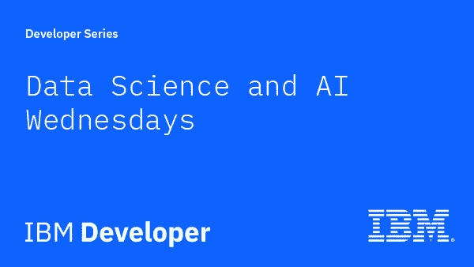
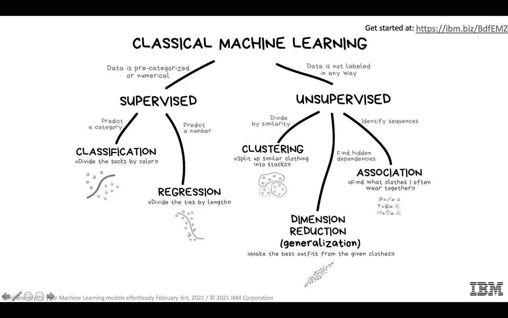
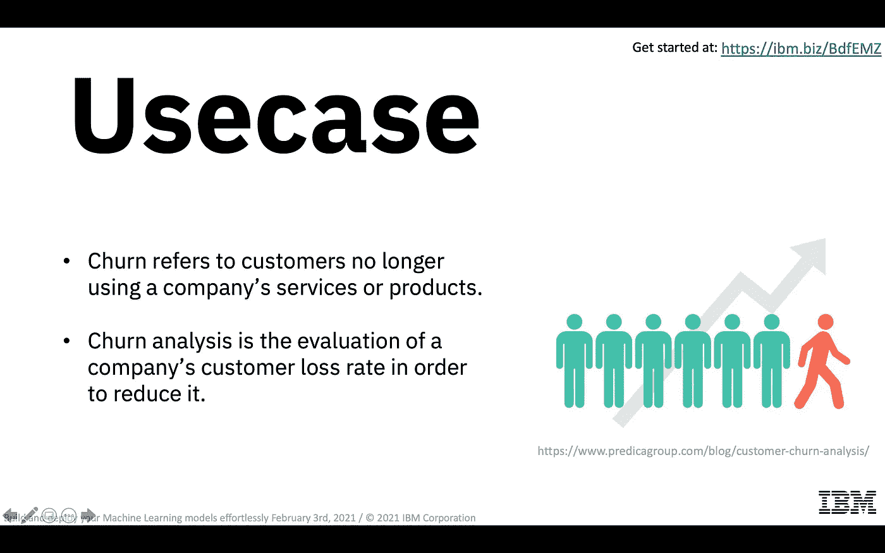
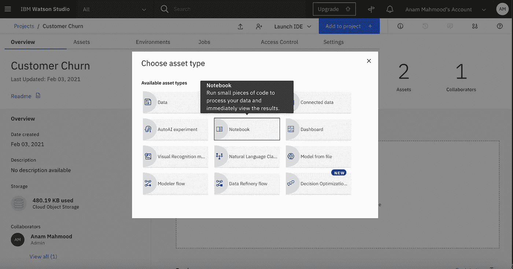
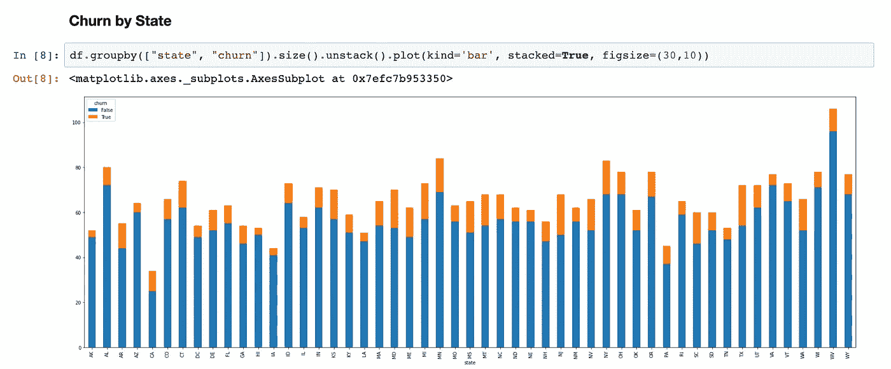
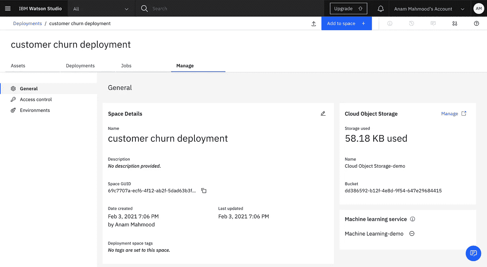
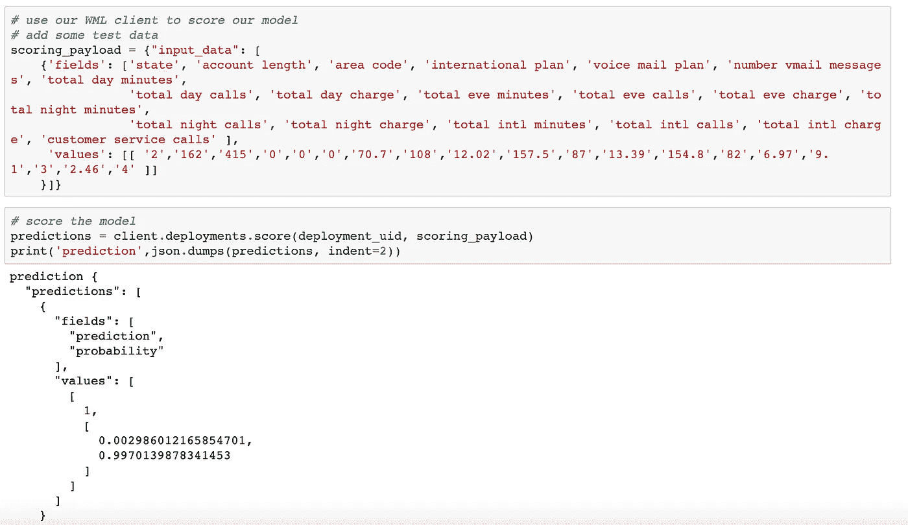

# 轻松构建和部署您的机器学习模型

> 原文：<https://medium.com/analytics-vidhya/build-deploy-your-machine-learning-models-effortlessly-2544547ba256?source=collection_archive---------27----------------------->

数据科学和人工智能周三，IBM 开发人员

IBM 开发人员支持者 Anam Mahmood 和 Sidra Ahmed 在 2 月 3 日举办了一次研讨会。他们的目标是展示每个人如何在 IBM Watson Studio 中轻松使用 Jupyter 笔记本来运行处理数据的小段代码，并在交互式环境中立即向您显示计算结果，以及快速构建机器学习模型。

会议分为两部分。研讨会的前半部分由 Sidra 主持，她欢迎观众并谈论了议程。然后，她向他们解释了数据科学、人工智能、机器学习和深度学习。

什么是数据科学

接下来，她概述了经典的机器学习算法，解释了监督学习和非监督学习。然后她详细讲述了分类算法，

1.  逻辑回归
2.  k-最近邻(KNN)
3.  决策树
4.  随机森林

经典的机器学习算法

会议的后半部分由 Anam Mahmood 主持。本部分包括一个实践演示，演示如何使用 IBM Cloud 上的 Watson Studio 在 Jupyter 笔记本上轻松构建和部署您的机器学习模型。

Anam 首先解释了客户流失分析用例。

客户流失是指客户不再使用公司的服务或产品。

客户流失分析用例

然后，她带他们浏览了 IBM Cloud dashboard，并向他们展示了如何创建服务。

1.  创建一个 IBM 云对象存储服务。
2.  创建一个 IBM Watson Studio 项目。
3.  提供 IBM 云服务。
4.  上传数据集。
5.  创建 API 密钥

然后，她向他们展示了如何创建部署空间并从 URL 添加笔记本。一旦一切都设置好了，我们就运行笔记本，并使用 pandas 将数据作为数据框导入。然后，她带着他们浏览笔记本，向观众解释不同的算法和可视化。

将笔记本添加到 Watson Studio 项目中

按州划分的变动

最后，她向他们展示了如何将笔记本电脑部署到 IBM Cloud，并轻松测试他们的模型。

获取部署空间空间 ID 以部署您的笔记本

测试您的模型

与会者对研讨会反应积极，并给予了积极的反馈。

资源:

*   事件记录:[https://www.crowdcast.io/e/build-deploy-ml](https://www.crowdcast.io/e/build-deploy-ml)
*   动手实验:[https://github . com/Anam-Mahmood/Watson-studio-learning-path-assets](https://github.com/Anam-Mahmood/watson-studio-learning-path-assets)
*   幻灯片:[https://www . slide share . net/anammahmood 10/build-and-deploy-your-machine-learning-models-effortly-2](https://www.slideshare.net/AnamMahmood10/build-and-deploy-your-machine-learning-models-effortlessly-2)
*   IBM 开发者 Jupyter:[https://developer.ibm.com/components/jupyter/](https://developer.ibm.com/components/jupyter/)