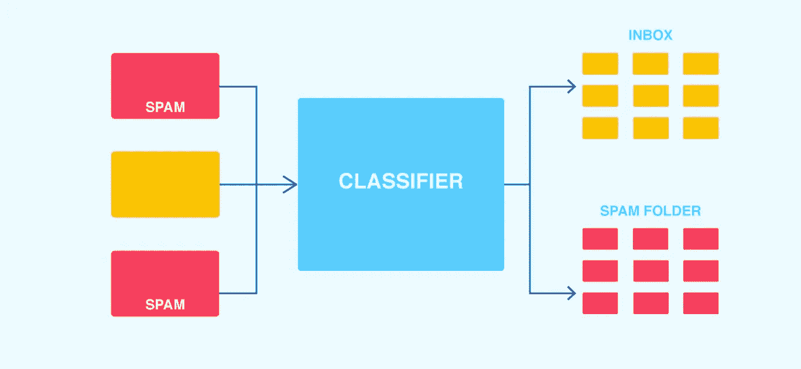
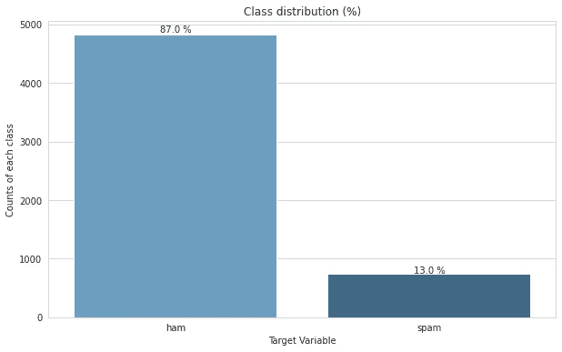
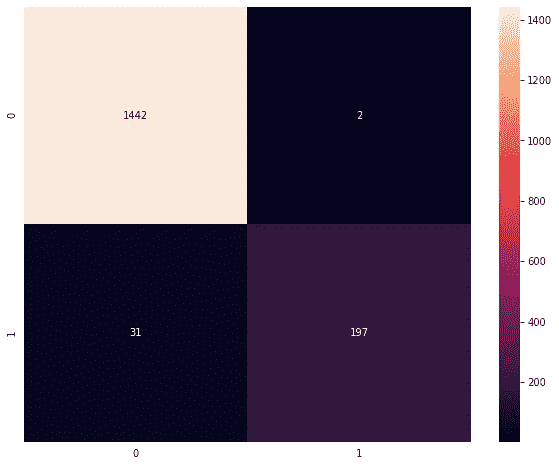

# 利用 Python 和 SpaCy 构建垃圾邮件分类模型

> 原文：<https://medium.com/analytics-vidhya/build-email-spam-classification-model-using-python-and-spacy-a0c914a83f4d?source=collection_archive---------3----------------------->



目前，在这个数字世界中，来自不同来源和不同格式的数据呈指数级增长，这包括不同类型的数据，包括结构化(数字、表格)、半结构化(JSON)和非结构化(文本、音频、视频)。

数字数据是构建各种机器学习和统计模型的主要来源，但随着文本数据的增加，人们正在使用自然语言处理技术来处理和提取文本中有意义的信息，最终有助于做出正确的决策

从文本数据中生成洞察不像从数字数据中生成洞察那么简单，因为文本数据不是结构化的。为了处理文本数据，第一步是将非结构化文本数据转换成结构化数据。

我们有各种 Python 库来提取文本数据，如 **NLTK、spacy、文本 blob** 。

**在本文中，我们使用了** [**spacy**](http://spacy.io/) **自然语言 python 库** **构建了一个垃圾邮件分类模型，只用几行代码就能识别出一封邮件是不是垃圾邮件。**

有几种不同的算法来构建这个分类器模型，但今天我们将使用 spacy 和 python 来构建一个，因为它们为我们提供了以更优化的方式和最少的代码量来构建模型的好处。

获得完整的代码签出我的 Kaggle 笔记本[这里](https://www.kaggle.com/divyhshah/30-days-of-ml-sms-classifier-using-spacy)

**现在没有任何延迟，让我们开始一步一步地构建模型**

# **导入库**

```
import nltk
import random
import pandas as pd
import numpy as np
import seaborn as sns
import spacy
from spacy.util import minibatch
import matplotlib.pyplot as plt
from sklearn.metrics import precision_score, recall_score, plot_confusion_matrix, classification_report, accuracy_score, f1_score, confusion_matrix
from sklearn import metrics
%matplotlib inline
```

# **数据加载**

```
data = pd.read_csv('../input/sms-spam-collection-dataset/spam.csv')
```

你可以参考我的笔记本[这里](https://www.kaggle.com/divyhshah/30-days-of-ml-sms-classifier-using-spacy)下载数据集

# **探索类别标签**



正如您在这里看到的，火腿和垃圾邮件的分布分别为 87 %和 13 %

让我们进一步创建一个**空间**模型和管道

```
*# create empty model*
nlp = spacy.blank("en")

text_cls = nlp.create_pipe("textcat", config={"exclusive_classes": True, "architecture": "bow"})

*# add pipeline in model we can add other steps in pipeline also but for now i am not adding tokenization, lemmetization, stop word removation etc. steps*
nlp.add_pipe(text_cls)

*# add your customer label in pipeline*
text_cls.add_label('ham')
text_cls.add_label('spam')
```

我们已经用英语创建了空空间模型。

在下一步中，我们只是创建一个管道定义来执行文本分类，在配置(config)部分，我们必须在这里指定字典，我们将其指定为一个独占类，这意味着我们将在我们的情况下提供目标类 spam 或 ham。使用 **bow (bag-of-words)** 架构。

我们也可以使用内置的空间架构。

现在，我们在空模型中添加了这个管道。

接下来，我们添加目标类 spam 和 ham 来创建文本分类模型

# **训练-测试和分割**

与其他 ML 模型开发类似，我们使用训练测试分割将数据集分割为训练和测试部分。

训练数据集-用于训练模型

测试数据集—用于验证模型的性能

```
x_train, x_test, y_train, y_test = train_test_split(data['text'], data['target'], test_size=0.3, random_state = 7)
```

与其他 sklearn 模型不同，在 spacy 中，您不能将目标数据指定为单个列，我们必须创建一个目标类的布尔列表。

```
*# Create the train and test data for the spacy model*
train_lables = [{'cats': {'ham': label == 'ham',
                          'spam': label == 'spam'}}  for label **in** y_train]
test_lables = [{'cats': {'ham': label == 'ham',
                      'spam': label == 'spam'}}  for label **in** y_test]

*# Spacy model data*
train_data = list(zip(x_train, train_lables))
test_data = list(zip(x_test, test_lables))
```

现在我们已经做好了所有的数据准备，所以让我们快速进入模型构建阶段。

```
def train_model(model, train_data, optimizer, batch_size, epochs=10):
    losses = {}
    random.seed(1)

    for epoch **in** range(epochs):
        random.shuffle(train_data)

        batches = minibatch(train_data, size=batch_size)
        for batch **in** batches:
            *# Split batch into texts and labels*
            texts, labels = zip(*batch)

            *# Update model with texts and labels*
            model.update(texts, labels, sgd=optimizer, losses=losses)
        print("Loss: **{}**".format(losses['textcat']))

    return losses['textcat']
```

这里我创建了上面的函数来训练空间模型。

```
optimizer = nlp.begin_training()
batch_size = 5
epochs = 20

*# Training the model*
train_model(nlp, train_data, optimizer, batch_size, epochs)
```

尼斯（法国城市名）..我们刚刚完成了模型训练，现在让我们进入预测部分

```
def get_predictions(model, texts):
    *# Use the model's tokenizer to tokenize each input text*
    docs = [model.tokenizer(text) for text **in** texts]

    *# Use textcat to get the scores for each doc*
    text_cls = model.get_pipe('textcat')
    scores, _ = text_cls.predict(docs)

    *# From the scores, find the label with the highest score/probability*
    predicted_labels = scores.argmax(axis=1)
    predicted_class = [text_cls.labels[label] for label **in** predicted_labels]

    return predicted_class
```

我创建了上面的广义函数来生成预测

```
train_predictions = get_predictions(nlp, x_train)
test_predictions = get_predictions(nlp, x_test)
train_accuracy = accuracy_score(y_train, train_predictions)
test_accuracy = accuracy_score(y_test, test_predictions)

print("Train accuracy: **{}**".format(train_accuracy))
print("Test accuracy: **{}**".format(test_accuracy))
```

哇..我们获得了很好的精确度

```
Train accuracy: 1.0
Test accuracy: 0.9802631578947368
```

现在，最后让我们检查混淆矩阵



模型测试混淆矩阵

测试混淆矩阵

恭喜你！你只需学习如何使用 spacy 和 python 创建一个模型，并在自己的电脑上进行实验[看看这个笔记本](https://www.kaggle.com/divyhshah/30-days-of-ml-sms-classifier-using-spacy)并玩玩它。

请不要忘记给笔记本投票。

如果你觉得这篇文章有用，请关注并喜欢它。

快乐学习！