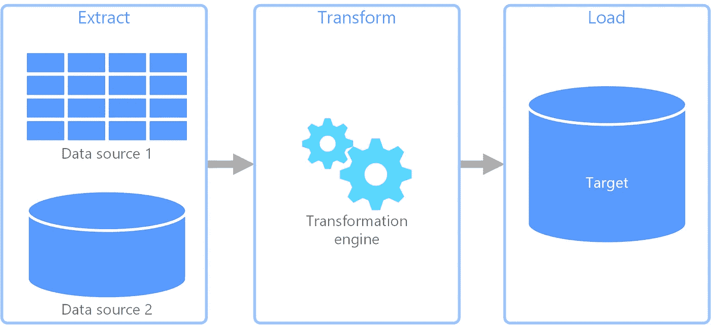
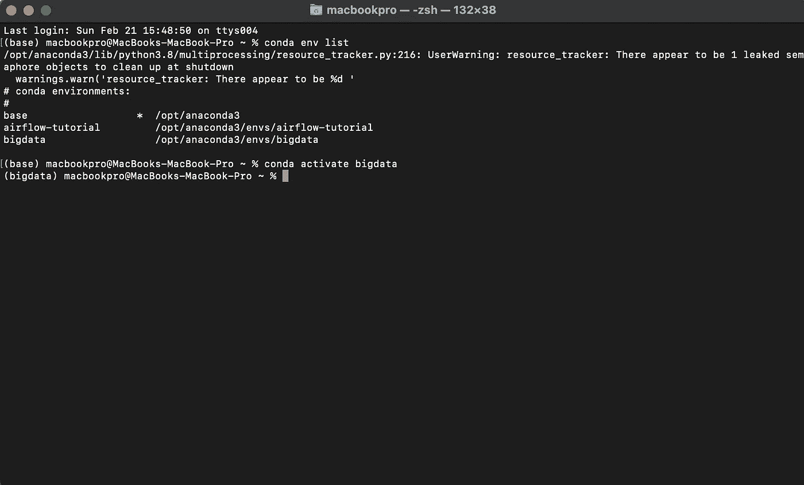
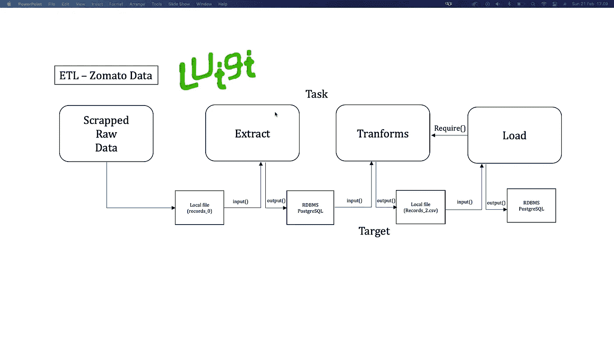
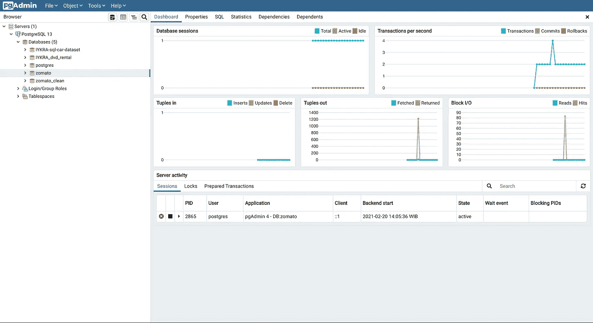
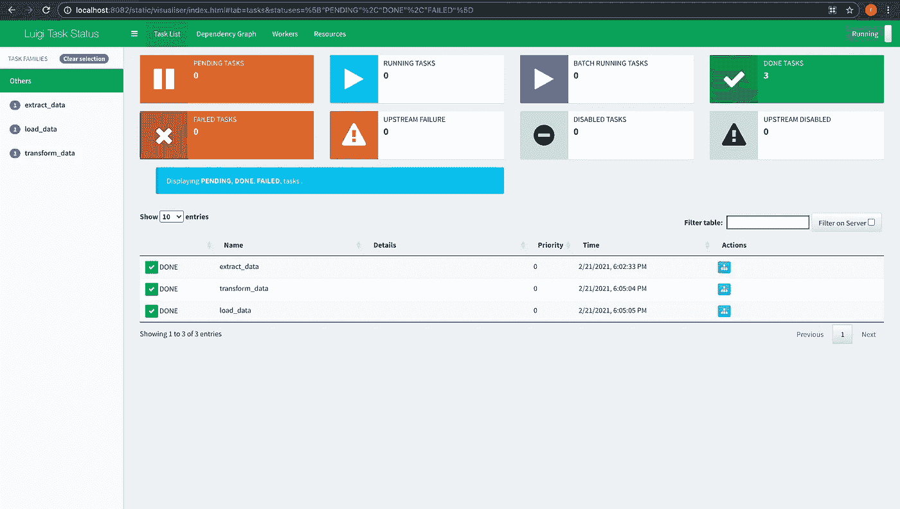

# 使用 PostgreSQL、Luigi 和 Python 脚本从头开始构建简单的数据管道！

> 原文：<https://medium.com/analytics-vidhya/build-simple-data-pipelines-from-scratch-using-postgresql-luigi-and-python-script-d3423f0a02d8?source=collection_archive---------3----------------------->

让我们实现自动化吧！


[https://www . custom truck . com/blog/how-are-oil-gas-and-refined-products-transported/](https://www.customtruck.com/blog/how-are-oil-gas-and-refined-products-transported/)

# "为什么我们需要管道来处理数据？"

对于那些仍然不知道为什么我们需要管道，或者仍然对数据管道感到困惑的人。在我读了几篇文章后，我可能会说数据管道是从各种来源提取的“一组动作”。它可能会转换和加载数据到特定的地方。那么，它是一个**自动化加工吗？Yups！**看起来就像从数据库中取出列，合并它们，根据我们的需要转换它们，然后加载回数据库系统。

见下图更好理解！



提取、转换和加载

在我们了解了管道之后，我们为什么还需要它呢？

*   我们需要在一个地方用正确的相同格式保存我们的数据
*   我们不需要时不时自己动手
*   它是可重复的

所以，让我们深入一点！

# 什么是路易吉？


Luigi 是一个执行框架，允许你用 Python 写数据管道。

该工作流引擎支持任务依赖性，并包括一个中央调度器，该调度器为帮助者提供了一个详细的库，以在 PostgreSQL、MySQL、AWS 和 Hadoop 中构建数据管道。不仅很容易依赖 repos 中定义的任务，还可以很容易地派生执行路径，并将一个任务的输出用作第二个任务的输入。

这个框架由 Spotify 编写，并于 2012 年开源。许多受欢迎的公司如 Stripe、Foursquare 和 Asana 都使用这个 Luigi 工作流引擎。让我们看看 github 中的 [Luigi 文档](https://github.com/spotify/luigi)！

在本文中，我假设您已经安装了 postgreSQL，因为我们将直接介绍如何构建一个简单的管道！但是，谁没有安装它，不要担心，我建议访问并观看这个 youtube [视频](https://www.youtube.com/watch?v=1aybOgni7lI&t=323s)。

# 路易吉装置

我建议您在任何特定的环境中安装 Luigi。在这种情况下，我使用我的“大数据”环境。所以，先激活你的环境。



环境激活

在这里，我们开始，因为 Luigi 是用 Python 编写的，您只需使用 pip 安装它:

```
pip install luigi
```

在我们进行技术练习之前，让我们先了解一下使用 zomato 数据集的 pipelines scratch。这个数据集是我用 beautiful 和 selenium 库的报废方法得到的。让我们打破这个抓痕。正如我们所看到的，我们有 3 个任务，不包括报废任务，提取，转换和加载任务。每个任务都有自己的目标，要么是本地文件，要么是数据库系统。

**问题提问:**

假设我们有一个项目，从特定的平台(目前，我们正在使用 zomato)收集数据，并以清晰的格式将它们存储到我们的数据库系统(PostgreSQL)中进行分析。



管道

**目标:**

我们希望从报废方法中提取所有原始数据，并进行一些转换，如清理数据和特征提取，以便通过构建管道在未来的分析中更好地理解。所以，我们的数据科学家很容易分析数据。

## 正如我之前所说，我们不想手动操作。所以让我们开始技术实践来解决我们的问题吧！

首先，在本地 postgreSQL 中创建两个数据库，并给定任意名称。在这种情况下，我使用 zomato 和 zomato_clean 数据库。



PgAdmin

创建一个包含我们的 python 代码和 csv 文件的新目录。首先，编写一个从数据库获取数据的函数代码。

get_data_db.py

其次，为管道编写第二个代码。Luigi 的任务应该包装成一个类。下面这段代码分别执行提取任务、转换任务和加载任务。加载任务与转换任务有依赖关系。因此，只有当转换任务已经执行且运行良好时，加载任务才会执行。你搞混了吗，够了吗？放心吧！请再次参考我们的管道划痕。

这里，让我们检查一下这段代码。

正如你在上面看到的，Luigi 的工作方式几乎就像一张图表。Luigi 有一个**任务()**用了以下方法:

提到这篇[文章](https://towardsdatascience.com/a-tutorial-on-luigi-spotifys-pipeline-5c694fb4113e)，

**要求()**

方法 requires()是执行的第一个方法(如果存在)。

它包含在当前任务之前已经执行的所有实例。最常见的情况是，该方法调用工作流上方的另一个 Luigi 任务，允许代码向后移动到管道的开头。

如果我们之前看到了目标是将任务连接到下一个任务所需要的，那么()是将任务连接到前一个任务的。

目标将代码移动到末尾，需要移动到开头。

只有当一个方法要求被满足时，任务才能执行第二个方法运行:

**run()**

在这个方法中包含了任务必须执行的动作。它可以是任何东西，调用另一个方法，运行一个脚本，等等。

Luigi 中与前两个模型相关的任务示例如下:

```
class MakeTaskA(luigi.Task):
    def requires(self):
        return MakeTaskB()
    def run(self):
        return luigi.LocalTarget(DoSomething())
```

**输出()**

顾名思义，方法 output()返回一个或多个目标对象。但是，建议任何任务在输出中只返回一个目标。目标是连接一个任务和下一个任务的边。这些通常表示为一个文件。事实上，我们在前面的例子中已经看到了一个。文件“hello.txt”是一个目标。当且仅当任务的每个输出目标都存在时，才可以认为任务已经完成。它们可以是简单的空文件，一个 S3 或任何东西。

# **那么，还有什么呢？让我们从终端**执行这些任务

正如我们之前构建的转换和加载之间的依赖关系任务。因此，我们需要执行第一个任务，将原始数据存储到本地 PostgreSQL 中。转到您的管道文件目录，然后激活您的环境并执行以下命令:

```
PYTHONPATH='.' luigi --module luigitutorial extract_data
```

你会得到

```
DEBUG: Checking if extract_data() is completeINFO: Informed scheduler that task   extract_data__99914b932b   has status   PENDINGINFO: Done scheduling tasksINFO: Running Worker with 1 processesDEBUG: Asking scheduler for work...DEBUG: Pending tasks: 1INFO: [pid 18294] Worker Worker(salt=845978677, workers=1, host=MacBooks-MacBook-Pro.local, username=macbookpro, pid=18294) running   extract_data()INFO: [pid 18294] Worker Worker(salt=845978677, workers=1, host=MacBooks-MacBook-Pro.local, username=macbookpro, pid=18294) done      extract_data()DEBUG: 1 running tasks, waiting for next task to finishINFO: Informed scheduler that task   extract_data__99914b932b   has status   DONEDEBUG: Asking scheduler for work...DEBUG: DoneDEBUG: There are no more tasks to run at this timeINFO: Worker Worker(salt=845978677, workers=1, host=MacBooks-MacBook-Pro.local, username=macbookpro, pid=18294) was stopped. Shutting down Keep-Alive threadINFO:===== Luigi Execution Summary =====Scheduled 1 tasks of which:* 1 ran successfully:- 1 extract_data()This progress looks :) because there were no failed tasks or missing dependencies===== Luigi Execution Summary =====
```

我们已经成功运行第一个任务，检查您的 PgAdmin，特别是您的 zomato 数据库。作为第一个提取任务的结果，有一个名为 zomato_dataset 的新表。

其次，执行以下命令:

```
PYTHONPATH='.' luigi --module luigitutorial load_data
```

你会得到

```
DEBUG: Checking if load_data() is completeDEBUG: Checking if transform_data() is completeINFO: Informed scheduler that task   load_data__99914b932b   has status   PENDINGINFO: Informed scheduler that task   transform_data__99914b932b   has status   DONEINFO: Done scheduling tasksINFO: Running Worker with 1 processesDEBUG: Asking scheduler for work...DEBUG: Pending tasks: 1INFO: [pid 18324] Worker Worker(salt=315842906, workers=1, host=MacBooks-MacBook-Pro.local, username=macbookpro, pid=18324) running   load_data()INFO: [pid 18324] Worker Worker(salt=315842906, workers=1, host=MacBooks-MacBook-Pro.local, username=macbookpro, pid=18324) done      load_data()DEBUG: 1 running tasks, waiting for next task to finishINFO: Informed scheduler that task   load_data__99914b932b   has status   DONEDEBUG: Asking scheduler for work...DEBUG: DoneDEBUG: There are no more tasks to run at this timeINFO: Worker Worker(salt=315842906, workers=1, host=MacBooks-MacBook-Pro.local, username=macbookpro, pid=18324) was stopped. Shutting down Keep-Alive threadINFO:===== Luigi Execution Summary =====Scheduled 2 tasks of which:* 1 complete ones were encountered:- 1 transform_data()* 1 ran successfully:- 1 load_data()This progress looks :) because there were no failed tasks or missing dependencies===== Luigi Execution Summary =====
```

尤普斯，我们已经完成了第二个和第三个任务！现在您在 zomato_clean 数据库中有了一个新表，即 zomato_dataset_clean。



Luigi UI

# 恭喜你！我们刚刚完成简单的数据管道

另一种方法，我将尝试使用阿帕奇气流。下一篇文章再见！Yups，本文只是一个用 Luigi 实现数据管道的小项目！