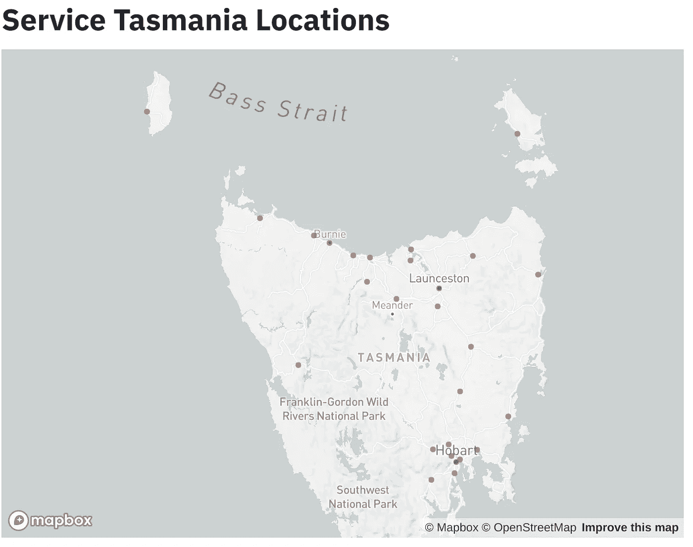
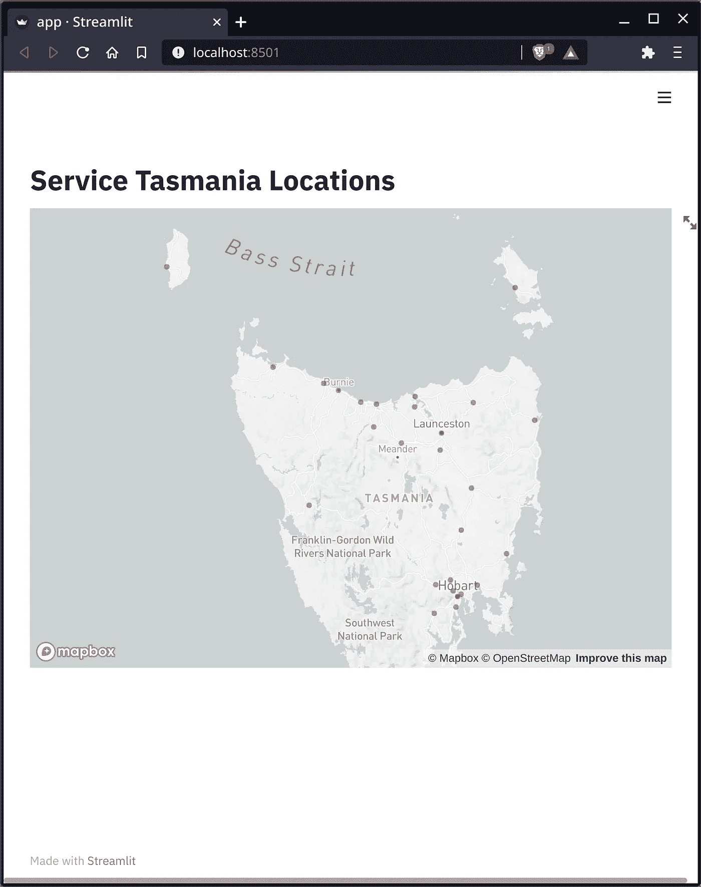

# 用 5 行代码用 Streamlit 构建您的第一个数据科学应用程序。

> 原文：<https://medium.com/analytics-vidhya/build-your-first-data-science-app-with-streamlit-in-5-lines-of-code-26ed1f73e1fe?source=collection_archive---------7----------------------->



用 5 行代码构建这个应用程序！

作为一名数据科学家，我一直在评估新的工具和技术来改进我的工作流程。作为一名软件工程师，我开始了我的职业生涯，我对安装程序和设置环境感到很舒服。我最大的挑战之一一直是，“我如何以一种快速简单的方式展示我工作中的洞察力？”

Jupyter 笔记本易于使用，但最终用户无法获得除所提供内容之外的任何其他信息。 [Plotly Dash](https://plotly.com/dash/) 制作了漂亮的仪表盘和应用程序，但它需要对回调、风格化和容器有更多的理解，这超出了我对原型制作或快速分享见解的真正需求。最近，我开始使用 [Streamlit](http://streamlit.io) ，它让快速分享见解变得很容易。

# 为什么使用 Streamlit？

Streamlit 由一群数据科学家创建。这有什么关系？如果有人知道数据科学家的挣扎，那就是数据科学家。Streamlit 使我能够专注于获得我想要分享的见解和功能，而不会陷入应用程序/仪表板开发中。

# 什么是 Streamlit？

根据他们的网站，Streamlit 是一个面向机器学习和数据科学团队的开源应用框架。Streamlit 提供了一种简单的方法，可以在几个小时内构建应用程序，这些应用程序可以在本地运行和共享，由私人托管，或通过他们的平台发布。通过运行以下命令，可以在 python 中通过`pip`安装 Streamlit:

`pip install streamlit`

几分钟后，您就可以安装并使用 Streamlit 了。

# 我们来建个 app 吧！

为了展示构建一个应用程序是多么容易，我将用几行代码(几分钟)构建一个全功能的 Streamlit 应用程序。让我们一起来建造它！

对于这个项目，我们将建立一个视觉塔斯马尼亚的“服务塔斯马尼亚”的位置。该应用程序将在地图上为他们的位置点组成。这个数据集是免费的，包含城市名称、地址、经度和纬度等等。出于我们的目的，我们将关注这个数据集中的纬度和经度。

首先，让我们确保已经安装了我们需要的包

```
# Standard Imports
import io
import requests# Third-Party Imports
import pandas as pd
import streamlit as st
```

如果你没有安装`pandas`，你可以像对 Streamlit 那样做`pip install pandas`。

让我们进入代码。我们想做的是从 data.gov.au 获取[服务塔斯马尼亚数据集](https://data.gov.au/dataset/648d7a00-96bb-40b5-ad8e-5ca51f90f441/resource/b8e618b5-2ec4-46b7-a1ce-e1fafedce05f/download/stoshops.csv)，并将其放入数据帧中。python 模块`requests`将允许您发送 HTTP 请求，以便您可以从他们的网站获取 csv 文件。

```
url="https://data.gov.au/dataset/648d7a00-96bb-40b5-ad8e-5ca51f90f441/resource/b8e618b5-2ec4-46b7-a1ce-e1fafedce05f/download/stoshops.csv"result=requests.get(url).content
```

这将返回以字节存储的 csv 内容。我们想把这些内容转换成一种格式来创建一个熊猫数据框架。我们将不得不使用 utf-8 对字节进行`decode`处理，流入信息并将其转换为数据帧，并将 Latitude 重命名为 lat，将 Longitude 重命名为 lon(或者，您可以将列名小写):

```
df=pd.read_csv(io.StringIO(result.decode('utf-8'))).rename(columns = {"Latitude" : "lat", "Longitude": "lon"})
```

现在神奇的事情发生了，我们想要创建地图并把这些点放在地图上。听起来工作量很大，但实际上只有一行！

```
st.map(df)
```

将所有这些放在一起看起来像这样:

app.py

将此文件另存为`app.py`，这样我们就可以运行应用程序了。

# 运行您的应用

要运行您的应用程序，请导航至您保存文件的目录并键入

`streamlit run app.py`



恭喜你！你做了你的第一个应用！

几秒钟后，您应该会看到您的浏览器打开，您的应用程序出现。在您的终端中，您应该注意到有两个链接:localhost(只能在您的计算机上访问)和 network URL(只要您的防火墙允许，网络上的任何人都可以访问)。

就是这样！

# 回顾和后续步骤

Streamlit 是一个强大的框架，允许您快速构建 web 应用程序来共享见解和更多内容，而不必关注大量的 web 开发。我们介绍了启动和运行项目的一些基础知识，但是您还可以做更多的事情，包括添加 UI 元素(按钮、复选框等)。)或者使用其他的包和绘图框架(plotly，matplotlib，seaborn 等)。).还有很多东西要学，所以玩得开心点，继续探索吧！