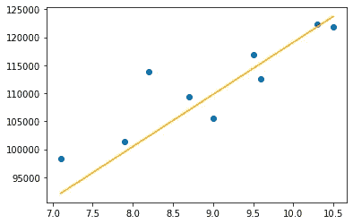
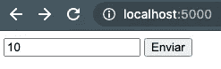
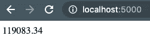

# 轻松构建您的第一个机器学习 Web 应用程序

> 原文：<https://medium.com/analytics-vidhya/build-your-first-machine-learning-web-app-painlessly-ea24f8bbef94?source=collection_archive---------18----------------------->

## 通过实现 OLS 简单线性回归模型和使用 Flask，用不到 20 行代码构建一个基于机器学习的 web 应用程序


作者图片📸

# 目录

1.  **去取一些简单的数据**
2.  **建立简单的线性回归模型**
3.  **是时候创建我们的网络应用了**
4.  **运行 web 应用程序！**
5.  **结论**

简单。开始时保持简单。通常，尝试完成一个简单的任务比处理一个复杂的任务更好，原因有几个:这将有助于你进一步理解主题的基础，防止你太快感到不知所措，并帮助你在进入下一步之前建立必要的信心。最重要的是，一旦完成，它会让你体验到兴奋！至少，这是我过去几天的感觉。

我是一名数据科学家，在一家深度学习专业公司实习，我认为自己是一名不断学习的人(嗯，在科技领域，你必须永远是这样的人)，对我所做的事情充满好奇、热情和激情。每当我发现一个新功能、摆弄一个新工具或完成一个新项目时，我都有一种像个孩子的感觉。我知道我每周都在对工具和过程有一个很好的理解(从满是错误的屏幕中)。

今天，我想谈谈我用 Flask 创建的第一个机器学习 web 应用程序。在我写这几行的那天，我成功地在云上部署了模型(太棒了！)，尽管我不想在本文中讨论这个问题，但它可能是下一次讨论的好话题。我想重点分享如何编写几行 Python 代码，并让您的第一个预测模型在您的 web 浏览器上运行。

# 去取一些简单的数据

让我们遵循文章开头提到的原则。当我被分配到现在的任务时，我就是这样做的。重点不在于拥有一流的模型，而在于学会如何将该模型部署为 web 应用程序。我知道，当你第一次面对这个任务(作为一个初学者)时，这听起来有点吓人，我希望这些句子能帮助你完成这个任务！

我去 Kaggle 下载了一个很小的 CSV 文件，其中包含几个条目，只有两个特征:多年经验和薪水。就在这里可以找到:[https://www . ka ggle . com/karthickveerakumar/salary-data-simple-linear-regression](https://www.kaggle.com/karthickveerakumar/salary-data-simple-linear-regression)

# 构建简单的线性回归模型

首先，我们将创建一个新的 Python 脚本(命名为“model.py ”,以便于理解),导入相关的库，加载数据并快速可视化。

```
# Import the relevant libraries
import matplotlib.pyplot as plt
import statsmodels.api as sm
from sklearn.metrics import mean_absolute_error, mean_squared_error
import pickle
import numpy as np# Load the data
data = pd.read_csv('Salary_Data.csv')
data# Plot it
plt.scatter(data.YearsExperience, data.Salary)
plt.show()
```

为了加载回归算法，在本例中我们将使用 Statsmodels，不过如果您愿意，也可以使用 Scikit-learn。Scikit-learn 中的几个指标将会很有用，模块 Pickle。是的，也许你没有听说过后者，但它在这个项目中是必不可少的。

然后，我们读取 CSV 文件并显示数据帧。最后，我们用这两个变量做一个散点图，这样你就可以快速掌握它们之间的关系。正如多年的经验和薪水所预期的那样，这是一种线性的正相关关系。一个增加，另一个也增加。

现在，我们将数据集分为训练集和验证集，并将特征向量分配给目标变量和解释变量(分别为 Y 和 X)。

之后，我们加载模型(OLS)，训练它，并使用验证集进行一些预测。

```
# Split data into train and validation
train = data[:int(0.7*len(data))]
valid = data[int(0.7*len(data)):]# Assigning feature vectors to target and explanatory variable
Y_train = train.Salary
X_train = train.YearsExperience
X_train = sm.add_constant(X_train)Y_valid = valid.Salary
X_valid = valid.YearsExperience
X_valid = sm.add_constant(X_valid)# Building a Simple Linear Regression model
model = sm.OLS(Y_train, X_train)
results = model.fit()
results.params# Predict with validation data
predicted = results.predict(X_valid)
```

作为一个小数据集，我发现 70/30 是一个很好的数据分割比例。然后，在训练和验证这两个集合中，我们将`salary`特征分配给 Y，将`years of experience`特征分配给 X。关于 Statsmodels 库，这里需要注意一点:我们必须添加常数项。基本上，它向数据集添加一列 1。

之后，我们有机会使用`.params`方法查看回归模型的参数，并根据验证数据进行预测。这是我们存储在`predicted`变量中的内容。

我们的模型表现如何？好，我们来唱。

```
# Model performance
print(f'The MAE is {mean_absolute_error(Y_valid, predicted)}')
print(f'The RMSE is {np.sqrt(mean_squared_error(Y_valid, predicted))}')# Visualizing predictions and actual values
plt.scatter(Y_valid, predicted)
plt.show()# Visualizing the model
plt.scatter(X_valid.YearsExperience, Y_valid)
plt.plot(X_valid.YearsExperience, predicted, color='orange')
plt.show()
```

我们使用两个指标来衡量模型性能，并绘制出这种衡量的可视化表示。

最大可能是 300000 美元。53807.68638686667

RMSE 是第二大城市。46862 . 66866868661



实际值(蓝点)与预测值(橙线)-作者图片

最后，我们将把我们的模型对象(一个 Python 对象)保存在一个二进制文件中，这就是 Pickle 模块发挥作用的时候。它允许我们在其他地方使用训练好的模型，比如在另一个脚本或笔记本中。在我们的例子中，我们将在应用程序中使用这个模型。它存储在一个名为“model.pkl”的文件中。

```
with open('model.pkl', 'wb') as f:
    pickle.dump(results, f)
    print('Pickling completed')
```

我们训练的模型在`results`变量中，不在`model`也不在`predicted`中。`model`变量包含我们加载的 OLS 模型，而`predicted` 变量包含我们在验证集上运行后的预测值。

# 是时候创建我们的 web 应用程序了

让我们创建一个新的 Python 脚本，并将其命名为“app.py”，这只是为了保持一致。除非您的机器上已经安装了 Flask，否则我们必须先这样做(不要担心 Pickle，因为它是 Python 的内置模块，您已经有了)。我还建议创建一个虚拟环境来处理这个项目，以及在其他项目中这样做，而不影响您已经安装的软件包和您运行的当前版本。这很像创造一个新的空间，用你需要的特定包来做特定的工作，或者像准备一个新房间来做一些事情，同时保持你的主工作间整洁。您可以保留它以备后用，也可以在工作完成后将其删除。

如果您正在使用 Anaconda，请进入终端并运行命令`$ conda create -n your_env_name python flask`，其中`your_env_name`代表您希望使用的环境名称。这个命令也会安装 Python 和 Flask。然后，运行`$ conda activate your_env_name`来激活环境。接下来，我运行`$ spyder`来启动 IDE。显然，您可以运行您喜欢的另一个 IDE 或文本编辑器，甚至从那里激活环境。

*注意:我在 Mac 上，所以请搜索与 Windows 或 Linux 系统相关的文档，以防有一些差异。*

```
from flask import Flask, request, render_template
import pickle

# Create a Flask object
app = Flask(__name__)# Read our trained model
model = pickle.load(open('model.pkl', 'rb'))
```

我们只是导入了相关的库和模块，在`app`中创建了一个 Flask 对象，并将我们之前拟合的训练模型存储在变量`model`中，反序列化二进制文件(使用 Pickle)。

```
[@app](http://twitter.com/app).route('/')
def home():
    return render_template('experienceform.html')[@app](http://twitter.com/app).route('/', methods=['POST'])
def predict():
    user_input = float(request.form['text'])
    prediction = model.predict([1.0, user_input])

    output = round(prediction[0], 2)

    return str(output)if __name__ == '__main__':
    app.run(port=5000, debug=True)
```

装饰者定义了我们想要使用的路径和我们想要在每个路径中调用的函数。`home()`函数直接呈现一个非常简单的 HTML 表单，其中用户输入一个代表`years of experience`(我们的解释变量)的数字(整数或浮点数)。我们稍后会看到 HTML 文件。

`predict()`函数获取我们在表单中输入的数字，将其传递给`model.predict`，并将结果存储在一个名为`prediction`的变量中。然后，它格式化输出，从一个数组中提取预测的薪水(`prediction`包含一个数组)并四舍五入到两位小数。函数返回一个字符串是很重要的，否则它会引发一个错误。您看到的 POST 方法是一个 HTTP 方法，它允许向服务器发送请求以接受输入数据(在本例中，就是我们在表单中输入的数据)。

最后，我们设置`app.run`在端口 5000 上运行并激活调试。

我们需要的 HTML 文件包含以下内容:

```
<form method="POST">
    <input name="text">
    <input type="submit">
</form>
```

使用上面的代码创建“form.html”文件，并将其保存在工作目录中名为“templates”的文件夹中。

# 运行 web 应用程序！

你保存脚本文件了吗？好吧，继续读下去，因为我会告诉你如何运行应用程序，以及如何安排目录，以使所有设置。

您正在工作的目录应该具有以下结构:

```
Salary_Data.csv *# Data file from Kaggle*
model.pkl *# Our trained model in a binary file*
salary_model.py *# The regression model script*
app.py *# Our web app script*
templates / form.html *# The folder containing the HTML file*
```

一切正常吗？很好！打开终端，导航到工作目录`$ cd ./your_working_directory/`并运行`$ python app.py`。你应该在你的终端上看到几条消息，其中一条写着“运行在 [http://127.0.0.1:5000/](http://127.0.0.1:5000/) 。将地址复制并粘贴到你的浏览器中……你应该会在主页上看到一个文本框和一个“发送”按钮。输入一个数字(无论你希望模型预测多少年的工资),它将返回一个数值！



在表格框中输入 10-作者图片



返回预测工资-按作者排序的图片

# 结论

我真的希望这篇教程能引导你构建你的第一个基于机器学习的 web 应用程序，并正确地运行它，没有任何复杂之处。从数据到应用程序开发，一切都非常简单，容易理解(至少我希望如此)，这样你也可以在你的数据科学投资组合中拥有这个小项目。如果这也让你感到兴奋，就像我第一次运行这个应用程序时的感觉一样，我会非常高兴！作为初学者，从头开始，对事物建立牢固的理解，然后一步一步地学习更复杂的东西，这总是一个好主意。你有足够的时间，不要着急。

在这里，你有几个想法可以让你的工作更上一层楼:

*   实现具有更多功能的模型。
*   给 web app 主页增加一些美感。
*   在应用程序中定义其他路径以添加更多功能。
*   测试并了解端点和 API。
*   在云上部署模型(例如，部署到 Heroku)。

此外，在下面找到整个脚本，以防您遗漏了什么:

**model.py**

```
import numpy as np
import pandas as pd
import matplotlib.pyplot as plt
import statsmodels.api as sm
from sklearn.metrics import mean_absolute_error, mean_squared_error
import pickle
import numpy as npdata = pd.read_csv('Salary_Data.csv')
dataplt.scatter(data.YearsExperience, data.Salary)
plt.show()# Split data into train and validation
train = data[:int(0.7*len(data))]
valid = data[int(0.7*len(data)):]# Assigning feature vectors to target and explanatory variable
Y_train = train.Salary
X_train = train.YearsExperience
X_train = sm.add_constant(X_train)Y_valid = valid.Salary
X_valid = valid.YearsExperience
X_valid = sm.add_constant(X_valid)# Building a Simple Linear Regression model
model = sm.OLS(Y_train, X_train)
results = model.fit()
results.params# Predict with validation data
predicted = results.predict(X_valid)# Model performance
print(f'The MAE is {mean_absolute_error(Y_valid, predicted)}')
print(f'The RMSE is {np.sqrt(mean_squared_error(Y_valid, predicted))}')# Visualizing predictions and actual values
plt.scatter(Y_valid, predicted)
plt.show()# Visualizing the model
plt.scatter(X_valid.YearsExperience, Y_valid)
plt.plot(X_valid.YearsExperience, predicted, color='orange')
plt.show()with open('model.pkl', 'wb') as f:
    pickle.dump(results, f)
    print('Pickling completed')
```

**app.py**

```
from flask import Flask, request, render_template
import pickleapp = Flask(__name__)
model = pickle.load(open('model.pkl', 'rb'))[@app](http://twitter.com/app).route('/')
def home():
    return render_template('form.html')[@app](http://twitter.com/app).route('/', methods=['POST'])
def predict():
    user_input = float(request.form['text'])
    prediction = model.predict([1.0, user_input])

    output = round(prediction[0], 2)

    return str(output)if __name__ == '__main__':
    app.run(port=5000, debug=True)
```

**form.html**

```
<form method="POST">
    <input name="text">
    <input type="submit">
</form>
```

如果你愿意，可以点击这里[https://github.com/jaycee-ds/Salary_ModelDeployment_Flask](https://github.com/jaycee-ds/Salary_ModelDeployment_Flask)访问 GitHub 上的知识库页面

资源:

[](https://www.kaggle.com/karthickveerakumar/salary-data-simple-linear-regression) [## 工资数据-简单线性回归

### 机器学习 A - Z

www.kaggle.com](https://www.kaggle.com/karthickveerakumar/salary-data-simple-linear-regression) [](https://stackoverflow.com/questions/12277933/send-data-from-a-textbox-into-flask) [## 将文本框中的数据发送到 Flask？

### 我想知道是否有一种方法可以从 HTML 的文本框中取出一些东西，放入 flask，然后解析它…

stackoverflow.com](https://stackoverflow.com/questions/12277933/send-data-from-a-textbox-into-flask)  [## stats models . regression . linear _ model。OLS -统计模型

www.statsmodels.org](https://www.statsmodels.org/stable/generated/statsmodels.regression.linear_model.OLS.html)