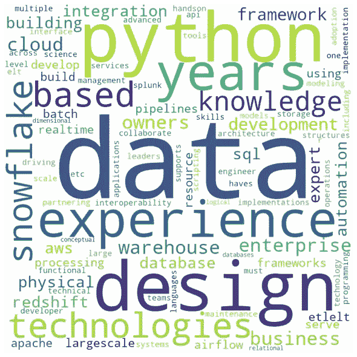

# 使用 Python 构建自己的简历扫描仪

> 原文：<https://medium.com/analytics-vidhya/build-your-own-resume-scanner-using-python-b3de12a8199b?source=collection_archive---------6----------------------->



让我们想一个虚构的场景。你想换一份工作。你开始浏览求职门户。突然，一份工作描述引起了你的注意。它看起来非常合适！这个角色似乎是专为你而生的！很快，你上传了简历申请。你如此确信你会很快接到面试电话。但不幸的是，那个电话一直没有打来！想起来了吗？你也是这样吗？对我来说，这是“在那里做的”！(很多！)

嗯，找工作是一个复杂的过程。不同层次都有障碍。可悲的是，直到几天前我提交职位申请后立即给招聘人员打电话时，我才意识到为什么我没有接到第一个电话。她说，“*你的资料与这个角色有 36%的匹配，我会给你回电话的！*“我不确定她在说什么！后来我知道，我们的简历甚至在送到招聘经理手里之前，甚至在被人看到之前，就已经被自动 NLP 程序扫描过了。于是我得知第一个障碍的名字是[**【ATS】**](https://en.wikipedia.org/wiki/Applicant_tracking_system)。

我确信不同的公司使用不同复杂程度的简历扫描仪。我想要一个简单的——我自己的简历扫描仪。所以这篇文章是关于**创建你自己的简历扫描仪**——一个查看你的简历与特定工作描述匹配程度的程序。

## 方法:

我想创建一个 Python 程序，它将返回简历和工作描述之间的匹配百分比。此外，我将使用职位描述创建一个单词云，这样我们就可以清楚地看到所有重要的关键字。

## 安装和导入库:

首先，我们将导入这个项目所需的所有库。

现在，简历没有固定的文件格式，因此可以是任何文件格式，如。pdf 或。所以我们的第一个挑战是阅读简历并将其转换为纯文本。为此，我们可以使用两个 Python 模块: [pdfminer](https://github.com/euske/pdfminer) 和 [doc2text](https://github.com/ankushshah89/python-docx2txt) 。这些模块帮助提取文本 from.pdf 或。医生或者。docx 文件格式。

```
pip install pdfminer 
pip install docx2txt
```

让我们导入这个项目所需的所有库。

```
import io 
from pdfminer.converter 
import TextConverter 
from pdfminer.pdfinterp 
import PDFPageInterpreter 
from pdfminer.pdfinterp 
import PDFResourceManager 
from pdfminer.pdfpage 
import PDFPage #Docx resume 
import docx2txt #Wordcloud 
import re 
import operator 
from nltk.tokenize import word_tokenize 
from nltk.corpus 
import stopwords 
set(stopwords.words('english')) 
from wordcloud import WordCloud 
from nltk.probability import FreqDist 
import matplotlib.pyplot as plt from sklearn.feature_extraction.text import CountVectorizer 
from sklearn.metrics.pairwise import cosine_similarity
```

## 阅读简历:

在这里，我将创建两个不同的函数。一个看 pdf 文件格式的简历。又一个要读的。doc 格式。这两个函数都将返回简历中的文本。

**阅读 PDF 简历:**

```
def read_pdf_resume(pdf_doc): 
    resource_manager = PDFResourceManager() 
    fake_file_handle = io.StringIO() 
    converter = TextConverter(resource_manager, fake_file_handle)     
    page_interpreter = PDFPageInterpreter(resource_manager, 
                                          converter) 
    with open(pdf_doc, 'rb') as fh: 
        for page in PDFPage.get_pages(fh,  
                            caching=True,check_extractable=True):   
            page_interpreter.process_page(page)  
            text = fake_file_handle.getvalue()  
    # close open handles 
    converter.close() 
    fake_file_handle.close()     if text: 
        return text
```

**阅读 word 简历:**

```
def read_word_resume(word_doc): 
    resume = docx2txt.process(word_doc) 
    resume = str(resume) 
    #print(resume) 
    text = ''.join(resume) 
    text = text.replace("\n", "") 
    if text: 
        return text
```

## 用关键词创建单词云

一个能显示职位描述中关键词的图形图像怎么样？我一直是单词云的忠实粉丝。如果你在浏览一份职位描述，你可能会错过一些该职位要求的技能。也许你在这些技能方面有一些经验，但却不记得把它们添加到你的简历中。因此，一个词云将闪现这些关键词以供快速查看。

**清洁工作描述:**

为了创建一个单词云，我通常首先清理文本，以避免单词重复或标点符号或数字，因为这些在单词云中没有多大意义。

```
def clean_job_decsription(jd): 
    ## Clean the Text 
    # Lower 
    clean_jd = jd.lower() 
    # remove punctuation 
    clean_jd = re.sub(r'[^\w\s]', '', clean_jd) 
    # remove trailing spaces 
    clean_jd = clean_jd.strip() 
    # remove numbers 
    clean_jd = re.sub('[0-9]+', '', clean_jd) 
    # tokenize clean_jd = word_tokenize(clean_jd) 
    # remove stop words 
    stop = stopwords.words('english') 
    clean_jd = [w for w in clean_jd if not w in stop]  

    return(clean_jd)
```

**造词云:**

现在，是时候创建图像了。

```
def create_word_cloud(jd): 
    corpus = jd fdist = FreqDist(corpus)   
    #print(fdist.most_common(100)) 
    words = ' '.join(corpus) 
    words = words.split() 
    # create a empty dictionary 
    data = dict() 

    # Get frequency for each words where word is the key and the 
    #count is the value 
    for word in (words): 
        word = word.lower() 
        data[word] = data.get(word, 0) + 1 

# Sort the dictionary in reverse order to print first the most used terms 
    dict(sorted(data.items(),
                 key=operator.itemgetter(1),
                 reverse=True)) 
    word_cloud = WordCloud(width = 800, height = 800,  
                            background_color ='white',
                            max_words = 500) 
    word_cloud.generate_from_frequencies(data) 
    # plot the WordCloud 
    image plt.figure(figsize = (10, 8), edgecolor = 'k')  
    plt.imshow(word_cloud,interpolation = 'bilinear')   
    plt.axis("off") plt.tight_layout(pad = 0) 
    plt.show()
```

## 获取职位描述和简历匹配分数

现在，我们正处于项目的最后阶段。为了给简历与具体职位描述的匹配程度打分，我将使用一个 ***余弦相似度*** 指标。在数学上，它测量的是在多维空间中投影的两个向量之间的角度余弦。角度越小，余弦相似度越高。在这个上下文中，这两个向量是包含两个文档的单词的数组。

现在，一种常用的匹配相似文档的方法是基于计算文档之间的最大共同单词数。但是这种方法有一个问题。随着文档大小的增加，即使文档谈论不同的主题，常用词的数量也趋于增加。

余弦相似性是有利的，因为即使两个相似的文档由于大小而相距欧几里德距离很远(例如，单词‘python’在一个文档中出现 50 次，在另一个文档中出现 2 次)，它们之间仍然可以有较小的角度。因此，角度越小，相似度越高。

好，让我们创建一个函数来查找匹配分数！

```
def get_resume_score(text): 
    cv = CountVectorizer(stop_words='english') 
    count_matrix = cv.fit_transform(text) 
    #Print the similarity scores 
    print("\nSimilarity Scores:") 

    #get the match percentage 
    matchPercentage = cosine_similarity(count_matrix)[0][1] * 100 
    matchPercentage = round(matchPercentage, 2) # round off

    print("Your resume matches about "+ str(matchPercentage)+ "% of the job description.")
```

## 测试简历扫描仪:

终于到了拿分的时候了！我正在使用我的个人简历，并将它复制到同一个文件夹中，这样它就可以被这个程序读取。现在，让我从一个工作门户获取一份工作描述。我做了一份数据分析师的工作描述，让我们看看我的个人资料与这个特定角色有多匹配。

```
What you'll do: 
The role involves partnering very closely with multiple PMs, Engineers, Test Managers and Business Partner to elevate the site experience for the verticals on Walmart. Analyze click stream data to understand how customers are interacting with the site. Uncover user pain points and help in building inspirational experiences. Provide and supports the implementation of product solutions Provide data driven insights and deliver recommendations that address opportunities for product improvements Provide analytical support to Product Managers Ensure accuracy of data capture strategy A/B Test: Test variations on messaging or features. Display dashboards: Visualize data with templated or custom reports. Create effective reporting and dashboards. Measure: Measure engagement by feature A self-starter: Can drive projects with minimal guidance Strong communicator: You effectively synthesize, visualize, and communicate your ideas to others  **You'll sweep us off our feet if...** 
You're able to use metrics to improve performance 
You're excited about solving complex challenges 
You're customer-centric in spirit and in execution 
You're comfortable influencing others, leading teams, managing stakeholders, and communicating clearly 
You have a test and learn mentality and an agile way of working to improve your product
```

让我们运行上面创建的所有函数，并得到一个分数！

```
if **name** == '**main**': 
    extn = input("Enter File Extension: ") 
    #print(extn) 
    if extn == "pdf": 
        resume = read_pdf_resume('Resume_OindrilaSen.pdf') 
    else: 
        resume = read_word_resume('test_resume.docx')     job_description = input("\nEnter the Job Description: ") 

    ## Get a Keywords Cloud 
    clean_jd = clean_job_decsription(job_description) 
    create_word_cloud(clean_jd) 
    text = [resume, job_description]     ## Get a Match score 
    get_resume_score(text)
```

我的天啊！

```
Similarity Scores: Your resume matches about 26.82% of the job description.
```

今天，我所有的猜测都有了答案。所以，今天的要点是，如果一份工作描述看起来很合适，我需要运行这个程序，检查我的简历。因此，简历扫描仪可以告诉你一个故事——一个真实的故事！

我已经在我的 [Github](https://github.com/Oindrila-Sen/Python-Projects/tree/master/Resume_Scanner) 中上传了我的 Jupyter 笔记本用于简历扫描程序。

此外，如果你正在寻找一些其他项目的想法，看看我下面的项目:

[使用 Keras LSTM 生成文本的深度学习模型](https://oindrilasen.com/2021/02/generate-text-keras-lstm/)

[在 Heroku 上构建和部署一个多页面 Flask 应用程序](https://oindrilasen.com/2020/12/multi-page-heroku-application/)

[使用 Python 对 Twitter 上的#冠状病毒趋势进行文本分析](https://oindrilasen.com/2020/04/text-analytics-on-twitter-trends-using-tweepy/)

感谢您阅读这篇文章。希望对大家有帮助！如果你喜欢这篇文章，并发现它很有帮助，请留下一些掌声，以示感谢。

谢谢大家！

*原载于 2021 年 5 月 26 日 https://oindrilasen.com**[*。*](https://oindrilasen.com/2021/05/build-resume-scanner-using-python-nlp/)*