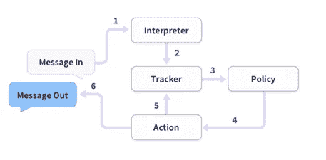
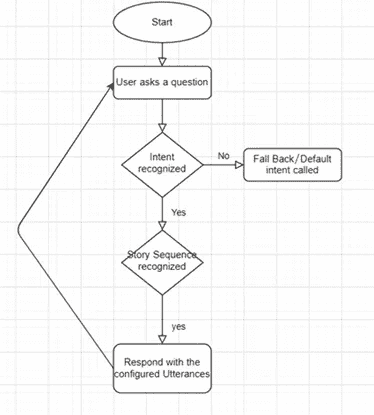
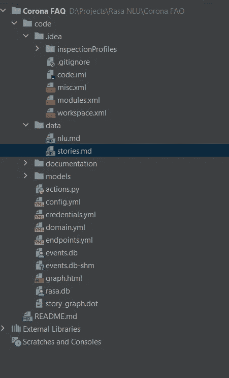
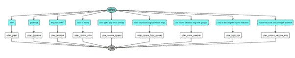
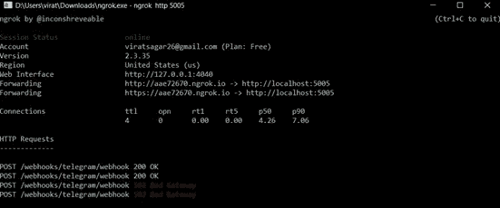
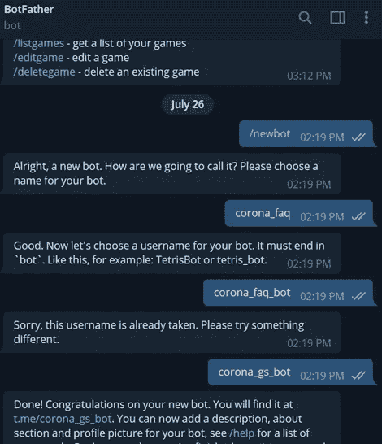

# 使用 Rasa 框架和 Telegram 集成构建您自己的简单 Corona FAQ 聊天机器人

> 原文：<https://medium.com/analytics-vidhya/build-your-own-simple-corona-faq-chatbot-with-rasa-framework-and-telegram-integration-7deee22f1be0?source=collection_archive---------2----------------------->


大家好，今天我们将构建 FAQ 聊天机器人来传播对电晕病毒的认识。这些是我们将要看到的主题。

*   聊天机器人简介
*   先决条件
*   问题陈述
*   履行
*   与电报集成

*那么我们就从聊天机器人的介绍开始吧。*

# **聊天机器人:**

聊天机器人是一种可以像人类一样使用听觉和/或文本方法发起并继续对话的应用程序。聊天机器人可以是简单的基于规则的引擎，也可以是利用自然语言理解的智能应用程序。如今，许多组织已经开始广泛使用聊天机器人。
聊天机器人正变得越来越出名，因为它们全天候可用，提供一致的客户体验，可以同时处理几个客户，具有成本效益，因此带来了更好的整体客户体验。

**聊天机器人的用途:**

*   回答一个问题
*   客户支持
*   常见问题
*   解决不满
*   预约
*   日常任务的自动化

# **先决条件:**

使用 Rasa 开发和理解聊天机器人的先决条件是:

1.Python (PyCharm 或任何 IDE)

2.使用 C++的微软构建工具

[*下载 Visual Studio 2019 for Windows&Mac(microsoft.com)*](https://visualstudio.microsoft.com/downloads/#build-tools-for-visual-studio-2019)

3.Rasa(如果想用 UI 聊天机器人，可以用 Rasa X

```
pip install rasapip install rasa x
```

# **问题陈述:**

这里的目标是建立一个聊天机器人，可以回答有关新冠肺炎病的查询。

**技术堆栈:**

计算机编程语言

Rasa 或 Rasa X

Rasa 是一个开源的机器学习框架，用于构建[上下文 AI 助手和聊天机器人](http://blog.rasa.com/level-3-contextual-assistants-beyond-answering-simple-questions/)。

Rasa 有两个主要模块:

**NLU** 用于理解用户信息

**核心**进行对话并决定下一步做什么

**RASA 架构:**



**申请流程:**



# **实施:**

*   为您的 chatbot 项目创建一个新文件夹。
*   使用 Pycharm 打开该文件夹
*   从 Pycharm 或 anaconda 提示符下为您的 chatbot 项目创建一个新环境。
*   运行命令 **pip install rasa** 安装所有的 rasa 依赖项
*   运行命令 **pip install spacy** 安装 spacy 库。
*   然后输入以下命令:

```
**python -m spacy download en****python -m spacy download en_core_web_md****python -m spacy link en_core_web_md en**
```

*   该命令成功运行后，输入命令 **rasa init，**并为所有后续操作选择 Y(用于训练模型等)。

然后你会得到 RASA 已经建立的所有预定义的结构。



从数据文件夹中打开' **nlu.md** '文件，输入以下内容:

```
*## intent:greet
* - hey
 — hello
 — hi
 — good morning
 — good evening
 — hey there*## intent:goodbye* — bye
 — goodbye
 — see you around
 — see you later*## intent:bot_challenge* — are you a bot?
 — are you a human?
 — am I talking to a bot?
 — am I talking to a human?*## intent:corona_intro* — What is corona virus
 — what is covid
 — what is a novel corona virus
 — what is covid-19
 — tell me about corona
 — can you tell me about covid*## intent:corona_spread* — how does corona virus spread
 — how does the virus spread*## intent:corona_food_spread* — Does corona spread from food
 — how will corona spread from food*## intent:warm_weather* — will warm weather stop the spread
 — will it stop with warm weather*## intent: high_risk* — who is at a higher risk of infection
```

该文件用于创建所有意图及其对话的示例话语。

打开“ **domain.yml** 文件，放入以下内容:

session _ config:
session _ expiration _ time:60
carry _ over _ slots _ to _ new _ session:true

```
intents:— greet 
— goodbye
— bot_challenge 
— corona_intro 
— corona_spread 
— corona_food_spread 
— warm_weather
— high_riskresponses:
 utter_greet:
 — text: Hey! How are you?
 utter_did_that_help:
 — text: Did that help you?
 utter_goodbye:
 — text: Bye
 utter_iamabot:
 — text: I am a bot, powered by Rasa.
 utter_corona_intro:
 — text: Coronaviruses are a group of related viruses that cause diseases in mammals and birds. In humans, coronaviruses cause respiratory tract infections that can be mild, such as some cases of the common cold (among other possible causes, predominantly rhinoviruses), and others that can be lethal, such as SARS, MERS, and COVID-19
 utter_corona_spread:
 — text: “This virus was first detected in Wuhan City, Hubei Province, China. The first infections were linked to a live animal market, but the virus is now spreading from person-to-person. It’s important to note that person-to-person spread can happen on a continuum. Some viruses are highly contagious (like measles), while other viruses are less so. The virus that causes COVID-19 is spreading from person-to-person. Someone who is actively sick with COVID-19 can spread the illness to others. That is why we recommend that these patients be isolated either in the hospital or at home (depending on how sick they are) until they are better and no longer pose a risk of infecting others.

 utter_corona_food_spread:
 — text: Coronaviruses are generally thought to be spread from person-to-person through respiratory droplets. Currently there is no evidence to support transmission of COVID-19 associated with food.
 utter_warm_weather:
 — text: It is not yet known whether weather and temperature impact the spread of COVID-19\. Some other viruses, like the common cold and flu, spread more during cold weather months but that does not mean it is impossible to become sick with these viruses during other months.
 utter_high_risk:
 — text: Older adults and people of any age who have serious underlying medical conditions may be at higher risk for more serious complications from COVID-19.actions:
 — utter_greet 
 — utter_did_that_help 
 — utter_goodbye 
 — utter_iamabot 
 — utter_corona_intro 
 — utter_corona_spread 
 — utter_corona_food_spread 
 — utter_warm_weather 
 — utter_high_risk
```

该文件用于配置机器人响应。

从数据文件夹中打开' **stories.md** '文件，放入以下内容:

```
*## say goodbye** goodbye 
— utter_goodbye*## bot challenge** bot_challenge 
— utter_iamabot*## what is corona** corona_intro 
— utter_corona_intro*## how does corona spread** corona_spread 
— utter_corona_spread*## corona food spread** corona_food_spread 
— utter_corona_food_spread*## corona warm weather** warm_weather 
— utter_warm_weather*## corona high risk** high_risk 
— utter_high_risk
```

该文件用于创建对话流。

你可以添加更多的问题，更多的意图，建立一个强大的 FAQ 聊天机器人。如果你想问问题，你可以查看政府官方网站或世卫组织网站，并把它们放入你的聊天机器人。

完成所有这些后，您只需输入命令' **rasa train'** ,用新的对话元素训练模型。

训练机器人后，你可以通过输入命令' **rasa visualize** '来查看图形或可视化所有结构。



# **与电报集成:**

*   从**[https://ngrok.com/download](https://ngrok.com/download)下载 ngrok**
*   **解压缩 zip 文件后，打开 ngrok 文件并运行它。**
*   **在 ngrok 中，输入以下命令**

```
**ngrok http 5005**
```

****

*   **然后去 telegram，用 Botfather 创建你自己的机器人:**

1.  **打开 telegram 应用程序并搜索 botfather(这是一个用于创建其他机器人的内置机器人)**
2.  **开始与 botfather 对话，输入/newbot 创建一个 newbot。**
3.  **给你的机器人取个名字**
4.  **给你的机器人一个用户名，必须以 _bot 结尾。这将生成一个访问令牌。**

****

*   **打开“credentials.yml”并输入:**

```
telegram:access_token: “obtained from telegram”verify: “your bot username”webhook_url: “https://<ngrokurl>/webhooks/telegram/webhook”
```

*   **进入终端，输入命令“rasa run”**
*   **再打开一个终端，运行命令“rasa run actions”**
*   **现在，你可以从 Telegram 和你的机器人聊天了。**

**您可以将此 bot 与其他选项集成，如 Slack bot、Cisco Webex bot、Twilio bot 等。查看下面的链接。**

**[Rasa.com](https://rasa.com/docs/rasa/connectors)**

****参考文献**:**

**1.Rasa 官方文件[https://rasa.com/docs/rasa/user-guide/installation/](https://rasa.com/docs/rasa/user-guide/installation/)**

**2.ineuron.ai**

**谢谢大家！！现在你有自己的机器人了。**

**你可以在这个 GitHub 链接上查看所有文件和代码。**

**[**gaur av 21s/Corona-FAQ-chatbot(github.com)**](https://github.com/gaurav21s/Corona-FAQ-chatbot)**

****在 LinkedIn 上关注我:** [**高拉夫·什里瓦斯塔夫**](https://www.linkedin.com/in/gaurav-shrivastav-gs/)**