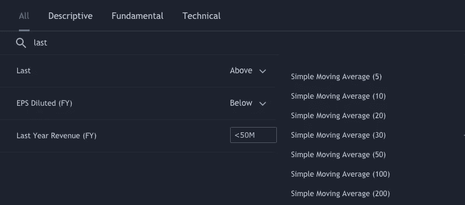

# 使用 Python 构建自己的技术分析股票筛选工具

> 原文：<https://medium.com/analytics-vidhya/build-your-own-technical-analysis-stock-screener-using-python-5d1bb3d091f0?source=collection_archive---------1----------------------->

一个基于马来西亚股票市场的例子。

有许多令人惊叹的股票筛选应用程序和网站，比如 [TradingView](https://www.tradingview.com/) 。然而，如果你不付费的话，大多数网站不会提供你想要的定制服务。

例如，在 TradingView 中，您可以很容易地找到最近价格高于某些移动平均线(MA)的股票，但您只能使用预定义的 5、10、20、30、50、100 和 200 日均线。

好消息是，只需几行 Python 代码，你就可以制作自己定制的简单股票筛选工具…