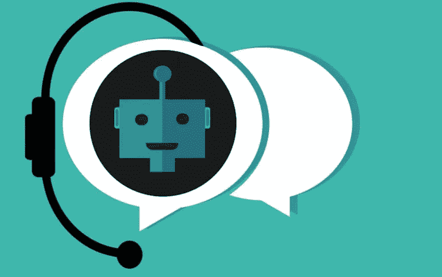
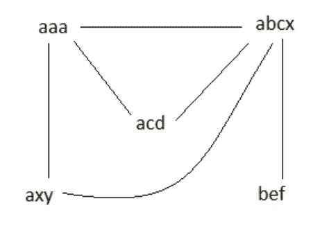
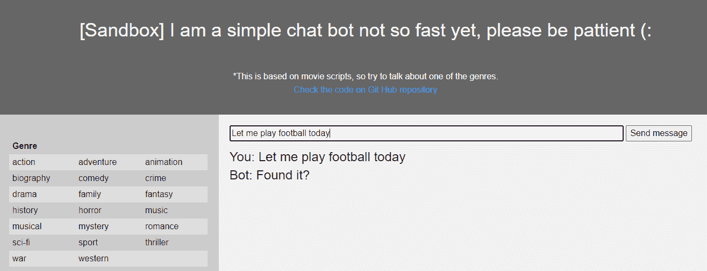

# 使用人工智能和电影脚本数据集构建聊天机器人

> 原文：<https://medium.com/analytics-vidhya/building-a-chat-bot-using-ai-with-movie-scripts-dataset-f18fc1f9629e?source=collection_archive---------7----------------------->

[https://pix abay . com/illustrations/chatbot-bot-assistant-support-icon-4071274/](https://pixabay.com/illustrations/chatbot-bot-assistant-support-icon-4071274/)

# 动机

最近，我不得不购买一项新的互联网服务，所以我尝试使用该公司现有的聊天机器人。我注意到与聊天机器人的对话是基于规则和条件的。因此，对于我向机器人提出的每个问题，它都向我发送了一个选项列表，我需要选择这些选项来进行下一步的对话。这次经历对我来说并不好，也没有解决我的问题。所以，我开始搜索可能的解决方案，只是出于好奇，我在互联网上找到了一些内容，谈论使用自然语言处理(NLP)训练一个聊天机器人。读完这篇文章后，我决定接受挑战，训练我的聊天机器人进行自然对话。

我对结果非常满意，因为我可以使用人工智能概念在 python 中构建一个完整的解决方案，对它进行覆盖 98%源代码的单元测试，并且我还可以在 Heroku 中部署它。阅读文本，了解如何基于人工智能构建自己的聊天机器人。

在接下来的部分中，我将解释:

*   人工智能是如何被训练的；
*   使用的文本相似性技术；
*   数据集的处理；
*   聊天机器人的业务流程；
*   如何用不同的数据集重新训练聊天机器人？

# 这是如何做到的

1.  我用了一个数据集，里面有关于电影的虚构对话；
2.  处理数据以建立对话序列(对话)；
3.  应用大写、词汇化和词干化来减少单词的变化；
4.  用更多的特征(句子的相似性)丰富了数据集；
5.  使用神经网络训练每个消息及其对应的答案；
6.  建立了一个用户界面，允许与聊天机器人的互动；
7.  在一个免费的公共领域部署了聊天机器人(Heroku)。

# 概念

# 预处理数据

数据集在成对的输入-输出消息中进行预处理，例如输入消息“这是什么？”可以有一个输出消息“一只狗”。这些消息用于将最接近的答案映射到来自用户的给定消息。

# 页面等级

相似消息的图表被提供给页面排名算法，因此最相关的消息被排在列表的顶部。

消息被认为是图的顶点，并且消息之间的相似性被认为是这些顶点的关联(边)。将每条消息与所有其他消息进行比较，消息之间的相似性数量越多，这些消息的关联(边)数量就越多。例如，给定消息“aaa”、“abcx”、“acd”、“bef”、“axy”。因此，我们会有下面的相似性图，因为‘abcx’类似于' **aaa** '、' **ac** d '、' **ax** y '和' **b** ef '。

图 1 —信息相似度图

因此，聊天机器人中的每个传入消息通过余弦相似性与预先分类的消息进行比较。该比较的结果被添加到预先分类的消息的权重中，并且具有最高关联值的消息被返回给用户。

# Cossine 相似性

Cossine 相似性用于将用户的输入消息与数据集中最相似的消息进行匹配。该值与消息的页面等级相加。对所有消息进行这种处理，并将具有最高值(页面排名+相似性)的消息返回给用户。

# 用过的库

*   熊猫
*   关于
*   克拉斯
*   numpy
*   sklearn
*   Scipy
*   训练 _ 测试 _ 分割
*   数学

# 聊天机器人的工作方式如下:

1.  用户提供输入消息；
2.  聊天机器人接收到该消息，并将其保存在数据文件中，以供将来改进；
3.  该消息被预处理以服务于神经网络，并被标记为问题(1)或答案(0)。
4.  相同的原始消息也被预处理以服务于相似性算法。在任何预处理中，在消息不能被使用的情况下，只作为数字，只作为特殊字符，等等。标准紧急消息被返回给用户。该标准消息是从标准消息列表中提取的；
5.  对预处理后的消息进行标记，并且根据标记，将其与具有相同标记的消息列表进行比较。例如，如果邮件被标记为问题，则将其与问题数据集进行比较；
6.  如果发现类似的消息，聊天机器人将返回该消息的相关响应。
7.  如果没有类似的消息，则向用户返回标准的 kind 消息。

# 连接

聊天机器人部署在[https://chatbotnaive.herokuapp.com/](https://chatbotnaive.herokuapp.com/)，所以试试这个:)

# 使用您自己的数据集进行再培训

*   为了重新训练聊天机器人，有必要按照文件 001，002 的顺序使用 Git Hub 中的 Jupyter 笔记本…也许笔记本需要根据你的数据集进行调整。
*   笔记本生成聊天机器人使用的 3 个数据集:“movie _ lines _ pre _ processed _ for _ test . TVs”、“page_rank_questions.txt”和“page_rank_answers.txt”。如果是再培训，把生成的文件放在笔记本/聊天数据里，放在 src/聊天数据里。
*   model.h5 和 tokenizer.pickle 也是由笔记本生成的，需要在 src/chatdata 中复制这两个文件。
*   由于性能问题，这个聊天机器人是使用 30000 条消息开发的，所以如果您正在重新训练聊天机器人，请注意您的数据集。

# 源代码

源代码放在[https://github.com/douglasdcm/chatbot_for_movies](https://github.com/douglasdcm/chatbot_for_movies)中，所以欢迎拉取请求。

如果你喜欢的话，用一颗星来标记存储库:)

# 结论

聊天机器人是使用电影对话数据集设计的，根据用户发送的消息类型(问题或答案)，聊天机器人使用神经网络来标记这条消息，并返回更相关的答案。因此，我可以建造一个不是基于规则，而是基于人工智能的聊天机器人。

谢谢你的阅读。好好学习！

# 参考

*   数据集[https://www . ka ggle . com/Cornell-University/movie-dialog-corpus？select=movie_lines.tsv](https://www.kaggle.com/Cornell-University/movie-dialog-corpus?select=movie_lines.tsv)
*   【https://shanebarker.com/blog/deep-learning-chatbot/ 
*   [https://towards data science . com/how-to-create-a-a-chatbot-with-python-deep-learning-in-less-hour-56a 063 bdfc 44](https://towardsdatascience.com/how-to-create-a-chatbot-with-python-deep-learning-in-less-than-an-hour-56a063bdfc44)