# 在 Databricks 中使用 Pyspark 构建分类模型。

> 原文：<https://medium.com/analytics-vidhya/building-a-classification-model-using-pyspark-in-databricks-909646147b57?source=collection_archive---------7----------------------->

图片来自谷歌图片。

一种解决方案可以是……。

图片来自谷歌

大数据，大数据无处不在，设计和建模的并行化是一个解决方案。如今许多工具和技术正在被使用。为了参与到这个数据解决方案的旅程中来，作为我好奇心的一部分，我试图深入研究 PySpark( Python + Spark)和 databricks。因此，我开始学习机器学习设计的步骤和方法。

虽然这是我第一次使用 PySpark 设计模型，但我发现它非常有趣，而且与数据科学领域相关。让我们来看看分类的简单演示。

**数据集**:数据集是从 Kaggle 平台上采集的。下面是链接:【https://www.kaggle.com/uciml/glass[。](https://www.kaggle.com/uciml/glass)

**问题陈述**:问题陈述是利用给定的矿物浓度作为独立特征对玻璃的种类进行分类。目标变量是“类型”。嗯，我们可以使用任何工具设计模型，对于使用 Databricks 平台来说，这个模型可能非常小，但是为了让它进行试验，我选择从它开始。

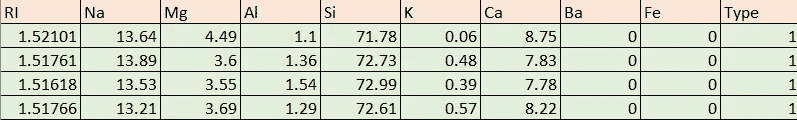

图片:数据集的一瞥

**在数据砖块平台中执行**

为了执行设计过程，我使用了免费的 Databricks 社区版本。

**a)获取数据**

一旦我们将数据上传到数据砖平台，并创建一个集群。我们可以轻易拿到笔记本。笔记本的以下命令块显示了文件位置、类型以及正在读入数据帧(df)的数据。当我们提到 inferSchema=True 时，数据帧中的特征被推断为它们的对应类型。

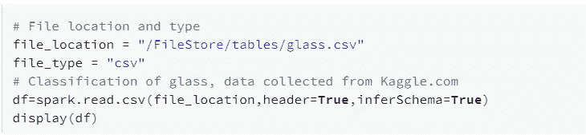

这就是数据在笔记本中的显示方式。

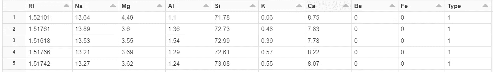

图像:数据块中的数据集

**b)数据理解**

printSchema()显示了数据的细节。除了目标变量是整数之外，其他变量都是双精度类型。

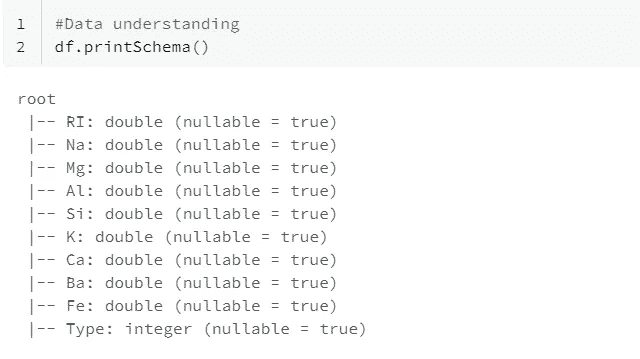

数据类型

在下面的代码片段中，显示了“Type”中标签的变量中不同值的数量。因此，我们知道数据集中记录了六种类型的眼镜。

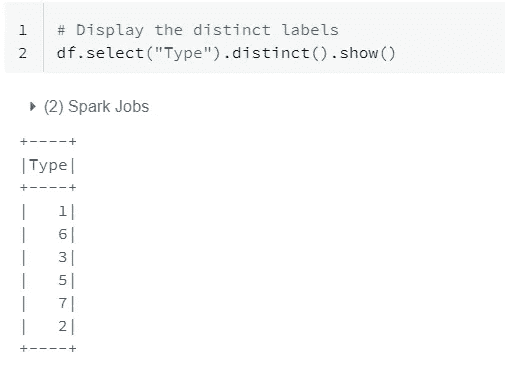

dataframe 的类型变量的不同值

**c)数据组装和转换**

使用 VectorAssembler 对用于预测的特征进行分组，这里所有独立特征(矿物浓度)作为输入列给出，我们得到一个包含每个样本的特征向量的列。

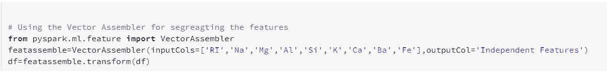

使用矢量汇编程序

从上面我们可以看出，浓度的值是变化的，因此使用特征库中的 MinMaxScaler()来归一化值的分布，如下所示。

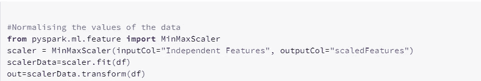

价值观的正常化

下图显示了要素标准化后输出的显示方式。注意:这一步只是提供使用 PySpark 的规范化技术的知识。一般来说，在使用树模型(接下来将在下一节中出现)时，我们不需要对特性进行缩放，因为基于树的算法是基于面向分区创建的。

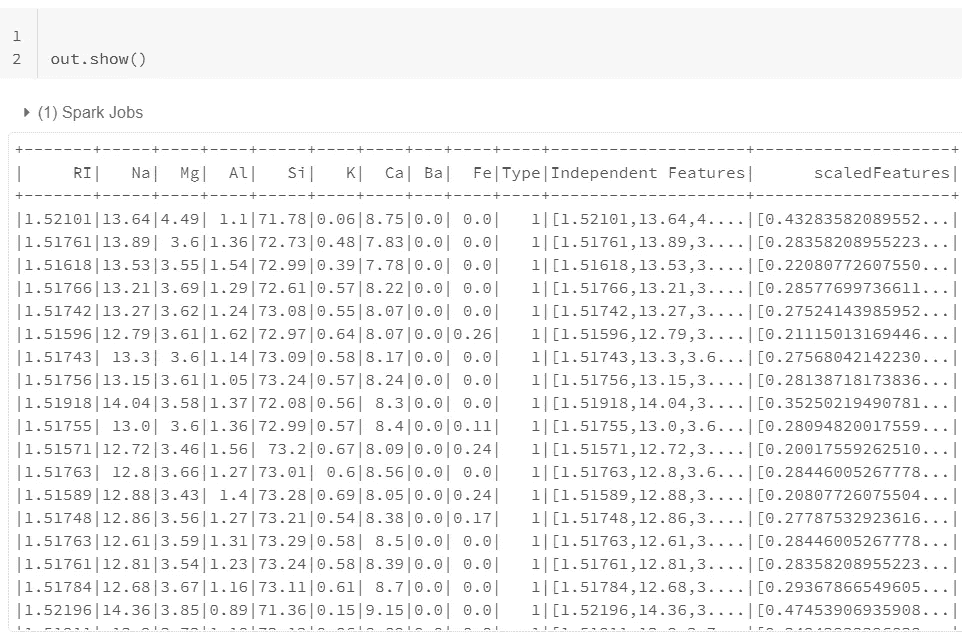

正如我们所知，目标变量被推断为整数，但实际上它们本质上是分类的，因此我在特性上使用 StringIndexer()来标记它，如下所示。

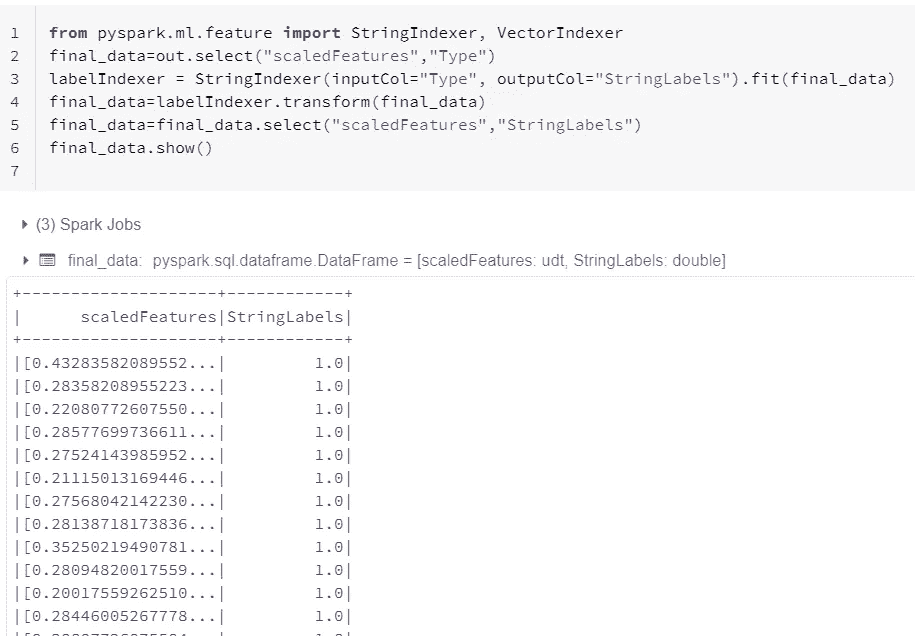

数据转换

将所有转换后的标注与原始要素进行比较，以检查是否有任何遗漏。

**d)数据分割**

使用 PySpark 库的 randomSplit()命令将数据分成 75%的训练数据和 25%的测试数据。

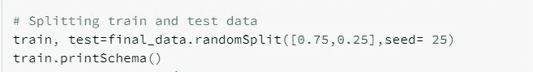

下图显示了训练数据中要素的数据类型。在测试数据中也发现了类似的情况。

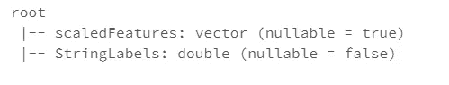

**e)模型分类和评价。**

为了保持模型简单，我使用了 maxdepth=10 的 RandomForest 分类器。我们可以使用 Pyspark 的 Mlib 包中定义的任何模型。下面的代码片段显示了随机森林分类器的初始化，以及如何使用 rfModel.transform()对测试数据进行预测

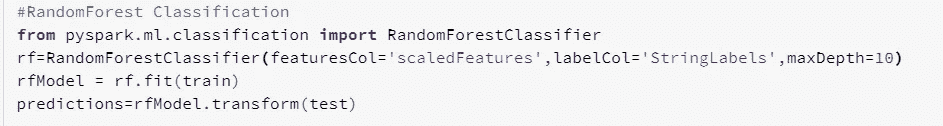

模型设计和预测

模型建立后，pyspark 有一个评估库，我们可以根据问题陈述和模型类型从中选择任何评估者。在这里，模型是在准确性的基础上进行评估的，尽管我在这里只展示了一个演示的准确性，我还检查了模型预测的“f1 得分”和“精确度”。两个分数都显示了大约 0.86 的值。在第一次尝试中，模型评估的准确度约为 0.857。labelCols 字段将包含要预测的列名。

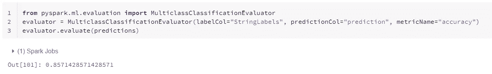

这是我第一次尝试使用 PySpark 和 databricks，但是了解数据以及如何在各种环境中使用数据真的很好。任何建设性的反馈都是最受欢迎的！！！。