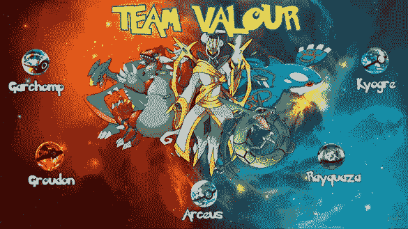
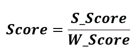
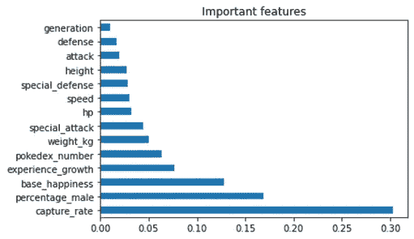
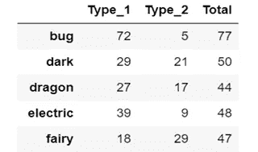
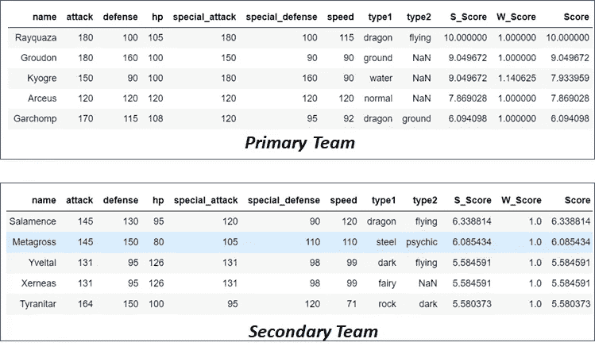
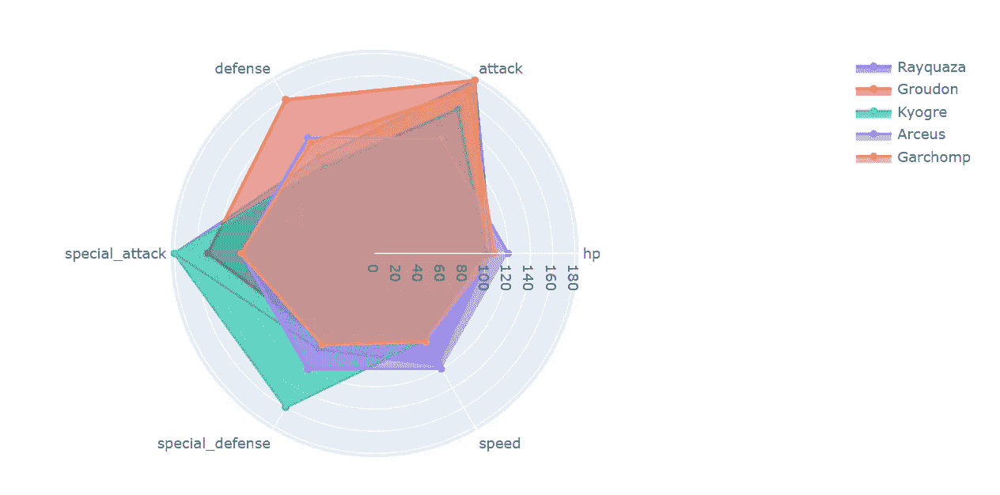
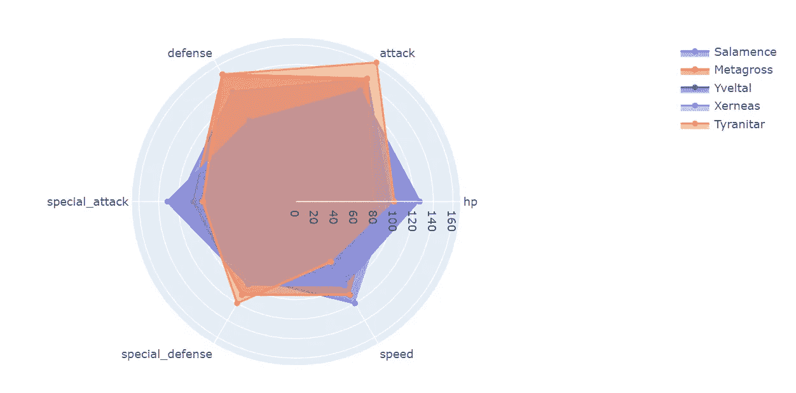
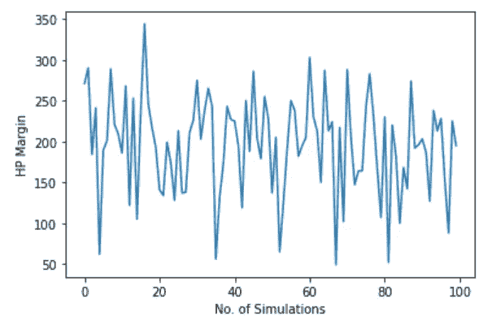
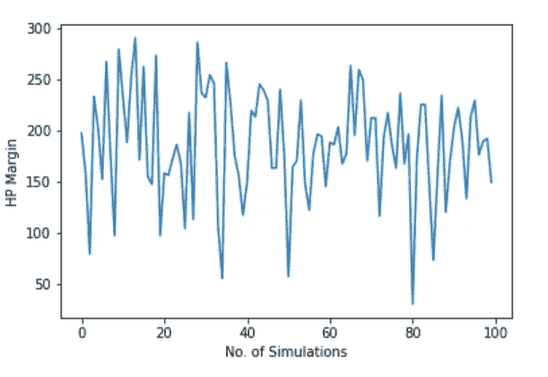

# 使用分析和战斗模拟可视化建立有竞争力的神奇宝贝团队

> 原文：<https://medium.com/analytics-vidhya/building-a-competitive-pok%C3%A9mon-team-using-analytics-and-fight-simulation-visualization-c341c3965223?source=collection_archive---------11----------------------->



来源:作者图片

最近，我和我的队友([](https://www.linkedin.com/in/shubham-gupta-b9595b9b/)*和 [*哈什特*](https://www.linkedin.com/in/harshit-singh-68b54110a/) )一起参加了由 IMI 德里 信息管理和分析俱乐部 [*举办的分析比赛，我们在比赛中胜出。在这篇博客中，我将详细解释我们的解决方案，这可能对类似比赛中的分析爱好者有所帮助。*](https://www.linkedin.com/in/imac-imi-delhi/)*

*您可以从 [*这里*](https://drive.google.com/drive/folders/1jjTHNUu9zeZOp91IzSnXER-MUb-kQVQS?usp=sharing) 下载数据集和问题陈述。*

# *目标*

*本案的主要目标是:*

1.  *使用历史数据创建一个由 5 个神奇宝贝组成的主要和次要团队*
2.  *他们在神奇宝贝竞技场比赛时的统计估计*

# *数据预处理*

***1)删除不相关的列***

*“日语名称”被删除，因为它与我们的分析无关*

***2)处理缺失值***

*I)列中缺少值:“类型 2”、“男性百分比”、“体重公斤”和“身高”*

*ii)“类型 2”列中的缺失值表示神奇宝贝只有一种类型(假设),它被遗漏了。*

*iii)“百分比 _ 男性”栏中缺少的值表示神奇宝贝是无性的(基于已完成的研究),因此用“-999”填充以表示无性*

*iv)使用中间值填充“身高”、“体重 _ 千克”栏的缺失值*

# ***团队组建策略***

*在参加这个比赛之前，我对神奇宝贝知之甚少。有趣的是，我的侄子帮助我理解了与神奇宝贝有关的一切。你可以称之为我的主要研究！！！: )*

## ***有效分数计算***

*我们使用了有效分数法，计算每个神奇宝贝的有效分数，并根据分数选出初级和次级团队。*

**

*有效分数公式*

**这里 S_Score =实力分，W_Score =弱点分。**

****注:*** *在计算最终分数*之前，S_Score 和 W_Score 被归一化*

*从有效得分公式可以明显看出，有效得分会随着神奇宝贝力量的增加而增加，随着弱点得分的增加而减少，反之亦然。*

*现在，我们将不得不计算 *S_Score 和 W_Score。**

## ***力量分数(S_Score)计算***

*在这里，最重要的任务是确定可以用来计算强度得分的变量。由于分数计算的主要目的是建立一个战斗团队，我们选择了可以积极影响其在竞技场中表现的变量。*

*使用以下变量计算强度得分:*

**1)【攻击】，**

**2)【辩护】，**

**3)‘HP’，**

**4)‘特殊 _ 攻击’，**

**5)‘特殊 _ 防御’，**

**6)‘速度’**

***S_score=(攻击 _ 重量×攻击)×(防御 _ 重量×防御)…..(速度 _ 重量×速度)***

*其中*攻击 _ 重量，防御 _ 重量…速度 _ 重量*是用于计算力量值的变量的重量*

***计算强度得分的权重:**使用*随机森林特征重要性计算参与计算强度得分的变量的权重。*传说中的神奇宝贝在竞技场中会比其他人表现更好。基于上述假设，设计了分类模型，计算了特征的重要性，并将其分配给各个变量*(排列重要性应优先于射频特征重要性，因为后者可能会产生误导。参见* [*此处*](https://explained.ai/rf-importance/) *了解更多)**

**

## *弱点得分(W_Score)计算*

*弱点得分是根据每个神奇宝贝相对于其他神奇宝贝的弱点计算出来的。*

*使用以下变量计算弱点得分:*

**1)*T32)【对抗 _bug】，*

**2)*‘反 _ 暗’，*

*……*

**18)*T40)【反 _ 水】*

**(参考数据集以获得完整的变量列表)**

***W_score=(bug_weight×对抗 _ bug)×(dark _ weight×对抗 _dark)…..(水的重量×水的重量)***

*其中 bug_weight、dark_weight 等是用于计算 W_Score 的不同变量的权重。*

***弱点得分权重的计算:**为了计算给予不同变量的权重，计算不同类型神奇宝贝的数量，并相应地分配权重。*

**

*不同类型的神奇宝贝数量*

*采用上述策略是因为每种神奇宝贝的脆弱性因不同种类的神奇宝贝而异。例如，如果错误类型神奇宝贝的数量很高，在战场上遇到错误类型神奇宝贝的概率会更高，因此应该给予“对抗 _ 错误”弱点更多的权重。*

# ***组队***

*一旦我们得到了所有神奇宝贝的有效分数，我们就根据计算出的有效分数对它们进行排序。前五名神奇宝贝被分配到初级队，除了“萨拉门瑟”，因为他的类型与“烈空坐”相同。*(根据问题陈述，每组 5 人应拥有所有不同类型的神奇宝贝)*“烈空坐”比“萨拉米斯”更受青睐，因为其有效得分更高。同样的，二队入选。“萨拉米斯”被分配到二队。*

**

# ***团队统计可视化***

**

*初级团队*

**

*二级团队*

*从上面的图中，我们可以根据不同的参数，如攻击，特殊攻击，hp 等，来比较我们主要和次要团队的不同成员。*

*基于比较，可以得出以下见解:*

*   *“地面”的*防御*和*攻击*在初级队伍中最大，而“盖欧卡”的*特殊防御*和*特殊攻击*最大*
*   **初级队员的 Hp* 和*速度*相差不大。*
*   *在二级队伍中，“暴虐者”的*攻*、*防、*、*专防*最高，而 *hp* 、*专攻*较低。*

# ***战斗估计***

*本次分析的目标是确定神奇宝贝战斗的战斗统计。在选定的主要团队和 100 个随机选择的 5 个神奇宝贝团队之间进行了 100 场战斗的模拟。*

*模拟可以扩展到 nC5 个随机产生的团队。(*注意:*需要大量的计算资源，因此我们将自己限制在 100 次模拟)*

***战斗规则:***

*   *为了保证公平战斗，每个对手还会有 5 只神奇宝贝组成的队伍*
*   *速度更快的神奇宝贝会先攻击*
*   *在上述条件僵持的情况下，将进行随机选择*
*   *只有一个特定类型的神奇宝贝的限制不适用于对手(压力测试)*
*   *一旦被击败(hp =)，神奇宝贝就不能参加其他战斗*
*   *模拟将继续进行，除非对手队伍中的所有神奇宝贝都被击败*
*   *最后一个神奇宝贝站着的队伍将获胜*
*   *当一只神奇宝贝进入下一轮**时，它将携带上一轮战斗中更新的 HP***

***战斗模拟算法:***

*也可以直接参考最后给出的代码。*

***第一步:** *将 2 队各 5 只神奇宝贝载入战斗模拟**

*在这里，我们派出两支队伍在竞技场上战斗。*

***第二步:** *从每支队伍中选择神奇宝贝拥有:HP！=0 和最大(速度)**

*每个队应该选择一个神奇宝贝，它将首先战斗。最大速度和生命值不等于零的神奇宝贝将被选中。*

***第三步:** *载入 2 个选中的神奇宝贝进入战斗模拟**

***第四步:** *计算两个魔法球的攻击点和防御点(工程特征)**

**攻击点数=(神奇宝贝['攻击'] +神奇宝贝['特殊 _ 攻击'] ) / 4**

**防御点数=(神奇宝贝['防御'] +神奇宝贝['特殊 _ 防御'])*4**

*攻击和防御点数表示一只神奇宝贝攻击另一只的能力，以及它在竞技场中躲避其他神奇宝贝攻击的能力。*

***第五步:** *计算每次移动造成的伤害**

**如果:**

**攻击神奇宝贝比防御神奇宝贝有优势类型**

**然后:**

**造成额外伤害(通过神奇宝贝的因子放大攻击['对抗 _ <类型> ]**

**伤害= {攻击点(攻击，口袋妖怪)/防御点(防御口袋妖怪)}*放大系数**

*在这里，我们正在计算伤害(减少生命值)。伤害将取决于对手的攻击点和玩家的防御。*

***第六步:** *两者中速度较大的神奇宝贝会先攻击**

**(概念取自神奇宝贝* [*玩法*](https://en.wikipedia.org/wiki/Gameplay_of_Pok%C3%A9mon) *)**

***第七步:** *战斗在两个魔怪之间结束**

***第八步:** *计算防御神奇宝贝的生命值:**

**HP = HP -伤害**

*其他人的 HP 将为零*

***第九步:** *检查总 HP(团队 HP)= 0**

**然后；结束战斗**

**否则:继续:**

*幸存的口袋妖怪带着剩余的血量进入下一轮*

*幸存的神奇宝贝以最高速度与下一个对手神奇宝贝战斗*

*从步骤 3 开始重复*

***第十步:** *防守神奇宝贝轮到进攻**

***第 11 步:** *重复第 7-10 步**

***第 12 步:** *迭代直到队伍中的一个用完所有 5 个神奇宝贝，即队伍 HP=0(被打败的神奇宝贝不能再战)**

***第十三步:** *用 HP 余量宣布获胜队伍**

*以下输出显示了主队和随机选择的对手队之间的一场战斗的细节:*

```
*Battle Number:  1
--------------------------------------------------------------------
BATTLE BEGINS
--------------------------------------------------------------------
Total Hp Team 1:  533
Total Hp Team 2:  248
----------------------------------------------------------------
Arceus vs Kadabra
HP1:  120 	HP2:  40
HP1:  81 	HP2:  0
Fight Ends
----------------------------------------------------------------
Total Hp Team 1:  494
Total Hp Team 2:  208
----------------------------------------------------------------
Arceus vs Volbeat
HP1:  81 	HP2:  65
HP1:  17 	HP2:  0
Fight Ends
----------------------------------------------------------------
Total Hp Team 1:  430
Total Hp Team 2:  143
----------------------------------------------------------------
Arceus vs Finneon
HP1:  17 	HP2:  49
HP1:  0 	HP2:  32
Fight Ends
----------------------------------------------------------------
Total Hp Team 1:  413
Total Hp Team 2:  126
----------------------------------------------------------------
Rayquaza vs Finneon
HP1:  105 	HP2:  32
HP1:  74 	HP2:  0
Fight Ends
----------------------------------------------------------------
Total Hp Team 1:  382
Total Hp Team 2:  94
----------------------------------------------------------------
Rayquaza vs Sandile
HP1:  74 	HP2:  50
HP1:  25 	HP2:  0
Fight Ends
----------------------------------------------------------------
Total Hp Team 1:  333
Total Hp Team 2:  44
----------------------------------------------------------------
Rayquaza vs Squirtle
HP1:  25 	HP2:  44
HP1:  0 	HP2:  19
Fight Ends
----------------------------------------------------------------
Total Hp Team 1:  308
Total Hp Team 2:  19
----------------------------------------------------------------
Garchomp vs Squirtle
HP1:  108 	HP2:  19
HP1:  90 	HP2:  0
Fight Ends
----------------------------------------------------------------
Total Hp Team 1:  290
Total Hp Team 2:  0
--------------------------------------------------------------------
BATTLE ENDS
Winner: Team  1 by  290  points*
```

# ***模拟结果***

***有对手的初级团队***

```
*Number of Times primary team won:  100
Number of Times opposition team won:  0
Avg margin:  196.04
Std Deviation in margin:  60.09*
```

**

*模拟结果*

***二级队与对手***

```
*Number of Times secondary team won:  99
Number of Times opposition team won:  1
Avg margin:  185.71
Std Deviation in margin:  53.24*
```

**

*模拟结果*

# *战斗评估代码*

*你可以在我的 [Github](https://github.com/satyamsanu/Building-a-Competitive-Pok-mon-Team-using-Analytics-and-Fight-Simulation-Visualization) 上找到完整的代码。*

*可以在 [*LinkedIn*](https://www.linkedin.com/in/satyamsanu/) *上联系我。关注我，获取更多关于分析和数据科学的文章。**