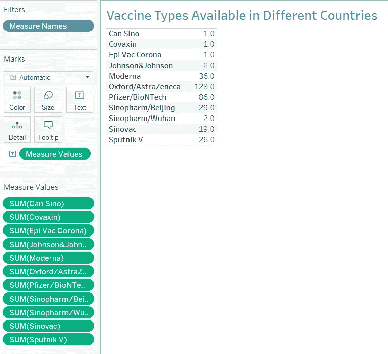
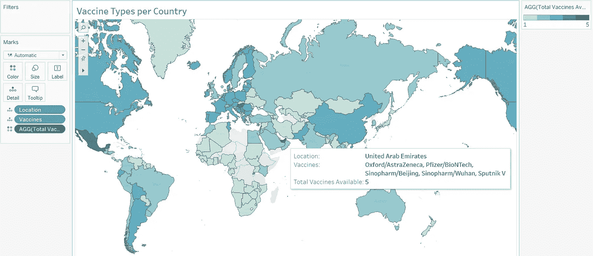

# 在 Tableau 构建新冠肺炎疫苗接种仪表板

> 原文：<https://medium.com/analytics-vidhya/building-a-covid-19-vaccination-dashboard-in-tableau-53971bf2e15e?source=collection_archive---------6----------------------->

# 介绍

Tableau 是一个强大的数据可视化软件，它的流行很大程度上归功于它的**交互式可视化&用户友好界面**。

随着 ***【新冠肺炎】【疫情】*** 肆虐全球，最近几个月疫苗接种的可用性让人松了一口气。在当今数据驱动的世界，这也意味着新数据的产生，反过来，*对新见解的需求*。

将 Tableau 的可视化能力与不断增长的疫苗接种数据相结合，以**仪表板**的形式，将帮助我们获得当前疫苗接种场景的鸟瞰图。

以下是如何在 Tableau 中构建**新冠肺炎疫苗接种仪表板**的分步指南。

# 数据

数据取自[我们的数据世界](https://github.com/owid/covid-19-data/tree/master/public/data/vaccinations)，它定期维护、跟踪&更新 Github 存储库中的新冠肺炎数据。

该分析使用来自文件*‘接种疫苗. CSV’*和*‘位置. CSV’*的数据。文件***‘接种. CSV’***包含与 ***总接种量、每日接种量、至少接种一次的人数、完全接种人数、*** 等相关的国家、地区&全球数据。文件*‘locations . CSV’*包含与 ***疫苗接种类型/品牌*** 相关的国别数据。

从 2020 年 12 月**开始接种疫苗到 2021 年 4 月 17 日**的数据在本分析的范围内。****

*******注:*** *为了更好的可视化，我对数据做了一些预处理，比如创建虚拟变量，提取最近的日期，将数据分成国家、地区和全球表。*****

# ****规划仪表板****

****构建有效仪表板的关键步骤是**提前计划**。我希望该控制面板反映的几个重要指标是:****

*   ****可用的不同类型的疫苗&最常用的****
*   ****接种一次和全部疫苗的人****
*   ****迄今接种的疫苗总数****
*   ****每日接种疫苗****

****这可能需要大约 4-6 次可视化，为每个指标使用最合适的类型。****

# ****入门指南****

# ****步骤 1:可视化新冠肺炎疫苗接种类型/品牌及其可用性****

****我们都听说过一些疫苗品牌名称，如*阿斯利康*、*辉瑞* …..但仅此而已吗？让我们找出不同国家的所有疫苗品牌:****

## ****打开 Tableau →连接到文件“locations.csv”****

********

****请注意，我已经为上面的每个疫苗品牌预先创建了虚拟列。对于每个品牌，**【1】**表示在相应国家有售，**【0】**表示没有。****

****在原始文件中，只有一栏叫做**‘疫苗’。**显示每个国家的所有疫苗品牌。****

## ****打开一个新工作表****

********

****如您所见，所有疫苗品牌都列在**数据窗格的**测量字段**中。**让我们将它们一个个拖到**卡片/货架上。******

****

**这显示了每一列的总和，这是在这种情况下可用的国家的数量。**

**水平条形图**最适合可视化该数据。前往**向我展示**选项，并选择一个条形图。返回以下图表。您可以根据需要**格式化**图表和**编辑**轴。****

****

**我们的第一次可视化已经准备好了:**

****

**我们可以看到全球有 11 种疫苗类型，其中*阿斯利康*是在 **123 个国家**最广泛使用的品牌，其次是*辉瑞*。**

**让我们通过创建一个显示**疫苗类型**和每种疫苗中可用的**疫苗总数**的**地图**来直观地展示它们在各个国家是如何可用的。**

## **打开一个新工作表**

****

**在**尺寸区域，****【位置】**字段包含国家名称。确保该符号是一个**地球仪**，如果不是，通过点击当前符号并分配**“国家”**作为**地理角色来设置它。****

**然后，将其拖至空白区域**。** Tableau 创建一个**地图。****

****

**注意在地图的右下方，显示了 **4 个未知数。**这意味着 Tableau 没有识别 4 个位置。要解决这个问题，点击 **4 未知**，通过输入未识别值的坐标**手动编辑位置**。**

****

**为了显示每个国家的**疫苗类型**，将**‘位置’**和**‘疫苗’**拖到**标记卡**上。现在，当你悬停在一个国家上方时，地图会显示该国可用的疫苗。**

****

**让我们将每个国家的疫苗总数添加到这个地图上，并创建一个 **Choropleth 地图。**为此，我们需要创建一个**计算字段**，它计算每个国家的疫苗数量。转到**分析** → **创建计算字段** → **合计**每个国家的疫苗列。创建字段**‘可用疫苗总数’**后，将其拖到卡片上，并将符号设置为**颜色。****

****

**我们的 **Choropleth 地图**准备好了！国家越黑暗，可用的疫苗品牌就越多，反之亦然。**

****

# **步骤 2:可视化全国范围内实施的全部疫苗接种**

**我们已经知道哪个国家使用什么类型的疫苗。但是每个国家使用了多少剂量呢？让我们创造一些**包装的泡泡**来了解截至 2021 年 4 月 17 日，在世界上施用的疫苗总剂量中，哪些国家施用了最多的剂量。**

****打开一个新的工作表** → **数据→新数据源→**→*' neptocations . CSV '***

**注意:在我的文件中，我已经创建了一个新的表格，上面有每个国家最近的日期。**

****

**在工作表中，将**‘位置’**&**‘接种总数’**字段拖至工作区。**

****

**我们希望将这些数字表示为接种疫苗总数的百分比**%**，以便进行有意义的比较**。**转到**分析→总计→显示列总计。**现在点击卡片**中的**“接种总数”**测量→快速表格计算→总数的百分比。****

****

**转到**演示**选项，选择**打包气泡**。为了给气泡添加每个国家的颜色，再次拖动**‘位置’**到卡片上，并将其设置为**颜色**。**

****

**数据集中有 182 个国家，所以我们有这么多泡沫！让我们修改**过滤器**以仅显示那些对世界上实施的疫苗接种总量贡献**超过 1%** 的国家。你也可以根据自己的喜好**排序**数据。**

****

**包装好的泡泡已经准备好了，泡泡越大，该国在全球接种疫苗总量中的份额就越大。**

****

# **步骤 3:可视化世界范围内实施的每日疫苗接种**

**从之前的图像中，我们知道与世界其他国家相比，美国、印度和中国注射了最多的疫苗。但是全世界每天实际上有多少疫苗在使用呢？让我们为此创建一个**线图**。**

**在一个**的新工作表**中，我已经建立了一个到我修改过的*‘nevaccinations . CSV’*文件中的**‘World’**工作表的连接，在那里我已经从主文件中复制了所有与全球数字相关的数据。**

****

**从工作簿的**数据窗格**中，将**‘日期’**字段拖到**行**架&**‘每日疫苗接种’**字段拖到**列**架。Tableau 在“日期”字段中显示**年**。让我们通过点击**年(日期)**旁边的 **+** 图标，并选择**日，将其更改为**日、**。****

**现在转到**展示**并选择**行:****

********

**我们创建了一个简单但信息丰富的图表，向我们展示了截至 2021 年 4 月 17 日全球范围内每日接种的疫苗剂量。请注意剂量在 2021 年 4 月 13 日后开始**下降。快速的网络搜索揭示了最近世界范围内疫苗的短缺:****

> **“疫苗短缺主要源于印度决定停止从其血清研究所工厂出口疫苗，该工厂生产阿斯利康的绝大多数疫苗，COVAX 指望在冠状病毒在全球范围内激增时供应全球约三分之一的人口。”**
> 
> **— **商务标****

# **步骤 4:可视化接种一次疫苗的人与完全接种的人**

**让我们更深入地探究一下，这些疫苗接种数字是如何分解成只接种过一次疫苗的人和完全接种过疫苗的人的。有趣的是，我们想知道这一指标在不同国家和地区之间会有什么不同。**

**对于一个**国家级**分析，一个**符号地图**将是完美的。**

**在新的工作簿中，选择与**步骤 2** 中相同的工作表*‘接种疫苗. CSV’*。**

**拖动**‘地点’，【接种人群】，**，&，**，【完全接种人群】，**创建一个表格。**

**列**‘接种人群’**代表至少接种过一次**疫苗的人群。*这意味着，如果一个人注射了第一针，这个数字增加 1，如果他们注射了第二针，这个数字保持不变*。*因此，我们可以计算:***

******只接种过一次的人=接种过的人—完全接种过的人******

***让我们为接种过一次 *，*的**人创建一个**计算字段**，并将其拖到表格上:*****

******

***更全面的方法是将这些数字表示为每个国家接种疫苗总人数的百分比。为此，创建两个**计算字段**，即**接种一次%** 和**接种完全%**，将这些数字除以**“接种人数”**:***

******

***将创建的字段拖到表中，并删除旧的字段:***

******

***最后，要创建地图，请转到**数据选项卡**中的**维度**，并将**国家**指定为**地理角色**，用于**‘位置’**字段。进入**展示**，选择**符号贴图**:***

******

***符号图上显示**接种过一次的人**为圆圈的**大小**，接种过一次的人**为**颜色**。**一个**更大更轻的**圆圈**，**表示**更多的**人已经**接种过一次而不够充分。**一个**更小更暗的**圆圈，表示**更多的**人已经**接种完全。*****

******

***对于**地区层面的**分析，一个**并排条形图**将是最合适的，一个条形图反映**接种过一次**的人，另一个条形图反映**接种过全部**的人。***

***为此，我建立了一个到一个表的连接，在这个表中，我已经从*‘nevaccinations . CSV’*文件中复制了地区数字。***

******

***按照上述国家地图中相同的步骤创建表格和**接种一次%** & **接种完全%** 字段。进入**展示**，选择**并排条形图:*****

******

***我们最终的可视化完成了:***

******

# ***步骤 5:创建仪表板***

***让我们将所有工作表整合到一个仪表板中，这样我们就可以一目了然地比较不同的指标。***

***为此，请单击 Tableau 屏幕底部的**新仪表板**图标，这将打开一个新仪表板:***

******

***在这里你可以看到**仪表板窗格**，在这里你可以设置仪表板的**尺寸**并将纸张从**纸张**窗格拖到空白处。让我们拖动工作表，开始构建仪表板:***

******

***调整可视化图的**尺寸**和**位置**，可以选择保留或丢弃任何可视化图的**图例**。最后，在仪表板上添加一个标题。***

*****新冠肺炎疫苗接种仪表板**完成:***

******

***新冠肺炎疫苗接种仪表板***

***[**查看交互式仪表盘上的 Tableau**](https://public.tableau.com/profile/ruhi2825#!/vizhome/CovidVaccineBarChart/CovidVaccinationDashboard)***

# ***分析仪表板***

***新冠肺炎疫苗接种仪表板提供了许多有趣的见解，例如:***

*   ******阿斯利康*** 和 ***辉瑞*** 是世界上最广泛可用的**疫苗*****
*   ***匈牙利、 ***、阿联酋、*** 和 ***墨西哥*** 的疫苗种类最多***
*   ***迄今为止，美国、中国、印度、中国和印度共接种了**到**的疫苗，其数量高达**的 57%*****
*   ***北美 T54、T55、T56、T57 地区的人们接种全面疫苗的速度要快得多，这些国家 58%的人接种了两种疫苗。 ***亚洲人*** 有大量的人接种了第一剂疫苗**，**但是只有 **26%** 的人接种了全程疫苗。***
*   ***以色列完全接种疫苗的人数最多，93%的人接种了两种疫苗。***
*   ***自 2021 年 4 月**第二周**以来，由于全球**疫苗短缺**，全球每日接种疫苗数量**下降**。主要是由于印度决定停止出口疫苗，以及全球冠状病毒感染的激增。***

# ***结论***

***Tableau 是一个非常棒的工具，可以创建令人惊叹的可视化效果，并以仪表板的形式整合可视化效果。这是一种**无代码的分析方法**。新冠肺炎疫苗接种仪表板展示了如何利用 Tableau 以视觉上吸引人和有启发性的可视化形式收集惊人的见解。***

> ***我是一名数据科学爱好者和 MBA 毕业生，对研究和统计充满热情。您可以在以下网址找到我:***
> 
> *****领英**:[https://www.linkedin.com/in/ruhii/](https://www.linkedin.com/in/ruhii/)***

****原载于 2021 年 4 月 24 日 https://www.analyticsvidhya.com***。*****