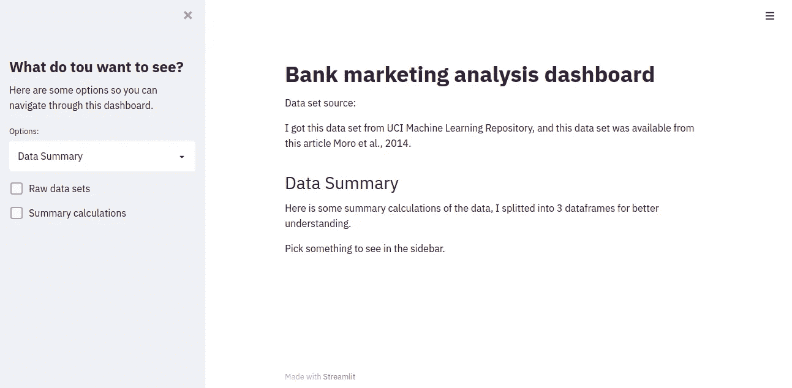
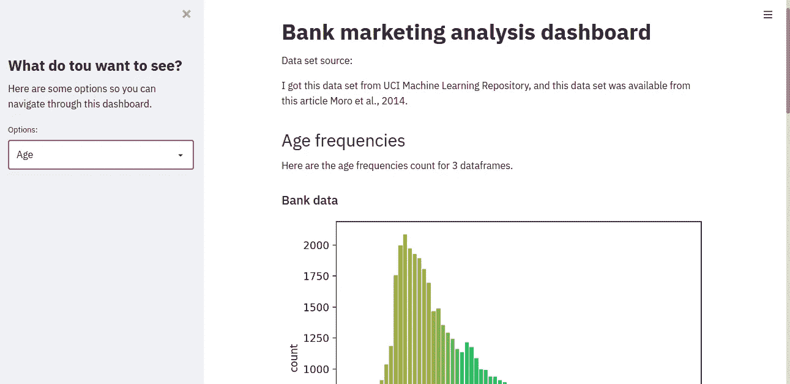

# 在 Streamlit 上构建功能性仪表板

> 原文：<https://medium.com/analytics-vidhya/building-a-functional-dashboard-on-streamlit-bff831fdc2aa?source=collection_archive---------10----------------------->

## 了解如何在屏幕上只显示您想要的数据。


弗兰基·查马基在 [Unsplash](https://unsplash.com/) 上拍摄的照片

按照展示我的项目的一些结果的想法，我开始寻找一些可以帮助我做到这一点的平台，我唯一的限制是能够显示 Seaborn 和 Plotly 情节。但问题是，做我正在寻找的最好的选择是破折号，然而，它只适用于 Plotly，进入 Streamlit。

Streamlit 是一个框架，您可以在其中将数据显示到应用程序中，它是一个非常用户友好的库和界面，可以让您以人们可以轻松看到的方式掌握编码和部署结果的诀窍。

这篇文章是我对这个框架的一点经验，希望它能帮助你在未来建立自己的应用程序。你可以在 Github 的这里看到我的代码[。](https://github.com/romulocrp/bank_marketing_data_analysis)

# **入门**

首先，看看应用完成后会是什么样子:



应用程序的第一页。



这里显示了一些数据。

所以这个框架是非常模块化的，而且非常模块化，非常用户友好，所以，我将向你们展示如何按照我想要实现的目标来构建它。

首先，你应该在你的页面上设置所有不可改变的元素，这里我们看到的是边栏和标题中的元素，在屏幕上写有这 4 行可以帮助你:

```
import streamlit as stst.title()
st.header()
st.subheader()
st.write()
```

所以如果你想在侧边栏上插入东西，那真是痛苦而又辛苦的过程:

```
st.sidebar.title()
st.sidebar.header()
st.sidebar.subheader()
st.sidebar.write()
```

就是这样，现在老实说，这个框架可能不是最可定制的，但它真的很好地实现了它的目标，以一种简单的编码方式显示您的数据。

这里还有两个东西，叫做交互式小部件，假设你想选择你想看的数据，这是你的查看者会做的方式，在这个应用程序中，有两个:

```
st.selectbox()
st.checkbox()
```

我们开始时关心的另一件事是显示数据，有许多选项，这里我使用 4 种方式:

```
st.dataframe()
st.table()
st.pyplot()
st.plotly_chart()
```

它们都是不言自明的，在这个过程中，您将通过更多的例子了解如何使用这些特性。

# 将所有元素组装在一起

既然构建这个仪表板的所有元素都已经解释了，现在是时候把它们放在一起，制作一个非常交互式的仪表板了。

构建应用程序时要记住的一点是，每次在测试环境中重新运行脚本时，streamlit 都会从头到尾读取脚本，就像 Python 解释器一样，这意味着将元素放在一起的顺序很重要(实际上有一种方法可以忽略这一规则，但现在并不重要)。

现在我向你展示如何做图片中的每一个元素。

## 人们将如何导航？

让我们从大管理器开始，选择框，我将展示代码，您将看到使用此框架的编码是多么直观:

```
option = st.sidebar.selectbox('Options:', ('Data Summary', 'Age', 'Job', 'Duration',...))
```

这里真正的技巧是在一个变量中赋值，这样你可以在以后调用它，让页面响应查看者的选择。偶尔使用一个元组总是好的。

## 我将如何绘制图表？

我将向您展示我是如何显示来自不同库的每个图形的，实际上，Streamlit 的这一功能非常有助于您选择当前的最佳选择，现在让我们来看看。

这里是`pyplot`:

```
if option == 'Age':
    st.header('Age frequencies')
    st.write('Here are the age frequencies count for 3 dataframes.')
    st.subheader('Bank data')
    fig1 = plt.figure()
    age_freq = sns.countplot(x=bank_data['age'])
    age_freq.set_xticklabels(age_freq.get_xticklabels(), rotation=40, ha="right")
    age_freq.xaxis.set_major_locator(ticker.MultipleLocator(5))
    st.pyplot(fig1)
```

这里有些东西需要你看一下，首先，使用条件语句，通过在选择框中选择一个选项来创建页面中的更改，它可以在整个代码中重复，它有点像是在应用程序上显示你的绘图的块。

另一件事是您将调用图形，而不是图形本身，这很重要，因为`figure`是 streamlit 将在应用程序中显示的图像对象。

这是给 plotly 的:

```
if option == 'Last contact date':
    st.header('Last contact date frequencies')
    st.write('Here are the last contact frequencies count for 3 dataframes.')
    st.subheader('Bank data')
    df_count = bank_data[['lc_date', 'y']].groupby(['lc_date']).count().reset_index()
    df_count_date = px.histogram(x=df_count['lc_date'],
                                 y=df_count['y'])
    st.plotly_chart(df_count_date)
```

这实际上比`pyplot`要简单一些，因为一旦你有了你的数据设置，plotly express 更容易绘制。

## 如何显示类似表格的数据？

所以，如果你注意图片，你会发现如果我更改选择框上的选项，复选框就会消失，所以让我们来看看这是如何发生的:

```
if option == 'Data Summary':
    st.header('Data Summary')
    st.write('Here is some summary calculations of the data, I splitted into 3 dataframes for better understanding.')
    if st.sidebar.checkbox('Raw data sets'):
        st.subheader('Bank data')
        st.dataframe(bank_data.head())
        st.subheader('yes_df:')
        st.dataframe(yes_df.head())
        st.subheader('no_df:')
        st.dataframe(no_df.head()) if st.sidebar.checkbox('Summary calculations'):
        st.subheader('Bank data summary:')
        st.table(bank_data.describe())
        st.subheader('yes_df summary:')
        st.table(yes_df.describe())
        st.subheader('no_df summary:')
        st.table(no_df.describe())
    else: st.write('Pick something to see in the sidebar.')
```

我实际上尝试了`elif`，但是如果你选择了第一个选项，第二个选项就会消失，如果你不想这样，那是我的解决方法，大量的‘如果’。

这里需要注意的另一件事是，我使用了一个数据框架，一个数据框架和一个表格到一个表格，这个决定给应用程序的感觉就像你使用 Jupyter 笔记本一样。

但是你应该在这里看到的最大的细节是使用`head`，当我开始的时候，我想“让我们把所有的数据都放进去，这样人们就可以一直滚动了！”这是一个错误，在我尝试的时候，我的电脑死机了 4 次，另外，我的文件有大约 45，000 行，这对 streamlit 来说太难处理了。在论坛上阅读，我了解到在这种情况下，streamlit 会冻结并消耗你所有的内存，这并不理想，但并不奇怪，因为这是一个非常繁重的任务，正如你所看到的，并不是真正必要的。

# 结论

这样做很棒，现在我有了一个基于浏览器的应用程序来显示和组织我得到的结果。我试图将它部署到生产环境中，但是，目前还不能将我的文件上传到 streamlit webserver 中以部署到生产环境中，尽管如果您使用 API 来获取数据，这不是问题，它应该工作得很好。

下一步是开始一个机器学习基准，我很期待，祝你愉快！