# 构建车道检测系统

> 原文：<https://medium.com/analytics-vidhya/building-a-lane-detection-system-f7a727c6694?source=collection_archive---------0----------------------->

使用 Python 3 和 OpenCV

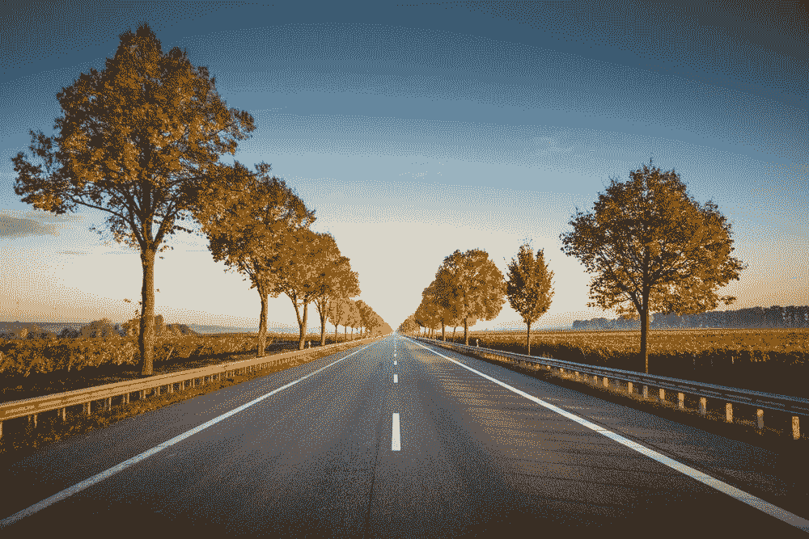

[来源](https://unsplash.com/photos/rafblRbne3o)

在本教程中，我们将学习如何使用计算机视觉技术建立一个跟踪道路车道的软件管道。

[](https://github.com/Arun-purakkatt/medium_repo) [## Arun-purakkatt/medium_repo

### 中型博客-机器学习、深度学习、数据科学- Arun-purakkatt/medium_repo

github.com](https://github.com/Arun-purakkatt/medium_repo) 

***道路车道检测面临挑战？***

道路上显示车道位置的线条是我们不断的参考。我们使用基于 canny 检测器-Hough 变换的车道检测。

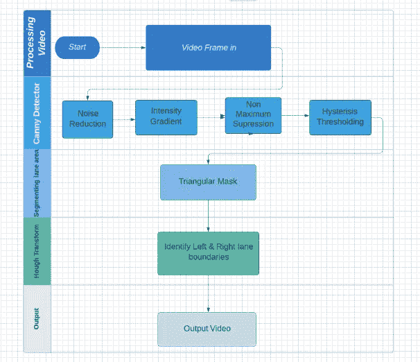

Canny-Hough 检测器工艺流程

下图是我们管线的概述。

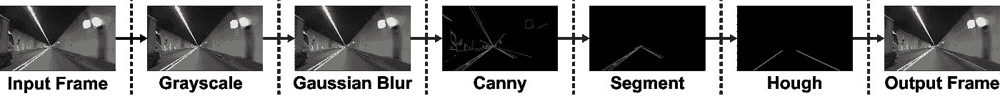

Canny-Hough 检测系统概观

**方法:**

Canny 边缘检测器需要灰度图像，因此我们需要将图像转换成灰度图像。我们将 3 个通道的像素值(红色、绿色和蓝色)合并成一个通道，像素值范围为[0，255]。

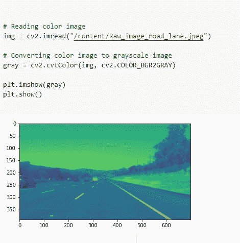

在我们的灰度图像上创建高斯模糊，这不是强制性的，因为 canny detector 会为我们做这一步。

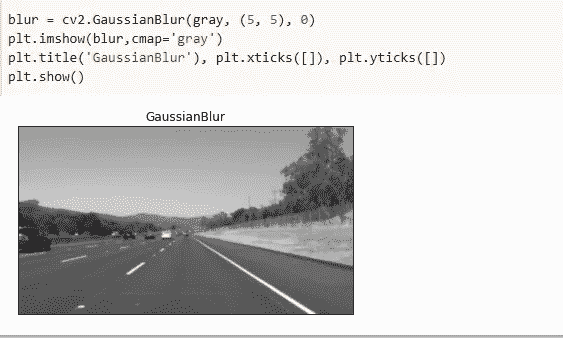

高斯模糊

让我们了解一下 canny 边缘检测器，你可以在这里找到详细的文档。下面是代码片段。

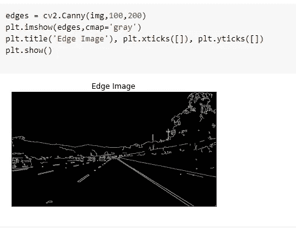

Canny 边缘检测器

通过阅读几篇文章，我发现，这些预处理步骤中的每一步都依赖于数据集。

车道线总是黄白相间的。黄色在 RGB 空间中可能是一种难以分离的颜色，所以让我们将其转换为[色调值饱和度](https://en.wikipedia.org/wiki/HSL_and_HSV)或 HSV 颜色空间。你可以通过谷歌搜索找到黄色值的目标范围。下面是我用过的。接下来，我们将对原始 RGB `image`应用遮罩，以返回我们感兴趣的像素。

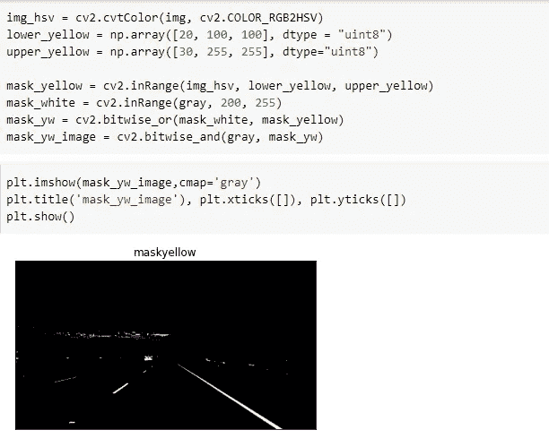

**设置环境**

确保您已经安装了 opencv。安装 numpy 和 matplotlib 库，因为我们在处理时需要它们。

```
pip install opencv-python
```

**导入库**

```
**import** **cv2**
**import** **matplotlib.pyplot** **as** **plt**
**import** **numpy** **as** **np**
```

**图像预处理**

灰度图像:灰度图像的复杂度低于彩色图像。我们可以谈论图像的许多特征，亮度、对比度、边缘、形状、轮廓、纹理、透视、阴影等等，而不涉及颜色。在提出灰度图像模型后，它可以扩展到彩色图像。

**高斯滤波器**:高斯滤波器的目的是减少图像中的噪声。我们这样做是因为 Canny 中的梯度对噪声非常敏感，所以我们希望尽可能消除噪声。

*cv2。高斯-布朗参数:img，ksize，sigma*

img:我们要拍的照片

ksize:我们对图像进行卷积的 kerenel 的维度。

sigma:定义沿 x 轴的标准偏差。

**canny-edge detection** :基本思想是检测亮度的急剧变化，如从黑到白、从白到黑&将其定义为边缘。降噪，强度梯度，非最大值抑制，滞后阈值。它有 3 个参数。

*   *img* 参数定义了我们将要检测边缘的图像。
*   *阈值-1* 参数过滤低于该数字的所有渐变(它们不被视为边缘)。
*   *threshold-2* 参数决定了一个边沿的有效值。
*   如果连接到高于*阈值-2* 的另一个梯度，则两个阈值之间的任何梯度都将被考虑。

```
#convert into grey scale image
def grey(image):
  image=np.asarray(image)
  return cv2.cvtColor(image,cv2.COLOR_RGB2GRAY)#Gaussian blur to reduce noise and smoothen the image
def gauss(image):
  return cv2.GaussianBlur(image,(5,5),0)#Canny edge detection
def canny(image):
    edges = cv2.Canny(image,50,150)
    return edges
```

这就是我们的图像经过精明的边缘检测后的样子。

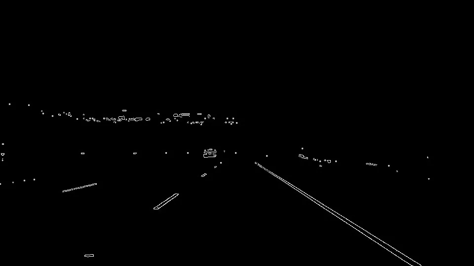

所以我们可以看到它包含了我们图像中的所有边缘&我们应该隔离车道线的边缘。

既然我们已经定义了图像中的所有边缘，我们需要隔离与车道线对应的边缘。这就是我们要做的。

```
**def** region(image):
    height, width = image.shape
    triangle = np.array([
                       [(100, height), (475, 325), (width, height)]
                       ])

    mask = np.zeros_like(image)

    mask = cv2.fillPoly(mask, triangle, 255)
    mask = cv2.bitwise_and(image, mask)
    **return** mask
```

该功能将隔离图像中车道线所在的特定硬编码区域。它接受一个参数，Canny 图像，并输出隔离区域。

在第 1 行，我们将使用 numpy.shape 函数提取图像尺寸。
在第 2–4 行，我们将定义一个三角形的尺寸，这是我们想要隔离的区域。
在第 5 行和第 6 行，我们将创建一个黑色平面，然后用第 2 行定义的尺寸定义一个白色三角形。
在第 7 行，我们将执行按位 and 运算，这允许我们隔离与车道线对应的边。

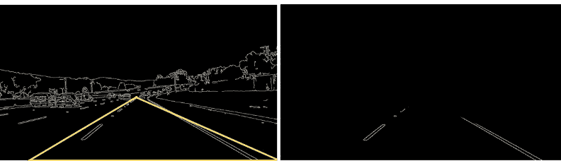

仅输出隔离区域中的边缘。其他的都被忽略了

霍夫线变换:

这一行代码是整个算法的核心。这就是所谓的霍夫变换，将孤立区域中的白色像素簇转化为实际的线条。

```
lines = cv2.HoughLinesP(isolated, rho=2, theta=np.pi/180, threshold=100, np.array([]), minLineLength=40, maxLineGap=5)
```

参数 1:孤立梯度
参数 2 和 3:定义面元大小，2 是 rho 的值，np.pi/180 是θ的值
参数 4:每个面元被认为是一条线所需的最小交点(在我们的例子中，它有 100 个交点)
参数 5:占位符数组
参数 6:最小线长度
参数 7:最大线间隙

优化和显示线条

为了平均这些线，我们将定义一个名为“平均”的函数。

```
def average(image, lines):
    left = []
    right = []
    for line in lines:
        print(line)
        x1, y1, x2, y2 = line.reshape(4)
        parameters = np.polyfit((x1, x2), (y1, y2), 1)
        slope = parameters[0]
        y_int = parameters[1]
        if slope < 0:
            left.append((slope, y_int))
        else:
            right.append((slope, y_int))
```

该功能将 *cv2 中的线平均化。HoughLinesP* 功能。它将找到左边和右边线段的平均斜率和 y 截距，并输出两条实线(一条在左边，另一条在右边)。

在 *cv2 的输出中。HoughLinesP* 函数，每个线段有 2 个坐标:一个表示线的起点，另一个标记线的终点。使用这些坐标，我们将计算每条线段的斜率和 y 轴截距。

然后，我们将收集所有线段的斜率，并将每个线段分类到对应于左线或右线的列表中(负斜率=左线，正斜率=右线)。

*   第 4 行:循环遍历该行数组
*   第 5 行:从每个线段中提取 2 个点的(x，y)值
*   第 6–9 行:确定每条线段的斜率和 y 截距。
*   第 10–13 行:将负斜率添加到左侧线的列表中，将正斜率添加到右侧线的列表中。

注意:通常，正斜率=左线，负斜率=右线，但是在我们的例子中，图像的 y 轴是反转的，这就是斜率反转的原因(OpenCV 中的所有图像都有反转的 y 轴)。

接下来，我们必须从两个列表中取斜率和 y 截距的平均值。

```
 right_avg = np.average(right, axis=0)
    left_avg = np.average(left, axis=0)
    left_line = make_points(image, left_avg)
    right_line = make_points(image, right_avg)
    return np.array([left_line, right_line])
```

*   第 1–2 行:取两个列表(左侧和右侧)中所有线段的平均值。
*   第 3–4 行:计算每条线的起点和终点。(我们将在下一节定义 make_points 函数)
*   第 5 行:输出每行的 2 个坐标

现在我们有了两个列表的平均斜率和 y 轴截距，让我们定义两个列表的起点和终点。

```
def make_points(image, average): 
 slope, y_int = average 
 y1 = image.shape[0]
 y2 = int(y1 * (3/5))
 x1 = int((y1 — y_int) // slope)
 x2 = int((y2 — y_int) // slope)
 return np.array([x1, y1, x2, y2])
```

这个函数有两个参数，一个是车道线的图像，一个是车道线的平均斜率和 y_int 的列表，并输出每条车道线的起点和终点。

*   第 1 行:定义函数
*   第 2 行:获得平均斜率和 y 截距
*   第 3–4 行:定义线条的高度(左右两边都一样)
*   第 5–6 行:通过重新排列一条线的方程，从 *y=mx+b* 到 *x = (y-b) / m* 计算 *x* 坐标
*   第 7 行:输出坐标集

更详细地说，在第 1 行，我们使用 *y1* 值作为图像的高度。这是因为在 OpenCV 中，y 轴是反的，所以 0 在顶部，图像的高度在原点(参考下图)。

同样，在第 2 行，我们将 *y1* 乘以 3/5。这是因为我们希望直线从原点( *y1* )开始，并在图像上方 2/5 处结束(因为 y 轴是 2/5，而不是从 0 向上 3/5，我们看到从最大高度向下 2/5)。

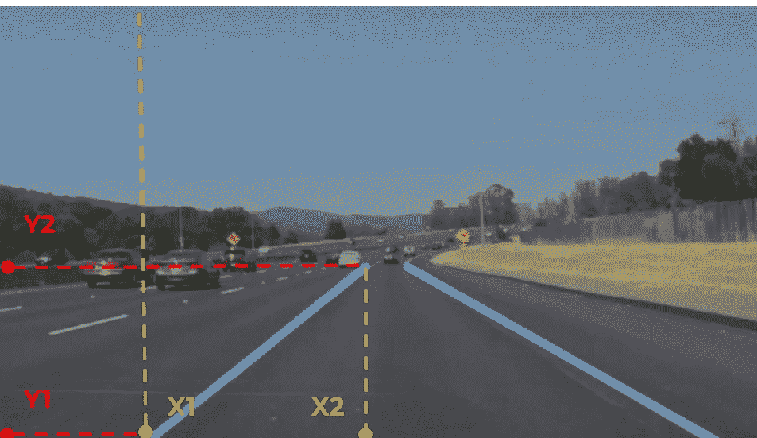

应用于左线的 make_points 函数的可视化示例

但是，该函数不显示线条，它只计算显示这些线条所需的点数。接下来，我们要创建一个函数，用这些点组成线条。

```
def display_lines(image, lines):
 lines_image = np.zeros_like(image)
 if lines is not None:
   for line in lines:
     x1, y1, x2, y2 = line
     cv2.line(lines_image, (x1, y1), (x2, y2), (255, 0, 0), 10)
 return lines_image
```

该函数接受两个参数:我们想要显示线条的图像和从*平均*函数输出的车道线。

*   第 2 行:创建一个涂黑的图像，尺寸与原始图像相同
*   第 3 行:确保包含行点的列表不是空的
*   第 4–5 行:遍历列表，提取两对(x，y)坐标
*   第 6 行:创建线条并粘贴到涂黑的图像上
*   第 7 行:输出带有线条的黑色图像

你可能想知道，为什么我们不把这些线条附加到真实的图像上，而不是黑色的图像上。嗯，原始图像有点太亮了，所以如果我们将它变暗一点，以便更清楚地看到车道线就好了(是的，我知道，这没什么大不了的，但找到使算法更好的方法总是好的)

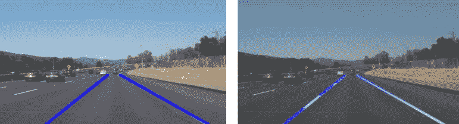

左:直接向图像添加行。右图:使用 cv2.addWeighted 函数

左:直接向图像添加行。右图:使用 cv2.addWeighted 函数

```
lanes = cv2.addWeighted(copy, 0.8, black_lines, 1, 1)
```

该函数为实际图像中的每个像素赋予 0.8 的权重，使它们略暗(每个像素乘以 0.8)。同样，我们将权重 1 赋予所有车道线的涂黑图像，因此其中的所有像素保持相同的强度，使其突出。

```
copy = np.copy(image1)
grey = grey(copy)
gaus = gauss(grey)
edges = canny(gaus,50,150)
isolated = region(edges)lines = cv2.HoughLinesP(isolated, 2, np.pi/180, 100, np.array([]), minLineLength=40, maxLineGap=5)
averaged_lines = average(copy, lines)
black_lines = display_lines(copy, averaged_lines)
lanes = cv2.addWeighted(copy, 0.8, black_lines, 1, 1)
cv2.imshow("lanes", lanes)
cv2.waitKey(0)
```

在这里，我们简单地调用我们之前定义的所有函数，然后在第 12 行输出结果。 *cv2.waitKey* 函数用于告诉程序图像显示多长时间。我们将“0”传递给该函数，这意味着它将等待，直到按下一个键来关闭输出窗口。

下面是输出的样子

在这里，我们简单地调用我们之前定义的所有函数，然后在第 12 行输出结果。 *cv2.waitKey* 函数用于告诉程序图像显示多长时间。我们将“0”传递给该函数，这意味着它将等待，直到按下一个键来关闭输出窗口。

下面是输出的样子

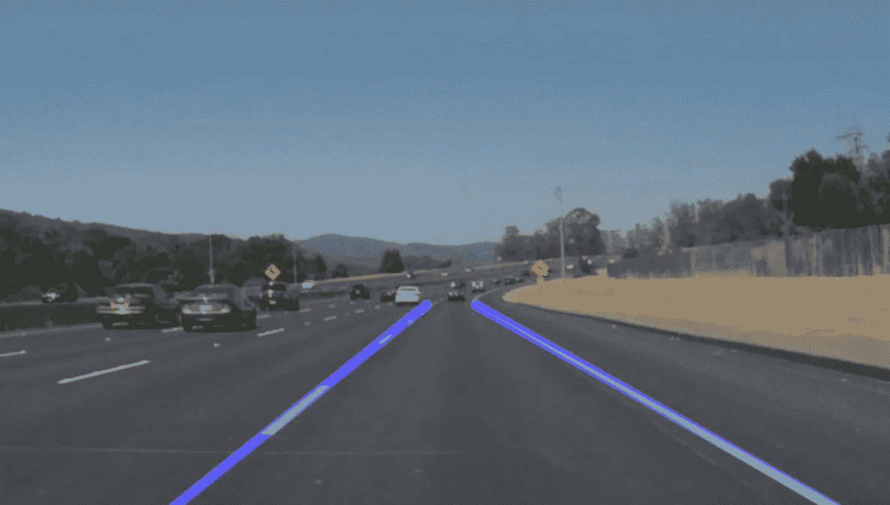

请在 [*Github*](https://github.com/Arun-purakkatt/medium_repo) 笔记本上查看完整代码，在 链接[*上与我保持联系。*](https://www.linkedin.com/in/arun-purakkatt-mba-m-tech-31429367/)

**参考文献:**

1.  [https://www.youtube.com/watch?v=eLTLtUVuuy4](https://www.youtube.com/watch?v=eLTLtUVuuy4)
2.  [https://towards data science . com/a-deep-dive-into-lane-detection-with-Hough-transform-8f 90 FDD 1322 f](https://towardsdatascience.com/a-deep-dive-into-lane-detection-with-hough-transform-8f90fdd1322f)
3.  [https://towards data science . com/tutorial-build-a-lane-detector-679 FD 8953132](https://towardsdatascience.com/tutorial-build-a-lane-detector-679fd8953132)