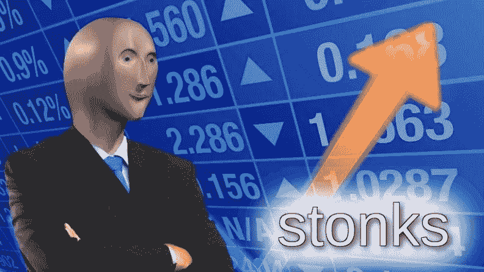
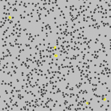
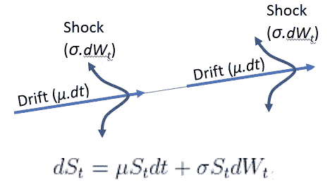
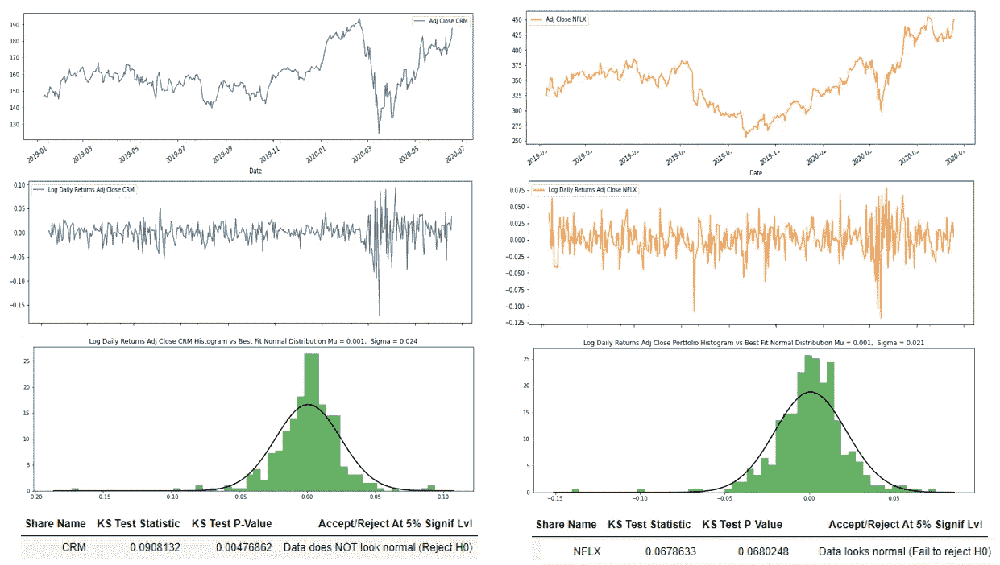
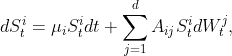
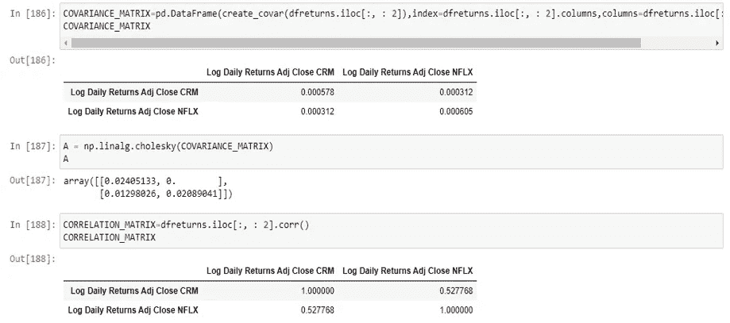
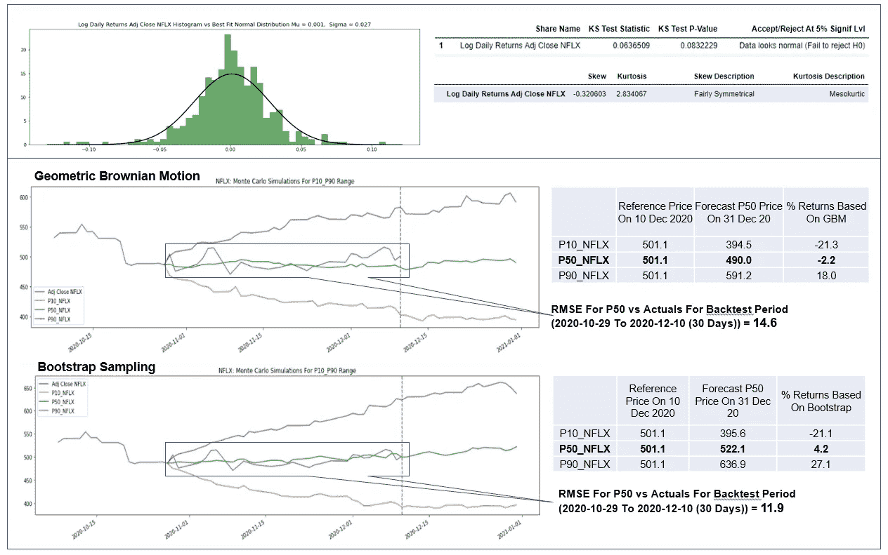

# 用几何布朗运动和 Bootstrap 抽样建立蒙特卡罗方法股票价格模拟器

> 原文：<https://medium.com/analytics-vidhya/building-a-monte-carlo-method-stock-price-simulator-with-geometric-brownian-motion-and-bootstrap-e346ff464894?source=collection_archive---------1----------------------->



图片来源:[https://knowyourmeme.com/memes/stonks](https://knowyourmeme.com/memes/stonks)

# 摘要

*我用 Python Flask 开发了一个 web 应用程序，允许你使用一种叫做蒙特卡罗模拟的方法来模拟未来的股票价格走势，有两种“口味”可供选择:几何布朗运动(GBM)和 Bootstrapped Sampling。*

[](https://www.stonksforecast.online/) [## z 的股票模拟器

### 图片来源:KnowYourMeme.com 嗨！我是 Z，这是一个简单的股票价格预测网络应用程序，我是为了好玩而开发的…

www.stonksforecast.online](https://www.stonksforecast.online/) 

*虽然我可能会在下面包含一些编程代码，但这篇文章不会是一篇“代码教程”,而是更侧重于 GBM 和 Bootstrap 抽样背后的基本理论。*

*然原生*。*py 和一个 Jupyter 笔记本版本的相同代码可以在下面的 GitHub 链接上找到，如果你想深入了解的话。*

[](https://github.com/ZhijingEu/StockSimulatorFlaskApp) [## ZhijingEu/StockSimulatorFlaskApp

### 这是一个股票分析 Python Flask web 应用程序，它允许你使用…

github.com](https://github.com/ZhijingEu/StockSimulatorFlaskApp) 

**警告！我不是任何类型的投资大师，所以我强烈建议你不要把这篇文章作为你投资决策的(唯一)依据。**

# 概述

*   [**几何布朗运动**](#376a)**【GBM】**
*   [**蒙特卡洛模拟**](#e429)
*   [**利用 GBM**](#0450) 模拟单只股票
*   [**利用 GBM**](#b49a) 模拟投资组合中的多只股票
*   [**另一种使用自举抽样的方法**](#f6d0)
*   [**Bootstrap vs GBM:哪个效果更好？**](#7d0e)
*   [**结论**](#05ad)

# 几何布朗运动

你可能对高中物理中的布朗运动很熟悉。这是空气粒子相互碰撞时看似随机的运动。虽然我们可能无法描述单个粒子的行为，但物理学和统计学让我们有能力描述整个系统结束的可能性。



图片来源:[维基百科](https://en.wikipedia.org/wiki/Brownian_motion)

同样，几何布朗运动是一个资产回报模型，其中资产/股票/投资的价格(或回报)可以建模为随机游走(即一个*过程，其中股票价格的变化具有相同的分布并且相互独立。因此，它假定股票价格或市场的过去运动或* [*趋势*](https://www.investopedia.com/terms/t/trend.asp) *不能用于预测其未来运动(来源:Investopedia)*

与其一头扎进一些相当复杂的随机微分方程，不如直观地了解它是如何工作的



来源:改编自[https://www.investopedia.com/articles/07/montecarlo.asp](https://www.investopedia.com/articles/07/montecarlo.asp)

***其中:***

*   *s*ₜ*=股价*
*   *ds*ₜ*=股票价格的变化*
*   *μ=预期收益*
*   *σ=收益的标准差*
*   *w*ₜ=*[*维纳过程*](https://en.wikipedia.org/wiki/Wiener_process) *随机变量其中 t 时间内的增量具有以零为中心的正态分布 n(即 W* ₜ - *W* ₀~ N(0，t))*
*   **d*ₜ*=经过的时间段**

*本质上，GBM 模型允许我们基于由平均值(即对数收益的平均值)驱动的“漂移”和随机但仍可以由波动性(即对数收益的标准差)表征的“冲击”的组合来对未来价格建模。*

*但是，应该注意的是，该模型做出了几个关键假设:*

*   ***股价的对数变化呈正态分布****
*   ***波动率(即对数收益的标准差)是常数***
*   ***预期收益(即对数收益的均值)**与股票表现无关*

**(*你可能想知道为什么我们使用回报而不是价格——这是因为回报是无标度的(以百分比而不是绝对值表示),并且通常具有更“稳定”的统计特性(例如恒定均值&方差)。此外，对数回归比简单回归有优势，因为对数正态分布随机变量的* **对数将是正态分布的。来自 statsexchange 的这三篇文章 [(1)](https://quant.stackexchange.com/questions/17287/why-is-rate-of-return-on-the-stock-normally-distributed-under-gbm) 、 [(2)](https://quant.stackexchange.com/questions/32244/geometric-brownian-motion-percentage-returns-vs-log-returns) 和 [(3)](https://stats.stackexchange.com/questions/230955/forecasting-with-arima-and-garch-does-my-plan-look-alright) 更详细。 *)****

*然而，正如我们将在后面看到的，这些条件并不总是成立的，所以任何预测的有效性都需要非常仔细地评估。*

# *蒙特卡洛模拟*

*如前所述，我已经有一篇关于这个主题的[独立文章](/analytics-vidhya/building-a-probabilistic-risk-estimate-using-monte-carlo-simulations-cf904b1ab503)但简单来说:蒙特卡罗模拟是一种通过重复运行具有随机变量的模型并汇总所有结果来了解结果范围的预测方法。*

*因此，尽管 GBM 预测的每次迭代都会略有不同，但我们可以进行多次预测，并汇总所有结果，以查看预期时间框架内潜在价格变化的总体范围。*

*基于 1 年的历史数据，对大约 3 周的 NFLX 股票价格进行 10 次不同的迭代预测。(注意:我使用了 7 天的回溯测试期，因此实际价格与预测价格之间存在重叠)*

*同样 10 次迭代的第 10、90 百分位和 NFLX 预测价格中位数*

*正如所料，越往后，可能的价格范围(即 P10 到 P90)越宽。(根据经验，有一篇学术论文称，当限于[最长 2 周](https://www.researchgate.net/publication/325987061_Forecasting_Share_Prices_of_Small_Size_Companies_in_Bursa_Malaysia_Using_Geometric_Brownian_Motion)前瞻时，GBM 最适合预测)*

# *用 GBM 模拟一只股票*

*该 web 应用程序是通过扩展另一位作者根据下面的文章构建的一些代码构建的，在这篇文章中，我将它与 Python Flask 相结合，以允许用户通过网站选择股票计数器以及所需的历史数据范围和预测持续时间。*

*[](https://towardsdatascience.com/how-to-simulate-financial-portfolios-with-python-d0dc4b52a278) [## 如何用 Python 模拟金融投资组合

### 多维几何布朗运动的一个应用

towardsdatascience.com](https://towardsdatascience.com/how-to-simulate-financial-portfolios-with-python-d0dc4b52a278) 

代码看起来有点像下面，其中有一个使用 pandasDataReader 从 Yahoo Finance 中提取股票价格的函数

```
import pandas as pd
from pandas_datareader import dataimport numpy as np, numpy.random
from numpy import meanimport random
import matplotlib.pyplot as pltfrom datetime import datetimefrom scipy.stats import norm 
from scipy.stats import kstest
from scipy.stats import skew
from scipy.stats import kurtosis
from scipy import statsdef extract_prices(start_date,end_date,symbols,backtestduration=0):
    dim=len(symbols)
    for symbol in symbols:
        dfprices = data.DataReader(symbols, start=start_date, end=end_date, data_source='yahoo')
        dfprices = dfprices[['Adj Close']]
    dfprices.columns=[' '.join(col).strip() for col in dfprices.columns.values] for i in range(0,len(symbols)):
        noOfShares.append(portfolioValPerSymbol[i]/priceAtEndDate[i])
    noOfShares=[round(element, 5) for element in noOfShares]
    listOfColumns=dfprices.columns.tolist()   
    dfprices["Adj Close Portfolio"]=dfprices[listOfColumns].mul(noOfShares).sum(1)

    print(f"Extracted {len(dfprices)} days worth of data for {len(symbols)} counters with {dfprices.isnull().sum().sum()} missing data")

    return dfprices
```

之后，另一个函数将价格转换成对数回报

```
def calc_returns(dfprices,symbols):
    dfreturns=pd.DataFrame()
    columns = list(dfprices) 
    mean=[]
    stdev=[]
    for column in columns:
        dfreturns[f'Log Daily Returns {column}']=np.log(dfprices[column]).diff()
        mean.append(dfreturns[f'Log Daily Returns {column}'][1:].mean())
        stdev.append(dfreturns[f'Log Daily Returns {column}'][1:].std())
    dfreturns=dfreturns.dropna()

    if len(dfreturns.columns)==1:
        df_mean_stdev=pd.DataFrame(list(zip(symbols,mean,stdev)),columns =['Stock', 'Mean Log Daily Return','StdDev Log Daily Return']) 
    else:
        df_mean_stdev=pd.DataFrame(list(zip(symbols+["Portfolio"],mean,stdev)),columns =['Stock', 'Mean Log Daily Return','StdDev Log Daily Return'])

    return dfreturns ,df_mean_stdev
```

这些对数回报作为输入输入到另一个函数中，该函数估计平均值、标准偏差，然后与初始价格一起推送到一个函数中，该函数将输入拟合到上一节讨论的方程中

```
def GBMsimulatorUniVar(So, mu, sigma, T, N):
    """
    Parameters
    So:     initial stocks' price
    mu:     expected return
    sigma:  volatility
    Cov:    covariance matrix
    T:      time period
    N:      number of increments
    """ dim = np.size(So)
    t = np.linspace(0., T, int(N))
    S = np.zeros([dim, int(N)])
    S[:, 0] = So
    for i in range(1, int(N)):    
        drift = (mu - 0.5 * sigma**2) * (t[i] - t[i-1])
        Z = np.random.normal(0., 1., dim)
        diffusion = sigma* Z * (np.sqrt(t[i] - t[i-1]))
        S[:, i] = S[:, i-1]*np.exp(drift + diffusion)
    return S, t
```

尽管对结果的有效性有一个重要的警告。在代码中，最佳拟合正态分布是根据历史数据估计的，但更相关的是回报的“正态”程度。

因此，我增加了一组关于正态性的统计测试,我不会在本文中详述。可以说，这些测试生成了一个统计值和一个 p 值，可以根据选定的显著性水平进行测试，以检查历史回报数据的“正态性”(*)。具体来说，我实现了两个测试，一个是 Kolmogorov Smirnov 测试，一个是 Shapiro 维尔克测试，显著性水平为 5%。(为什么是 5%？这里[看这个](https://stats.stackexchange.com/questions/55691/regarding-p-values-why-1-and-5-why-not-6-or-10)

*(*严格来说，这不是真正的‘检查’本身，但我宁愿不去探究* [*假设检验是如何工作的*](https://machinelearningmastery.com/statistical-hypothesis-tests)*)*

不幸的是，运行一些不同股票的数字(使用大约从 6 个月到一年的历史数据)显示，根据以下任意示例，CRM (Salesforce)和 NFLX(网飞)的股票在 2019 年 1 月至 2020 年 7 月期间的回报并不总是“正常的”。



CRM 日志返回不正常(P 值 0.0048 < alpha of 0.05) but NFLX log returns are normal (P Value 0.068 > 0.05)

然而现在，让我们假设我们将使用这种方法的股票会表现得很好。

# 使用 GBM 模拟投资组合中的多只股票

一个更现实的问题是建立一个由多个柜台组成的股票投资组合模型。

不幸的是，你不能只对两只不同的股票分别进行 GBM 模拟，然后再将它们结合起来，因为尽管每只股票的回报率变动是随机的，但股票之间的**回报率(*)是相关的**。

( ***** 如前一节所述，估算的是回报的相关性，而不是价格。这篇[文章](https://quantdare.com/correlation-prices-returns/)解释了原因)

***<警告:有数学来袭！>***

[<如果你想跳过理论>](#39b3) 点击这里

因此，为了将这种相关效应重新整合到 GBM 模型中，我们使用了早期方程的修改形式，现在包括了一个新项， *Aij，*股票收益之间协方差矩阵的 *Cholesky 因子*



来源:P. Glasserman，*金融工程中的蒙特卡罗方法*。第 53 卷(2013 年)

这个*乔莱斯基分解项*用于收益协方差矩阵，并乘以不相关随机变量矩阵，以“诱导”它们之间的相关性。

[](https://towardsdatascience.com/behind-the-models-cholesky-decomposition-b61ef17a65fb) [## 模型背后:乔莱斯基分解

### 运行今天的线性模型和蒙特卡洛模拟的 19 世纪地图制作者的诡计

towardsdatascience.com](https://towardsdatascience.com/behind-the-models-cholesky-decomposition-b61ef17a65fb) 

例如，下面是由 3 个元素组成的相同示例的协方差矩阵，即同一时期的股票计数器 CRM 和 NFLX。通常，协方差矩阵更难解释，因为它们反映了“绝对”联合可变性，因此另一种可视化变量之间关系的方法是使用[相关矩阵，它是协方差矩阵](https://en.wikipedia.org/wiki/Covariance_and_correlation)的“标准化”版本，其中每个值介于-1(完全负相关)到 0(无相关)到+1(完全正相关)之间



协方差矩阵；协方差矩阵的 Cholesky 分解；以及 2019 年 1 月至 2020 年 7 月期间股票 CRM 和 NFLX 的相关矩阵

不幸的是，对于等式中的这个新项，除了回报是否是“正态分布”之外，还需要检查协方差矩阵是否是对称正定的。

特别是对于有几十只不同股票的较大投资组合，这变得更加复杂，因为我们不仅要担心两只不同股票之间的相关性，还要担心多只股票之间的所有相关性，以便关系保持“一致”

因此，该算法偶尔会发出一条错误消息 *LinAlgError:矩阵不是正定的——无法计算乔莱斯基分解。(*这种正定性是矩阵的一个特性，它允许矩阵在不改变向量符号的情况下**相乘多次)**

[](https://towardsdatascience.com/what-is-a-positive-definite-matrix-181e24085abd) [## 什么是正定矩阵？

### 为什么这很重要？

towardsdatascience.com](https://towardsdatascience.com/what-is-a-positive-definite-matrix-181e24085abd) 

这是因为在实践中，股票回报数据可能有噪声，或者特别是对于有许多股票的大型投资组合(即高维数)，一些股票可能是多共线的(其中股票回报之间可能存在相互依赖性)。

[](https://blog.clairvoyantsoft.com/correlation-and-collinearity-how-they-can-make-or-break-a-model-9135fbe6936a) [## 相关性和共线性-它们如何建立或破坏模型

### 相关性和共线性

blog.clairvoyantsoft.com](https://blog.clairvoyantsoft.com/correlation-and-collinearity-how-they-can-make-or-break-a-model-9135fbe6936a) 

注意，GBM 的多元形式假设**协方差也是随时间恒定的**(注意:不幸的是，在实践中，就像均值和方差一样，相关性也会随时间变化)

***<数学预警结束>***

因此，以代码形式将所有这些放在一起看起来有点像下面的，其中有另一个新函数来计算不同股票之间的对数回报的协方差，GBM 函数有一个额外的协方差项作为输入。

```
def create_covar(dfreturns):  
    try:
        returns=[]
        arrOfReturns=[]
        columns = list(dfreturns)
        for column in columns:
            returns=dfreturns[column].values.tolist()
            arrOfReturns.append(returns)
        Cov = np.cov(np.array(arrOfReturns))    
        return Cov
    except LinAlgError :
        Cov = nearPD(np.array(arrOfReturns), nit=10)
        print("WARNING -Original Covariance Matrix is NOT Positive Semi Definite And Has Been Adjusted To Allow For Cholesky Decomposition ")
        return Covdef GBMsimulatorMultiVar(So, mu, sigma, Cov, T, N):
    """
    Parameters
    So:     initial stocks' price
    mu:     expected return
    sigma:  volatility
    Cov:    covariance matrix
    T:      time period
    N:      number of increments
    """ dim = np.size(So)
    t = np.linspace(0., T, int(N))
    A = np.linalg.cholesky(Cov)
    S = np.zeros([dim, int(N)])
    S[:, 0] = So
    for i in range(1, int(N)):    
        drift = (mu - 0.5 * sigma**2) * (t[i] - t[i-1])
        Z = np.random.normal(0., 1., dim)
        diffusion = np.matmul(A, Z) * (np.sqrt(t[i] - t[i-1]))
        S[:, i] = S[:, i-1]*np.exp(drift + diffusion)
    return S, t
```

# GBM 的替代方案——自举抽样


来源:[https://www . huffpost . com/entry/pull-your-up-by-your-bootstraps-废话 _n_5b1ed024e4b0bbb7a0e037d4](https://www.huffpost.com/entry/pull-yourself-up-by-your-bootstraps-nonsense_n_5b1ed024e4b0bbb7a0e037d4)

不幸的是，GBM 方法需要对基础分布的形状做很多假设才能工作。因此，我想分享一种替代方法，叫做替换引导抽样

[](https://towardsdatascience.com/an-introduction-to-the-bootstrap-method-58bcb51b4d60) [## 自助法简介

### 关于 bootstrap 方法、动机及其工作原理的探讨

towardsdatascience.com](https://towardsdatascience.com/an-introduction-to-the-bootstrap-method-58bcb51b4d60) 

这种方法从历史数据中随机抽取样本，生成新的“合成”数据集来预测未来价格。这样，Bootstrapping ***就不需要显式的理论模型*** 来生成预测(因此，在短语“*通过自己的引导来提升自己*”之后，它被称为 Bootstrapping，意思是在没有外部帮助的情况下改善自己的状况)。

在代码中，我使用 numpy 的 random.randint“选择”一个随机时间戳来提取历史日志返回，模拟了这种带有替换行为的采样。然后重复这一过程，以创建一系列随机日志回报来建立预测。

```
def bootstrap_w_replc_singleval(dfreturns):
    columns=dfreturns.columns        ____singlesample=pd.DataFrame(dfreturns.values[np.random.randint(len(dfreturns), size=1)], columns=columns)
    return singlesampledef bootstrapforecast(dfreturns,T):
    columnlist=dfreturns.columns
    X=[]
    for i in range(0,T):
        ____X.append(bootstrap_w_replc_singleval(dfreturns).values.tolist()[0])
    Y=pd.DataFrame(X)
    Y.columns=columnlist
    Y.loc[-1] = [0]*len(columnlist)  # adding a row
    Y.index = Y.index + 1  # shifting index
    Y = Y.sort_index()  # sorting by index

    return Y
```

然而，这种方法仍然依赖于提取的历史回报数据，这些数据是股票回报的潜在行为的无偏表示。

此外，即使数据不再需要正态分布，Bootstrapping 也假设均值和方差是同方差的(即不随时间变化)。换句话说，我们假设任何观察值(来自历史回报数据集)都同样有可能被选择，并且它的选择是独立的。

这种方法也适用于多只股票的投资组合，但与 GBM 的另一种方法不同，Bootstrap 采样不需要估计协方差，因为我们将从历史数据中对“一整行”回报进行采样，从而隐含地捕捉它们之间的任何相关性。

# Bootstrap vs GBM:哪个效果更好？

那么这两种方法中，哪一种效果更好呢？嗯，这要看情况。



比较 GBM 与 Bootstrap 方法在 100 次迭代中的聚合结果

基本的第一步检查应该是测试收益分布的正态性和偏斜度(因为 GBM 需要这个假设来保证结果的有效性)

然而，在上面的例子中，对数收益分布的形状似乎表明股票收益符合正态假设，并且具有相当均匀的对称形状(这意味着 GBM 应该是一种有效的方法)

然而，与 30 天回测期的 Bootstrap 抽样相比，GBM 方法给出了更大的均方根误差。因此，我的建议是在不同的回溯测试持续时间内对两者进行测试，并比较 RMSE-s(或者，如果您直接使用该文件的 Jupyter 笔记本版本，我猜您也可以编写自己的脚本来测试 MAE、MAPE 或任何您喜欢的预测准确性指标)

# 结论

所以在这一切之后，最大的问题是… **这些方法能用来预测未来的股票价格并获利吗？**

简答:…。不尽然(可悲)。大多数现实生活中的股票回报具有厚尾分布，并表现出波动聚集行为(即标准偏差和方差不会随着时间的推移而保持良好和固定)，这打破了我们之前所做的假设。

然而，对于特定时间范围内的某些股票，假设可能仍然成立(或接近有效)，这种方法确实提供了一种结构化的方法来估计短期(约 1-2 周)回报的相对最坏-最好情况范围。

如果你访问过该网站，你可能会注意到，除了 GBM 和 Bootstrap 抽样，该网站应用程序还允许使用其他“传统”统计时间序列预测方法进行预测，如 ARIMA，霍尔特温特斯和向量自动回归。如果你想让我介绍其他方法，请在下面的评论中告诉我。

同时，如果你喜欢这篇文章——看看我下面的其他文章:

[](https://zhijingeu.medium.com/how-to-estimate-optimal-stock-portfolio-weights-using-monte-carlo-simulations-modern-portfolio-d27d534e8a1a) [## 如何使用蒙特卡罗模拟和现代投资组合来估计最优股票投资组合权重

### 在本文中，我将介绍如何使用现代投资组合理论&蒙特卡洛模拟法来估计一个最优的风险回报…

zhijingeu.medium.com](https://zhijingeu.medium.com/how-to-estimate-optimal-stock-portfolio-weights-using-monte-carlo-simulations-modern-portfolio-d27d534e8a1a) [](/analytics-vidhya/building-a-simple-stock-ranking-screening-tool-7bc10049e85) [## 建立一个简单的股票排名和筛选工具

### 配料:一杯要素投资原则；从雅虎网上新收集的一些股票指数…

medium.com](/analytics-vidhya/building-a-simple-stock-ranking-screening-tool-7bc10049e85)*