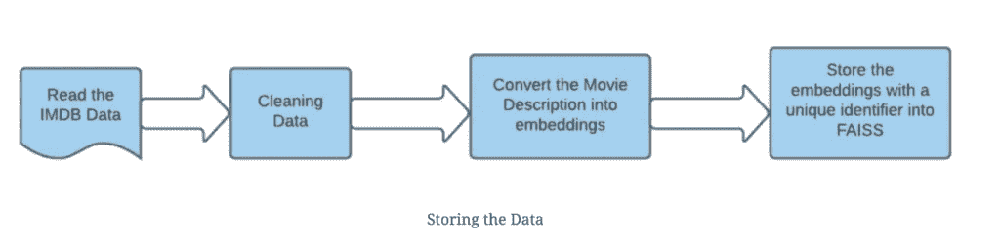
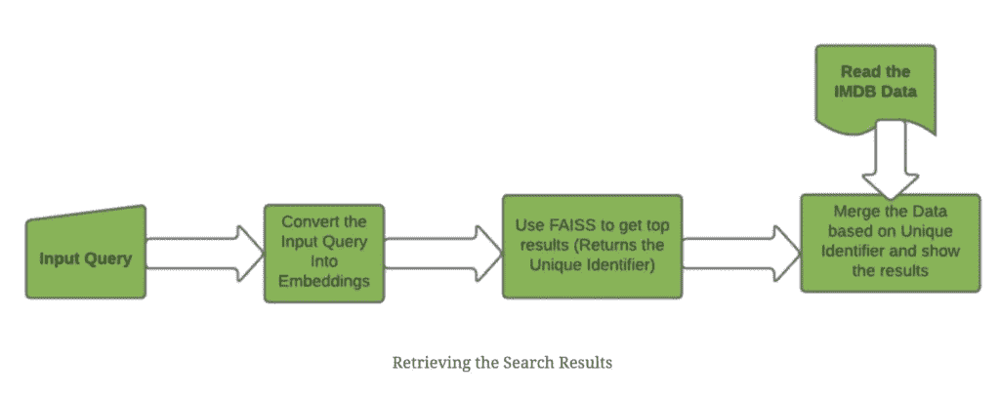
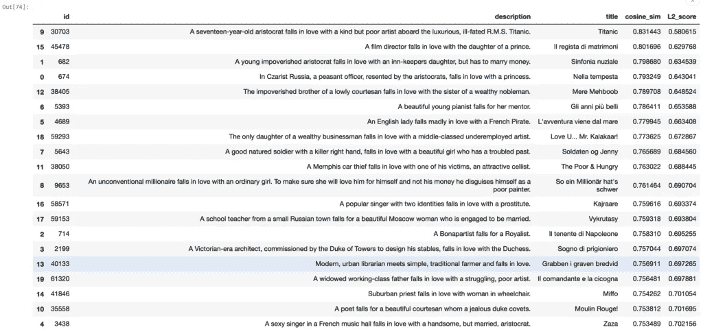
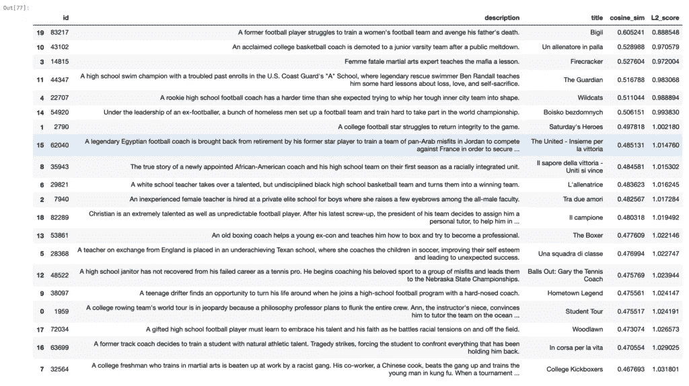

# 使用 FAISS 构建电影推荐

> 原文：<https://medium.com/analytics-vidhya/building-a-movie-recommendation-using-faiss-60d65b104dda?source=collection_archive---------9----------------------->


推荐系统是亚马逊、Flipkart、网飞、脸书等公司的关键组成部分。推荐系统的目标是推荐项目，以根据用户先前与系统的交互来预测用户喜欢某个项目的可能性。两种最常见的推荐系统是**基于内容的**和**协同过滤**。

**基于内容的推荐系统**关注物品的属性，推荐与之相似的物品。

**协同过滤**关注用户对物品的态度来推荐物品。它利用人群的知识来预测物品。

# 问题陈述

IMDB movies 是一个巨大的数据宝库，包含有关电影的信息，如导演、电影名称、上映时间、电影摘要、电影评级等。我们将使用该数据集来识别相似的电影，给定电影概要或描述，该数据集可以在[这里](https://www.kaggle.com/stefanoleone992/imdb-extensive-dataset)找到。这篇文章的代码可以在这里找到 Kaggle 笔记本[。](https://www.kaggle.com/aiswaryaramachandran/building-movie-recommendation-system-using-faiss/edit/run/52369178)

# FAISS 简介

[FAISS](https://github.com/facebookresearch/faiss) 是一个来自脸书的开源库，用于高效的相似性搜索和密集向量聚类。这允许我们搜索任何大小的向量，甚至是那些不适合 RAM 的向量。FAISS 有 GPU 支持。

**安装 FAISS**

```
pip install faiss-cpu ## For CPU Version pip install faiss-gpu ## For the GPU Version
```

FAISS 包含多种类型的索引，允许进行相似性搜索，并假设数据表示为具有唯一相关整数 id 的密集向量，允许使用 L2(欧几里德距离)或内积进行距离计算。**通常，对于大多数相似性问题，我们使用余弦相似性作为常用的度量。为了在 FAISS 中实现这一点，我们必须归一化向量，因为在这种情况下，余弦相似性与内积相同**

大多数方法，如基于二进制向量和紧凑量化码的方法，仅使用向量的压缩表示，而不需要保留原始向量。这通常以不太精确的搜索为代价，但是这些方法可以扩展到单个服务器的主存储器中的数十亿个向量。

# 体系结构

构建搜索系统包括两个步骤:**存储数据和检索相关结果**



在存储数据时，我们需要提取电影描述的嵌入内容，并将其索引到 FAISS 中。每个描述都与一个唯一的标识符相关联，这样我们就可以在搜索阶段将结果映射回电影数据。



# 加载和理解数据

IMDB 数据集有多个文件——电影数据集、评级数据集、包含演员详细信息的姓名数据集和包含角色重要性信息的片头主体数据集。出于我们的目的，我们将使用 IMDb 电影数据集(movies.csv ),它包含 85，855 部电影的详细信息，以及与电影描述、平均评级、电影名称、类型等相关的信息。

因为我们关注于使用电影描述来构建搜索，所以我们需要删除描述为空的行

此外，我们需要每一行的唯一标识符——这可以是该行的索引。

```
import numpy as np 
import pandas as pd imdb_movies=pd.read_csv("/kaggle/input/imdb-extensive-dataset/IMDb movies.csv") ## Dropping of rows where description is NULL 
imdb_movies=imdb_movies[pd.notnull(imdb_movies['description'])] imdb_movies=imdb_movies.reset_index(drop=True) ## Create an unique identifier for each row imdb_movies['id']=imdb_movies.index
```

# 创建嵌入

伯特、罗伯塔、XLM 等基于 Transformer 的模型使得迁移学习应用于 NLP(ImageNet Moment)成为可能。这些模型允许我们根据您的问题对模型进行微调，从而提供优于传统方法的性能。为了给每个电影描述创建嵌入(密集向量),我们可以得到每个单词的嵌入，然后进行平均。

相反，我们将使用 python 中的句子转换器库，其中不同的基于转换器的预训练模型专门针对有意义的句子嵌入进行调整，以便具有相似含义的句子在向量空间中接近。

```
pip install sentence_transformers ## Installs the library##Extracting list of description sentences=imdb_movies['description'].tolist()from sentence_transformers import SentenceTransformer, util ##Loading the pretrained distil Roberta model model = SentenceTransformer('paraphrase-distilroberta-base-v1') 
## This model gives us 768 Dimension Vector embeddings=model.encode(sentences) ## Extract the sentenceembeddings
```

# 索引数据

FAISS 在索引上有许多不同的类型——平面索引允许我们直接索引向量而不进行任何压缩。使用量化技术的索引允许我们压缩向量——为了压缩和实现有效的搜索，使用 k-means 将向量分成簇。这里我们将使用带有产品量化的倒排索引来存储我们的嵌入。这种类型的索引允许我们基于最近邻搜索的概念来执行近似搜索。

创建 IndexIVFPQ 类型的 FAISS 索引包括两个步骤

1.  **创建一个 k 形心的训练索引**。这一步允许我们创建向量空间的集群。对于这一步，整个数据需要在内存中
2.  **添加或更新索引** —在这里加载训练好的索引(它存储关于不同聚类中心的信息)并添加新数据。

**创建 K 形质心**

为了提供压缩，在该步骤中，N 维向量(N=768)在聚类之前被分成 m 个块。因此，我们最终对每个块进行 K 个聚类。此外，在创建质心之前，必须对嵌入进行规范化。

```
dim=768 ## Embedding Dimension ncentroids=50 ## This is a hyperparameter, and indicates number of clusters to be split intom=16 ## This is also a hyper parameter indicating number chunks the embeddings must be divided into quantiser = faiss.IndexFlatL2(dim) index = faiss.IndexIVFPQ (quantiser, dim,ncentroids, m , 8) 
## Before we train the embeddings, we will normalise the Embeddings faiss.normalize_L2(embeddings) index.train(embeddings) ## This step, will do the clustering and create the clusters for each chunk print(index.is_trained) ## Will print true if the index has been trained (The cluster centroids have been identified) faiss.write_index(index, "trained.index") ## The trained.index contains the details about the cluster centroids.
```

**添加数据**

FAISS index 允许我们使用 **add_with_ids** 函数索引嵌入和唯一标识符

```
ids=imdb_movies['id'].tolist() ids=np.array(ids)index.add_with_ids(embeddings,ids) print("Total Number of Embeddings in the index" ,index.ntotal)faiss.write_index(index,"movies_desc.index")
```

# 检索相关结果

为了找到相似的项目，余弦相似性是最常用的度量。当我们归一化一个向量时，内积和余弦相似度是一样的。我们可以根据 L2 距离计算内积。关系如下:


```
## This function converts the L2_score into inner product def calculateInnerProduct(L2_score): 
   return (2-math.pow(L2_score,2))/2
```

为了搜索索引，我们需要首先使用句子转换器将查询嵌入到向量中。为了减少搜索所需的时间，我们可以通过指定“ **nprobe** 参数来识别与查询向量最近的“k”个聚类。nprobe 的值小于创建索引时指定的簇数。

```
def searchFAISSIndex(data,id_col_name,query,index,nprobe,model,topk=20): ## Convert the query into embeddings query_embedding=model.encode([query])[0] dim=query_embedding.shape[0] query_embedding=query_embedding.reshape(1,dim) ## Normalise the Query Embedding faiss.normalize_L2(query_embedding) index.nprobe=nprobe D,I=index.search(query_embedding,topk) ids=[i for i in I][0] L2_score=[d for d in D][0] inner_product=[calculateInnerProduct(l2) for l2 in L2_score] search_result=pd.DataFrame() search_result[id_col_name]=ids search_result['cosine_sim']=inner_product search_result['L2_score']=L2_score dat=data[data[id_col_name].isin(ids)] dat=pd.merge(dat,search_result,on=id_col_name) dat=dat.sort_values('cosine_sim',ascending=False) 
return datquery="A seventeen-year-old aristocrat falls in love with a kind but poor artist" search_result=searchFAISSIndex(imdb_movies,"id",query,index,nprobe=10,model=model,topk=20) search_result=search_result[['id','description','title','cosine_sim','L2_score']]
```



查询结果:"`**A seventeen-year-old aristocrat falls in love with a kind but poor artist**`"



查询结果:"**前足球运动员训练足球队"**

正如我们所看到的，即使没有彻底的搜索，我们也可以使用 FAISS 检索到非常好的结果。此外，对于 83000 部电影，我们可以在几毫秒内基于语义关系检索搜索结果。这允许我们从基于关键字的搜索转向使用嵌入的能力来构建高效的搜索，即使我们没有很多 RAM。

使用 FAISS 相对于其他库(比如 Annoy)的优势在于 FAISS 允许我们更容易地执行增量更新。FAISS 的强大功能可以与弹性搜索相结合，构建强大的搜索系统。

本文仅使用电影描述来构建推荐系统。可以包含其他功能来构建更强大的推荐系统。此外，人们可以在 FAISS 中试验其他类型的索引，以构建更有效和可伸缩的搜索。