# 构建播放器推荐工具

> 原文：<https://medium.com/analytics-vidhya/building-a-player-recommender-tool-666b5892336f?source=collection_archive---------3----------------------->

图片鸣谢:[真正的 Python](https://realpython.com/)

我将带你经历一个旅程，设计一个端到端的、基于最近邻的推荐系统的简单实现，该系统基于可用的最新足球数据。

# 内容:

1.  问题陈述
2.  数据采集
3.  数据预处理
4.  探索性数据分析
5.  维度的诅咒
6.  利用主成分分析进行维数约简
7.  推荐系统
8.  使用 Streamlit 进行部署
9.  未来的改进
10.  最后的想法

# 1.问题陈述

目标(没有双关语的意思)是做一个应用程序，让你找到一个特定的足球运动员相似的球员。延迟要求是以最小的加载时间尽可能快地实时获取和显示结果。

**现有解决方案:**在足球分析方面，StatsBomb 是行业领先的组织。StatsBomb IQ 的[相似球员搜索工具](https://statsbomb.com/2021/06/using-statsbomb-iq-for-player-recruitment-forwards/)可以被安全地视为最先进的解决方案，但我们不知道它是如何实现的。

我的解决方案是一个独立的尝试，设计一个应用程序，其基本功能是获得相似的玩家。这是一个无人监督的学习问题，因此没有使用性能指标。

# 2.数据采集

[体育参考](https://www.sports-reference.com/)提供世界上一些主要体育项目的公开数据。在我们的例子中，我们将使用它的一个产品，Football Reference(称为 [FBref](https://fbref.com/) )。 [StatsBomb](https://statsbomb.com/) 向 FBref 提供高级统计数据，因此我想对他们两人的数据表示感谢。我们将获得欧洲五大联赛所有球员的 2020-21 赛季数据:

1.  英格兰(超级联赛)
2.  西班牙(西甲)
3.  意大利(意甲)
4.  德国(德甲)
5.  法国(法甲)

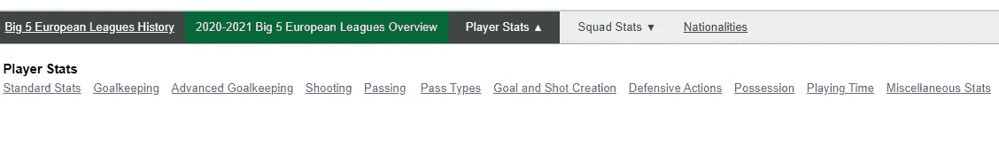

有不同类型的球员统计可用

要从“标准统计”部分获取数据，请转到页面，向下滚动到球员表，然后单击“切换每 90 分钟统计”，将所有统计数据转换为每 90 分钟的值，这意味着所有球员现在都有一个公平的竞争环境，尽管他们在赛季中的上场时间不同。将鼠标悬停在“共享和导出”上，然后单击“以 CSV 格式获取表格”。现在复制下图中高亮显示的文本，粘贴到文本编辑器中，保存为 csv 格式。类似的过程适用于其余的统计数据。

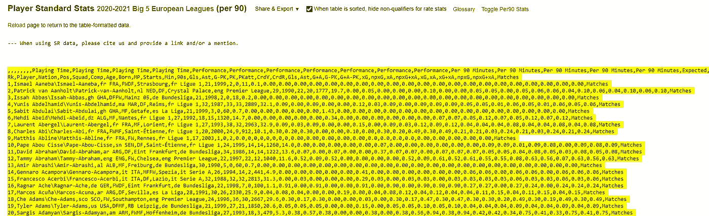

# 3.数据预处理

获得 CSV 形式的所有类型的统计数据后，是时候将其转换为高质量的数据，并为即将到来的阶段做准备了。注意，我将把所有数据分成两个数据集:**外场球员**和**守门员**。守门员将包含“守门员”和“高级守门员”的统计数据，而其余的所有统计数据将包括在外场球员数据集中。请记住，从现在开始在这个博客中执行的步骤将只适用于外场球员，同样的步骤也适用于守门员。

## 3.1 组合成单个数据帧

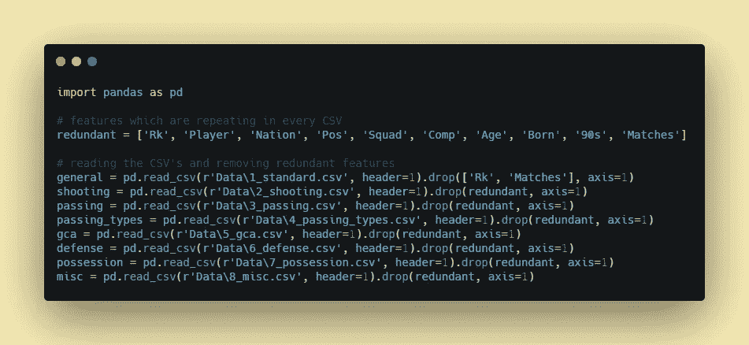

阅读 CSV

在每个 CSV 中重复的冗余特征在读取特定 CSV 后被移除(第一个除外)。

接下来，有一些功能在不同的 CSV 中有相同的名称，但实际上代表不同的东西。连接数据框后，我们将无法区分同名要素。为了解决这个问题，我使用一个自定义函数在特性后面附加了一个表号。此外，这将有助于轻松识别特定特征属于哪种类型的 stat。

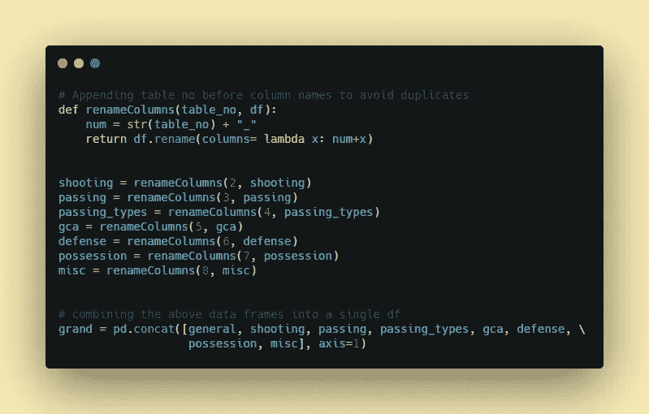

重命名功能

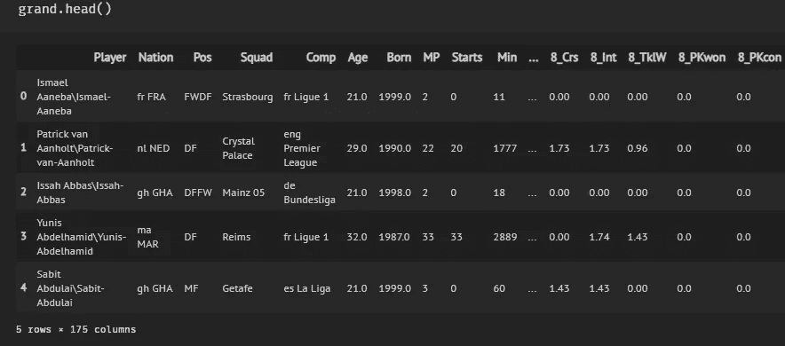

大数据框

## 3.2 一些过滤

在这一步，我们将选择至少打了 3 场 90 分的球员，并从外场数据集中排除守门员。此外，正如您从前面的图片中所看到的,“播放器”和“比较”功能的格式不合适。由于这些功能将用于过滤应用程序中的结果，我们正在提取正确的球员姓名，只选择联赛比赛名称，同时删除国家简称。

## 3.3 处理空值

使用 *df.isnull()进行检查。sum()。sum()* ，数据集中有 747 个空值/缺失值。这是因为不同位置的玩家可能没有某些特性的值。我们将使用 *df = df.fillna(0)将它们替换为 0。*

## 3.4 处理重名

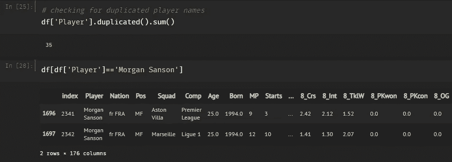

摩根·桑森的两个条目

如果你不熟悉的话，有一些球员在夏季或冬季转会窗口被租借出去或永久转会到其他俱乐部。因为我想包括“球员的名字”作为一个下拉过滤器在应用程序中，我希望球员的名字是唯一的。为了解决这个问题，我简单地创建了一个字典，将“球员+球队”映射到他们的索引，因为结合球员姓名和球队(俱乐部名称)创建了唯一的关键字。

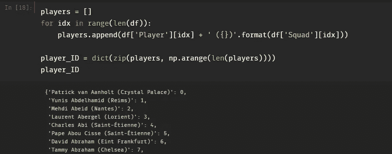

玩家 ID 哈希表

## 3.5 添加新功能:首选脚

在最终的应用程序中，我还想包括首选脚作为过滤器，这是我们的数据集中所缺少的。我将利用左脚和右脚的传球，通过这两个特征的比值来推断出首选的脚。如果这个比率大于 1，那么大部分是左脚运动员，其他人都是右脚运动员。

## 3.6 最终数据集

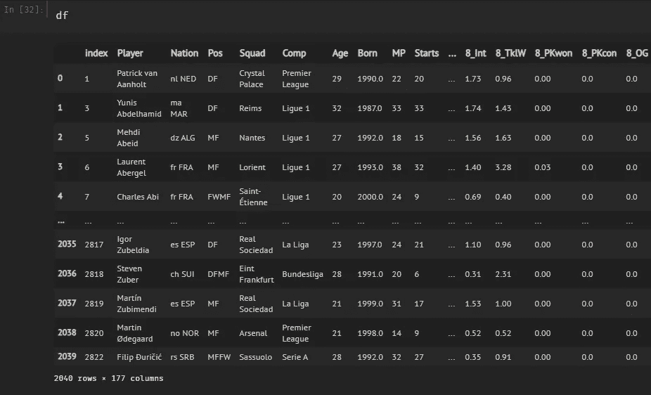

外场数据集

**外场球员** = 2040 名球员，177 个特征(164 个统计特征)

**守门员** = 173 名球员，52 个特征(40 个统计特征)

# 4.探索性数据分析

借助 EDA，我们可以可视化、解释并从数据集中获得洞察力。这在统计图形和数据可视化技术的帮助下成为可能。

## 4.1 位置分析

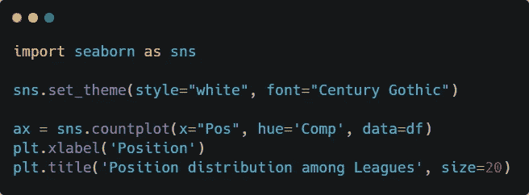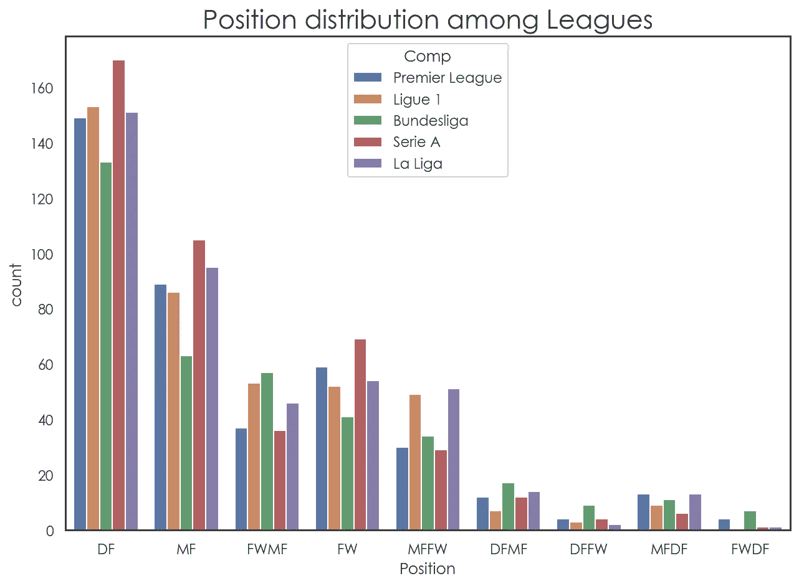

意甲(意大利)拥有最多的后卫(DF)、中场(MF)和前锋(FW)，但在这些位置的其他变化方面却落后了。后卫的数量明显高于其他位置，随着我们在球场上越走越远，球员的稀缺程度也越来越高。

## 4.2 年龄分析

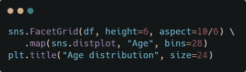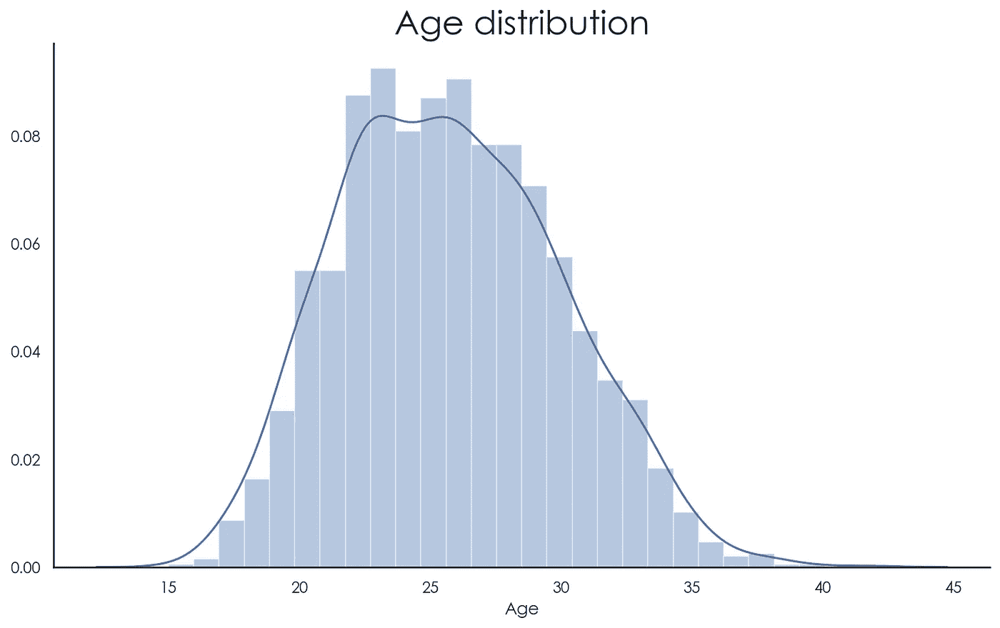

有趣的是，年龄的分布几乎像钟形曲线或正态分布(具有倾斜的尾部)一样遵循*规则，平均值为 25.78，标准偏差为 4.22。超过 50%的运动员年龄在 23 至 29 岁之间。*

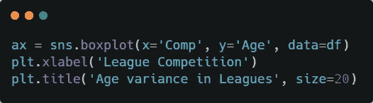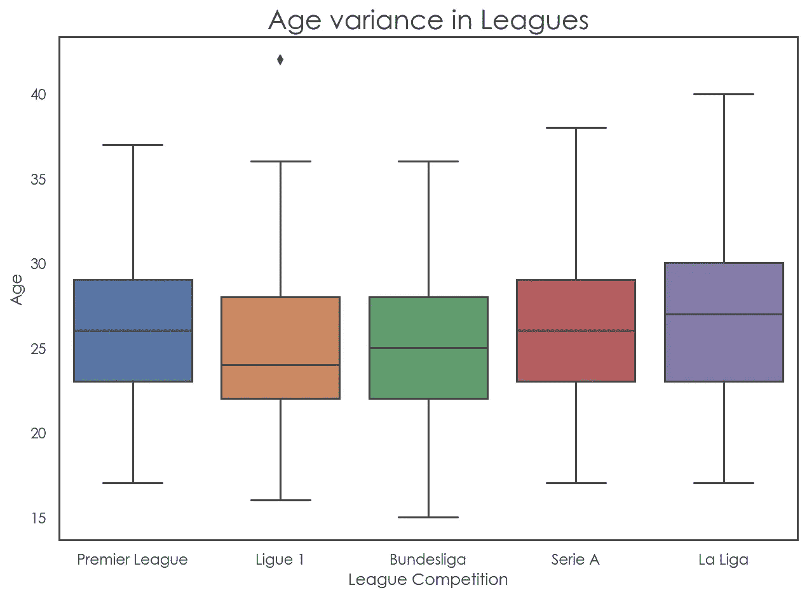

在欧洲五大联赛中，法甲拥有最年轻的球员，平均年龄为 24 岁。但有趣的是，法甲还包括数据集中年龄最大的球员，我们可以从上面的图中观察到，巴西中后卫维托里诺·希尔顿 42 岁，效力于蒙彼利埃俱乐部。

## 4.3 吨-SNE

t-分布式随机近邻嵌入(t-SNE)是一种主要用于可视化高维数据和数据探索的工具。更简单地说，t-SNE 让我们对数据在高维空间中是如何排列的有一种感觉或直觉。在我们的例子中，我们将把 164 个特征转换成两个特征，并将获得的两个维度绘制成散点图。

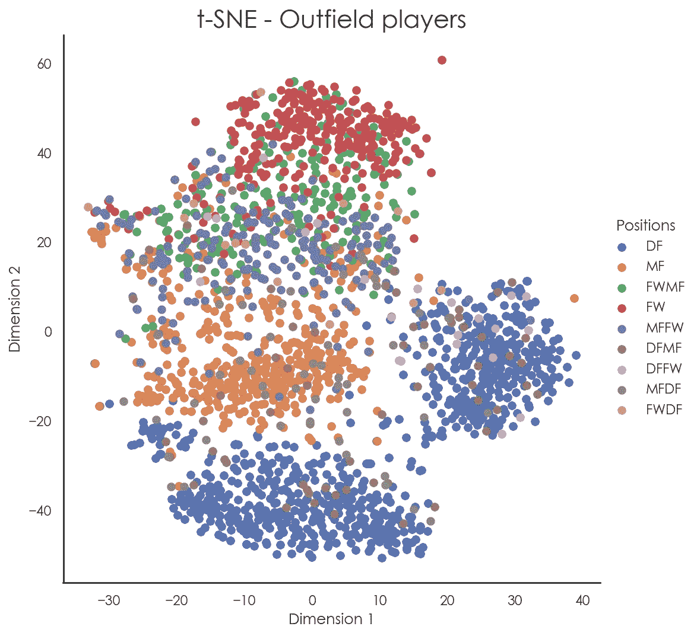

位置 DF(蓝色)、MF(橙色)和 FW(红色)彼此相当分开。DFMF(棕色)在 DF 附近，而 FWMF(绿色)位置的球员在 FW 组附近。有趣的是，DF 有两个独立的组(底部和右侧)，一个是中后卫，另一个是边后卫(他们主要在球场的宽阔区域活动)。

# 5.维度的诅咒

维数灾难指的是在处理高维数据时出现的一系列问题。这些问题的共同主题是，当维度增加时，空间的体积增加得如此之快，以至于可用的数据变得稀疏。这种稀疏性对于任何需要统计显著性的方法都是有问题的。简而言之，当通过增加新的特性来增加问题的维度实际上会降低我们的解决方案的性能时，就会出现这样的情况。维度诅咒主要有两个方面:

**数据稀疏:**随着数据集维度的增加，数据点占据的空间越来越小。这可能导致监督学习问题中的高方差或过拟合。

**距离集中:**距离集中是指随着数据维数的增加，空间中不同样本/点之间的所有两两距离收敛到同一个值的问题。由于这个原因，样本的接近度或相似度的概念在更高维度中可能不是定性相关的。我们将在下一节解决这个问题。

# 6.利用主成分分析进行维数约简

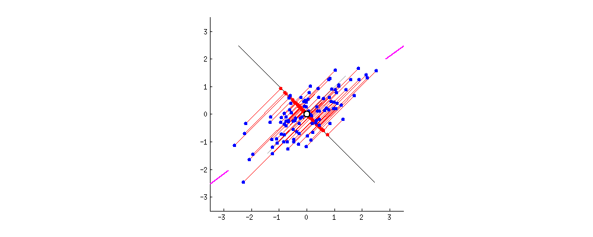

演职员表:这个关于 S [tackExchange](https://stats.stackexchange.com/questions/2691/making-sense-of-principal-component-analysis-eigenvectors-eigenvalues/140579#140579) 的精彩回答

主成分分析是一种降维方法，通常用于降低大型数据集的维数，方法是将一个大型特征集转换为一个较小的特征集，该特征集仍包含大型数据集中的大部分信息。上图很好地展示了 2D 空间中的数据点被投影到 1D 的情况，这样就保留了我们数据中的最大方差或扩散。观察旋转线上的红点(投影)到底什么时候相距最远？当这条线与边上的粉红色线段对齐时，它们就是，在这种情况下，这被称为第一原理。

**PCA vs t-SNE:**PCA 和 t-SNE 之间的主要区别之一是 t-SNE 只保留小的成对距离或局部相似性，而 PCA 关心的是保留大的成对距离以最大化方差。在我们的例子中，我们将使用 t-SNE 作为一个可视化工具，而主成分分析将用于降维，所选的组件将用于最终的解决方案。

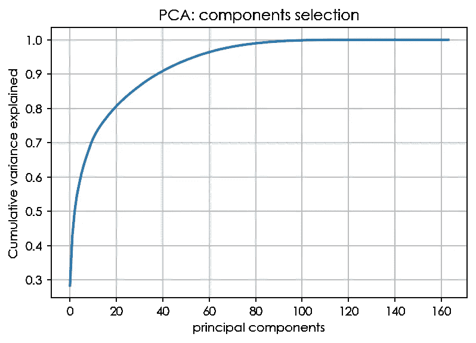

正如我们所观察到的，即使只有 40 个成分也能解释 90%的差异。我将选择解释 **99.5%方差**的第一个 **90 个**主成分。但这实际上意味着什么呢？它表明，以前的大多数特征要么是相关的，要么甚至在将样本转换到较低的维度后，我们能够保留几乎所有的方差，同时还解决了维数灾难的问题，这要归功于 PCA。

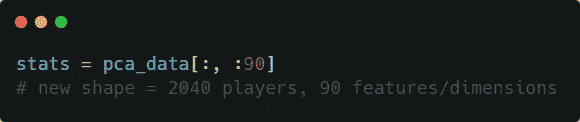

选择 90 个组件

# 7.推荐系统

我们的最终目标是找到与搜索查询最相似的玩家，但是我们如何才能做到呢？欧几里德距离或曼哈顿距离立即跃入脑海。但它们不是解决这个问题的合适指标，尤其是在处理一个真实世界的足球运动员数据集时，这些球员扮演着不同的角色，他们的统计数据非常丰富。在处理高维数据时，欧几里德距离可能会错误地表示两个向量之间的相似性度量。余弦相似性度量可以帮助克服这个问题。

**余弦相似度:**余弦相似度衡量一个内积空间的两个向量之间的相似度。它通过两个向量之间的夹角余弦来测量，并确定两个向量是否大致指向同一方向。其值介于-1 和 1 之间，其中-1 表示完全不同，1 表示完全相似。

余弦相似公式

下图很好地描述了欧几里德距离和余弦相似度之间的差异。如您所见，距离 d2 小于距离 d1，这表明农业和历史语料库比农业和食品语料库更相似，这在直觉上是错误的。现在在余弦相似性的帮助下，我们测量内角并取余弦。如果角度很小，余弦趋于 1。当角度接近 90 度时，余弦值趋于 0。这意味着两个向量之间的角度增量越大，相似性越小。因此，在这种情况下，余弦相似度显示农业语料库比历史语料库更类似于食品语料库，这在直觉上是有意义的。

图片来源: [aman.ai](https://aman.ai/coursera-nlp/vector-spaces/)

**代码实现:**首先， *getStats* 函数使用之前实现的 *player_ID* 哈希表返回具体玩家的向量。该函数将用于计算余弦相似度。

> 余弦相似度= 1 -余弦距离

上述公式正用于*相似度*功能。随着余弦距离的减小，相似度值将增加(趋于 1)，反之亦然。

接下来，我们将遍历所有 2040 个玩家，并在另一个循环中获取每个玩家的相似性值。在获取了列表中的值之后，我们希望使相似性值变得有点可展示和可解释。为此，我将相似度值归一化到 0 到 100 的范围内。现在如果你没有注意到，如果两者是相同的玩家，那么查询(外循环)与玩家(内循环)的相似度值不会是 1 吗？(想想对角线元素)。是的，对角线元素将为 1，因此当根据相似度值进行归一化和排序时，我们将始终获得 100%匹配的选定玩家本身。为了解决这个问题，我只是取消选择顶部的结果并显示其余的结果。作为一个权衡，没有玩家会与另一个玩家 100%匹配，这在直觉上也是有意义的。

**等待时间要求:**上述算法以二次时间运行，大约需要 3 分 45 秒完成。在我们的应用程序中，我们负担不起这么多的实时计算成本。因此，我将字典保存为 pickle 文件，以后可以加载(pickle 是一种在本地存储 Python 对象以备后用的方法)。从哈希表中的键检索值是一个常数时间操作，即 O(1)。在获得特定玩家的所有相似性值之后，我将规范化列表散列到适当的键(如前面实现的，name + squad)。速度问题现已修复，可实时显示结果。

# 8.使用 Streamlit 进行部署

Streamlit 是一个非常方便的资源，可以将数据脚本转换为 web 应用程序，不需要前端经验。但是，您应该熟悉一些基本的 Streamlit 概念:

**ST . cache()**——这个函数装饰器帮助记忆函数的执行。更简单地说，当第一次调用 *getData* 函数时，它将加载 pickle 文件，并在再次调用 *getData* 时返回那些已经加载的文件(尽管使用相同的参数)。因此，只需使用 *st.cache* ，我们就可以避免应用程序在每次参数/过滤器发生变化时从头开始加载所有数据，从而避免长时间加载。

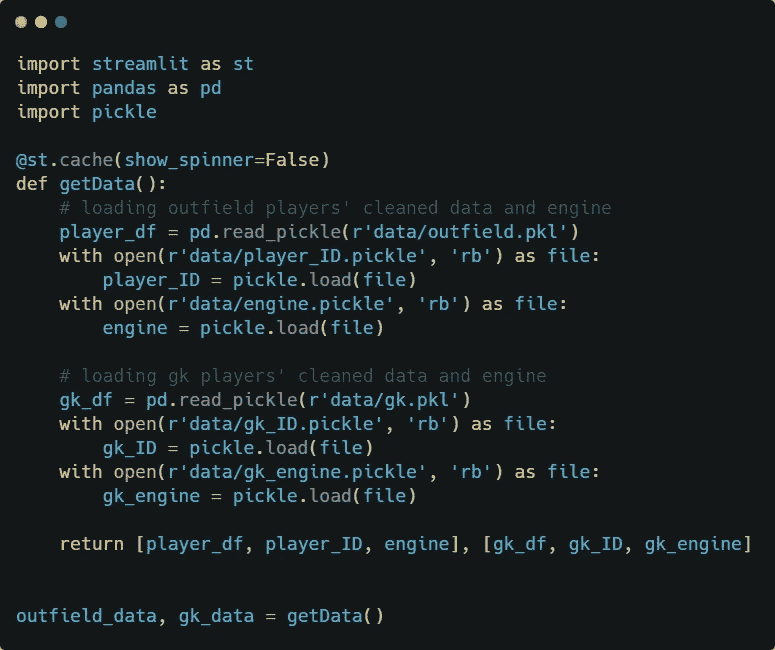

*st.cache* 用法

**互动 widgets** - 借助 widgets，Streamlit 允许我们通过按钮、滑块、文本输入等将互动性直接融入到您的应用中。此外，我们可以给一个小部件分配一个变量名，然后很容易地获得用户输入，如下面的代码所示。如果 radio 等于“外场球员”，我们只需从*外场数据*加载数据，否则从 *gk 数据*加载数据。 *st.beta_columns* 是另一个功能，它让我们按照列的方式排列小部件，接受列的大小列表作为参数。

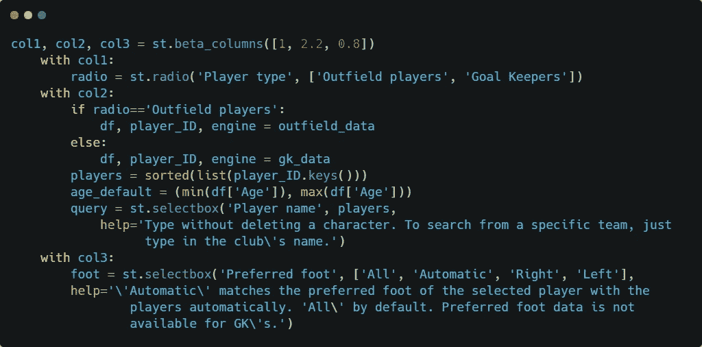

交互式小工具

同样，使用 Streamlit 的交互式小部件功能，添加了以下过滤器/参数:

1.  ***球员类型:*** 外场或守门员数据集
2.  ***玩家名称:*** 获取该玩家的同类玩家
3.  ***首选脚:*** 成绩中选手的首选脚
4.  ***对比:*** 对比同一职位或所有职位
5.  ***联赛:*** 联赛从比赛中获得成绩
6.  ***年龄段:*** 将根据特定的年龄窗口返回结果
7.  ***结果数量***

现在让我们深入研究代码，它将使应用程序能够返回并显示与上述过滤器中的任何变化相对应的结果。

从小部件变量中获取用户输入后，它们被传递给 *getRecommendations* 函数。然后，选择要显示为表格的基本特征(仅包括外场结果中的脚型)。所选玩家的排序相似性值被添加到数据帧中，并且如前所述，取消选择最高结果，即 100%匹配的玩家本身。在此之后，根据*比较*类型、*联盟*、*年龄*括号和*脚*类型对结果进行过滤。最后，基于 *count* 变量返回结果，并使用 *st.table* 以表格形式显示(是的，Streamlit 也支持魔法命令！)

# 最终应用

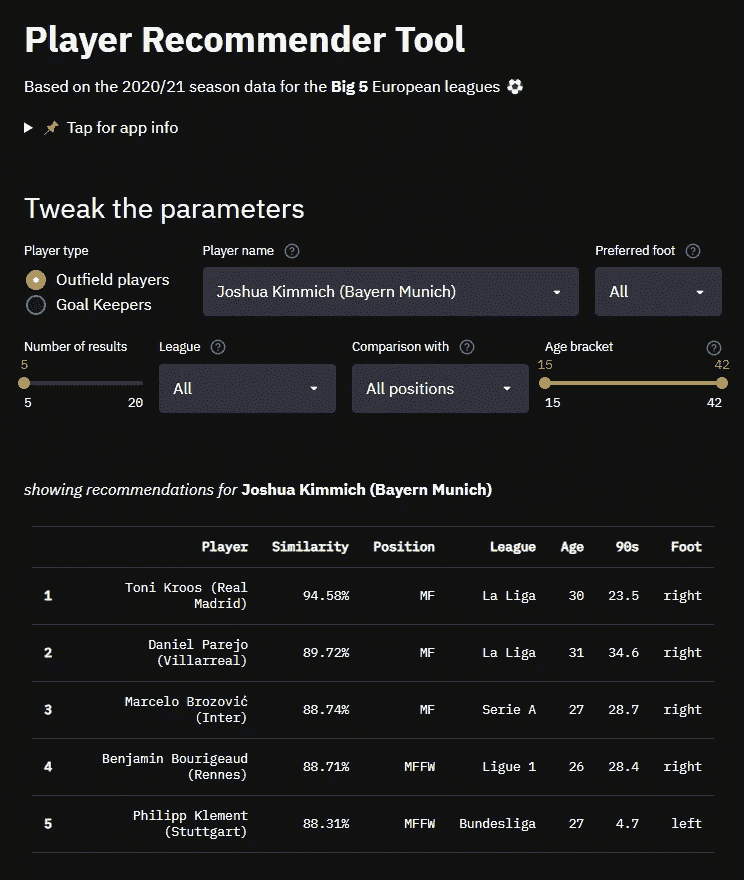

[您可以在这里访问应用程序。](https://share.streamlit.io/avneeshafc/player_recommender/app.py)现在你可以使用这个工具，搜索与你喜欢的球员相似的球员了。谁知道呢，你可能会挖掘出一些隐藏的宝石，就像下面这位先生:

# 9.未来的改进

1.  **自动化:**可以使用 Selenium/Requests 和 Beautiful Soup 自动化数据收集过程。随着常规赛的结束，我觉得没有必要为这个项目挖掘自动化，但在赛季期间，当数据在每个比赛日之后更新时，这将非常方便。
2.  团队偏见:这与其说是数据问题，不如说是足球问题。问题是，一个特定玩家的统计数据会受到他所在球队的严重影响。想想比赛风格，一个更具控球优势的球队的中场球员会有很高的传球和其他控球能力。由于这一点，在某些情况下，该队的中场球员可以彼此具有高相似性值。最小化或消除这种偏见是一个不小的问题，可能需要一些研究。
3.  **加权特征:**玩家在一个团队中有不同的角色，这要求他们在游戏的相关方面表现出色(特征)。因此，在计算和获取特定玩家的结果时，为某些特征分配不同的权重是有意义的。找到这些重量又是一个重要的足球问题。另一种方法是在描述玩家角色的标签上使用一键编码，这将比*位置*标签更加多样化，但我们必须为每个玩家手动创建！

# 10.最后的想法

这个项目仅仅是出于好奇和无数的实验。如果你学到了任何新的有价值的东西，我已经完成了这篇博文的目标。你可以在 Twitter 上联系我，在 LinkedIn 上联系我，在 T2 这里联系我。