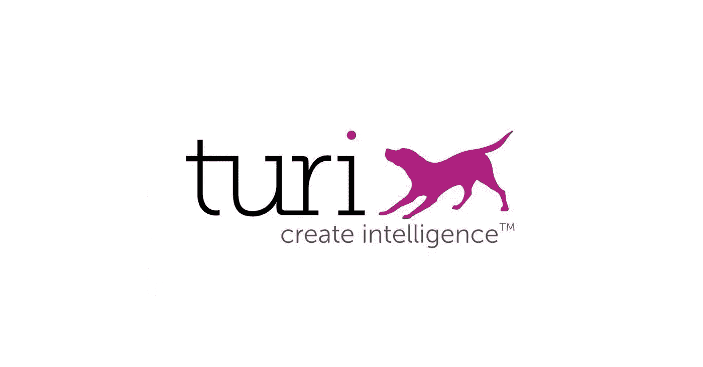
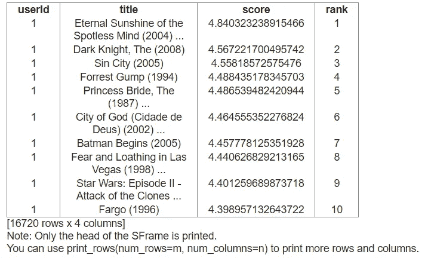
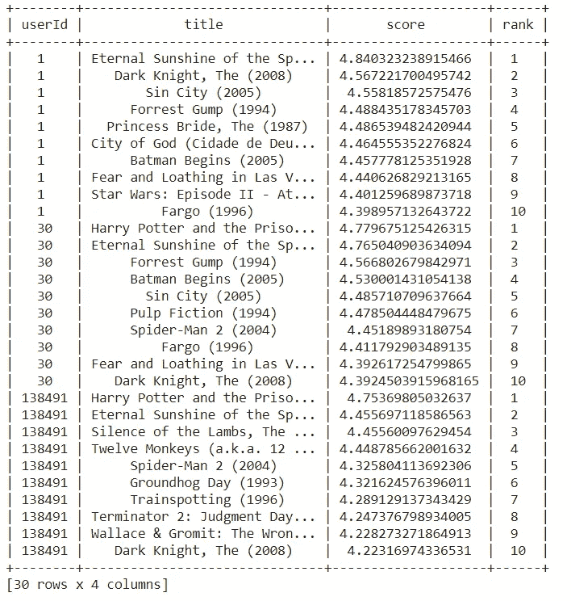
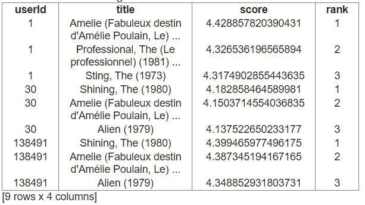
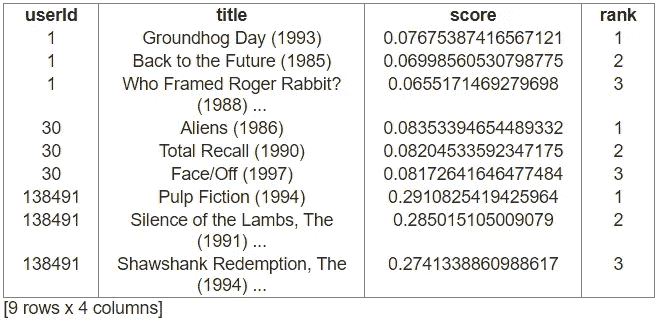
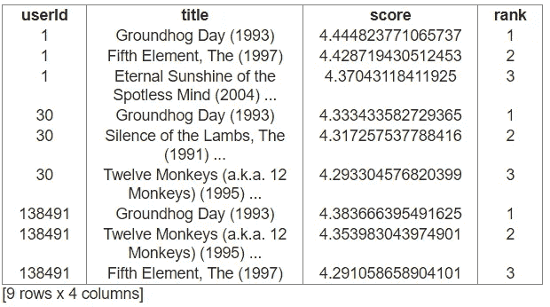

# 用 Turi Create 构建推荐系统

> 原文：<https://medium.com/analytics-vidhya/building-a-recommendation-system-with-turi-create-938be5fea671?source=collection_archive---------2----------------------->

在你的机器学习/数据科学之旅中，你会希望(或被要求)使用数据来提出建议。在当今世界，推荐无处不在——看什么，买什么，甚至去哪里度假。像网飞和亚马逊这样的公司有几个人致力于确保你在他们的网站上增加时间或购买量，准确地推荐你会喜欢的产品。但是，如果你想在你的应用或网站中加入推荐，但没有资源来构建复杂的算法或雇佣大量的数据科学家，该怎么办呢？这就是[图里创造](https://apple.github.io/turicreate/docs/userguide/)的用武之地。

Turi Create 是一个开源解决方案，简化了机器学习模型的开发。Turi 提供了[工具包](https://apple.github.io/turicreate/docs/userguide/applications/)，用于图像分类、对象检测、文本分类和其他一些工具。这篇文章将重点介绍如何实现[推荐系统](https://apple.github.io/turicreate/docs/userguide/applications/)。Turi Create 是为 Python 构建的。r 用户可以查看[这篇](https://data-flair.training/blogs/data-science-r-movie-recommendation/)教程。

# 入门指南

Turi Create 可通过 [PyPI](https://pypi.org/project/turicreate/) 进行安装。目前支持 MacOS 和 Linux。Windows 用户必须安装 WSL 才能使用 Turi Create(查看[这篇](https://blog.usejournal.com/installing-turicreate-on-windows-10-534e147a4792)帖子获取指导)。如果你不想安装 WSL(或者如果你只想使用基于云的笔记本)，使用 [Google Colab](https://colab.research.google.com/notebooks/intro.ipynb) 是一个很好的选择。如果您使用的是 MacOS、Linux 或 WSL，请在您的终端中运行`pip install turicreate`。如果你在 Google Colab 工作，在代码单元格中运行`!pip install turicreate`。现在，您可以运行一些推荐了。

# 初始推荐者

在这个练习中，我们将使用 Kaggle 上的 [MovieLens 20M](https://www.kaggle.com/grouplens/movielens-20m-dataset) 数据集。将电影和分级文件合并成一个数据帧。将合并后的数据帧转换为 csv 格式可以轻松地在多个笔记本会话中重新加载数据，而不必每次都重新运行合并代码。

导入 Turi 创建并加载数据。数据存储在 [SFrames](https://apple.github.io/turicreate/docs/api/generated/turicreate.SFrame.html#turicreate.SFrame) 中，可扩展的数据帧可以扩展到大数据。建议将数据分为训练数据集和测试数据集。这在比较模型时会很有帮助，因为我们希望用新数据来衡量性能，而这些数据在训练期间是看不到的。[推荐工具包](https://apple.github.io/turicreate/docs/api/turicreate.toolkits.recommender.html)包含创建、训练和评估模型性能所需的所有方法和实用程序。

现在，您可以使用训练数据集运行您的初始推荐模型了。该模型被设置为根据用户对他们所看过的电影的评级来预测每个用户的电影标题。默认情况下，`recommender.create`为所有用户提供前 10 个推荐，不包括用户已评价的电影。该默认模式还根据提供的数据(显式数据和隐式数据)选择在后台使用的模型和指标(RMSE 和精确召回)。因为提供了目标值，所以我们使用的数据是明确的。

对一个用户的建议

# 做预测

运行`model.recommend()`将为所有用户提供推荐。然而，我们也可以对特定用户进行预测。Turi Create 默认只打印 SFrame 的头部。`print_rows`实用程序允许你选择打印多少行和列。

对 3 名用户的建议

您还可以通过提供数据集中不包含的用户 ID 来预测新用户。在这种情况下，Turi Create 将推荐最受欢迎的电影，因为它没有新用户的评级作为推荐的基础。如果您想要多于或少于缺省值 10，您还可以指定显示多少个推荐。此外，您还可以选择包含用户已经评分的项目。

一旦您对模型的预测感到满意，就可以保存它。这将允许您在应用程序中使用它，或者重新加载它以供进一步研究。

# 选择模型

默认的`recommender.create`方法为您选择一个模型，并且是实现 Turi Create 的最简单的方法。但是，对于那些想自己选择型号的人，我们提供了一些选项。我将提供一些模型选择的例子，但是在[文档](https://apple.github.io/turicreate/docs/userguide/recommender/choosing-a-model.html)中可以找到关于实施和边数据使用的全部细节。

我们应该根据用户对电影《T3》的评价预测来推荐，还是根据用户是否会给电影一个高评价来推荐《T4》？这两种情况看起来非常相似，但一种本质上是回归，而另一种是分类，每种情况都需要选择不同的模型。

左图显示了因式分解的结果。右图显示了相同用户的项目相似性建议。

也可以选择排名因式分解。该模型还旨在预测用户是否会对电影给予高度评价。然而，它的预测是基于用户给予高评级的相似项目**和**电影。

排名因子分解模型的建议

# 比较模型

那么，你应该为你的推荐应用选择哪种模式呢？谢天谢地，Turi Create 提供了一个方便的[实用程序](https://apple.github.io/turicreate/docs/api/generated/turicreate.recommender.util.compare_models.html#turicreate.recommender.util.compare_models)来帮助你做决定。由于我们的数据包括目标值(评级)，我们的模型将根据均方根误差( [RMSE](https://www.statisticshowto.com/probability-and-statistics/regression-analysis/rmse-root-mean-square-error/) )进行评分。目标是最小化 RMSE。在我们的例子中，因式分解的 RMSE 最低(0.9701)，排名因式分解次之，为 0.9963。项目相似性模型的总体 RMSE 为 3.6175。虽然排名因子分解模型没有最低的 RMSE，但它仍然是一个可行的选择，因为它同时考虑了相似性和用户评级。您的选择将取决于您的具体应用和用于预测的数据。

这大概就是 Turi 创建推荐的快速实现。[有关如何将 Turi Create 添加到 MacOS 或 iOS 应用程序的说明](https://apple.github.io/turicreate/docs/userguide/recommender/coreml-deployment.html)。让我们总结一下 Turi Create 的优缺点。

**优点:**

1.  非常适合将机器学习解决方案添加到您的项目中，而无需从头开始。
2.  文档布局清晰，易于理解和实施。
3.  它为最常见的机器学习需求提供解决方案。

**缺点:**

1.  您无法控制模型的定制。
2.  需要 WSL 安装才能在 Windows 上使用(使用 Google Colab 来解决这个问题)。
3.  目前不支持 Python 的 R 或最新版本(MacOS 最高 3.7，其他 3.6)。
4.  在应用程序中部署模型目前仅适用于 MacOS 和 iOS。

总之，Turi Create 是一个易于使用的 ML 解决方案，但是和其他工具一样，你需要权衡利弊，确定它是否适合你。这次探险的笔记本可以在 [GitHub](https://github.com/ngachago/movie_recs) 上找到。